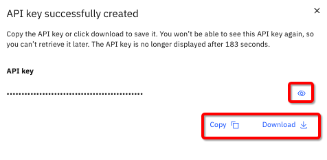
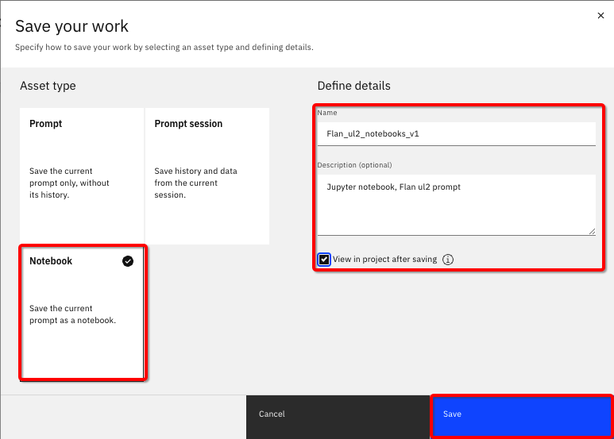
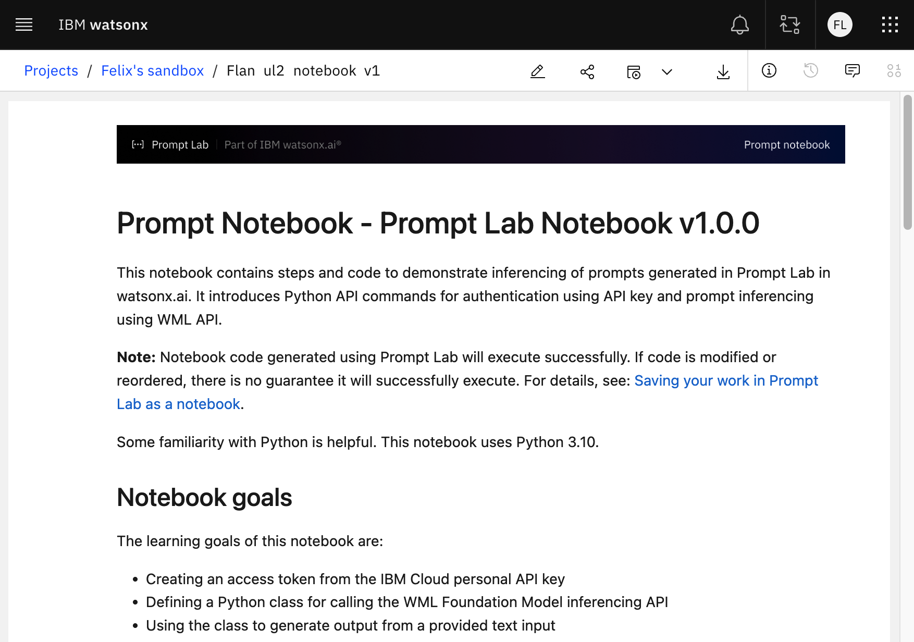
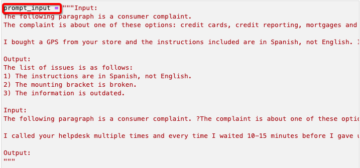

# 104: Using Jupyter notebooks with Prompts

In previous sections, you have been working with prompt engineering via the console. However, this is not how data and AI engineers typically work. In this section, you will create a Jupyter notebook for a prompt and work with prompts in a Jupyter notebook in **watsonx.ai**.

## Getting an API key

To run a Jupyter notebook, you will need your API key. If you have not generated one before, you can do so by following the steps below.

> **Note:** When using watsonx.ai on-prem (CP4D) the process is slightly different. For this exercise you will not need an api key, as the `ibm_watson_studio_lib` python package can be invoked to authenticate your current session. You can however find instructions to obtain a key [here.](https://www.ibm.com/docs/en/cloud-paks/cp-data/4.8.x?topic=steps-generating-api-keys) 

1. Log onto the IBM Cloud Console, or if you are using the Prompt Lab, you can click the icon in the upper left corner.


Select the option **Access (IAM)** option from the pop-up menu (you may have to log into the cloud console).


2. Select **Access (IAM)** to bring up the **Manage access and users panel**. Find and select the **API keys** item from the left-hand panel.


3. On the **API keys** panel, click **Create**.


On the next panel – you need to provide a name. You can use any name. In the example here, the name **watsonx.ai api key** is used. Now click **Create**.


4. An API key will be created for you. On the resulting panel, you have several choices:

- Select the blue "eye" icon on the right to look at the key
- Copy the key
- Download the key



**It is recommended** that you download your key. This key will be downloaded to a file called **apikey.json**. You might want to rename this file to ensure you remember what it is. If necessary, you can always create another API key.

You might see this message:


Simply close this window and the **API keys** window.

Now that you have the key, you are ready to work with the Jupyter notebook.

For more information, see [Creating an API key](https://cloud.ibm.com/docs/account?topic=account-userapikey&interface=ui#create_user_key).

## Creating a Jupyter notebook from a prompt

If you recall from the prompt and prompt session exercise, there is a third option when you choose to save a prompt, this is what you will do now.

1. Open the watsonx.ai Prompt Lab and scroll down to the **Projects** and select to open the project you were using. In a workshop setting the project will be provided for you. If you are running the lab on your own, it will most likely be **[Your name]'s sandbox**.


2. In the list of assets (under the **Assets** tab), select the `{uniqueid}_Flan_ul2_prompt_session_v1` prompt session that you saved in lab 103.


3. Click the **clock** icon on the left to open the history of this prompt session.


4. If the **Now** version is not highlighted, click it now.

5. Select **Save work**, and then select **Save as**.


Select the **Notebook** tile and fill in the fields as follows:

- Use the **Name** `{uniqueid}_Flan_ul2_notebook_v1`
- Use the **Description** `Jupyter notebook, Flan ul2 prompt`
- Select **View in project after saving**
- Click **Save**



6. **Watsonx.ai** will open the Jupyter notebook with the content of the prompt.



7. Click the **pencil** icon in the top menu bar to go into edit mode.


<Warning text='You can now work with the Jupyter notebook' />

8. Inspect the notebook and the various cells

The first cell is the setup cell. **Watsonx.ai** has automatically filled in all the necessary data such as wml_url and sets up an inferencing class that makes a REST API call to the **watsonx** foundation model to generate output from your input. This part of the notebook is not the focus of this lab so you will not spend more time on this cell.

9. The next cell defines the credentials necessary to work with the watsonx API. When you run this cell, you will be asked to enter your API key.


You need to enter your API key, and “hit enter” as instructed, before executing the next cell. You will be asked each time to provide your API key. As a workaround, you can modify the code by changing the `apikey` line:

```py
# from
apikey = getpass.getpass("Please enter your api key (hit enter):"),
# to
api = "[your API key]"
```

For example, it may look like this:


After this change, you will not need to provide your key for each run session of the notebook.

10. The following cell identifies the model you are using. For the 5 models available, here are the respective names you should use for **model_id** in a Jupyter notebook:

- **granite-13b-chat-v2** model_id="ibm/granite-13b-chat-v2"
- **flan-ul2-20b** model_id="google/flan-ul2"
- **flan-t5-xl-3b** model_id="google/flan-t5-xl"
- **flan-t5-xxl-11b** model_id="google/flan-t5-xxl"
- **mt0-xxl-13b** model_id="bigscience/mt0-xxl"
- **llama-2-70b-chat** model_id="meta-llama/llama-2-70b-chat"
- **codellama-34b-instruct-hf** model_id="codellama/codellama-34b-instruct-hf"
- **mixtral-8x7b-instruct-v01-q** model_id="ibm-mistralai/mixtral-8x7b-instruct-v01-q"

1.  The next section contains a list of the model parameters that you can update. These are the same ones as from the user interface.

- **decoding_method** greedy or sample
- **min_new_tokens** 0 or larger
- **max_new_tokens** positive integer
- **temperature** 0.0 to 1.0
- **top_k** 0 to 100
- **top_p** 0.0 to 1.0
- **repetition_penalty** 1.0 to 2.0

Now that you have put your API key in the notebook, you can easily experiment by changing these runtime configuration parameters and see how they can affect the output.

For example, try changing the values of **max_new_tokens** in combination with different values of **repetition_penalty**; and changing values of **top_p** and **top_k**.

12. The next section defines the project id, you should not need to touch it.


13. The following section is your “prompt” - your input into the inference engine.



- From the model’s point of view, everything between the pair of triple double quotes ("") is the prompt.
- Note that this was the one-shot prompt example you worked on earlier. When you do this (similarly for few-shots), you are simply inserting it before the section that you want to derive results on.
- You can use this notebook to quickly test out a _"few-shot"_ example – simply insert another sample section in the cell.
- Another important item to remember is that here the words **Input** and **Output** are not _"fixed"_ and you can change them. You should try changing Output to something different like Summarize or Conclusion. If you do change it, you might also change the Output in the one-shot (in the middle of the text box), or your answer may be surprising.
- Always keep in mind, that this is NOT a human reading the input as natural language. A model sees the input as a series of tokens, and it is calculating probability – changing words in key locations (such as the last word in the prompt) can have interesting impacts.

## Section summary

- In this section, you learned how to create a Jupyter notebook from the Prompt Lab.
- You need your own API key to use the notebook. You can input the API key into the notebook, so you do not need to provide it on every run.
- You can use the notebook to quickly test out changing the prompt, the model, or any of the configuration parameters.
