# Integración de Watson Discovery con modelos de fundación watsonx.ai

Este laboratorio le mostrará cómo podemos utilizar Watson Discovery y watsonx.ai juntos para resolver un caso de uso de la generación aumentada de recuperación (RAG). Al combinar los modelos de base de watsonx.ai LLM (Gran Modelo de Lenguaje) con una base de datos existente de datos podemos obtener respuestas más perspicaces de watsonx que se basan en datos y hechos conocidos.

### ¿Qué es RAG?

Para el contexto, la RAG o la generación aumentada de recuperación es un marco de IA ahora común utilizado para mejorar la calidad de las respuestas generadas por LLM mediante la puesta a tierra del modelo utilizando fuentes externas de conocimiento para complementar la representación interna de una LLM de información.

El uso de fuentes externas proporciona unos pocos beneficios, mejorando la calidad de las respuestas de un LLM, así como la fiabilidad general de esas respuestas.

Esto se hace en parte proporcionando un LLM con los datos más actuales y fiables *(es decir, base de conocimiento) *, y garantizando que los usuarios tengan acceso a las fuentes del modelo, asegurando que sus reclamaciones pueden ser comprobadas para su exactitud y en última instancia de confianza.

Del mismo modo, al poner en tierra un LLM en un conjunto de hechos externos y verificables, el modelo tiene menos oportunidades de tirar de la información al horno en sus parámetros o sesgos de sus datos de entrenamiento. Esto reduce las posibilidades de que un LLM filtrará datos sensibles, o *"alucinado" *información incorrecta o engañosa.

# Watson Discovery

Watson Discovery es una plataforma basada en IA desarrollada por IBM, accesible a través de la nube y diseñada para ayudar a las empresas a obtener información significativa de datos no estructurados. A través de la utilización del procesamiento de lenguaje natural (PNL) y las técnicas de aprendizaje automático, Watson Discovery ayuda a las organizaciones a descubrir información valiosa de diversas fuentes, como documentos de texto y contenido web. Es una parte integral de la suite de herramientas de IA de IBM conocida como Watson.

En este laboratorio haremos uso de una base de conocimientos que consta de algunos documentos financieros, que se ingieren en Watson Discovery. Entonces haremos uso de watsonx.ai para hacer algunas preguntas perspicaces acerca de los documentos financieros basados en la base de conocimiento. Se puede encontrar un enlace a los datos financieros utilizados [aquí ](https://github.com/ibm-build-lab/VAD-VAR-Workshop/tree/87155f66db7248994ff17fc0dfe80a3b99b64fc9/content/Watsonx/WatsonxAI/docs).

## Ingestión de datos en Watson Discovery

Para esta sección del laboratorio vamos a mostrar cómo puede ingerir datos en Watson Discovery para crear un conocimiento que más adelante se puede utilizar dentro de watsonx.ai.

> Si está completando este laboratorio en un entorno de taller, es posible que una instancia de Watson Discovery con una colección de documentos ya esté establecida para usted; pregunte a su instructor de laboratorio. Si no es así, puede crear su propia instancia de Watson Discovery desde IBM Cloud con su propia colección de documentos. Los pasos para cómo hacerlo pueden encontrarse a continuación:

### Creación de un proyecto en Watson Discovery

Antes de poder ingerir datos en Watson Discovery, empezaremos creando un nuevo proyecto.

1.  En la pantalla principal de Watson Discovery, seleccione la `New Project` botón

    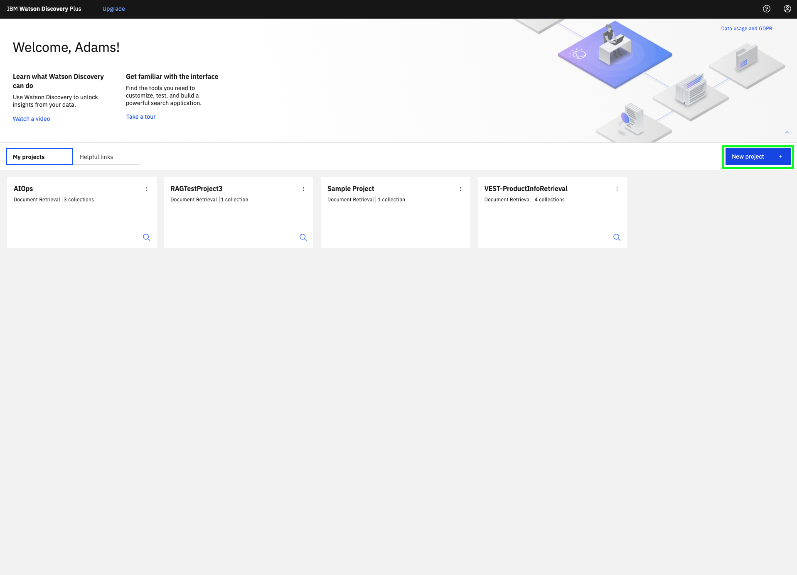

2.  En la siguiente pantalla, asigne un nombre a su nuevo proyecto y seleccione la selección de recuperación de documentos

    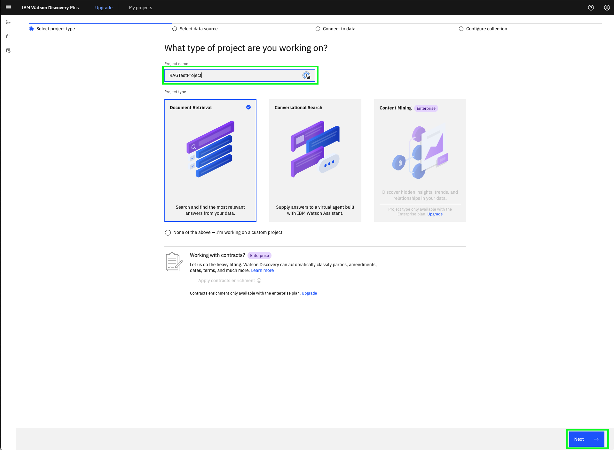

3.  En la pantalla siguiente, seleccione el `Upload Data` para que pueda cargar sus propios datos en el proyecto de Watson Discovery

    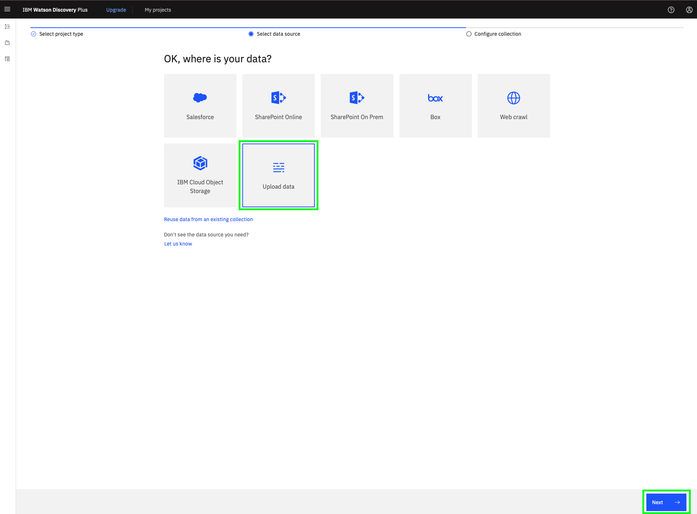

4.  En la siguiente pantalla, dé a su nueva colección un nuevo nombre, como *Documentos financieros *, y seleccione la opción OCR en más valores de proceso.

    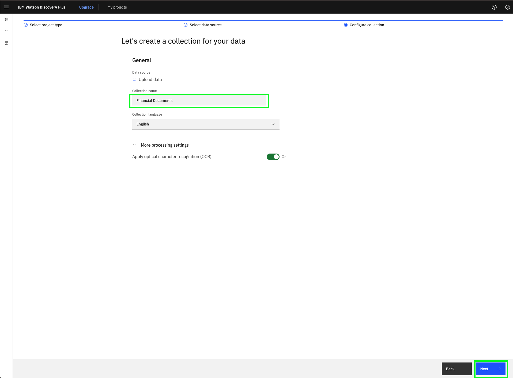

5.  En esta pantalla final, arrastre y suelte los datos para subirlos utilizando el cuadro de diálogo. *nota las limitaciones de archivo*

    > Para la coherencia de esta práctica de laboratorio, puede encontrar un enlace a los documentos utilizados en esta colección de laboratorios [aquí ](https://github.com/ibm-build-lab/VAD-VAR-Workshop/tree/87155f66db7248994ff17fc0dfe80a3b99b64fc9/content/Watsonx/WatsonxAI/docs).

    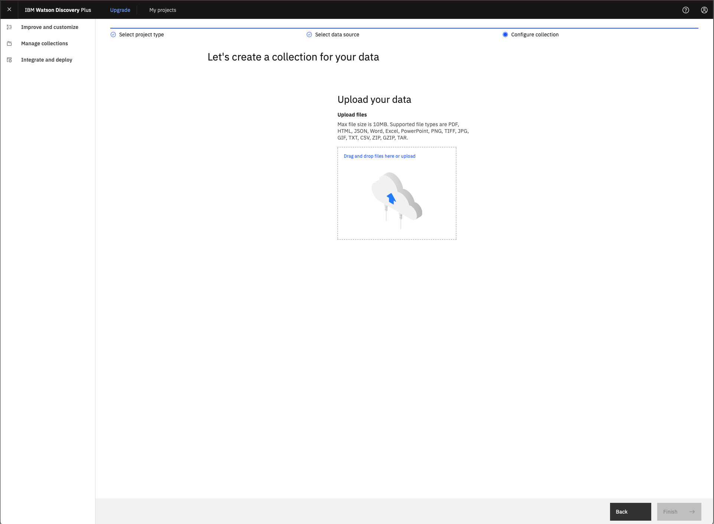

6.  Si se carga correctamente, debe ver el número total de documentos cargados bajo la tarjeta con la colección que ha nombrado anteriormente

    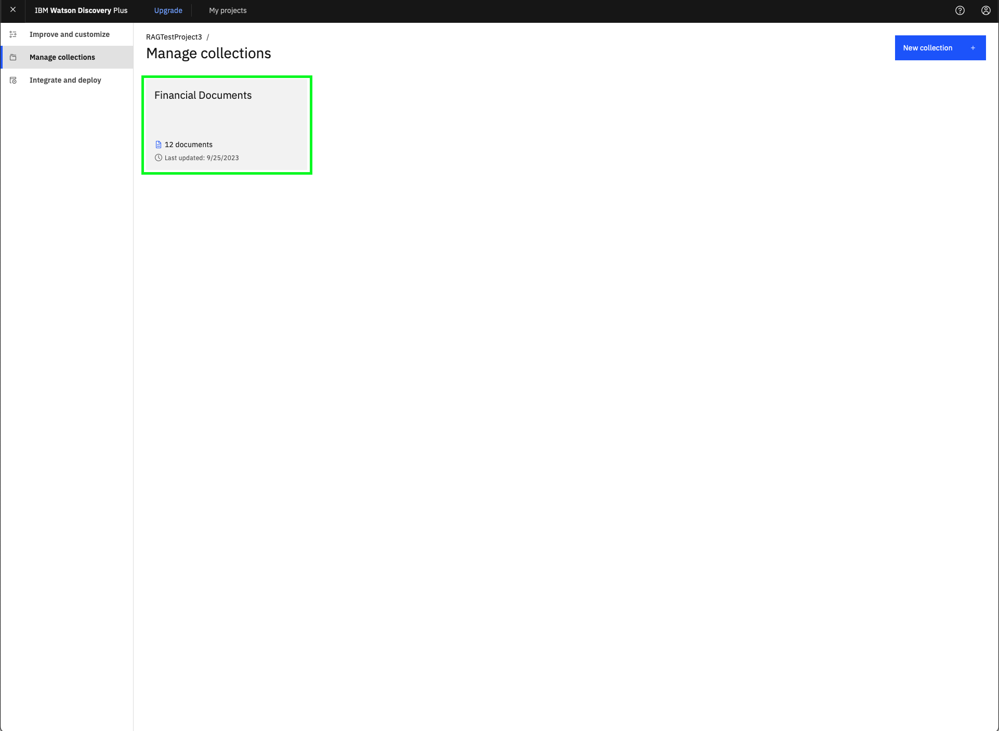

7.  Si ve los documentos que faltan o desea investigar los datos cargados para el proceso, puede pulsar en la colección con nombre y ver detalles adicionales. Cualquier problema relacionado con el proceso de sus datos será anotado por Watson Discovery en esta página de la pestaña de actividad.

    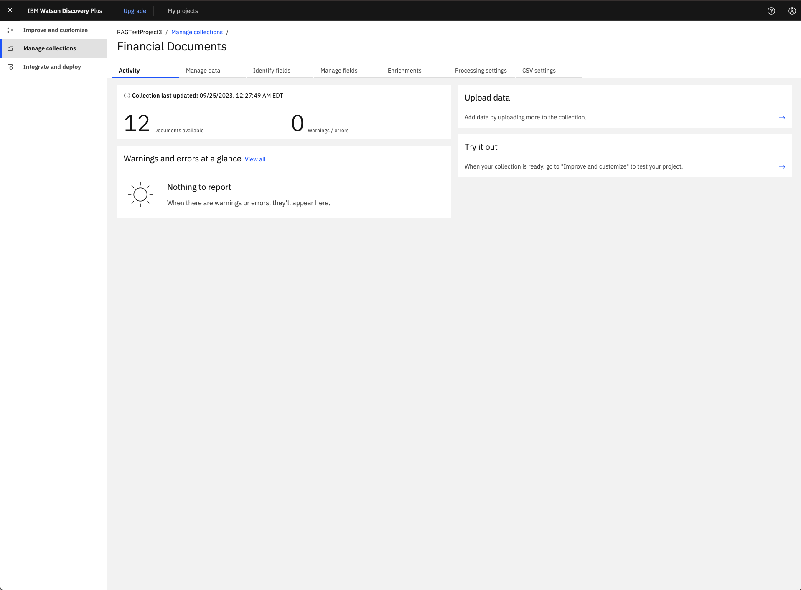

8.  Bajo el `Manage data` Puede revisar los documentos individuales que componen su colección.

    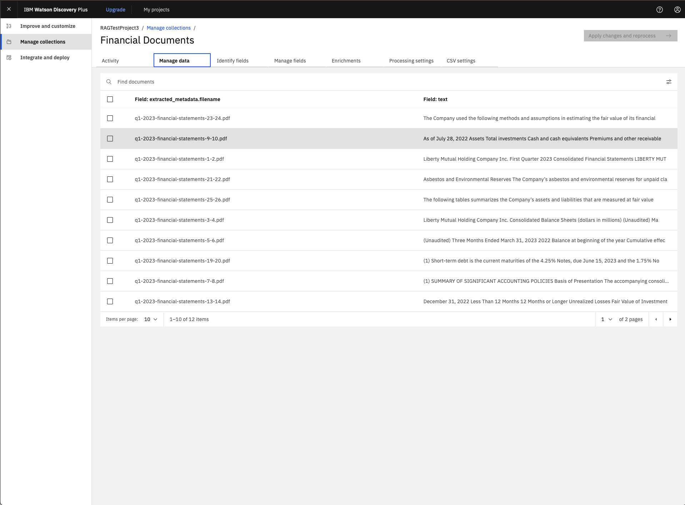

9.  Por último, si desea integrar la colección de Watson Discovery en otros servicios, puede ver el `project_id` asociado con la colección de Watson Discovery bajo el `Integrate and deploy` elemento de barra lateral izquierda

    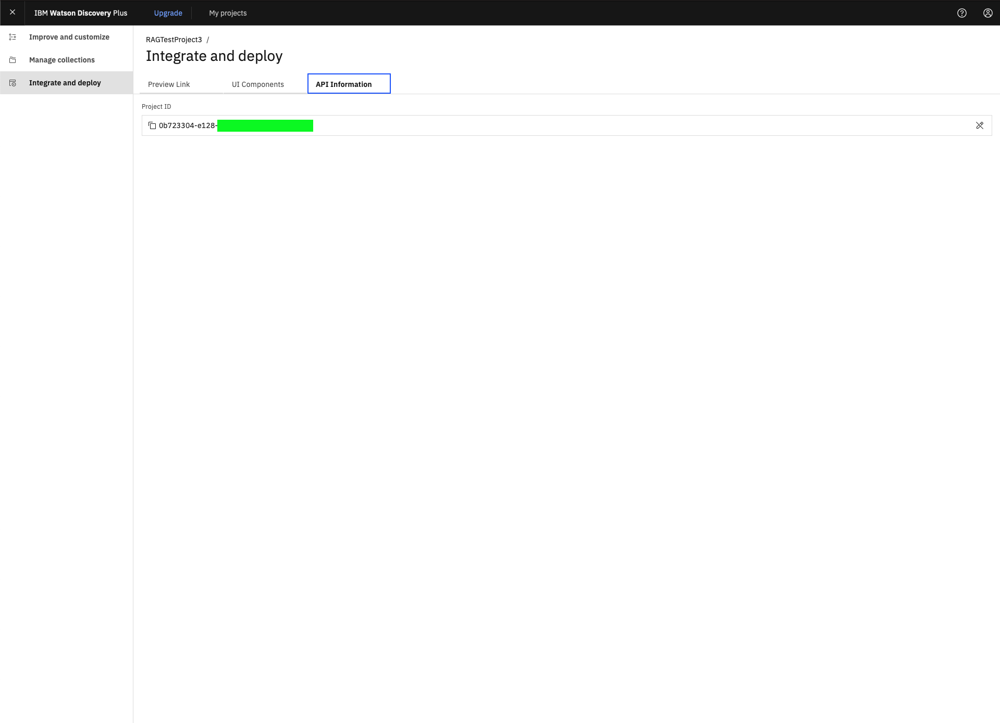

# watsonx.ai

Junto con Watson Discovey como nuestra base de conocimientos, haremos uso de los modelos de la fundación watsonx.ai para responder a las preguntas sobre los documentos de nuestra Watson Discovery Collection.

Después de navegar a la página de inicio de watsonx [aquí ](https://dataplatform.cloud.ibm.com/wx/home), desearemos abrir el editor de Notebook que podemos utilizar para ejecutar el cuaderno asociado con este laboratorio. Si no sabe cómo access watsonx.ai o no está seguro de cómo abrir al editor de notebook, siga el enlace de la nota siguiente que le guiará a través del proceso para acceder a watsonx.ai, así como para unirse al editor del cuaderno.

### Cómo importar un cuaderno a watsonx

Para importar un cuaderno a watsonx, siga los pasos siguientes:

1.  Inicie sesión y navegue hasta el panel de control principal de watsonx dataplatform [aquí](https://dataplatform.cloud.ibm.com/wx/home)

2.  Haga clic en **Trabajar con datos y modelos en cuadernos Python o R **tarjeta/azulejo

    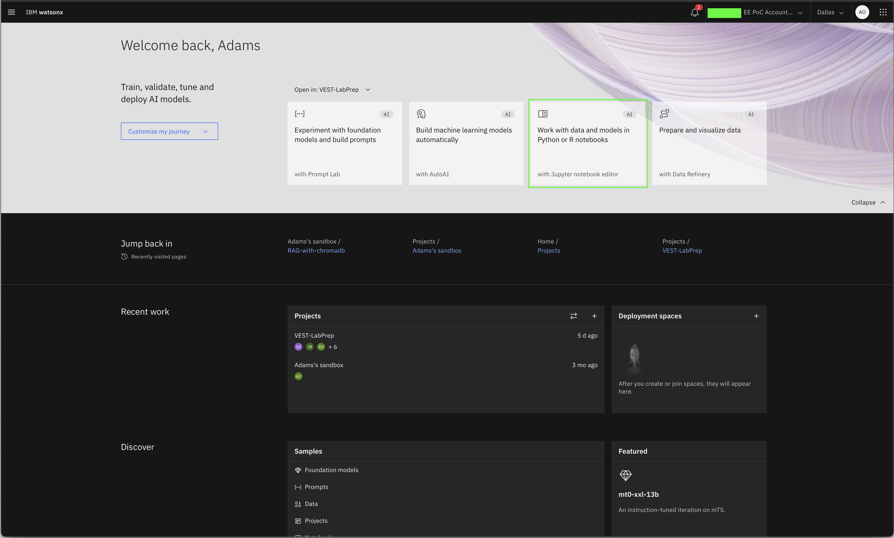

3.  Una nueva página con un menú modal titulado **Trabajar con datos y modelos en cuadernos Python o R **aparecerá. En este menú, haga clic en **URL **opción en la navegación de la izquierda

4.  En el **Nombre **tipo de campo `{uniqueId}-rag-discovery`, donde `uniqueId` representa sus iniciales y la ubicación de su taller, tales como: `ao-dallas-rag-discovery`; también puede añadir una descripción opcional.

5.  Para la **Seleccione la unidad **uso de opciones `Runtime 22.2 on Python 3.10 XXS`, los tiempos de ejecución más grandes utilizan más señales o créditos en la nube.

6.  En el **URL del cuaderno **copia de sección `https://raw.githubusercontent.com/ibm-build-lab/VAD-VAR-Workshop/main/content/WatsonX/WatsonxAI/files/rag-with-discovery.ipynb` en el campo

7.  Una vez que se hayan rellenado todos los campos necesarios, haga clic en **Crear **. A continuación, se pondrá en marcha en el cuaderno.

    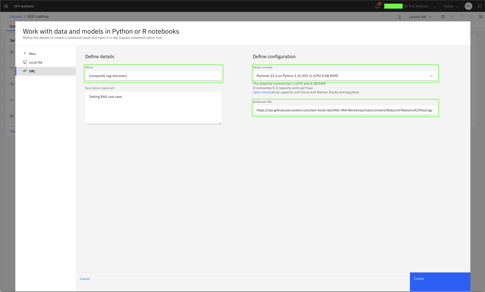

Una vez lanzado y creado tu cuaderno, puedes seguir y correr a través de cada celda del cuaderno para completar el laboratorio. El cuaderno contiene comentarios que explican qué código de cada celda hace, así como cualquier entrada necesaria que es posible que deba proporcionar para poder ejecutar correctamente una célula.

¡Buena suerte!
