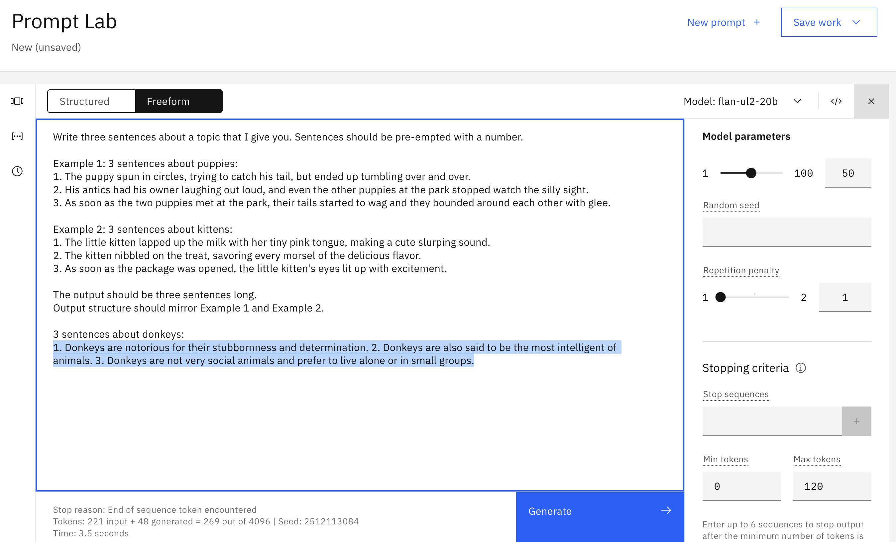
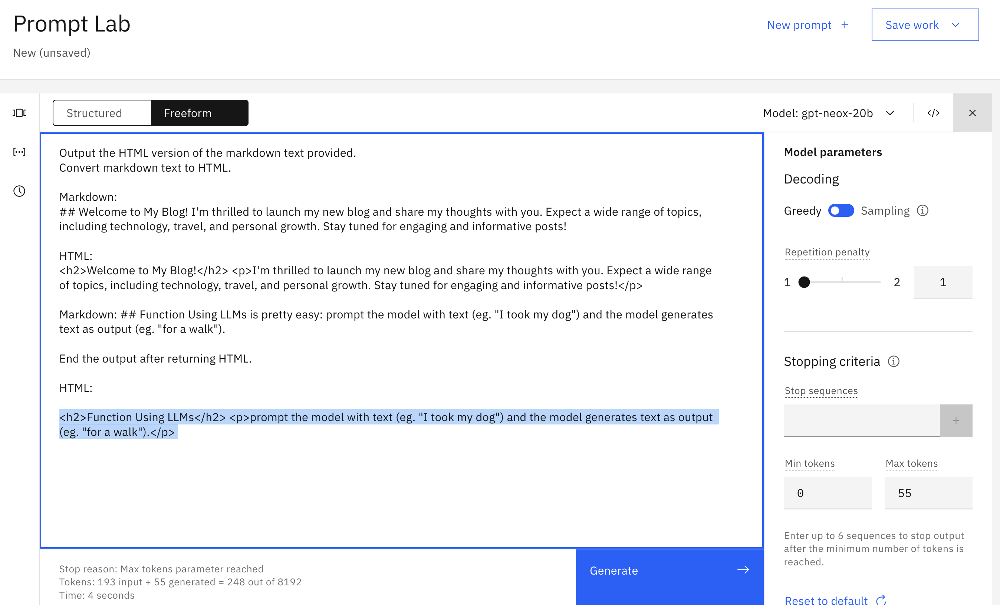
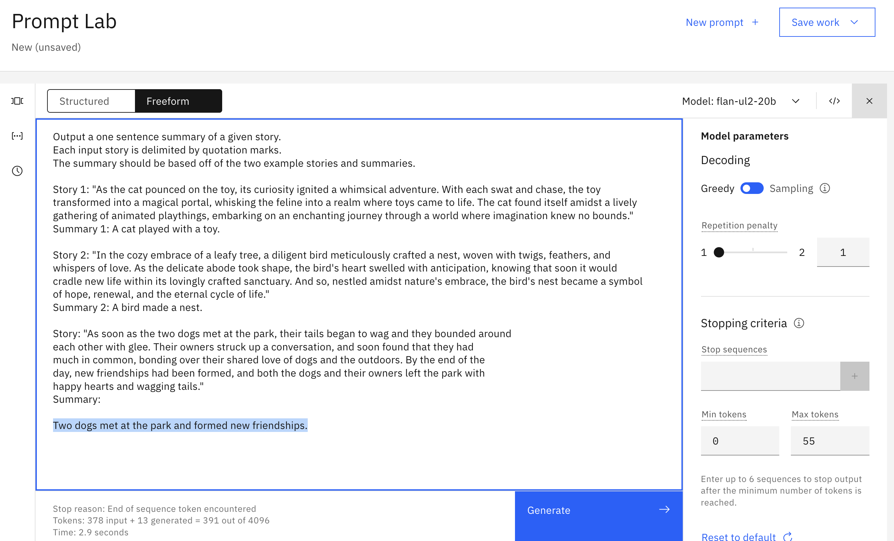
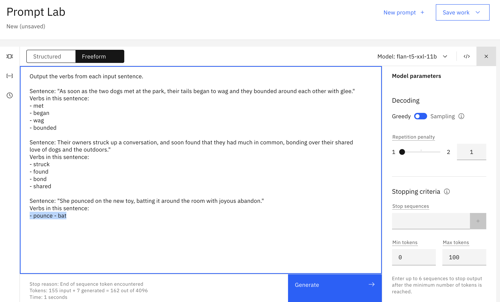

# Appendix: Prompt engineering exercise answers

&nbsp;

## 1. Generate

**Goal**

<table>
<tr>
<td>
Write three sentences about donkeys
</td>
</tr>
</table>

**One possible answer**

&nbsp;

## 2. Rewrite

**Goal**

<table>
<tr>
<td>
Transform one of these Markdown passages to HTML
</td>
</tr>
</table>

**One possible answer**

&nbsp;

## 3. Summarize

**Goal**

<table>
<tr>
<td>
Summarize one of these short stories
</td>
</tr>
</table>
  
**One possible answer**

&nbsp;

## 4. Text extraction

**Goal**

<table>
<tr>
<td>
Extract verbs from one of these sentences
</td>
</tr>
</table>

**One possible answer**

&nbsp;

