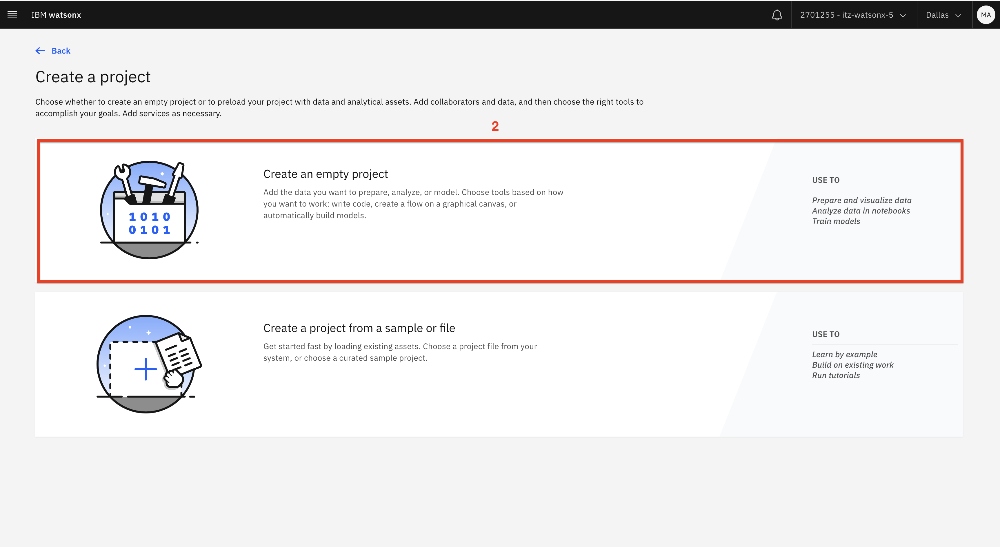
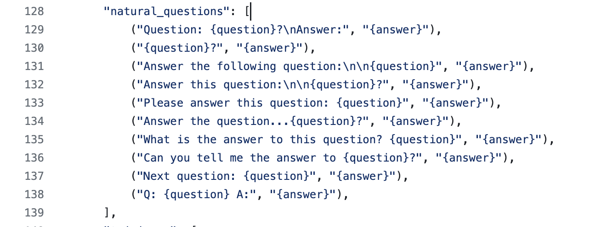
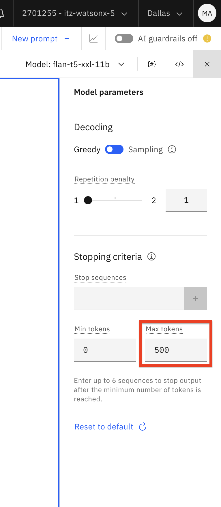
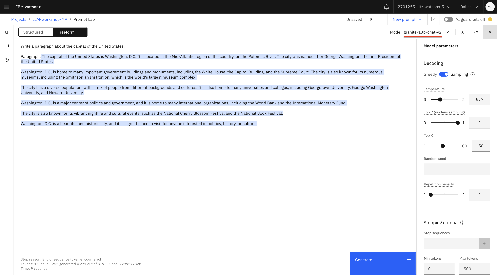
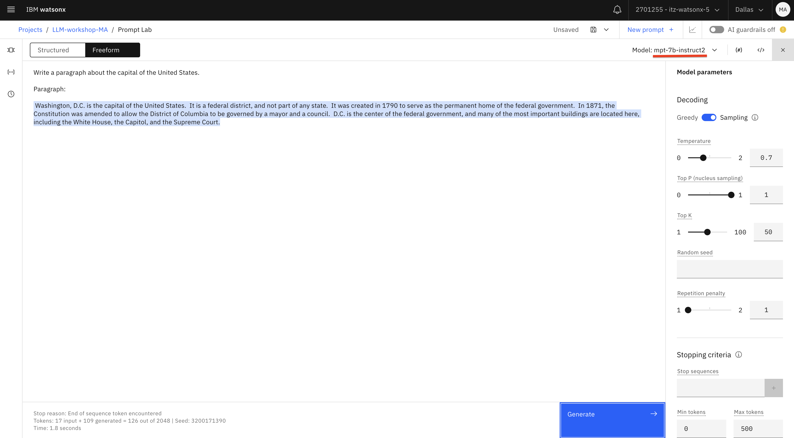
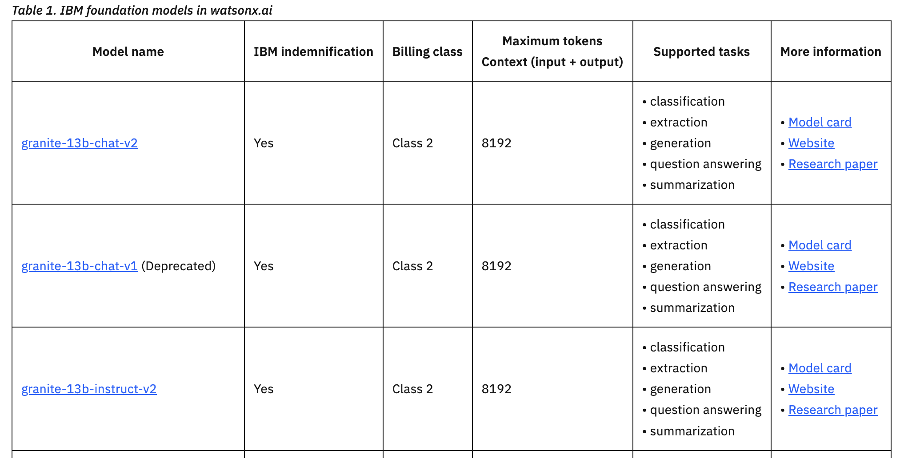
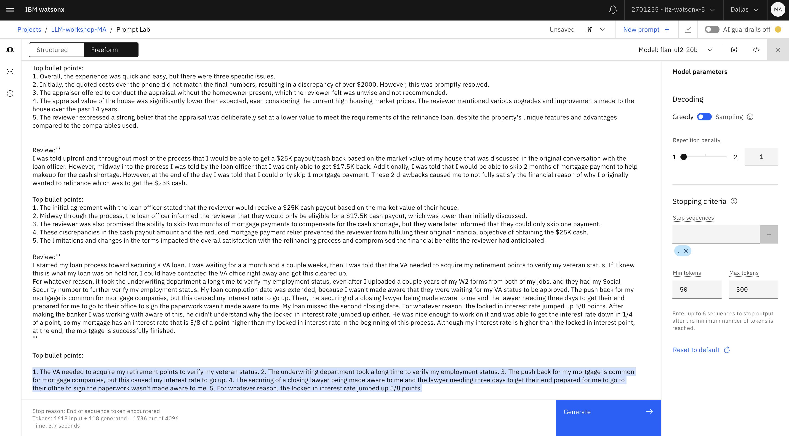
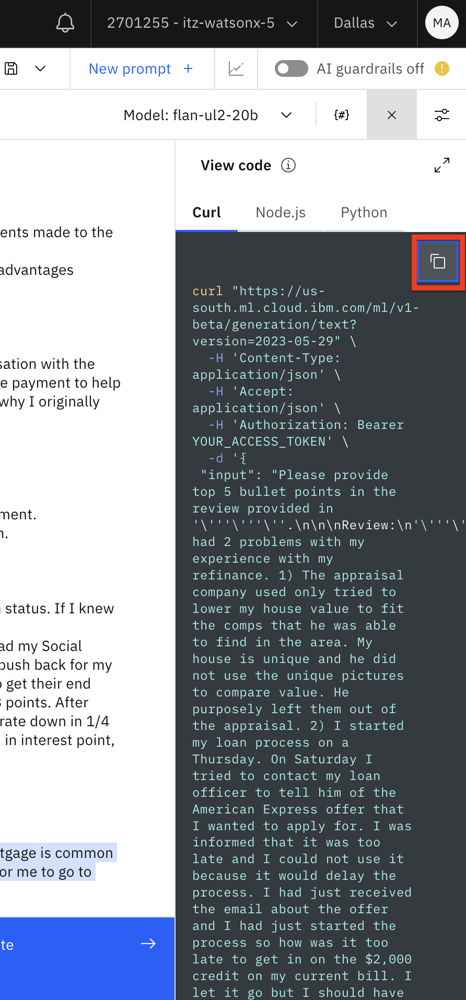
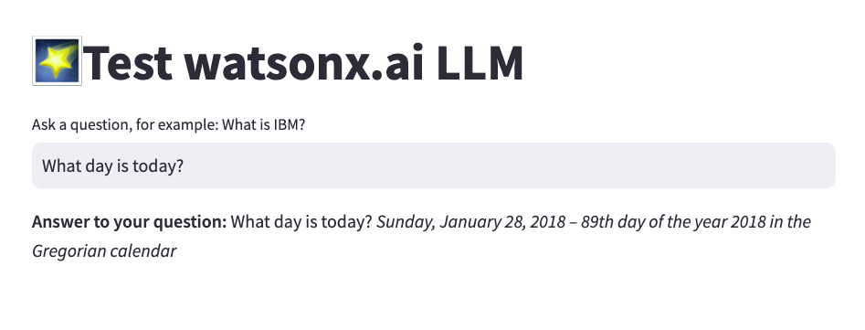

<QuizAlert text="Heads Up! Quiz material will be flagged like this!" />

# Introducción a la IA Generativa en watsonx.ai

En este laboratorio aprenderá a implementar casos de uso de IA generativa en watsonx.ai. Watsonx.ai es una plataforma de IA que se puede utilizar para implementar tanto casos de uso de aprendizaje automático tradicional como casos de uso que utilizan modelos de lenguaje de gran tamaño (LLM).

Analizaremos más detenidamente los siguientes casos de uso:

*   Generación
*   Resumen
*   Clasificación

> Nota: Los LLM son un tipo de modelo base. En las herramientas y la documentación de IBM, los términos LLM y modelos de base se utilizan indistintamente.

## Requisitos previos

*   Acceso a watsonx.ai.

*   IDE de Python con entorno Python 3.10

    *   Vamos a utilizar el IDE de Python, [Visual Studio Code (VSCode)](https://code.visualstudio.com/)

*   También tendrá que descargar los archivos de laboratorio de [esta carpeta GitHub](https://github.com/ibm-build-lab/VAD-VAR-Workshop/tree/main/content/Watsonx/WatsonxAI/files/201)

    *   Nos referiremos a esta carpeta como la carpeta *repo*.

## IA generativa y grandes modelos lingüísticos

La IA generativa es un nuevo campo de la IA que permite a los usuarios interactuar con modelos utilizando el lenguaje natural. El usuario envía *peticiones* a un modelo y éste genera una respuesta. Para un usuario final, la IA generativa puede parecerse a un chatbot o a un motor de búsqueda, pero su aplicación es diferente de la de los chatbots tradicionales, que se basan en reglas de negocio codificadas, y de la de los motores de búsqueda, que utilizan la indexación.

A diferencia de los modelos de aprendizaje automático tradicionales, que siempre requieren entrenamiento, los LLM se entrenan previamente en un conjunto de datos muy amplio. Existen docenas de LLM desarrollados por distintas empresas. Algunas empresas contribuyen con sus modelos al código abierto, y muchos de ellos están disponibles en el sitio de la comunidad LLM [*Hugging Face*](https://huggingface.co/). Corresponde al desarrollador del LLM publicar información sobre el modelo y el conjunto de datos en el que se ha entrenado. Por ejemplo, véase la [ficha](https://huggingface.co/google/flan-t5-xxl) de uno de los modelos de código abierto más populares, *Flan-T5-xxl*. En general, todos los LLM se entrenan con datos disponibles públicamente. IBM es una de las pocas empresas que publica información detallada sobre los datos utilizados para entrenar el modelo. Esta información puede encontrarse en [los Documentos de Investigación](https://www.ibm.com/downloads/cas/X9W4O6BM) publicados por IBM.

Se puede considerar que los datos con los que se ha entrenado el modelo son su "conocimiento". Por ejemplo, si el modelo no se ha entrenado en un conjunto de datos que contenía los resultados del *Mundial de Fútbol de 2022*, no podrá generar respuestas válidas/correctas relacionadas con este evento. Por supuesto, esto se aplica a todos los casos de uso empresarial en los que necesitamos que los modelos interactúen con datos propios de la empresa. Más adelante explicaremos cómo resolver este problema.

Hay otros dos factores que influyen en las capacidades del LLM: el tamaño y el ajuste de las instrucciones. Los modelos más grandes se han entrenado con más datos y tienen más parámetros. En el contexto de los LLM, el número de parámetros se refiere al número de pesos ajustables en la red neuronal que el modelo utiliza para generar respuestas. Los parámetros son las variables internas del modelo que se aprenden durante el proceso de entrenamiento y representan el conocimiento que ha adquirido el modelo.

Aunque pueda parecer obvio que un modelo más grande producirá mejores resultados, en una aplicación de producción puede que tengamos que considerar modelos más pequeños que cumplan los requisitos de nuestro caso de uso debido al coste de alojamiento e inferencia.

Los modelos ajustados a las instrucciones son modelos que se han entrenado específicamente para tareas como la clasificación o el resumen. Consulte [la documentación de IBM](https://dataplatform.cloud.ibm.com/docs/content/wsj/analyze-data/fm-choosing-a-model.html?context=wx\&audience=wdp) para conocer otras consideraciones a la hora de elegir un modelo.

A medida que avancemos en el laboratorio, iremos introduciendo algunos conceptos LLM más importantes.

## Comprender las capacidades del LLM

En este laboratorio utilizaremos el **Prompt Lab** en *watsonx.ai* para interactuar con los LLMs incluidos en la plataforma.

Normalmente, los usuarios (ingenieros o científicos de datos) tienen tres objetivos en esta fase del ciclo de vida del LLM:

*   Averiguar si los LLM pueden utilizarse para el caso de uso propuesto.
*   Identificar el mejor modelo y los mejores parámetros
*   Cree avisos para el caso de uso.

1.  Inicie sesión en [**IBM watsonx**](https://dataplatform.cloud.ibm.com/wx/home?context=wx).

2.  En el menú principal, en la esquina superior izquierda, seleccione **Proyectos - > Ver todos los proyectos**.

    

3.  Haga clic en el botón **Nuevo proyecto (1)**. Seleccione **Proyecto vacío (2)** y añada sus iniciales al nombre del proyecto **(3)**. Por ejemplo, *LLM-taller-MA*. A continuación, haga clic en el botón **Crear ( 4).

      

4.  Seleccione la pestaña **Gestionar ( 1)**. Cambie a la pestaña **Servicios e integraciones (2)** y, a continuación, haga clic en **Asociar servicio (3)**.

    

5.  Seleccione el servicio de **aprendizaje automático (1** ) mostrado y haga clic en **Asociar (2)**.

    

6.  Vaya a la pestaña **Activos (1)** y haga clic en el botón **Nuevo activo (2)**.

    

7.  Haga clic en la ficha **Experimentar con modelos de cimentación.**...

    

    Antes de empezar a experimentar con los avisos, repasemos algunos conceptos clave sobre la selección de modelos.

    A medida que vaya probando diferentes modelos, observará que algunos obtienen mejores resultados que otros con la función de no dar instrucciones (dar instrucciones sin ejemplos). Normalmente, los modelos que han pasado por un proceso de *ajuste fino*, *ajuste de instrucciones* y *RLHF* generan resultados significativamente mejores.

    *   *Afinar* significa que el LLM original se entrenó con datos etiquetados de alta calidad para casos de uso específicos. Por ejemplo, si nuestro objetivo para el modelo era "Actuar como un arquitecto informático" al generar resultados, durante el proceso de ajuste fino proporcionamos ejemplos de datos etiquetados de un estilo de escritura para arquitectura informática.
    *   Si el modelo pasa por el proceso de ajuste de instrucciones, podrá generar resultados sin instrucciones explícitas, como *"¿Puedes responder a esta pregunta?"*. El modelo entenderá que estás haciendo una pregunta por el contexto y la estructura de la frase.
    *   *RLHF* ( *Reinforcement Learning from Human Feedback* ) es una técnica que se utiliza para mejorar los resultados de un modelo a partir de los comentarios de los evaluadores, que suelen ser expertos en la materia (por ejemplo, abogados para la generación de documentos jurídicos). Antes de publicarse, el modelo se actualiza en función de los resultados de las pruebas.

    Aunque todos los proveedores pueden decir que su modelo se ha ajustado con precisión, se ha ajustado a las instrucciones y se ha sometido a RLHF, los puntos de referencia del sector para los LLM no están maduros. Incluso los puntos de referencia que pueden llegar a convertirse en el estándar del sector (por ejemplo, [TruthfulQA](https://huggingface.co/datasets/truthful_qa)) solo comprueban determinados aspectos de los resultados del modelo.

    Una posible solución a este problema es la investigación realizada por la comunidad LLM en general. La comunidad LLM es muy activa; la información sobre la calidad de los modelos suele darse a conocer ampliamente a través de diversos recursos de la comunidad, como artículos, blogs y vídeos de YouTube. Esto es especialmente cierto en el caso de los modelos de código abierto frente a los propietarios. Por ejemplo, busque "llama vs. ChatGPT" y revise los resultados. También puede consultar la [clasificación de](https://huggingface.co/spaces/HuggingFaceH4/open_llm_leaderboard) Hugging Face, teniendo en cuenta que deberá conocer los criterios de evaluación utilizados para la clasificación (consulte la página [Acerca de](https://huggingface.co/spaces/HuggingFaceH4/open_llm_leaderboard) la clasificación).

    En la actualidad, el modelo *llama-70b-2-chat* es uno de los mejores modelos de avisos de disparo cero. Aunque pueda parecer una opción obvia utilizar siempre *llama-70b-2-chat* en watsonx.ai, puede que no sea posible por varias razones:

    *   Disponibilidad del modelo en el centro de datos (debido a recursos o licencias)
    *   Coste de inferencia
    *   Coste de alojamiento (para implantaciones locales o en nube híbrida).

    Puede que sea posible lograr resultados similares con otros modelos o con versiones más pequeñas de *llama* utilizando pocos disparos de incitación o un ajuste fino, por eso es importante experimentar con varios modelos y comprender las técnicas de incitación/vuelta.

    > Nota: Las instrucciones de este laboratorio están escritas para los modelos flan y llama, que están disponibles en todos los centros de datos de IBM Cloud donde se aloja watsonx.ai y en la versión local de watsonx.ai. Le animamos a probar otros modelos (por ejemplo, granito y mpt-7b), si están disponibles en el entorno de su taller.

8.  Una vez abierta la interfaz de usuario **de Prompt Lab**, cambie a la pestaña **Freeform ( 1)**. Selecciona el modelo ***flan-ul2-20b* (2)**.

    > Nota: Revisaremos la configuración del modelo más adelante en el laboratorio.

    

    Dado que la mayoría de los LLM, incluido el modelo de flan seleccionado, se entrenaron con datos disponibles públicamente, podemos plantearle algunas preguntas generales.

9.  Escriba la pregunta `What is the capital of the United States?` y haga clic en **Generar**. La respuesta generada aparece resaltada en azul.

    

    Obtuvimos la respuesta a nuestra pregunta sin instruir al modelo para que lo hiciera porque el modelo flan estaba ajustado a instrucciones para responder preguntas. Google , el creador de este modelo, publicó las instrucciones de entrenamiento que se utilizaron para el modelo en este [repositorio git](https://github.com/google-research/FLAN/blob/main/flan/v2/flan_templates_branched.py). Como se puede ver en la documentación, las instrucciones se muestran a menudo en un "formato técnico", pero siguen siendo útiles para entender las mejores opciones de prompting para este modelo.

    Desplázate hasta la sección de *preguntas naturales* de la página git. Aquí podemos ver las distintas frases que podemos utilizar con el modelo al hacer preguntas.

    

    A continuación, plantearemos una pregunta diferente: `When was Washington, DC founded?`

    

    Comprueba si es la respuesta correcta haciendo una búsqueda tradicional en Internet. Descubrirás que la respuesta correcta es *16 de julio de 1790*.

    A continuación, cambia el modelo a *granito*, luego *llama2-70b-chat* y vuelve a hacer la pregunta. Esta vez obtenemos la respuesta correcta.

     

    A continuación, cambiamos el modelo a *mpt* y volvemos a formular la pregunta: obtenemos otra respuesta incorrecta.

    

    En general, no se trataba de una pregunta sencilla, ya que en el momento de redactar este artículo aparecen fechas contradictorias en la página web de la Biblioteca del *Congreso* y en *Wikipedia*. La Biblioteca *del* Congreso es una fuente más creíble, y en este ejemplo la página de *Wikipedia*, que puede haberse utilizado para el entrenamiento del modelo, tiene la fecha incorrecta.

    Proporcionamos este ejemplo para resaltar el hecho de que el uso principal de los LLM no debe ser la *pregunta y respuesta de conocimiento general*. La calidad de los resultados de un LLM depende de la base de conocimientos con la que se haya entrenado. Si hiciéramos otra pregunta, es posible que *flan* superara a otros modelos.

    ***Deberíamos pensar en los LLM como un "motor" que puede trabajar con datos no estructurados, más que como una "base de conocimientos".***

    Cuando empiece a trabajar con LLMs, es posible que piense que algunos modelos no devuelven la respuesta correcta debido al formato del prompt. Pongamos a prueba esta teoría con el modelo *flan*.

    Introduzca este mensaje en el **Laboratorio de mensajes**:

    ```txt
    Answer the question provided in '''.

    Question: '''When was Washington, DC founded?'''

    Answer:
    ```

    Repasemos por qué hemos construido la pregunta en este formato:

    *   Las comillas simples triples (''') suelen utilizarse para identificar una pregunta o un texto que queremos que utilice el LLM. Puedes elegir otros caracteres, pero evita las " (comillas dobles) porque pueden estar ya en el texto proporcionado
    *   Fíjese en que hemos incluido la palabra "*Respuesta*:" al final. Recuerde que los LLM *generan la siguiente palabra probable* ", y proporcionar la palabra "Respuesta" es una "pista" para el modelo.

    

    Por desgracia, no conseguimos un resultado más preciso con el modelo de *flan*.

    Intentaremos una aproximación más, esta vez con un prompt diferente, que puedes copiar a continuación:

    ```text
    Using the following paragraph, answer the question provided in '''. 

    Paragraph: 

    Washington, D.C. was founded on July 16, 1790. Washington, D.C. is a unique and historical place among American cities because it was completely planned for the national capital and needed to be distinct from the states. President George Washington chose the specific site (e) along the Potomac and Anacostia Rivers. 

    The Serial Set contains a lot of information about the plan for the city of Washington, including maps, bills, and illustrations. In this Story Map, you can see original plans and pictures of Washington, D.C.

    Question: '''When was Washington, DC founded?''' 

    Answer:
    ```

    

    Aunque este ejemplo puede parecer sencillo porque proporcionamos la respuesta en nuestro aviso, demuestra uno de los casos de uso clave para los LLM, que se denomina *Generación Aumentada de Recuperación (RAG)*. Con RAG, pedimos a los LLM que respondan a preguntas o generen contenido basado en la información que proporcionamos. En nuestro ejemplo, codificamos el contenido en el prompt, pero también es posible implementar RAG con recuperación automática de información de varias bases de conocimiento, como sitios web, documentos, correos electrónicos, etc. En este caso, la principal característica de un LLM que nos interesa es la "comprensión" y no el "conocimiento".

    Hemos utilizado un ejemplo sencillo para hacer una pregunta de trivial, pero piense en temas que puedan ser relevantes para su empresa para los que también puede existir "información general", por ejemplo:

    *   ¿Cuáles son los pasos para obtener el permiso de conducir?
    *   ¿Cuáles son los pasos para presentar una reclamación al seguro de coche?
    *   ¿Cómo puedo cerrar una tarjeta de crédito?
    *   ¿Cómo puedo mejorar mi puntuación de crédito?
    *   ¿Me reembolsará una compañía aérea un vuelo cancelado?
  
    <br />

    La mayoría de los LLM podrán responder a estas preguntas porque fueron formados con datos disponibles en Internet, pero si desea obtener la respuesta correcta a su pregunta, en la mayoría de los casos tendrá que utilizar *la GAR*, es decir, proporcionar información procedente de las fuentes de datos de su empresa.

    *Watsonx.ai soporta varias implementaciones de RAG*. Lo cubriremos con más detalle en uno de los otros laboratorios.

    A continuación, probaremos los avisos que generan salida.

10. Haga clic en el icono de parámetros del modelo en la esquina superior derecha. Utilice el modelo de flan para su primera prueba.

    

    Si desea obtener más información sobre cada entrada del panel Parámetros del modelo, puede consultar [la documentación](https://dataplatform.cloud.ibm.com/docs/content/wsj/analyze-data/fm-model-parameters.html?context=wx\&audience=wdp).

    Cambia el **Max tokens** a **500**. Cuando los LLM procesan instrucciones y generan salidas, convierten palabras en tokens (una secuencia de caracteres). Aunque no existe una proporción estática para la conversión de letras a tokens, podemos utilizar 10 palabras = 15 a 20 tokens como regla general para la conversión.

    

11. Cambia la indicación para escribir un párrafo:

    ```txt
    Write a paragraph about the capital of the United States.

    Paragraph:
    ```

    Observe que nuestra salida es bastante breve.

    

    A continuación, probaremos distintos parámetros y modelos para ver si podemos obtener mejores resultados.

12. En la configuración del modelo, cambie la **decodificación** de *Greedy* a *Sampling*. El muestreo producirá una mayor variabilidad/creatividad en el contenido generado (consulte [la documentación](https://dataplatform.cloud.ibm.com/docs/content/wsj/analyze-data/fm-model-parameters.html?context=wx\&audience=wdp) para obtener más información).

    > Importante: Asegúrese de borrar el texto generado después de la palabra "Párrafo" : antes de pulsar Generar de nuevo porque el modelo continuará generando después de cualquier texto dado en un prompt, lo que puede dar lugar a repeticiones.

    Pulse el botón **Generar**.

    

    Parece que no obtenemos mejores resultados con este modelo, así que probemos con otro.

13. Pruebe el mismo aviso con los modelos *granito* y *mpt-7b-instruct- 2*. Borre el texto generado y pruebe de nuevo.

     

    En nuestras pruebas, obtenemos mejores resultados con estos modelos. Observe que cada vez que hace clic en **Generar** (después de borrar el texto generado), obtiene resultados diferentes. Esto se debe a que hemos configurado la opción Decodificación como **Muestreo**. También puede probar Muestreo con diferente temperatura (un valor más alto resultará en más variabilidad).

    Aunque pueda parecer inusual que el modelo genere una salida diferente cada vez, es lo que le estamos indicando al modelo que haga, tanto dándole instrucciones ("escribir") como estableciendo los parámetros del modelo ("muestreo"). No utilizaríamos las mismas instrucciones/parámetros para un caso de uso de clasificación que necesita proporcionar una salida consistente (por ejemplo, sentimiento positivo, negativo o neutro).

14. Por último, prueba el modelo *llama*. Para casos de uso de "salida creativa", *llama* suele producir el mejor resultado.

    Aunque puede utilizar el mismo prompt, también debemos familiarizarnos con el *formato de prompt del sistema* en llama , que es uno de los pocos modelos que acepta prompts en un formato específico.

    Introduzca este mensaje:

    ```text
    <s>[INST] <<SYS>>
    You are a motivational speaker. You speak in the style of Tony Robbins.
    <</SYS>>

    Please write a paragraph to motivate a tourist to visit Washington, DC [/INST]
    ```

    > Nota importante: Si decides utilizar este formato para llama, asegúrate de no poner nada después del \[/INST] En este formato no necesitas darle al modelo una "pista" (Respuesta: para generar la respuesta, etc.), como has hecho en otros ejemplos.

    

    Al igual que en el primer ejercicio, empezamos con los conocimientos generales de los LLM para generar resultados. En un escenario de caso de uso empresarial, le daríamos a LLM unos cuantos puntos breves y le pediríamos que generara resultados.

    Si desea continuar con el ejemplo de Washington, DC, puede utilizar este otro indicador:

    ```text
    <s>[INST] <<SYS>>
    You are a marketing consultant. 
    <</SYS>>

    Please generate a promotional email to visit the following attractions in Washington, DC:
    1. The National Mall
    2. The Smithsonian Museums
    3. The White House
    4. The U.S. Capitol 
    5. The National Gallery of Art
    [/INST]
    ```

    

    Otro ejemplo de generación se ofrece en los ejemplos de instrucciones incluidos en el laboratorio de instrucciones.

15. Ya te habrás dado cuenta de que trabajar con LLM requiere experimentación. En el **Prompt Lab** podemos guardar los resultados de nuestra experimentación con prompts

    *   Como cuaderno
    *   Como indicación
    *   Como sesión puntual.

    Si guardamos nuestra experimentación como una sesión de avisos, podremos acceder a varios avisos y a la salida que se generó.

    En el **Prompt Lab**, seleccione \*\*Guardar trabajo -> Guardar como.

    

    Seleccione la ficha **Sesión de consulta (1)**. Asigne a la sesión de consulta el nombre `Generate_paragraph` **(2)**. Haga clic en **Guardar (3)**

    

16. Abre [watsonx.ai](https://dataplatform.cloud.ibm.com/projects/?context=wx) en otra ventana del navegador y navega hasta tu proyecto.

    

17. Haga clic en la pestaña **Activos (1)** y abra el activo de sesión de consulta **(2)** que ha creado.

    

18. En el **Prompt Lab**, haga clic en el icono *Historial*.

    

    Observe que puede hacer clic en varias solicitudes que haya probado y ver el resultado en la sección Pruebe su solicitud del Laboratorio de solicitudes.

    

    Cierre esta pestaña del navegador y vuelva al Laboratorio Prompt.

    Lo que has intentado hasta ahora es un "caso de uso de pregunta y respuesta y generación con cero disparos" - le has pedido al LLM que genere salida sin proporcionarle ningún ejemplo. La mayoría de los LLM producen mejores resultados cuando se les dan algunos ejemplos. Esta técnica se denomina "petición de pocos ejemplos". Los ejemplos se proporcionan en el prompt después de la instrucción.

    Vamos a probar la solicitud de unos pocos disparos para varios casos de uso.

19. En el **Laboratorio de instrucciones**, cree una nueva instrucción. Cambie a **Freeform**, y pegue el siguiente prompt:

    ```text
    Write a paragraph about the capital in '''.

    Capital: '''London'''

    Paragraph: London, the iconic capital city of the United Kingdom, stands as a dynamic tapestry woven from centuries of history, culture, and innovation. With its blend of historic landmarks and modern marvels, London captures the essence of a global metropolis. The River Thames meanders through its heart, bordered by a panorama of architectural wonders such as the Tower Bridge, the Houses of Parliament, and the Tower of London. The city's rich history is palpable in its cobbled streets, where ancient stories whisper from every corner. Museums like the British Museum and the Tate Modern house an unparalleled collection of art and artifacts, while West End theaters stage world-class performances that define the realm of entertainment. From the royal grandeur of Buckingham Palace to the bustling vibrancy of Camden Market, London's diverse neighborhoods offer a mosaic of experiences that celebrate both tradition and innovation. A melting pot of cultures and cuisines, London's culinary scene is a reflection of its global population, inviting exploration and gastronomic delight. In every alleyway, park, and bustling street, London emanates an aura of ceaseless energy and opportunity, inviting visitors and residents alike to immerse themselves in its ever-evolving story.

    Capital: '''Tokyo'''

    Paragraph: Tokyo, the electrifying capital of Japan, stands as a testament to the harmonious blend of ancient traditions and cutting-edge modernity. This sprawling metropolis pulses with a vibrant energy that encapsulates both the past and the future. Skyscrapers and neon lights adorn the skyline, creating a mesmerizing spectacle in districts like Shinjuku and Shibuya. Amidst the urban buzz, historic shrines and temples such as Meiji Shrine and Senso-ji offer serene respites, where one can glimpse into Japan's rich spiritual heritage. The efficient and intricate public transportation system whisks residents and visitors seamlessly across the city's diverse neighborhoods, each with its unique character. From the fashion-forward streets of Harajuku to the upscale elegance of Ginza, Tokyo's districts cater to every taste and preference. Culinary adventures abound, with world-renowned sushi, ramen, and street food stalls enticing the palate. The city's constant evolution is matched only by its unwavering commitment to preserving its cultural heritage, resulting in a truly immersive experience where tradition and innovation dance in harmony.


    Capital: '''Cairo'''

    Paragraph: Cairo, the bustling capital of Egypt, stands as a bridge between the ancient wonders of the past and the vibrant pulse of the present. Nestled along the banks of the Nile River, Cairo is a sprawling metropolis that embodies the nation's rich history and contemporary dynamism. The iconic pyramids of Giza and the enigmatic Sphinx loom just beyond the city's edge, bearing witness to the enduring legacy of the Pharaohs. In the heart of Cairo, the historic district of Islamic Cairo boasts intricate mosques, bustling bazaars, and winding alleys that transport visitors back in time. The Egyptian Museum, a treasure trove of antiquities, showcases the remarkable artifacts of ancient civilizations. Amidst the chaos of traffic and markets, the serene calm of the Nile promenade offers a respite, where felucca boats glide by against the backdrop of the city's skyline. Cairo's vibrant street life, aromatic street food, and vibrant arts scene reflect the city's diverse culture and modern ambitions. In the ebb and flow of Cairo's daily life, the past and present converge, creating a city that is as layered and complex as the history it holds within its streets.

    Capital: ''' Washington, DC'''

    Paragraph: 
    ```

20. Modificar los parámetros del modelo:

    *   Cambia la *descodificación* por *el muestreo* (para una salida más creativa)
    *   Cambia el número mínimo y máximo de tokens por el resultado que quieras ver (por ejemplo, *50 min* y *500 max* )
    *   Si lo desea, puede probar diferentes modelos.

    Prueba el modelo y revisa los resultados.

    

    A continuación, repasaremos el concepto de fichas.

21. Fíjate en el recuento de tokens que aparece en la parte inferior de la salida del modelo.

    En esta captura de pantalla de la salida del modelo *flan*, el número " *out of* " ( *4096* ) muestra el número máximo de tokens que puede procesar un modelo. Si realiza la prueba con un modelo distinto, el número máximo de tokens será diferente.

    

    Es importante comprender los siguientes datos sobre las fichas:

    *   Todos los LLMs tienen un límite para el número de tokens soportados. El número máximo de tokens suele aparecer en la documentación o en la interfaz de usuario, como has visto en el **Prompt Lab**.
    *   El número máximo de tokens incluye tanto los de entrada como los de salida. Esto significa que no se puede proporcionar un número ilimitado de ejemplos en el prompt. Además, cada modelo tiene un número máximo de tokens de salida (véase [la documentación](https://dataplatform.cloud.ibm.com/docs/content/wsj/analyze-data/fm-models.html?context=wx\&audience=wdp)).
    *   Algunos proveedores tienen límites de tokens diarios/mensuales para diferentes planes, lo que debe tenerse en cuenta a la hora de seleccionar una plataforma LLM.
  
    <br />

    Ejemplo de límites de fichas (de la documentación):

    

    Comprender las restricciones de tokens es especialmente importante para los casos de uso de resumen, generación y preguntas y respuestas, ya que pueden requerir más tokens que los casos de uso de clasificación, extracción o análisis de sentimientos.

    La limitación de la restricción de tokens puede resolverse con varios enfoques. Si necesitamos proporcionar más ejemplos al modelo, podemos utilizar un enfoque llamado Multitask Prompt Tuning (MPT) o ajuste fino. No cubriremos estos enfoques avanzados en este laboratorio introductorio.

    Hasta aquí hemos repasado ejemplos de preguntas y respuestas y de generación. Empezamos con estos ejemplos porque para la mayoría de los usuarios son la "primera experiencia" con la IA generativa. Mucha gente está familiarizada con ChatGPT , una popular aplicación de asistente personal desarrollada por OpenAI. A veces los términos IA generativa e incluso LLM se utilizan indistintamente con ChatGPT , pero ChatGPT es más que un LLM, es una aplicación compleja que utiliza LLMs.

    Los LLM son bloques de construcción o componentes de una aplicación, y por sí solos rara vez pueden ser utilizados por un usuario empresarial. ChatGPT es una herramienta que se centra en tareas de productividad personal para muchos tipos de usuarios. Las empresas que quieren crear aplicaciones basadas en IA necesitan una plataforma de desarrollo y despliegue de IA, como watsonx.ai.

    Según nuestra experiencia de trabajo con clientes, algunos de los principales casos de uso de la IA generativa son:

    *   Resumen de contenidos
    *   Clasificación del contenido
    *   Generación de contenidos
    *   Extracción de contenidos, NER (reconocimiento de entidades con nombre)
    *   Análisis del sentimiento
    *   Preguntas con respuesta RAG

    <br />
    
    Ahora que ya ha revisado y creado los avisos, vamos a probar la integración de los LLM con las aplicaciones cliente.

## Integrar los LLM en las aplicaciones

La ingeniería rápida es sólo uno de los pasos del proceso de integración de los LLM en las aplicaciones empresariales.

Repasemos otros pasos:

*   Existen varios tipos de ajuste, que suelen aplicarse para mejorar los resultados del modelo. En muchos casos, el ajuste no es necesario.
*   Los LLMs están pre-desplegados (disponibles para invocación out-of-the-box) en *watsonx.ai*. La única vez que puede ser necesario el despliegue es para los modelos ajustados.
*   Las pruebas y la integración se realizan con la API REST o el SDK de Python.

En esta sección revisaremos los pasos de prueba e integración.

1.  Vaya al **laboratorio de avis** os y abra uno de los avisos que haya creado previamente o uno de los avisos de muestra.

2.  Genere una respuesta utilizando esta pregunta:

    ```txt
    Please provide top 5 bullet points in the review provided in '''.


    Review:
    '''I had 2 problems with my experience with my refinance. 1) The appraisal company used only tried to lower my house value to fit the comps that he was able to find in the area. My house is unique and he did not use the unique pictures to compare value. He purposely left them out of the appraisal. 2) I started my loan process on a Thursday. On Saturday I tried to contact my loan officer to tell him of the American Express offer that I wanted to apply for. I was informed that it was too late and I could not use it because it would delay the process. I had just received the email about the offer and I had just started the process so how was it too late to get in on the $2,000 credit on my current bill. I let it go but I should have dropped the process and restarted it because that would have helped me out with my bill.'''

    Top bullet points:
    1. The appraisal company undervalued the reviewer's house by purposely excluding unique pictures that would have accurately assessed its value.
    2. The uniqueness of the house was not taken into consideration, and the appraiser relied solely on comps that did not reflect its true worth.
    3. The reviewer attempted to inform their loan officer about an American Express offer they wanted to apply for, which would have provided a $2,000 credit on their current bill.
    4. The loan officer stated it was too late to take advantage of the offer as it would delay the process, despite the reviewer having just received the email and recently started the loan process.
    5. The reviewer regrets not dropping the process and restarting it to benefit from the offer, as it would have helped them with their bill.


    Review:'''
    For the most part my experience was very quick and very easy. I did however, have 3 issues.

    #1 - When I received my final numbers, my costs were over $2000 more than was quoted to me over the phone. This was straightened out quickly and matched what I was quoted.

    #2 - The appraiser had to change his schedule and when I didn't know if I could be home for the appraisal, he said he could do it with me not there. I do not think this is a wise thing to do or to offer.

    #3 - When I received my appraisal, it was far lower than it should have been. My house appraised for basically the same price I purchased it for 14 years ago. I have kept the home up with flooring, paint, etc. It has new shingles on it from last summer, the driveway has been paved, I have about three acres landscaped compared to maybe one when I bought it, and have paved the driveway which was originally gravel.

    Even if you discount the insanely high prices that houses are selling for in today's market, the house has increased in value over the past fourteen years. In fact, some of the compared properties looked like camps that were not on water, had no basement or possibly no slab, and very minimal acreage. These comparably priced houses were in no way equal to my 4 bedroom cape, with a wraparound deck, on 4 acres, though not on the water, it is overlooking lake around 100 feet away at the most. I feel very strongly that the appraisal price was put in at a high enough estimate to satisfy the needs of the refinance loan.'''

    Top bullet points:
    1. Overall, the experience was quick and easy, but there were three specific issues.
    2. Initially, the quoted costs over the phone did not match the final numbers, resulting in a discrepancy of over $2000. However, this was promptly resolved.
    3. The appraiser offered to conduct the appraisal without the homeowner present, which the reviewer felt was unwise and not recommended.
    4. The appraisal value of the house was significantly lower than expected, even considering the current high housing market prices. The reviewer mentioned various upgrades and improvements made to the house over the past 14 years.
    5. The reviewer expressed a strong belief that the appraisal was deliberately set at a lower value to meet the requirements of the refinance loan, despite the property's unique features and advantages compared to the comparables used.


    Review:'''
    I was told upfront and throughout most of the process that I would be able to get a $25K payout/cash back based on the market value of my house that was discussed in the original conversation with the loan officer. However, midway into the process I was told by the loan officer that I was only able to get $17.5K back. Additionally, I was told that I would be able to skip 2 months of mortgage payment to help makeup for the cash shortage. However, at the end of the day I was told that I could only skip 1 mortgage payment. These 2 drawbacks caused me to not fully satisfy the financial reason of why I originally wanted to refinance which was to get the $25K cash.

    Top bullet points:
    1. The initial agreement with the loan officer stated that the reviewer would receive a $25K cash payout based on the market value of their house.
    2. Midway through the process, the loan officer informed the reviewer that they would only be eligible for a $17.5K cash payout, which was lower than initially discussed.
    3. The reviewer was also promised the ability to skip two months of mortgage payments to compensate for the cash shortage, but they were later informed that they could only skip one payment.
    4. These discrepancies in the cash payout amount and the reduced mortgage payment relief prevented the reviewer from fulfilling their original financial objective of obtaining the $25K cash.
    5. The limitations and changes in the terms impacted the overall satisfaction with the refinancing process and compromised the financial benefits the reviewer had anticipated.

    Review:'''
    I started my loan process toward securing a VA loan. I was waiting for a a month and a couple weeks, then I was told that the VA needed to acquire my retirement points to verify my veteran status. If I knew this is what my loan was on hold for, I could have contacted the VA office right away and got this cleared up. 
    For whatever reason, it took the underwriting department a long time to verify my employment status, even after I uploaded a couple years of my W2 forms from both of my jobs, and they had my Social Security number to further verify my employment status. My loan completion date was extended, because I wasn't made aware that they were waiting for my VA status to be approved. The push back for my mortgage is common for mortgage companies, but this caused my interest rate to go up. Then, the securing of a closing lawyer being made aware to me and the lawyer needing three days to get their end prepared for me to go to their office to sign the paperwork wasn't made aware to me. My loan missed the second closing date. For whatever reason, the locked in interest rate jumped up 5/8 points. After making the banker I was working with aware of this, he didn't understand why the locked in interest rate jumped up either. He was nice enough to work on it and was able to get the interest rate down in 1/4 of a point, so my mortgage has an interest rate that is 3/8 of a point higher than my locked in interest rate in the beginning of this process. Although my interest rate is higher than the locked in interest point, at the end, the mortgage is successfully finished.
    '''

    Top bullet points:
    ```

    *   Puede utilizar el modelo *flan* o el modelo *mpt*
    *   Mantener el método de descodificación como *Greedy*
    *   Añada una secuencia de parada "." para evitar que la salida termine a mitad de frase.
    *   Asegúrate de establecer los tokens mínimo y máximo en 50 y 300.

    

    Después de probar la solicitud (haga clic en **Generar (1)** ), haga clic en el icono **Ver código (2)**.

    

    Copie el código en un bloc de notas.

    

    Revisemos el código.

    Este código es un ejemplo de una llamada REST para invocar el modelo. **Watsonx.ai** también proporciona una API Python para la invocación del modelo, que revisaremos más adelante en este laboratorio.

    La cabecera de la solicitud REST incluye la URL donde está alojado el modelo y un marcador de posición para el token de autenticación. En este momento, todos los usuarios comparten un único punto final de inferencia de modelo. En el futuro, IBM planea proporcionar puntos finales de modelo dedicados.

    > *Nota: IBM no almacena datos de entrada/salida de inferencia de modelos. En el futuro, los usuarios podrán optar por almacenar los datos.*

    La seguridad se gestiona mediante el token *de autenticación de IBM Cloud*. Obtendremos este token en breve.

    El cuerpo de la petición contiene la solicitud completa.

    

    Por último, al final de la solicitud especificamos los parámetros del modelo y el *identificador del proyecto*.

3.  Ahora obtendremos el token de autenticación. Consulte [Crear una clave de API de IBM Cloud](https://cloud.ibm.com/docs/account?topic=account-userapikey\&interface=ui#create_user_key) para obtener más información.

4.  En [watsonx.ai](https://dataplatform.cloud.ibm.com/wx/home?context=wx) haz clic en la pestaña **Work with data and models in Python or R notebooks**.

    

    Haz clic en la pestaña **Archivo local (1)** y navega hasta la carpeta git repo */notebooks* descargada para seleccionar el cuaderno [TestLLM](https://github.com/ibm-build-lab/VAD-VAR-Workshop/tree/main/content/Watsonx/WatsonxAI/files/201/notebooks) **(2)**. Asegúrate de que el *entorno Python 3.10* está seleccionado **(3)**. Haz clic en **Crear (4)** para importar el cuaderno.

    

    Repasemos el cuaderno de muestra.

    Este cuaderno actúa como una aplicación cliente que invoca el LLM desplegado con un SDK de Python. Estamos utilizando el cuaderno como cliente para simplificar las pruebas durante este laboratorio.

    Las aplicaciones cliente empresariales pueden implementarse en Python, Java, .Net y muchos otros lenguajes de programación. Como ya se ha comentado, los LLM desplegados en watsonx.ai pueden invocarse con llamadas REST o con el SDK de Python.

    Ejecute el cuaderno para probar el LLM con sus indicaciones. Consulte las instrucciones específicas del cuaderno.

    A continuación, utilizaremos un IDE de Python, como **Visual Studio** o **PyCharm** para ejecutar la aplicación cliente.

5.  Encuentre los siguientes scripts Python en la carpeta de [aplicaciones](https://github.com/ibm-build-lab/VAD-VAR-Workshop/tree/main/content/Watsonx/WatsonxAI/files/201/applications) del repositorio git descargado:

    *   *demo\_wml\_api.py*
    *   *demo\_wml\_api\_con\_streamlit.py*

    Cargue estos scripts en su IDE de Python.

6.  Para ejecutar este script, necesitarás instalar algunas dependencias en tu entorno Python. Puedes hacerlo descargando el [requirements.txt](https://github.com/ibm-build-lab/VAD-VAR-Workshop/blob/main/content/Watsonx/WatsonxAI/files/201/requirements.txt) en tu proyecto, e instalar los requisitos ejecutando este comando:

    `python3 -m pip install -r requirements.txt`.

    > Importante: Si está ejecutando en Windows, necesitará ejecutar este script en un entorno Anaconda Python porque es el único [entorno Python](https://docs.streamlit.io/get-started/installation) soportado en Windows. Tanto VS Code como Pycharm pueden configurarse para usar Anaconda.

    Repasemos los guiones.

    *demo\_wml\_api.py* es un sencillo script en Python que muestra cómo invocar un LLM desplegado en watsonx.ai. El código de este script puede convertirse en un módulo y utilizarse en aplicaciones que interactúen con LLM.

    El script tiene las siguientes funciones:

    *   *get\_credentials(): lee la clave api y el id del proyecto del fichero .env (se usará para la* *autenticación*
    *   *get\_model()*: crea un objeto modelo LLM con los parámetros especificados
    *   *answer\_questions()*: invoca un modelo que responde a preguntas sencillas
    *   *get\_list of\_complaints():* genera una lista de reclamaciones a partir de una opinión de cliente codificada.
    *   *invoke\_with\_REST():* muestra cómo invocar el LLM utilizando la API REST (otras funciones utilizan el SDK)
    *   *get\_auth\_token():* genera el token necesario para la invocación REST
    *   *demo\_LLM\_invocation():* invoca todas las demás funciones para realizar pruebas

    > Importante: Antes de ejecutar el script, cree un archivo `.env` en el directorio raíz de su proyecto y añada su clave Cloud API y el identificador del proyecto.

    > Para obtener más información, consulte [Creación de una clave de API de IBM Cloud](https://cloud.ibm.com/docs/account?topic=account-userapikey\&interface=ui#create_user_key) y [Búsqueda de su ID de proyecto watsonx](https://dataplatform.cloud.ibm.com/docs/content/wsj/analyze-data/fm-project-id.html?context=wx).

7.  Ejecute el script *demo\_wml\_api.py*. La salida se mostrará en el terminal de Python.

    ```bash
       python ./demo_wml_api.py
    ```

    

    A continuación, invocaremos el LLM desde una interfaz de usuario. Utilizaremos un popular marco de desarrollo de aplicaciones web, Streamlit, para crear una interfaz de usuario sencilla.

8.  Abre el *script demo\_wml\_api\_with\_streamlit.py.* Esta aplicación utiliza un código para invocar el LLM similar al del ejemplo anterior.

    La aplicación tiene 4 funciones:

    *   *get\_credentials(): lee la clave api y el id del proyecto del fichero .env (se usará para la autenticación*
    *   *get\_model()*: crea un objeto modelo LLM con los parámetros especificados
    *   *get\_prompt()*: crea un prompt de modelo
    *   *answer\_questions ():* establece los parámetros e invoca a las otras dos funciones.

    Como puede deducirse por el nombre de la última función, se trata de una sencilla interfaz de usuario de pregunta y respuesta. Observará que la solicitud es más complicada que la del ejemplo anterior: proporcionamos instrucciones y algunos ejemplos (solicitud de pocas respuestas).

    Observe que estamos codificando la instrucción para responder a la pregunta. Esto es sólo un ejemplo, y usted puede elegir parametrizar todos los componentes de la pregunta.

9.  Cuando ejecutes el script, Python abrirá la *interfaz de usuario de Streamlit* en tu navegador.

    Si invoca la aplicación Python desde un terminal, y no desde un IDE, utilice el siguiente comando: `streamlit run demo_wml_api_with_streamlit.py`

    > Nota: Cuando realice la prueba, formule preguntas de "conocimientos generales" teniendo en cuenta que nuestra pregunta no es sofisticada y que el modelo se ha entrenado con datos generalmente disponibles.

    

    

## Conclusión

Has terminado el laboratorio de Introducción a la IA Generativa. En este laboratorio has aprendido:

*   Características principales de los LLM
*   Conceptos básicos de ingeniería de avisos, incluido el ajuste de parámetros
*   Uso del laboratorio de avisos para crear y probar avisos con modelos disponibles en watsonx.ai
*   Comprobación de la inferencia del modelo LLM
*   Creación de una interfaz de usuario sencilla que permita a los usuarios interactuar con los LLM.
