<QuizAlert text='Heads Up! Quiz material will be flagged like this!' />

# 201: Introduction to Generative AI in watsonx.ai

In this lab you will learn how to implement generative AI use cases in watsonx.ai. 
Watsonx.ai is an AI platform which can be used to implement both traditional machine learning use cases and use cases that utilize Large Language Models (LLMs).

We will take a closer look at the following use cases:

- Geneneration
- Summarization
- Classification

> Note: LLMs are a type of a foundation model. In IBM tools and documentation, the terms LLM and foundation models are used interchangeably. 

## Prerequisites

- Access to watsonx.ai.
- Python IDE with Python 3.10 environment
  - We will be using the Python IDE, [Visual Studio Code (VSCode)](https://code.visualstudio.com/)
- You will also need to download the lab files from [this GitHub folder](https://github.com/ibm-build-lab/VAD-VAR-Workshop/tree/main/content/Watsonx/WatsonxAI/files/201)
  - We will refer to this folder as the _repo_ folder.


## Generative AI and Large Language Models

Generative AI is a new domain in AI which allows users to interact with models using natural language. A user sends requests ( _prompts_ ) to a model, and the model generates a response. To an end user generative AI may look like a chatbot or a search engine, but implementation of generative AI is different from legacy chatbots that rely on hardcoded business rules and search engines that use indexing.

Unlike traditional machine learning models, which always require training, LLMs are pretrained on a very large dataset. There are dozens of LLMs, which are developed by different companies. Some companies contribute their models to open source, and many of them are available on the LLM community site [_Hugging Face_](https://huggingface.co/). It’s up to the LLM developer to publish information about the model and the dataset that the model has been trained on. For example, see the [model card](https://huggingface.co/google/flan-t5-xxl) for one of the popular open source models, _Flan-T5-xxl_. In general, all LLMs are trained on publicly available data. IBM is one of the few companies that publishes detailed information about the data that was used to train the model. This information can be found in [Research Papers](https://www.ibm.com/downloads/cas/X9W4O6BM) published by IBM.

You can think of the data that the model has been trained on as its “knowledge”. For example, if the model was not trained on a dataset that contained _2022 Soccer World Cup_ results, it will not be able to generate valid/correct answers related to this event. Of course, this applies to all business use cases in which we need models to interact with proprietary enterprise data. We will explain how to solve this problem later in the lab.

Two more factors influence LLM capabilities: size and instruction-tuning. Larger models have been trained on more data and have more parameters. In the context of LLMs, the number of parameters refers to the number of adjustable weights in the neural network that the model uses to generate responses. Parameters are the internal variables of the model that are learned during the training process and represent the knowledge the model has acquired.

While it may seem obvious that a larger model will produce better results, in a production implementation we may need to consider smaller models that meet our use case requirements because of the hosting and inferencing cost.

Instruction-tuned models are models that have been specifically trained for tasks such as classification or summarization. See [IBM documentation](https://dataplatform.cloud.ibm.com/docs/content/wsj/analyze-data/fm-choosing-a-model.html?context=wx&audience=wdp) for other considerations when choosing a model.

As we work through the lab, we will introduce a few more important LLM concepts.


## Understand LLM capabilities

In this lab we will use the **Prompt Lab** in _watsonx.ai_ to interact with LLMs included in the platform.

Typically, users (prompt engineers or data scientists) have three goals in this phase of the LLM lifecycle:

  - Find if LLMs can be used for the proposed use case
  - Identify the best model and parameters
  - Create prompts for the use case.

1. Log in to [**IBM watsonx**](https://dataplatform.cloud.ibm.com/wx/home?context=wx).
2. From the main menu in the top left corner select **Projects - > View All Projects**.

    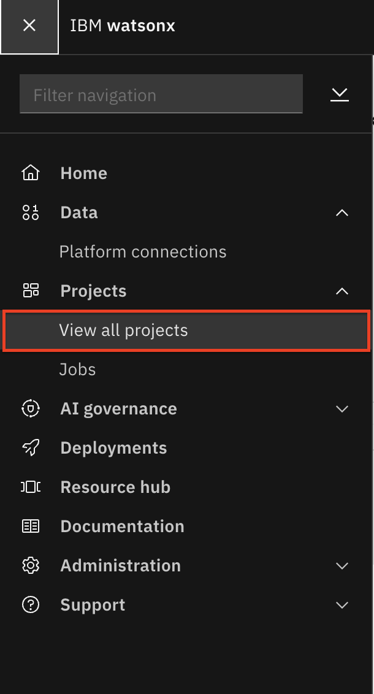

3. Click on the **New Project (1)** button. Select **Empty Project (2)** and add your initials to the project name **(3)**. For example, _LLM-workshop-MA_. Then, click on the **Create (4)** button.

    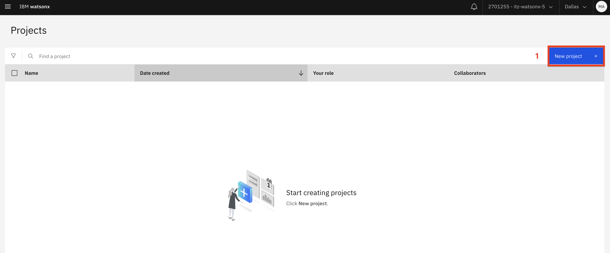
    
    

4. Select the **Manage (1)** tab. Switch to the **Services and Integrations (2)** tab, then click **Associate Service (3)**.
   
    

5. Select the displayed **Machine Learning (1)** service and click **Associate (2)**.

    

6. Switch to the **Assets (1)** tab, then click the **New asset (2)** button.

    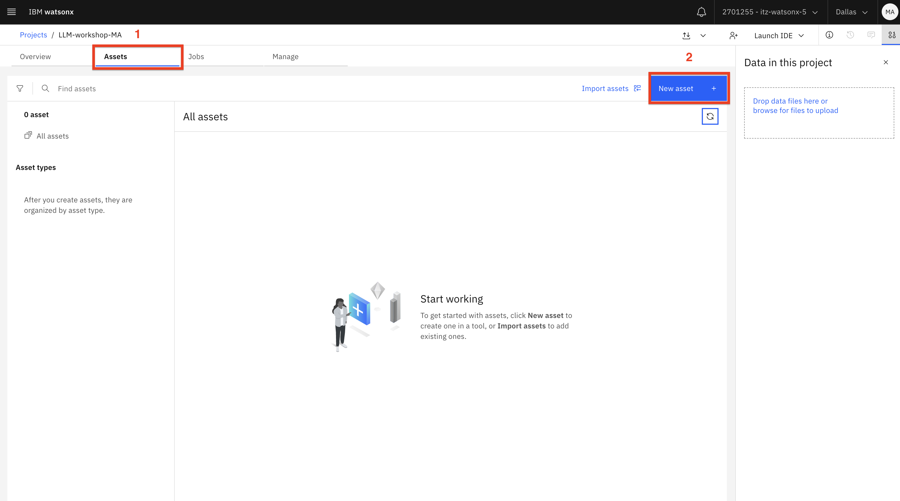

7. Click on the **Experiment with foundation models...** tile.

    


    Before we start experimenting with prompting, let’s review some key concepts about model selection.

    As you try different models, you will notice that some models return better results with zero-shot prompting (providing instructions without examples) than others. Usually models that have gone through _fine-tuning_, _instruction-tuning_ , and _RLHF_ generate significantly better output.

    - _Fine-tuning_ means that the original LLM was trained with high quality labeled data for specific use cases. For example, if our goal for the model was to “Act as an IT architect” when generating output, during the fine-tuning process we provided labeled data examples of a writing style for IT architecture.
    
    - If the model goes through the instruction-tuning process, then it will be able to generate output without explicit instructions, such as _“Can you answer this question?”_ The model will understand that you’re asking a question from the context and sentence structure.
    
    - _RLHF_ ( _Reinforcement Learning from Human Feedback_ ) is a technique that’s used to improve model output based on feedback provided by testers, usually domain experts (for example, lawyers for generation of legal documents). Before the model is released, it’s updated based on testing results.


    While all vendors can say that their model has been fine-tuned, instruction-tuned, and has gone through RLHF, the industry benchmarks for LLMs are not mature. Even benchmarks that may eventually become the industry standard (for example, [TruthfulQA](https://huggingface.co/datasets/truthful_qa)) test only certain aspects of model output.


    A potential solution to this issue is the research done by the broader LLM community. The LLM community is very active; information about the quality of models usually becomes widely known through various community resources such as articles, blogs, and YouTube videos. This is especially true for open source vs. proprietary models. For example, search for “llama vs. ChatGPT” and review results. You can also review the [leaderboard](https://huggingface.co/spaces/HuggingFaceH4/open_llm_leaderboard) on Hugging Face, keeping in mind that you will need to understand the evaluation criteria used for the leaderboard (see the [About](https://huggingface.co/spaces/HuggingFaceH4/open_llm_leaderboard) page of the leaderboard).


    Currently, the _llama-70b-2-chat_ model is one of the best models for zero-shot prompting.
    While it may seem like an obvious choice to always use _llama-70b-2-chat_ in watsonx.ai, it
    may not be possible for several reasons:

    - Model availability in the data center (due to resources or licensing)
    - Inference cost
    - Hosting cost (for on-premises or hybrid cloud deployments).

    It may be possible to achieve similar results with other models or with smaller versions of
    _llama_ by using few-shot prompting or fine-tuning, that’s why it’s important to experiment
    with multiple models and understand prompt/turning techniques.


    > Note: Instructions in this lab are written for the flan and llama models, which are available
    in all IBM Cloud data centers where watsonx.ai is hosted and in the on-premises version of
    watsonx.ai. We encourage you to try other models (for example, granite and mpt-7b), if
    they’re available in your workshop environment.

8. After the **Prompt Lab** UI opens, switch to the **Freeform (1)** tab. Select the **_flan-ul2-20b_ (2)** model. 
   
    > Note: We will review model settings later in the lab.

    

    Since most LLMs, including the selected flan model were trained on publicly available data, we can ask it some general questions.

9.  Type in the question: `What is the capital of the United States?` and click **Generate**. The generated answer is highlighted in blue.

    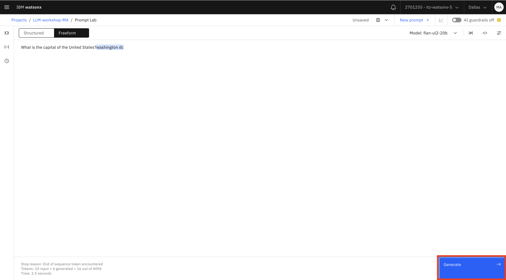

    We got the answer to our question without instructing the model to do it because the flan model was instruction-tuned to answer questions. Google , the creator of this model, published the training instructions that were used for the model in this [git repository](https://github.com/google-research/FLAN/blob/main/flan/v2/flan_templates_branched.py). As you can see in documentation, the instructions are often shown in a “technical format”, but they are still helpful for understanding the best prompting options for this model.


    Scroll down to the _natural questions_ section of the git page. Here we can see the various phrases we can use with the model when asking questions.

    

    Next, we will ask a different question: `When was Washington, DC founded?`

    

    Double check if this is a correct answer by doing a traditional Internet search. You will find out that the correct answer is _July 16th, 1790_.

    Next, switch the model to _granite_ , then _llama2-70b-chat_ and ask the question again. This time we get the correct answer.

    
    

    Next, switch the model to _mpt_ and ask the question again - we get another incorrect answer.

    

    In general, this was not a simple question because at the time of writing conflicting dates are listed on the _Library of Congress_ website and _Wikipedia_. _Library of Congress_ is a more credible source, and in this example the _Wikipedia_ page, which may have been used for model training, has the incorrect date.

    We provided this example to highlight the fact that the primary usage of LLMs should not be _general knowledge question and answer_. The quality of LLM output depends on the knowledge base that it was trained on. If we asked another question, it’s possible that _flan_
    would outperform other models.

    **_We should think of LLMs as an “engine” that can work with unstructured data rather than a “knowledge base”._**

    When you first start working with LLMs, you may think that some models are not returning the correct response because of the prompt format. Let’s test this theory with the _flan_ model.

    Enter this prompt in the **Prompt Lab**:

    ```txt
    Answer the question provided in '''.

    Question: '''When was Washington, DC founded?'''

    Answer:
    ```

    Let’s review why we constructed the prompt in this format:

    - Triple single quotes (‘’’) are often used to identify a question or text that we want the LLM to use. You can choose other characters, but avoid “ (double quotes) because they may already be in the provided text
    - Notice that we provided the word “ _Answer_ :” at the end. Remember that LLMs _generate the next probable word_ ”, and providing the word “Answer” is a “hint” for the model.

    

    Unfortunately, we did not get a more accurate result from the _flan_ model.

    We will try one more approach, this time with a different prompt, which you can copy below:

    ```text
    Using the following paragraph, answer the question provided in '''. 

    Paragraph: 

    Washington, D.C. was founded on July 16, 1790. Washington, D.C. is a unique and historical place among American cities because it was completely planned for the national capital and needed to be distinct from the states. President George Washington chose the specific site (e) along the Potomac and Anacostia Rivers. 

    The Serial Set contains a lot of information about the plan for the city of Washington, including maps, bills, and illustrations. In this Story Map, you can see original plans and pictures of Washington, D.C.

    Question: '''When was Washington, DC founded?''' 

    Answer:

    ```

    

    While this example may seem simple because we provide the answer in our prompt, it demonstrates one of the key use cases for LLMs, which is called _Retrieval Augmented Generation (RAG)_. With RAG, we ask LLMs to answer questions or generate content based on the information that we provide. In our example we hardcoded content in the prompt, but it’s also possible to implement RAG with automatic information retrieval from various knowledge bases, such as Websites, documents, emails, etc. In this case, the main feature of an LLM that we are interested in is “understanding” and not “knowledge”.   

    We used a simple example to ask a trivia question, but think about topics that may be relevant to your business for which “general information” may also exist, for example:

      - What are the steps to get a driver’s license?
      - What are the steps for submitting a car insurance claim?
      - How can I close a credit card?
      - How can I improve my credit score?
      - Will an airline reimburse me for a canceled flight?

    <br />

    Most LLMs will be able to answer these questions because they were trained on data available on the Internet, but if you want the correct answer to your question, in most cases you will need to use _RAG_ , i.e. provide information from your company’s data sources.

    _Watsonx.ai is supports several implementations of RAG_. We will cover it in more detail in one of the other labs.

    Next, we’ll test prompts that generate output.

10. Click on model parameters icon in the top right corner. Use the flan  model for your first test.

    

    If you would like to learn more about each input in the Model parameters panel, you can review [documentation](https://dataplatform.cloud.ibm.com/docs/content/wsj/analyze-data/fm-model-parameters.html?context=wx&audience=wdp).


    Change the **Max tokens** to **500**. When LLMs process instructions and generate output, they convert words to tokens (a sequence of characters). While there isn’t a static ratio for letter to token conversion, we can use 10 words = 15 to 20 tokens as a rule of thumb for conversion.

    

11. Change the prompt to write a paragraph:

    ```txt
    Write a paragraph about the capital of the United States.

    Paragraph:
    ```

    Notice that our output is rather brief.

    

    Next, we will try different model parameters and models to see if we can get better results.

12. In the model settings switch **Decoding** from _Greedy_ to _Sampling_. Sampling will produce greater variability/creativity in generated content  (see [documentation](https://dataplatform.cloud.ibm.com/docs/content/wsj/analyze-data/fm-model-parameters.html?context=wx&audience=wdp) for more information).

    > Important: Make sure to delete the generated text after the word “Paragraph” : before clicking Generate again because the model will continue generating after any given text in a prompt, which may result in repetition.

    Click the **Generate** button.

    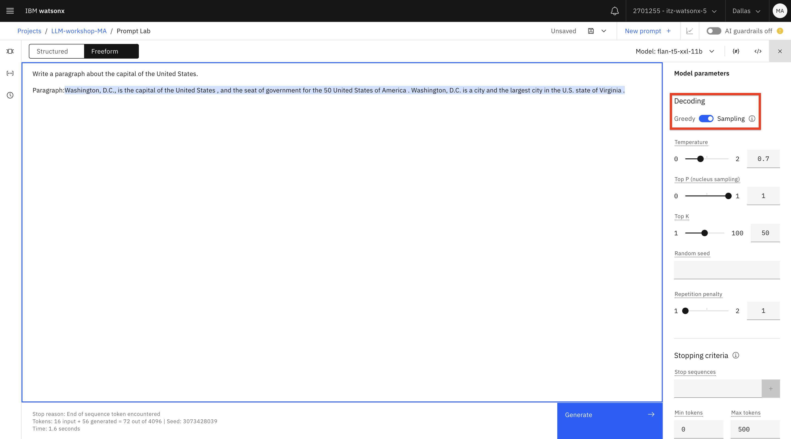
    
    It looks like we’re not getting better results with this model, so let’s try another one.

13. Test the same prompt with the _granite_ and _mpt-7b-instruct- 2_ models. Delete the generated text and test again.

    
    

    In our testing, we get better results with these models. Notice that every time you click **Generate** (after deleting the generated text), you get different results. We’re seeing this because we set the Decoding option to **Sampling**. You can also try Sampling with different temperature (higher value will result in more variability). 

    While it may seem unusual that the model generates a different output each time, it’s what we’re instructing the model to do by both giving it instructions (“write”) and setting model parameters (“sampling”). We would not use the same instructions/parameters for a classification use case which needs to provide consistent output (for example, positive , negative , or neutral sentiment).

14. Finally, try the _llama_ model. For “creative output” use cases, _llama_ usually produces the best output.


    While you can you use the same prompt, we should also be familiar with _system prompt format_ in llama , which is one of the few models that accepts prompts in a specific format.


    Enter this prompt:

    ```text
    <s>[INST] <<SYS>>
    You are a motivational speaker. You speak in the style of Tony Robbins.
    <</SYS>>

    Please write a paragraph to motivate a tourist to visit Washington, DC [/INST]
    ```


    > Important note: If you decide to use this format for llama, make sure not to put anything after the \[/INST\] In this format you do not need to give the model a “hint” (Answer: to generate the answer, etc.), like you’ve done in other examples.

    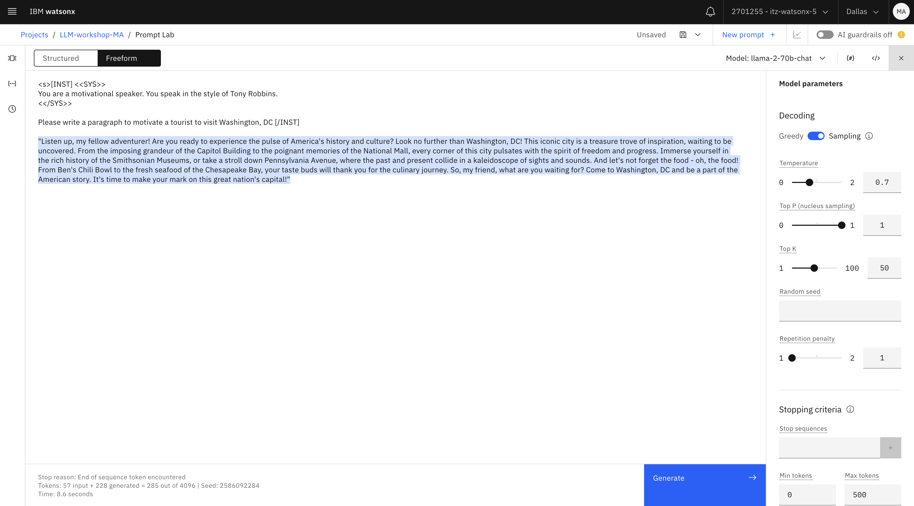

    Similar to the first prompting exercise, we started with LLMs’ general knowledge for generating output. In a business use case scenario, we would give LLMs a few short bullet points and ask it to generate output.

    If you wish to continue with the Washington, DC example, you can use this other prompt:

    ```text
    <s>[INST] <<SYS>>
    You are a marketing consultant. 
    <</SYS>>

    Please generate a promotional email to visit the following attractions in Washington, DC:
    1. The National Mall
    2. The Smithsonian Museums
    3. The White House
    4. The U.S. Capitol 
    5. The National Gallery of Art
    [/INST]
    ```

    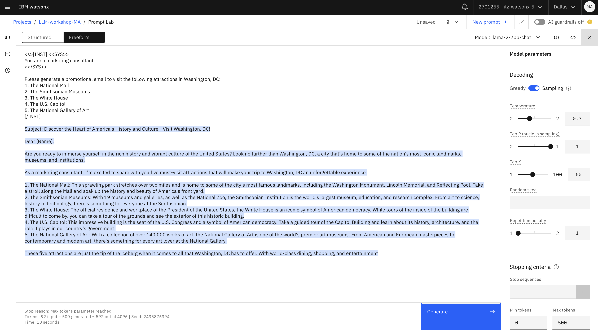

    Another example of generation is provided in Sample Prompts included with the Prompt Lab.

15. You may have already noticed that working with LLMs requires experimentation. In the **Prompt Lab** we can save the results of our experimentation with prompts

    - As a notebook
    - As a prompt
    - As a prompt session.

    If we save our experimentation as a prompt session, we will be able to access various prompts and the output that was generated.

    In the **Prompt Lab** , select **Save work -> Save as**.

    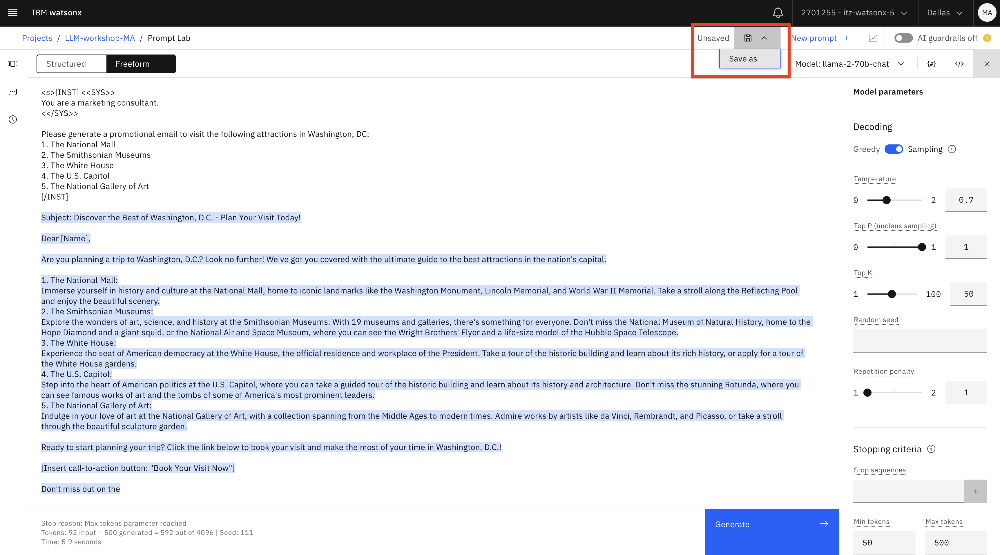

    Select the **Prompt session (1)** tile. Name the prompt session `Generate_paragraph` **(2)**. Click **Save (3)**

    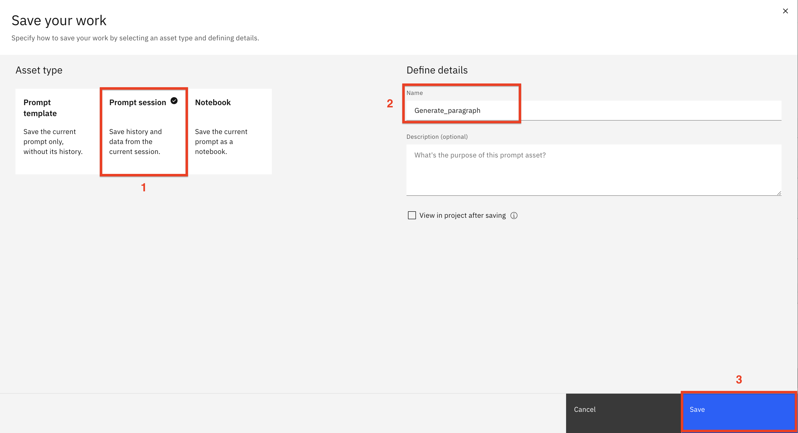

16. Open [watsonx.ai](https://dataplatform.cloud.ibm.com/projects/?context=wx) in another browser window and navigate to your project.

    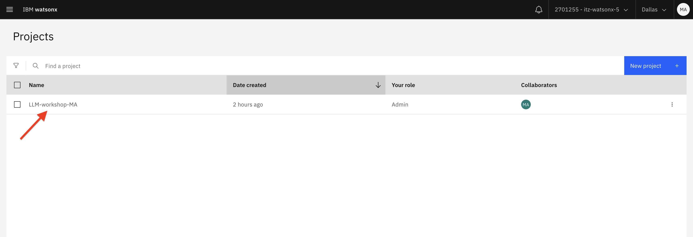
    
17. Click on the **Assets (1)** tab and open the prompt session asset **(2)** that you created.

    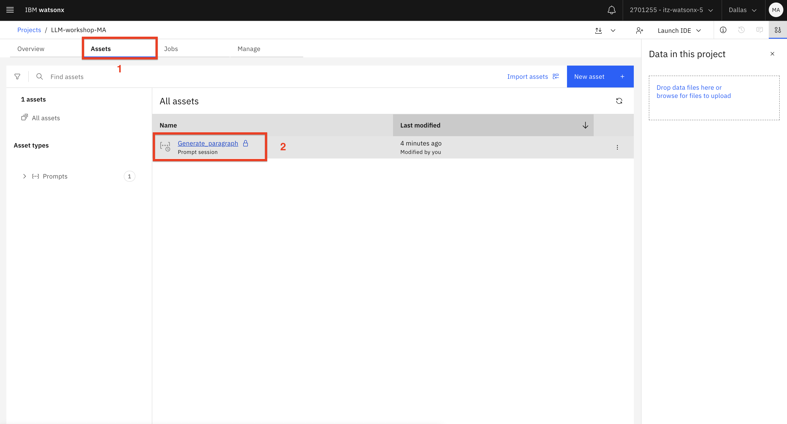
    
18. In the **Prompt Lab** , click on the _History_ icon.

    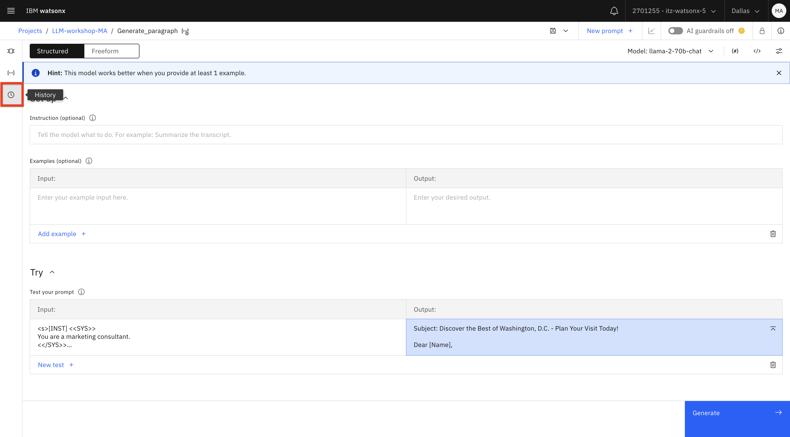

    Notice that you can click on various prompts that you tested and view the output in the Test your prompt section of the Prompt Lab.

    

    Close this browser tab and return to the Prompt Lab.


    What you have tried so far is a “ question and answer and generation use case with zero-shot prompting ” – you’ve asked the LLM to generate output without providing any examples. The majority of LLMs produce better output when they’re given a few examples. This technique is called “few-shot prompting”. The examples are provided in the prompt after the instruction.


    Let’s test few-shot prompting for various use cases.

19. In the **Prompt Lab** , create a new prompt. Switch to **Freeform** , and paste the following prompt:

    ```text
    Write a paragraph about the capital in '''.

    Capital: '''London'''

    Paragraph: London, the iconic capital city of the United Kingdom, stands as a dynamic tapestry woven from centuries of history, culture, and innovation. With its blend of historic landmarks and modern marvels, London captures the essence of a global metropolis. The River Thames meanders through its heart, bordered by a panorama of architectural wonders such as the Tower Bridge, the Houses of Parliament, and the Tower of London. The city's rich history is palpable in its cobbled streets, where ancient stories whisper from every corner. Museums like the British Museum and the Tate Modern house an unparalleled collection of art and artifacts, while West End theaters stage world-class performances that define the realm of entertainment. From the royal grandeur of Buckingham Palace to the bustling vibrancy of Camden Market, London's diverse neighborhoods offer a mosaic of experiences that celebrate both tradition and innovation. A melting pot of cultures and cuisines, London's culinary scene is a reflection of its global population, inviting exploration and gastronomic delight. In every alleyway, park, and bustling street, London emanates an aura of ceaseless energy and opportunity, inviting visitors and residents alike to immerse themselves in its ever-evolving story.

    Capital: '''Tokyo'''

    Paragraph: Tokyo, the electrifying capital of Japan, stands as a testament to the harmonious blend of ancient traditions and cutting-edge modernity. This sprawling metropolis pulses with a vibrant energy that encapsulates both the past and the future. Skyscrapers and neon lights adorn the skyline, creating a mesmerizing spectacle in districts like Shinjuku and Shibuya. Amidst the urban buzz, historic shrines and temples such as Meiji Shrine and Senso-ji offer serene respites, where one can glimpse into Japan's rich spiritual heritage. The efficient and intricate public transportation system whisks residents and visitors seamlessly across the city's diverse neighborhoods, each with its unique character. From the fashion-forward streets of Harajuku to the upscale elegance of Ginza, Tokyo's districts cater to every taste and preference. Culinary adventures abound, with world-renowned sushi, ramen, and street food stalls enticing the palate. The city's constant evolution is matched only by its unwavering commitment to preserving its cultural heritage, resulting in a truly immersive experience where tradition and innovation dance in harmony.


    Capital: '''Cairo'''

    Paragraph: Cairo, the bustling capital of Egypt, stands as a bridge between the ancient wonders of the past and the vibrant pulse of the present. Nestled along the banks of the Nile River, Cairo is a sprawling metropolis that embodies the nation's rich history and contemporary dynamism. The iconic pyramids of Giza and the enigmatic Sphinx loom just beyond the city's edge, bearing witness to the enduring legacy of the Pharaohs. In the heart of Cairo, the historic district of Islamic Cairo boasts intricate mosques, bustling bazaars, and winding alleys that transport visitors back in time. The Egyptian Museum, a treasure trove of antiquities, showcases the remarkable artifacts of ancient civilizations. Amidst the chaos of traffic and markets, the serene calm of the Nile promenade offers a respite, where felucca boats glide by against the backdrop of the city's skyline. Cairo's vibrant street life, aromatic street food, and vibrant arts scene reflect the city's diverse culture and modern ambitions. In the ebb and flow of Cairo's daily life, the past and present converge, creating a city that is as layered and complex as the history it holds within its streets.

    Capital: ''' Washington, DC'''

    Paragraph: 
    ```


20. Modify model parameters:
    - Change _decoding_ to _sampling_ (for more creative output)
    - Change the min and max number of tokens to the output you would like to see (for example, _50 min_ and _500 max_ )
    - If you wish, you can test different models.


    Test the model and review the output.

    


    Next, we will review the concept of tokens.

21. Notice the token count that’s shown on the bottom of the model output.


    In this screenshot of the _flan_ model output, the “ _out of_ ” number ( _4096_  ) shows the
    maximum number of tokens that can be processed by a model. If you test with a different
    model, the maximum number of tokens will be different.

    

    It’s important to understand the following facts about tokens:

    - All LLMs have a limit for the number of supported tokens. The maximum number of
        tokens is usually captured in documentation or in the UI, as you’ve seen in the **Prompt Lab.**
    - The maximum number of tokens includes both input and output tokens. This means that you can’t provide an unlimited number of examples in the prompt. In addition to that, each model has the maximum number of output tokens (see [documentation](https://dataplatform.cloud.ibm.com/docs/content/wsj/analyze-data/fm-models.html?context=wx&audience=wdp)).
    - Some vendors have daily/monthly token limits for different plans, which should be considered when selecting an LLM platform.

    <br />

    Example of token limits (from documentation):

    

    Understanding token constraints is especially important for summarization, generation, and
    Q&A use cases because they may require more tokens than classification, extraction, or sentiment analysis use cases.


    The token constraint limitation can be solved with several approaches. If we need to
    provide more examples to the model, we can use an approach called Multitask Prompt
    Tuning (MPT) or fine tuning. We are not covering these advanced approaches in this
    introductory lab.


    Up to this point we reviewed question & answer and generation examples. We started with
    these examples because for most users they are the “first experience” with generative AI.
    Many people are familiar with ChatGPT , a popular personal assistant application developed
    by OpenAI. Sometimes the terms generative AI and even LLM are used interchangeably with
    ChatGPT , but ChatGPT is more than an LLM, it’s a complex application that uses LLMs.


    LLMs are building blocks or components of an application, and by themselves they can
    rarely be used by a business user. ChatGPT is a tool that focuses on personal productivity
    tasks for many types of users. Companies that want to build AI-driven applications need an
    AI development and deployment platform, such as watsonx.ai.


    In our experience of working with clients, some of the top generative AI use cases are:
    - Content summarization
    - Content classification
    - Content generation
    - Content extraction, NER (Named Entity Recognition)
    - Sentiment analysis
    - Question answering with RAG

    <br />

    Now that you have reviewed and created prompts, we will test the integration of LLMs with client applications.


## Integrate LLMs with applications

Prompt engineering is just one of the steps in the process of integrating LLMs into business applications.

Let’s review other steps:

- There are several types of tuning, which is usually applied to improve model output. In many use cases tuning won’t be a required step.
- LLMs are pre-deployed (available for invocation out-of-the-box) in _watsonx.ai_. The only time deployment may be required is for tuned models.
- Testing and integration is done with either the REST API or the Python SDK.

In this section we will review the testing and integration steps.

1. Navigate to the **Prompt lab** and open one of the prompts you previously created or one of the sample prompts.

2. Generate a response using this prompt:

    ```txt
    Please provide top 5 bullet points in the review provided in '''.


    Review:
    '''I had 2 problems with my experience with my refinance. 1) The appraisal company used only tried to lower my house value to fit the comps that he was able to find in the area. My house is unique and he did not use the unique pictures to compare value. He purposely left them out of the appraisal. 2) I started my loan process on a Thursday. On Saturday I tried to contact my loan officer to tell him of the American Express offer that I wanted to apply for. I was informed that it was too late and I could not use it because it would delay the process. I had just received the email about the offer and I had just started the process so how was it too late to get in on the $2,000 credit on my current bill. I let it go but I should have dropped the process and restarted it because that would have helped me out with my bill.'''

    Top bullet points:
    1. The appraisal company undervalued the reviewer's house by purposely excluding unique pictures that would have accurately assessed its value.
    2. The uniqueness of the house was not taken into consideration, and the appraiser relied solely on comps that did not reflect its true worth.
    3. The reviewer attempted to inform their loan officer about an American Express offer they wanted to apply for, which would have provided a $2,000 credit on their current bill.
    4. The loan officer stated it was too late to take advantage of the offer as it would delay the process, despite the reviewer having just received the email and recently started the loan process.
    5. The reviewer regrets not dropping the process and restarting it to benefit from the offer, as it would have helped them with their bill.


    Review:'''
    For the most part my experience was very quick and very easy. I did however, have 3 issues.

    #1 - When I received my final numbers, my costs were over $2000 more than was quoted to me over the phone. This was straightened out quickly and matched what I was quoted.

    #2 - The appraiser had to change his schedule and when I didn't know if I could be home for the appraisal, he said he could do it with me not there. I do not think this is a wise thing to do or to offer.

    #3 - When I received my appraisal, it was far lower than it should have been. My house appraised for basically the same price I purchased it for 14 years ago. I have kept the home up with flooring, paint, etc. It has new shingles on it from last summer, the driveway has been paved, I have about three acres landscaped compared to maybe one when I bought it, and have paved the driveway which was originally gravel.

    Even if you discount the insanely high prices that houses are selling for in today's market, the house has increased in value over the past fourteen years. In fact, some of the compared properties looked like camps that were not on water, had no basement or possibly no slab, and very minimal acreage. These comparably priced houses were in no way equal to my 4 bedroom cape, with a wraparound deck, on 4 acres, though not on the water, it is overlooking lake around 100 feet away at the most. I feel very strongly that the appraisal price was put in at a high enough estimate to satisfy the needs of the refinance loan.'''

    Top bullet points:
    1. Overall, the experience was quick and easy, but there were three specific issues.
    2. Initially, the quoted costs over the phone did not match the final numbers, resulting in a discrepancy of over $2000. However, this was promptly resolved.
    3. The appraiser offered to conduct the appraisal without the homeowner present, which the reviewer felt was unwise and not recommended.
    4. The appraisal value of the house was significantly lower than expected, even considering the current high housing market prices. The reviewer mentioned various upgrades and improvements made to the house over the past 14 years.
    5. The reviewer expressed a strong belief that the appraisal was deliberately set at a lower value to meet the requirements of the refinance loan, despite the property's unique features and advantages compared to the comparables used.


    Review:'''
    I was told upfront and throughout most of the process that I would be able to get a $25K payout/cash back based on the market value of my house that was discussed in the original conversation with the loan officer. However, midway into the process I was told by the loan officer that I was only able to get $17.5K back. Additionally, I was told that I would be able to skip 2 months of mortgage payment to help makeup for the cash shortage. However, at the end of the day I was told that I could only skip 1 mortgage payment. These 2 drawbacks caused me to not fully satisfy the financial reason of why I originally wanted to refinance which was to get the $25K cash.

    Top bullet points:
    1. The initial agreement with the loan officer stated that the reviewer would receive a $25K cash payout based on the market value of their house.
    2. Midway through the process, the loan officer informed the reviewer that they would only be eligible for a $17.5K cash payout, which was lower than initially discussed.
    3. The reviewer was also promised the ability to skip two months of mortgage payments to compensate for the cash shortage, but they were later informed that they could only skip one payment.
    4. These discrepancies in the cash payout amount and the reduced mortgage payment relief prevented the reviewer from fulfilling their original financial objective of obtaining the $25K cash.
    5. The limitations and changes in the terms impacted the overall satisfaction with the refinancing process and compromised the financial benefits the reviewer had anticipated.

    Review:'''
    I started my loan process toward securing a VA loan. I was waiting for a a month and a couple weeks, then I was told that the VA needed to acquire my retirement points to verify my veteran status. If I knew this is what my loan was on hold for, I could have contacted the VA office right away and got this cleared up. 
    For whatever reason, it took the underwriting department a long time to verify my employment status, even after I uploaded a couple years of my W2 forms from both of my jobs, and they had my Social Security number to further verify my employment status. My loan completion date was extended, because I wasn't made aware that they were waiting for my VA status to be approved. The push back for my mortgage is common for mortgage companies, but this caused my interest rate to go up. Then, the securing of a closing lawyer being made aware to me and the lawyer needing three days to get their end prepared for me to go to their office to sign the paperwork wasn't made aware to me. My loan missed the second closing date. For whatever reason, the locked in interest rate jumped up 5/8 points. After making the banker I was working with aware of this, he didn't understand why the locked in interest rate jumped up either. He was nice enough to work on it and was able to get the interest rate down in 1/4 of a point, so my mortgage has an interest rate that is 3/8 of a point higher than my locked in interest rate in the beginning of this process. Although my interest rate is higher than the locked in interest point, at the end, the mortgage is successfully finished.
    '''

    Top bullet points:
    ```

    - You can use either the _flan_ or the _mpt_ model
    - Keep the decoding method as _Greedy_
    - Add a stop sequence of “.” to prevent output that ends with mid-sentence.
    - Make sure to set the min and max tokens to 50 and 300.

    

    After testing the prompt, click **Generate (1)** and then click on the **View code (2)** icon.

    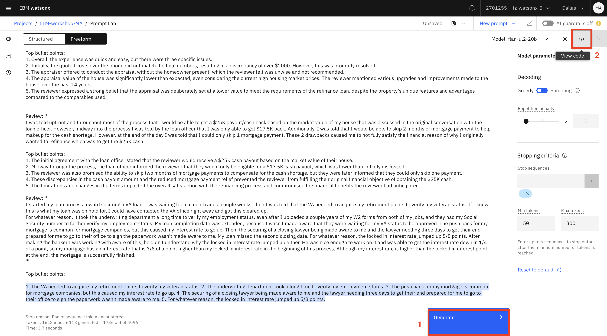

    Copy the code to a notepad.

    

    Let’s review the code.

    This code is an example of a REST call to invoke the model. **Watsonx.ai** also provides a
    Python API for model invocation, which we will review later in this lab.

    The header of the REST request includes the URL where the model is hosted and a
    placeholder for the authentication token. At this time all users share a single model
    inference endpoint. In the future, IBM plans to provide dedicated model endpoints.

    > _Note: IBM does not store model inference input/output data. In the future, users will be able
    to opt in to storing data._

    Security is managed by the _IBM Cloud authentication token_. We will get this token shortly.

    The body of the request contains the entire prompt.

    

    Finally, at the end of the request we specify model parameters and the _project id_.

3. Now we will get the authentication token. See [Creating an IBM Cloud API key](https://cloud.ibm.com/docs/account?topic=account-userapikey&interface=ui#create_user_key) for more information.
   
4. In [watsonx.ai](https://dataplatform.cloud.ibm.com/wx/home?context=wx) click on the **Work with data and models in Python or R notebooks** tile.

    


    Click the **Local file (1)** tab and navigate to the downloaded git repo _/notebooks_ folder to select the [TestLLM](https://github.com/ibm-build-lab/VAD-VAR-Workshop/tree/main/content/Watsonx/WatsonxAI/files/201/notebooks) notebook **(2)**. Make sure that the _Python 3.10 environment_ is selected **(3)**. Click **Create (4)** to import the notebook.

    

    Let’s review the sample notebook.

    This notebook acts as a client application that invokes the deployed LLM with a Python SDK. We are using the notebook as a client for simplicity of testing during this lab.

    Enterprise client applications can be implemented in Python, Java, .Net and many other programming languages. As discussed earlier, LLMs deployed in watsonx.ai can be invoked either with REST calls or with the Python SDK.

    Run the notebook to test the LLM with your prompts. See specific instructions in the notebook.

    Next, we will use a Python IDE, such as **Visual Studio** or **PyCharm** to run the client
    application.

5. Find the following Python scripts in the downloaded git repo [applications](https://github.com/ibm-build-lab/VAD-VAR-Workshop/tree/main/content/Watsonx/WatsonxAI/files/201/applications) folder:
   
    - _demo_wml_api.py_
    - _demo_wml_api_with_streamlit.py_

    Load these scripts into your Python IDE.

6. To run this script, you will need to install some dependencies in your Python environment. You can do so by downloading the [requirements.txt](https://github.com/ibm-build-lab/VAD-VAR-Workshop/blob/main/content/Watsonx/WatsonxAI/files/201/requirements.txt) into your project, and install the requirements by running this command: 

   `python3 -m pip install -r requirements.txt`.

   > Important: If you’re running on Windows, you will need to run this script in an Anaconda Python environment because it’s the only supported [Python environment](https://docs.streamlit.io/get-started/installation) on Windows. Both VS Code and Pycharm can be configured to use Anaconda.

    Let’s review the scripts.

    _demo_wml_api.py_ is a simple Python script that shows to how invoke an LLM that’s
    deployed in watsonx.ai. Code in this script can be converted to a module and used in
    applications that interact with LLMs.

    The script has the following functions:

    - _get_credentials(): reads the api key and the project id from the .env file (will be used for_
        _authentication_
    - _get_model()_ : creates an LLM model object with the specified parameters
    - _answer_questions()_ : invokes a model that answers simple questions
    - _get_list of_complaints():_ generates a list of complaints from a hardcoded customer
        review
    - _invoke_with_REST():_ shows how to invoke the LLM using the REST API (other
        functions use the SDK)
    - _get_auth_token():_ generates the token that’s required for REST invocation
    - _demo_LLM_invocation():_ invokes all other functions for testing


    > Important: Prior to running the script, create a `.env` file in the root directory of your project and add your Cloud API key and project id.

    > For more information, see [Creating an IBM Cloud API key](https://cloud.ibm.com/docs/account?topic=account-userapikey&interface=ui#create_user_key) and [Looking up your watsonx project ID](https://dataplatform.cloud.ibm.com/docs/content/wsj/analyze-data/fm-project-id.html?context=wx).


7. Run the script _demo_wml_api.py_. The output will be shown in the Python terminal.
   
      ``` bash
         python ./demo_wml_api.py
      ```
    
    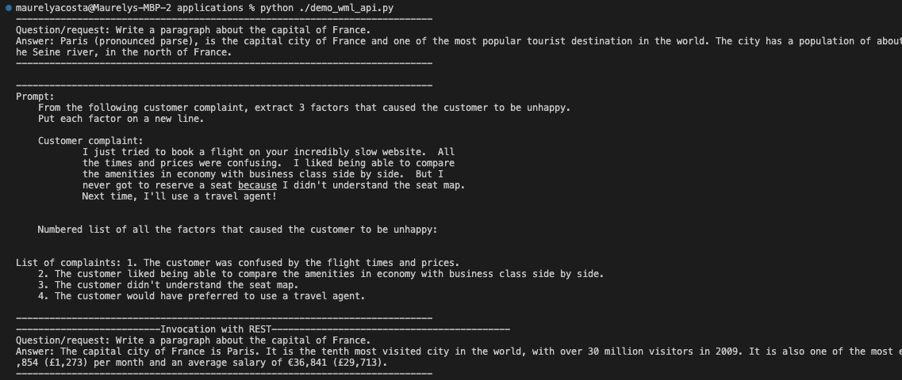

    Next, we will invoke the LLM from a UI. We will use a popular web application development
    framework, Streamlit, to create a simple UI.

8. Open the _demo_wml_api_with_streamlit.py script._ This application uses similar code to
    invoke the LLM as a previous example.   

    The application has 4 functions:

   - _get_credentials(): reads the api key and the project id from the .env file (will be
   used for authentication_
   - _get_model()_ : creates an LLM model object with the specified parameters
   - _get_prompt()_ : creates a model prompt
   - _answer_questions ():_ sets the parameters and invokes the other two functions.


    As you can tell by the name of the last function, this is a simple Question and Answer UI.
    You will notice that the prompt is more complicated than the prompt in the previous
    example: we provide instructions and a few examples (few-shot prompting).

    Notice that we are hardcoding the instruction to answer the question. This is just an
    example, and you can choose to parameterize all components of the prompt.

9.  When you run the script, Python will open the _Streamlit UI_ in your browser.
    
    If you invoke Python application from a terminal, and not an IDE then use the following
    command: `streamlit run demo_wml_api_with_streamlit.py`

    > Note: When testing, ask “general knowledge” questions keeping in mind that our prompt is not sophisticated and that the model was trained on generally available data.

    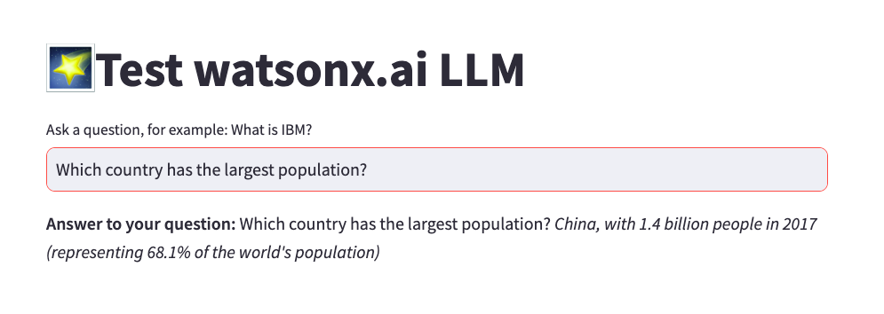

    

## Conclusion

You have finished the Introduction to Generative AI lab. In this lab you learned:

- Key features of LLMs
- The basics of prompt engineering, including parameter tuning
- Using the Prompt Lab to create and test prompts with models available in watsonx.ai
- Testing LLM model inference
- Creating a simple UI to let users interact with LLMs.
