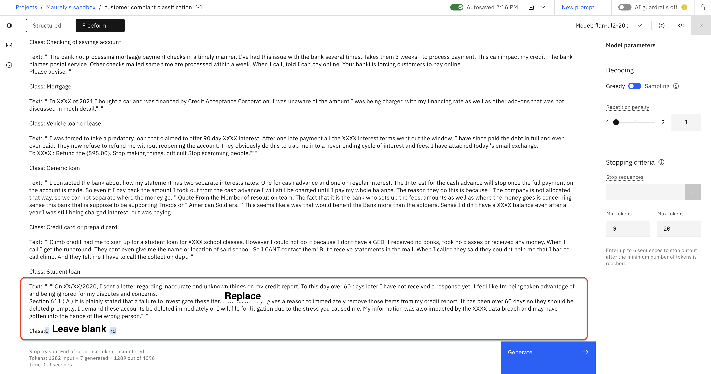
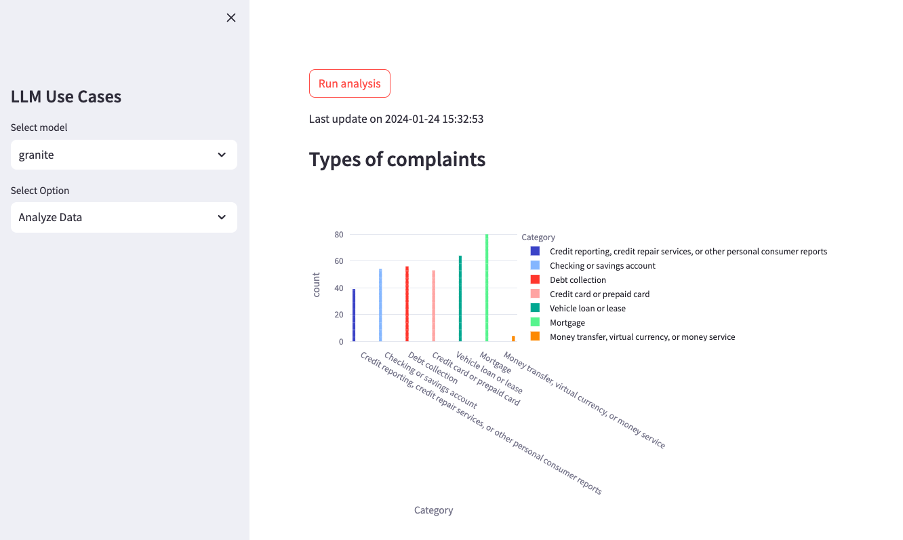
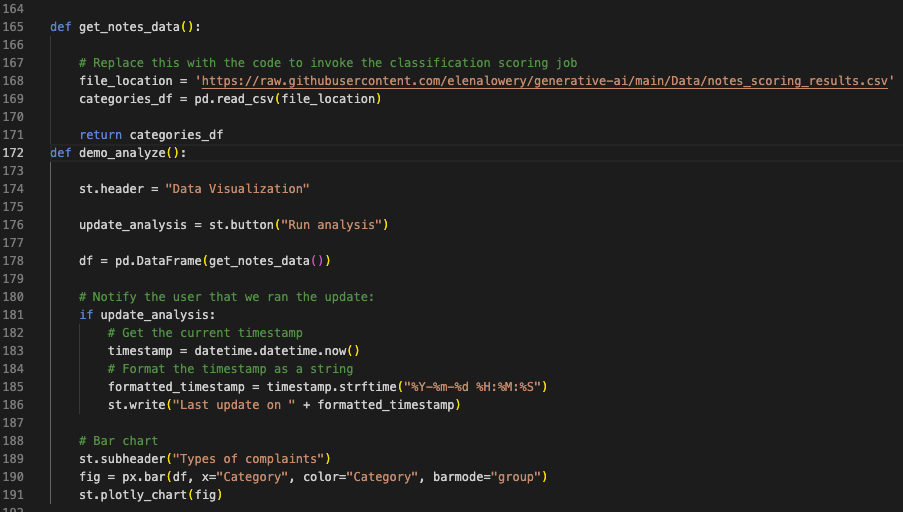

<QuizAlert text="¡Aviso! ¡El material del cuestionario se marcará así!" />

# Bloques de construcción de aplicaciones de modelos de grandes modelos de lenguaje

Este ejercicio práctico le mostrará cómo integrar grandes modelos lingüísticos (LLM) con aplicaciones cliente. Revisaremos varios ejemplos de código Python que se pueden utilizar como "bloques de construcción" para una aplicación LLM. A continuación, utilizaremos un prototipo de interfaz de usuario simple implementado con [Streamlit](https://streamlit.io/) para mostrar cómo se pueden invocar estos bloques de construcción desde las aplicaciones cliente.

La ingeniería de prompts es sólo uno de los pasos del proceso de integración de los LLM en las aplicaciones empresariales. Está fuera del alcance de esta guía proporcionar una introducción a la ingeniería de prompts en watsonx.ai. Para una introducción a la ingeniería de prompts en watsonx.ai, consulte [los Laboratorios VEST watsonx.ai L3](/watsonx/watsonxai).

## Requisitos previos

*   Acceso a watsonx.ai.

*   IDE de Python con entorno Python 3.10

    *   Vamos a utilizar el IDE de Python, [Visual Studio Code (VSCode)](https://code.visualstudio.com/)

*   También tendrá que descargar los archivos de laboratorio de [esta carpeta GitHub](https://github.com/ibm-build-lab/VAD-VAR-Workshop/tree/main/content/Watsonx/WatsonxAI/files/202)

    *   Nos referiremos a esta carpeta como la carpeta *repo*.

## Revisión de guiones para diversas tareas de LLM

En esta sección revisaremos 4 scripts Python y 2 notebooks que pueden ser utilizados como bloques de construcción para aplicaciones LLM.

> Nota: Es posible que las preguntas y la configuración del modelo en los guiones no siempre devuelvan resultados perfectos. Si lo desea, puede modificar las instrucciones y los parámetros del modelo.

1.  Cargue los siguientes scripts de la carpeta repo/scripts en su IDE de Python:

    *   use\_case\_infererence.py
    *   use\_case\_summary.py
    *   use\_case\_generate.py
    *   use\_case\_transform.py

    Como se puede deducir de los nombres de los scripts, éstos contienen indicaciones para los casos de uso más comunes de LLM. Cada script sigue una estructura de código similar:

    *   La librería *ibm-watson-machine-learning* se utiliza para invocar LLMs desplegados en watsonx.ai.

    *   La clave de la API de IBM Cloud y el identificador del proyecto watsonx se obtienen del archivo *.env* (archivo de entorno) que crearemos en un paso posterior de este laboratorio.

        

    *   La función parametrizada **get\_model(** ) crea un objeto modelo que se utilizará para invocar al LLM con el fin de que la aplicación obtenga respuestas para el texto que se introduzca en el prompt.

        

    *   La función **get\_prompt** () creará el mensaje final que se pasará al modelo. La función utilizará el texto de un parámetro pasado desde la función **get\_review()** o **get\_sample\_text()** que será analizado por el LLM.

        > Es posible organizar el código sin codificar la parte de la instrucción del prompt, pero no lo cubriremos en este laboratorio.

        

    *   La función **main(** ) especifica los parámetros del modelo e invoca las demás funciones. La función imprime la salida LLM en el terminal.

        

    *   Por último, cada script contiene al menos una función que puede ser llamada por un módulo externo de Python. Por ejemplo, en *use\_case\_generate.py*, el nombre de la función es **generate**.

2.  Antes de ejecutar los scripts, cree un archivo *.env* en el directorio raíz de su proyecto y añada su clave de API de IBM Cloud y el identificador de proyecto watsonx.

    > Para obtener más información, consulte [Creación de una clave de API de IBM Cloud](https://cloud.ibm.com/docs/account?topic=account-userapikey\&interface=ui#create_user_key) y [Búsqueda de su ID de proyecto watsonx](https://dataplatform.cloud.ibm.com/docs/content/wsj/analyze-data/fm-project-id.html?context=wx).

3.  Abra un terminal y navegue hasta la ubicación de los scripts. Ejecute cada script. Por ejemplo, puede ejecutar uno de los scripts con el siguiente comando:

    ```bash
       python ./use_case_generate.py
    ```

    Mientras revisas y ejecutas el código, plantéate las siguientes preguntas:

    *   ¿Cómo se puede mejorar este código?
    *   ¿Por qué los resultados pueden ser diferentes en cada ejecución?
    *   ¿Qué parámetros podemos ajustar para minimizar la variabilidad del resultado del modelo y hacerlo más determinista?
    *   ¿Por qué implementamos este código como scripts y no como cuadernos?
    *   ¿Cuándo tiene sentido implementar este código como cuadernos?

A continuación, revisaremos la aplicación Streamlit de ejemplo que utiliza estos scripts en tiempo real.

## Aplicación Streamlit UI

Streamlit es un framework de código abierto para crear aplicaciones Web. Lo incluimos en nuestro taller por su facilidad de uso. Aunque los clientes pueden utilizar Streamlit, no es un requisito para la integración con watsonx.ai.

1.  Carga la aplicación *Streamlit* de ejemplo, *sample\_llm\_ui\_demo.py*, de la carpeta repo/scripts en tu IDE de Python.

2.  Para ejecutar este script, necesitarás instalar algunas dependencias en tu entorno Python. Puedes hacerlo descargando el [requirements.txt](https://github.com/ibm-build-lab/VAD-VAR-Workshop/blob/main/content/Watsonx/WatsonxAI/files/202/requirements.txt) en tu proyecto, e instalar los requisitos ejecutando este comando:

    `python3 -m pip install -r requirements.txt`.

    > Importante: Si está ejecutando en Windows, necesitará ejecutar este script en un entorno Anaconda Python porque es el único entorno Python soportado en Windows. Tanto VS Code como Pycharm pueden configurarse para usar Anaconda.

3.  Revisemos la solicitud.

    <QuizAlert text="This will be on the quiz" />

    La mayor parte del código crea la interfaz de usuario y gestiona las interacciones. Los LLM se invocan en el evento de clic del botón. Cada clic enviará una solicitud para ejecutar un script e inferir nuestras indicaciones.

    

4.  Cuando ejecutes el script, Python abrirá la interfaz de usuario de Streamlit en tu navegador en la url local [http://localhost:8501.](http://localhost:8501)

    Si invoca la aplicación Python desde un terminal, y no desde un IDE, utilice el siguiente comando:

    ```bash
       streamlit run ./sample_llm_ui_demo.py
    ```

5.  Ejecute la aplicación y revise los resultados.

    *   Puede pegar diferentes reseñas en la interfaz web

    *   Probar los casos de uso Resumen y Extracción

    *   Si desea cambiar los parámetros del modelo, cámbielos en:

        *   *use\_case\_summary.py* - function *get\_summary()*
        *   *use\_case\_inference.py* - función extract( *)*

    A medida que experimente con diferentes modelos, notará que la salida no es perfecta. Estamos usando el mismo prompt para todos los modelos para mantener el código relativamente simple. En la mayoría de las aplicaciones de producción, el usuario final no tendrá la opción de elegir un modelo, por lo que podrá optimizar el indicador para obtener el mejor rendimiento.

    <QuizAlert text="This will be on the quiz" />

    En la actualidad, el modelo llama-70b-2-chat es uno de los mejores modelos de prompts de disparo cero. Aunque pueda parecer una opción obvia utilizar siempre llama-70b-2-chat en watsonx.ai, puede que no sea posible por varias razones:

    *   Disponibilidad del modelo en el centro de datos (debido a recursos o licencias)
    *   Coste de inferencia
    *   Coste de alojamiento (para implantaciones locales o en nube híbrida)

    Puede que sea posible conseguir resultados similares con otros modelos o con versiones más pequeñas de llama utilizando prompting de pocos disparos o un ajuste fino, por eso es importante experimentar con varios modelos y entender las técnicas de prompt/turning. Te animamos a probar otros modelos (por ejemplo, granito y mpt-7b) en el **Prompt Lab** para experimentar y optimizar el prompt, y luego pegarlo en los módulos respectivos.

A continuación, veremos una implementación alternativa de un caso de uso de clasificación.

## Clasificación

La clasificación es uno de los casos de uso más consolidados en el Procesamiento del Lenguaje Natural (PLN). El uso de LLMs para la clasificación tiene pros y contras. Tenga en cuenta lo siguiente cuando utilice LLM para la clasificación:

<QuizAlert text="This will be on the quiz" />

*   A favor: Los LLM no requieren datos de formación
*   Inconveniente: sin un ajuste rápido o un ajuste fino, es probable que los LLM produzcan resultados menos precisos que los modelos ML tradicionales.
*   Contra: coste de la inferencia (si se utiliza una oferta Cloud, el recuento de tokens se utiliza a menudo como métrica de carga).

Para nuestro siguiente caso de uso, aplicaremos el enfoque tradicional de PNL porque tenemos datos etiquetados y nos gustaría "ahorrar" nuestro uso de tokens para tareas que no pueden ser completadas por los modelos tradicionales de PNL, como el resumen y la generación de contenidos.

Aunque no utilizaremos el prompt o LLM de despliegue para el Paso 1 de esta sección, le recomendamos que lo complete para comprender las capacidades de clasificación de los LLM.

1.  En **watsox.ai** abre el **Prompt Lab** y prueba el prompt siguiendo las siguientes instrucciones.

    *   Ejemplo de solicitud: *Bank\_complaint\_classification.txt* (en la carpeta repo/prompts)

        *   El prompt utiliza la técnica de "few-shot prompting" proporcionando ejemplos en el prompt después de la instrucción.

    *   Modelo: flan o mpt

    *   Descodificación: codiciosa (Greedy)

        *   Dado que se trata de un caso de uso menos creativo o basado en hechos, utilizaremos la descodificación codiciosa. El muestreo producirá una mayor variabilidad/creatividad en el contenido generado (consulte [la documentación](https://dataplatform.cloud.ibm.com/docs/content/wsj/analyze-data/fm-model-parameters.html?context=wx&audience=wdp&locale=es) para obtener más información).

    *   Datos de muestra: *classification\_training\_data.csv* (en la carpeta repo/data)

    El conjunto de datos de muestra contiene datos etiquetados: fueron etiquetados por un analista que leyó las notas y asignó la clase (categoría/sujeto) de una reclamación.

    Cuando realice la prueba, pegue una sola celda de la columna **narrativa de la reclamación del consumidor** en la parte inferior de la solicitud y asegúrese de dejar la **Clase** en blanco.

    

    

    Aunque es posible automatizar las pruebas para todos los registros narrativos de reclamaciones de consumidores y compararlos con las etiquetas de clasificación para comprobar su precisión, no utilizaremos este enfoque en el laboratorio porque agotaría nuestra asignación de tokens del servicio *IBM Cloud/watsonx.ai*.

    Habrás notado que las notas son largas y, debido a las limitaciones de fichas para cada modelo, no podremos enviar un gran número de ejemplos (aprendizaje limitado a pocas tomas).

    Es importante comprender los siguientes datos sobre las fichas:

    *   Los LLMs tienen un límite para el número de tokens soportados. El número máximo de tokens suele aparecer en la documentación o en la interfaz de usuario, como has visto en el **Prompt Lab**.

        

    *   El número máximo de tokens incluye tanto los tokens de entrada como los de salida, también conocidos como *ventana contextual*. Esto significa que no se puede proporcionar un número ilimitado de ejemplos en el prompt. Además, cada modelo tiene un número máximo de tokens de salida (véase [la documentación](https://dataplatform.cloud.ibm.com/docs/content/wsj/analyze-data/fm-models.html?context=wx&audience=wdp&locale=es)).

    La limitación de la restricción de tokens puede resolverse con varios enfoques. Si necesitamos proporcionar más ejemplos al modelo, podemos utilizar un enfoque llamado Multitask Prompt Tuning (MPT) o ajuste fino. No vamos a cubrir estos enfoques avanzados en este laboratorio.

En este momento, pasaremos al enfoque tradicional de la PNL.

Watson NLP es una biblioteca Python NLP que proporciona funciones de procesamiento del lenguaje natural para el análisis sintáctico y para diversas tareas de procesamiento de textos, como el análisis de sentimientos, la extracción de palabras clave y la clasificación.

Watson NLP contiene tanto modelos predefinidos como modelos que pueden entrenarse con datos específicos para el caso de uso. Otra de las ventajas de Watson NLP es la compatibilidad con 20 idiomas. Puede obtener más información sobre Watson NLP en [la documentación](https://dataplatform.cloud.ibm.com/docs/content/wsj/analyze-data/watson-nlp-block-catalog.html?context=wx&audience=wdp&locale=es).

2.  Importe los dos cuadernos NLP de muestra de la carpeta repo/notebooks a su proyecto watsonx.ai en IBM Cloud:

    - _Classify_notes_model_build_
    - _Classify_notes_score_
  
    <br/>
    Para cada cuaderno, siga las siguientes instrucciones:

    a. En watsonx.ai pulsa sobre la tesela **Trabajar con datos y modelos en cuadernos Python o R**.

    

    b. Haga clic en la pestaña **Archivo local** de la izquierda y navegue hasta la carpeta git repo/notebooks descargada para seleccionar un cuaderno. Asegúrese de que está seleccionado el entorno NLP Runtime 23.1.

    c. Haga clic en **Crear** para importar la libreta.

    

3.  Importa los datos utilizados por los cuadernos a tu proyecto. Los archivos de datos se encuentran en *repo/notebooks*.

    - _classification_training.csv_
    - _notes_scoring.csv_

    

4.  Repasemos los cuadernos. En cada cuaderno se ofrece una explicación detallada de la formación y puntuación de los modelos. En un nivel alto, el cuaderno de construcción de modelos:

    *   Utiliza los modelos NLP precompilados de Watson para la sintaxis y la incrustación.
    *   Entrena una SVM y un modelo ensemble utilizando datos de muestra.
    *   Evalúa la precisión del modelo.
    *   Guarda los modelos en el proyecto.

    El cuaderno de puntuación de modelos carga los modelos del proyecto y puntúa los datos. Asumimos que este modelo se desplegará para la puntuación por lotes. Si nuestro objetivo fuera desplegar la clasificación para la puntuación en tiempo real, entonces podríamos envolverlo en una función de Python como se describe en [la documentación](https://dataplatform.cloud.ibm.com/docs/content/wsj/analyze-data/ml-deploy-py-function-write.html?context=wx&audience=wdp&locale=es).

5.  Abra el cuaderno de *construcción del modelo* (Classify\_notes\_model\_build) en modo *Edición* y realice los cambios necesarios antes de ejecutarlo (consulte las instrucciones del cuaderno):

    *   Genere un token de acceso al proyecto. Consulte las instrucciones [aquí](https://dataplatform.cloud.ibm.com/docs/content/wsj/analyze-data/token.html?context=cpdaas&locale=es).
    *   Regenerar/actualizar el código para cargar los datos de entrenamiento.

6.  Abra el cuaderno de *puntuación del modelo* (Classify\_notes\_score) en modo *Edición* y realice los cambios necesarios antes de ejecutarlo (consulte las instrucciones del cuaderno):

    *   Genere un token de acceso al proyecto. Consulte las instrucciones [aquí](https://dataplatform.cloud.ibm.com/docs/content/wsj/analyze-data/token.html?context=cpdaas&locale=es).
    *   Regenerar/actualizar el código para cargar los datos de puntuación.

    Mientras revisas y ejecutas el código, plantéate las siguientes preguntas:

    *   ¿Por qué implementamos este código como un cuaderno y no como scripts?
    *   ¿Puede implementarse este código en scripts Python fuera de watsonx.ai?
    *   ¿Cómo se puede mejorar este código?

Existen varias opciones para desplegar la calificación de modelos de clasificación. Aunque puede desplegarse para la calificación en tiempo real, un escenario más común es ejecutar la calificación como un trabajo por lotes. Un trabajo por lotes puede invocarse bajo demanda.

En este laboratorio no vamos a recorrer el proceso de despliegue. Puedes leer más sobre el despliegue por lotes en [la documentación](https://dataplatform.cloud.ibm.com/docs/content/wsj/analyze-data/deploy-batch-details.html?context=wx&audience=wdp&locale=es). En este momento, en watsonx.ai tendrás que envolver el código de puntuación del modelo en una *función Python* y desplegar la función para la puntuación por lotes.

Es posible que haya observado que la aplicación *Streamlit* de ejemplo tiene una opción **Analizar datos** en el menú desplegable de casos de uso.


7.  Ejecute la aplicación Streamlit y haga clic en el botón **Ejecutar análisis**.

    

    En nuestra aplicación de ejemplo no estamos invocando la calificación por lotes a petición, sino simplemente proporcionando el archivo con los resultados de la calificación.

    

    En una implementación de producción, esta función debería realizar dos pasos:

    *   Invocar el modelo configurado para la calificación por lotes (como se describe en la documentación mencionada)
    *   Cargar resultados de la fuente de datos que se utilizó como fuente de datos de salida de la calificación por lotes.

## Conclusión

Ha finalizado el laboratorio de Bloques de Construcción de Aplicaciones LLM. En este laboratorio has aprendido:

*   Cómo escribir trabajos con la biblioteca watson-machine-learning para invocar LLMs que realizan varias tareas.
*   Cómo escribir código modular que pueda utilizarse desde aplicaciones cliente.
*   Cómo implementar un caso de uso de clasificación con la biblioteca Watson NLP.
*   Sobre la relación coste-rendimiento del enfoque basado en LLM y los casos en los que tiene más sentido aprovechar el ML tradicional (clasificación).
