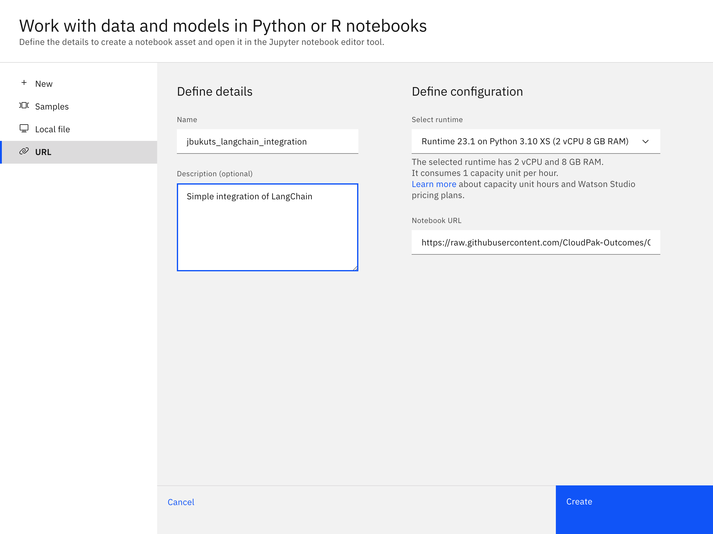
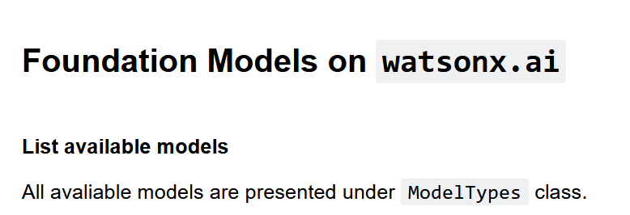
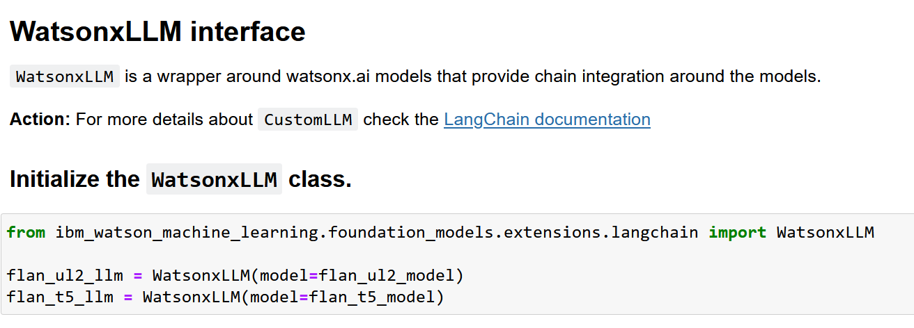
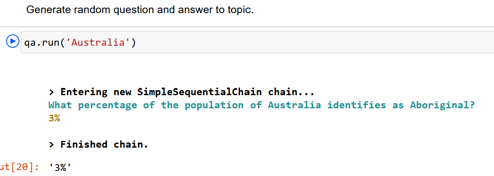
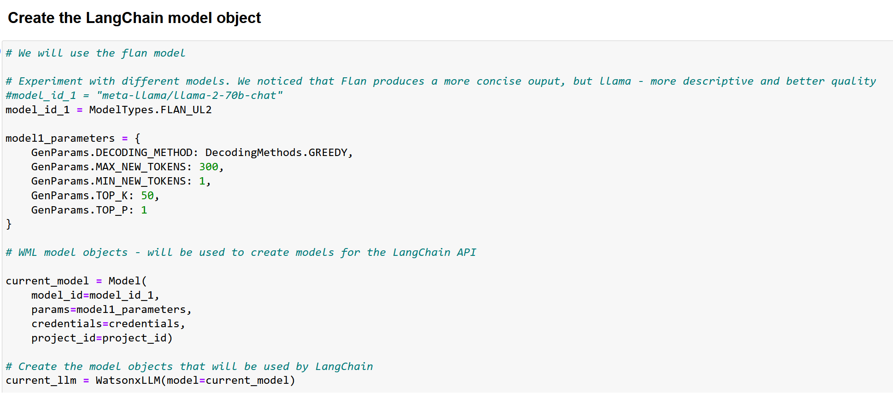

# 203: LangCadena

En este laboratorio, revisarás y ejecutarás ejemplos de aplicaciones LLM que utilizan el framework LangChain. Ampliaremos los conceptos que aprendiste en los laboratorios anteriores.

## Requisitos

> Si has completado estos pasos en los laboratorios anteriores (ver laboratorio Getting Started with Generative AI in watsonx.ai Lab), no necesitas repetirlos. Sin embargo, te recomendamos que leas esta sección, ya que contiene comentarios y consejos importantes que pueden ayudarte a depurar tu entorno, script o bloc de notas más rápidamente si tu código no se ejecuta correctamente.

*   Para completar este laboratorio necesitarás acceso a una instancia de watsonx.ai
*   Algunos conocimientos de Python

## Visión general de LangChain

Como ya hemos comentado en laboratorios anteriores, los LLM no se utilizan como componentes independientes, sino que se incluyen en las aplicaciones. *LangChain* es un popular framework de código abierto que se está convirtiendo en un estándar de facto para el desarrollo de aplicaciones LLM. *LangChain* simplifica la implementación de muchas tareas que son típicas en las aplicaciones LLM, tales como:

*   Utilizar plantillas de avisos
*   Análisis de los resultados de los LLM
*   Creación de una secuencia de llamadas a LLM
*   Mantenimiento del estado de la sesión entre llamadas LLM (memoria)
*   Un enfoque sistémico para la aplicación de los casos de uso del GAR

*LangChain* no añade capacidades a los LLM, es un marco complementario que se utiliza para construir aplicaciones LLM bien estructuradas en Python y JavaScript.

La mayoría de las capacidades *de LangChain* son "vendor and LLM-neutral", lo que significa que la API de LangChain funciona *de* la misma manera independientemente de los LLMs desarrollados y alojados por diferentes proveedores. Por ejemplo, esta línea de código crea una cadena (contiene un modelo y un prompt) para varios tipos de LLMs que son soportados por *LangChain*:

```
chain = LLMChain(llm=llm, prompt=prompt)
```

Esta es una consideración importante tanto para el desarrollo como para la educación. Hay muchos buenos recursos comunitarios y gratuitos para *LangChain*, como cursos, tutoriales de YouTube y entradas de blog.

Recomendamos los siguientes recursos para obtener más información:

*   [Deep Learning AI](https://learn.deeplearning.ai/langchain/lesson/1/introduction) Curso[de introducción a LangChain](https://learn.deeplearning.ai/langchain/lesson/1/introduction)
*   [Documentación](https://python.langchain.com/docs/get_started/introduction) sobre LangChain
*   [Comunidad](https://python.langchain.com/docs/contributing) LangChain

### Soporte de LangChain en watsonx.ai

**Watsonx.ai** soporta *LangChain* a través de extensiones en la API WML (Watson Machine Learning). En el momento de redactar este documento, la API WML admite las siguientes API de LangChain:

*   **LLMChain**: cadena formada por un prompt y un LLM
*   **CadenaSecuencialSimple**: cada paso tiene una entrada/salida singular, y la salida de un paso es la entrada del siguiente.
*   **TransformChain**: incluye una función *transform(* ) escrita a medida en la invocación de la cadena. Las transformaciones suelen utilizarse para la entrada o la salida de los LLM.
*   **ConversationBufferMemory**: almacena las preguntas y respuestas anteriores.

Puede obtener más información sobre estas cadenas en la [documentación](https://python.langchain.com/docs/modules/chains/) de *LangChain*.

También le recomendamos que consulte la [documentación de WML](https://ibm.github.io/watson-machine-learning-sdk/install.html) para conocer las últimas funciones compatibles.

En este laboratorio, revisaremos varios ejemplos de código Python que utilizan LangChain para mostrar cómo se pueden invocar estos bloques de construcción desde las aplicaciones cliente.

## Revisión de cuadernos y guiones para diversas tareas de LangChain

### Revisar el cuaderno de muestras

1.  Inicie sesión en **watsonx.ai** y navegue hasta su proyecto.

2.  Crear un nuevo cuaderno a partir de una URL:

    *   Selecciona **Nueva Tarea -> Trabajar con datos y modelos en cuadernos Python y R**
    *   En el menú de la izquierda, selecciona **URL** como fuente para el cuaderno.
    *   Mantén el entorno de ejecución por defecto *(Python 3.10 XS)*
    *   Dale al cuaderno un nombre único como `[your_name]_langchain_integration`
    *   Introduzca una descripción opcional para su cuaderno
    *   Utilice `https://raw.githubusercontent.com/ibm-build-lab/VAD-VAR-Workshop/main/content/Watsonx/WatsonxAI/files/203/LangChain_Integration.ipynb` para la **URL** del cuaderno



Después de hacer clic en el botón crear, serás redirigido al editor de cuaderno dentro de watsonx. Ahora vamos a revisar el código en el cuaderno.

Desplácese hasta la sección **Modelos de cimentación en watsonx.ai** del cuaderno.



Las primeras celdas instancian el objeto modelo LLM y proporcionan parámetros. Este código es similar al código WML que utilizamos en otros laboratorios (en este momento todavía no estamos utilizando la API LangChain).

Desplázate hacia abajo hasta la sección de la **interfaz W** atsonxLLM. Aquí instanciamos el objeto *WatsonxLLM*, que es el objeto que utilizaremos para invocar otras APIs de *LangChain*. Como puedes ver en el código, simplemente pasamos el objeto modelo LLM que creamos anteriormente.



Ahora que tenemos un objeto modelo que podemos utilizar con *LangChain*, podemos probar las funciones compatibles.

La capacidad demostrada en este cuaderno es una cadena *secuencial* simple. Una cadena secuencial simple nos permite crear "pasos" en el proceso de ejecución de LLM. Aunque pueda parecer una tarea trivial, la cadena secuencial simple tiene 2 características importantes:

*   Los pasos pueden utilizar diferentes modelos.
*   La salida del paso anterior se pasa automáticamente al paso siguiente.

Estas características hacen de la *cadena secuencial simple* una API versátil que puede utilizarse en infinidad de tareas para aplicaciones LLM. Por ejemplo, podemos utilizarla para implementar la siguiente secuencia de tareas:

```txt
Translate -> Summarize/Classifly -> Generate -> Format
```

Estas tareas son habituales en casos de uso como la automatización de una respuesta a los correos electrónicos de los clientes.

El cuaderno de ejemplo implementa un escenario mucho más simple. Revisaremos implementaciones más complejas más adelante.

En el cuaderno, desplácese hacia abajo hasta la sección que instancie el *PromptTemplate*. El objeto *PromptTemplate* no añade ninguna capacidad nueva a los prompts, pero nos ayuda a escribir código mejor estructurado. Observe que cuando creamos el objeto *PromptTemplate*, especificamos explícitamente los parámetros (variables de entrada) que se utilizarán en el prompt.

```python
from langchain import PromptTemplate

prompt_1 = PromptTemplate(
  input_variables=["topic"],
  template="Generate a random question about {topic}: Quesiton: "
)
prompt_2 = PromptTemplate(
  input_variables=["question"],
  template="Answer the following question: {question}"
)
```

A continuación, creamos dos tipos de cadenas:

*   La *LLMChain*, que contiene el modelo y el prompt
*   La *SimpleSequentialChain*, que contiene las dos LLMChains creadas.

La llamada a la función *qa.run()* en la última celda invoca los LLM secuencialmente.


3.  Ejecute el cuaderno. Si lo desea, cambie los parámetros que se pasan al LLM para ver resultados diferentes.



A continuación, implementaremos la cadena utilizando las instrucciones de ejemplo proporcionadas. Puede utilizar sus propios avisos o nuestros ejemplos.

### Implemente su propia cadena secuencial

1.  Usando el código de ejemplo que hemos revisado, crea tu propia *SimpleSequentialChain* y ejecútala. Como referencia, puede ser algo como esto:

```python
prompt_1 = PromptTemplate(
  input_variables=["customer_complaint"], 
  template="From the following customer complaint, extract 3 factors that caused the customer to be unhappy. Put each factor on a new line. Customer complaint: {customer_complaint}. Numbered list of complaints: "
)
 
prompt_2 = PromptTemplate(
  input_variables=["list_of_complaints"], 
  template="Does the following statements contain the concept of identify theft?: {list_of_complaints}"
)

# Experiment with different values of customer complaints
customer_complaint = "I am writing you this statement to delete the following information on my credit report. The items I need deleted are listed in the report. I am a victim of identity thief, I demand that you remove these errors to correct my report immediately! I have reported this to the federal trade commission and have attached the federal trade commission affidavit. Now that I have given you the following information, please correct my credit report or I shall proceed with involving my attorney!"
```

> Puede encontrar otras reclamaciones [aquí](https://raw.githubusercontent.com/CloudPak-Outcomes/Outcomes-Projects/main/L4assets/watsonx.ai-Assets/Prompts/Customer_complaints_prompts.txt)

Como se puede deducir de las instrucciones, el primer paso de la secuencia crea una lista de elementos a partir de la opinión del cliente y el segundo paso comprueba si se menciona el robo de identidad.

Si desea revisar el código completado para esta tarea, puede encontrarlo en el cuaderno *LangChain\_Integration\_Completed* [aquí](https://github.com/CloudPak-Outcomes/Outcomes-Projects/blob/main/L4assets/watsonx.ai-Assets/Notebooks/LangChain_Integration_Completed.ipynb)

A continuación, veremos otra característica de la API LangChain, la memoria.

### Implementar la memoria con LangChain

Como habrás notado en tu experiencia con los LLM, no tienen estado. Esto significa que cada petición a un LLM es independiente de la anterior o de la siguiente. En arquitectura, esto se llama una implementación *sin* estado. Para algunos casos, específicamente para los que involucran múltiples interacciones con un LLM (por ejemplo, un chatbot), podemos necesitar mantener una "historia" de la conversación, que en términos de programación se describe como *memoria*.

En *LangChain* la memoria se implementa añadiendo al prompt. Tanto la entrada como la salida se añaden.

La ventaja de este enfoque es que es fácil de entender y aplicar. Sin embargo, hay dos consideraciones importantes:

*   El límite de tokens de los LLM sigue siendo válido. Si sigues añadiendo solicitudes y respuestas a la memoria, puedes quedarte rápidamente sin tokens.
*   Coste de los tokens si utilizas una instancia alojada de LLM.

*LangChain* proporciona varios tipos de memoria para ayudar a mitigar estos problemas, tales como:

*   *ConversationBufferWindowMemory*: mantiene una lista de las interacciones en la conversación a lo largo del tiempo. Sólo utiliza las últimas K interacciones.
*   *ConversationSummaryBufferMemory*: mantiene un resumen de las interacciones, utilizando la longitud del token en lugar de un número arbitrario de interacciones para determinar cuándo vaciar las interacciones.
*   *ConversationTokenBufferMemory*: mantiene un buffer de interacciones recientes en memoria, y utiliza la longitud del token en lugar del número de interacciones para determinar cuándo vaciar las interacciones.

En el momento de redactar este documento, la API WML admite la integración con el tipo de memoria más básico, es decir, *ConversationBufferMemory*, que mantiene toda la conversación en memoria hasta que ésta se llena o hasta que se borra explícitamente. Según la documentación *de LangChain*, utiliza el método "primero en entrar, primero en salir" para eliminar información del búfer.

1.  Inicie sesión en **watsonx.ai** y navegue hasta su proyecto.

2.  Crear un cuaderno a partir de una URL:

    *   Seleccione **Nueva tarea -> Trabajar con datos y modelos en cuadernos Python y R**
    *   En la barra de navegación de la izquierda, seleccione **URL** como fuente para el bloc de notas.
    *   Mantener el entorno de ejecución por defecto *(Python 3.10 XS)*
    *   Dale al cuaderno un nombre único como `[your_name]_langchain_memory`
    *   Introduzca una descripción opcional para su portátil
    *   Utilice `https://raw.githubusercontent.com/ibm-build-lab/VAD-VAR-Workshop/main/content/Watsonx/WatsonxAI/files/203/LangChain_Memory.ipynb` para la **URL del bloc** de notas

Repasemos el código del cuaderno.

Después de instalar las librerías necesarias, creamos un objeto modelo de forma similar a como lo creamos en el ejemplo anterior.

Le recomendamos que pruebe ambos modelos, *flan* y *llama*, en este cuaderno (descomente el modelo que desee ejecutar y vuelva a ejecutar la celda).



Utilizamos la API *LangChain* estándar para crear el objeto de memoria intermedia.


Después de eso, construimos nuestros prompt, y en nuestro código, esperamos que la 2da cal al LLM analice la salida del 1er prompt.

Observe que proporcionamos 2 ejemplos de *user\_input* para el primer prompt. Si desea probar el segundo ejemplo, asegúrese de borrar la memoria intermedia en la celda anterior (está comentada por defecto).


Al invocar el LLM, la salida generada por el LLM comienza por *AI*:


### Implementar un caso de uso RAG simple con LangChain

La*Generación Aumentada por Recuperación (* RAG) nos permite utilizar LLM para interactuar con "datos externos", es decir, datos que no se utilizaron para el entrenamiento del modelo. Muchos casos de uso requieren trabajar con datos propios de la empresa, y es una de las razones por las que la RAG se utiliza con frecuencia en aplicaciones de IA generativa.

Hay más de una manera de implementar el patrón RAG, que cubriremos en un [laboratorio posterior](/watsonx/watsonxai/204). En este laboratorio, utilizaremos la API *RetrievalQA de LangChain* para demostrar una implementación de un patrón RAG. En general, RAG se puede utilizar para más que sólo casos de uso de preguntas y respuestas, pero como se puede deducir del nombre de la API, *RetrievalQA* se implementó específicamente para preguntas y respuestas.

Para empezar:

1.  Inicie sesión en **watsonx.ai** y navegue hasta su proyecto.

2.  Crear un cuaderno a partir de una URL:

    *   Seleccione **Nueva tarea -> Trabajar con datos y modelos en cuadernos Python y R**
    *   En la barra de navegación de la izquierda, seleccione **URL** como fuente para el bloc de notas.
    *   Mantener el entorno de ejecución por defecto *(Python 3.10 XS)*
    *   Dale al cuaderno un nombre único como `[your_name]_langchain_simple_rag`
    *   Introduzca una descripción opcional para su portátil
    *   Utilice `https://raw.githubusercontent.com/ibm-build-lab/VAD-VAR-Workshop/main/content/Watsonx/WatsonxAI/files/203/LangChain_Simple_RAG.ipynb` para la **URL del bloc** de notas

Revisemos el código.

*   la función ***get\_model*** () crea un objeto modelo que se utilizará para invocar el LLM. Dado que la función ***get\_model*** () está parametrizada, es la misma en todos los ejemplos.
*   La función ***get\_lang\_chain\_model(*** ) crea una envoltura de modelo que se utilizará con la API *LangChain*.
*   Por último, la función ***answer\_question\_from\_doc(*** ) especifica los parámetros del modelo, carga el archivo PDF, crea un índice a partir del documento cargado, instanciar e invocar la cadena.

> Observa que, a diferencia de otros ejemplos, no creamos un prompt. La *pregunta* y *file\_path* se especifican en la última celda de código que invoca a *answer\_questions\_from\_doc()*

Ahora puedes seguir en el cuaderno y ejecutar cada celda.

### Conclusión

Ha terminado el laboratorio *LangChain*. En este laboratorio, has aprendido:

*   Cómo utilizar Langchain para invocar una secuencia de llamadas a LLMs.
*   Cómo implementar la memoria con LangChain
*   Cómo implementar un caso de uso RAG sencillo con LangChain

*LangChain* tiene muchas otras API útiles, y seguiremos utilizándolas en el [laboratorio](/watsonx/watsonxai/204) que se centra específicamente en el patrón RAG.
