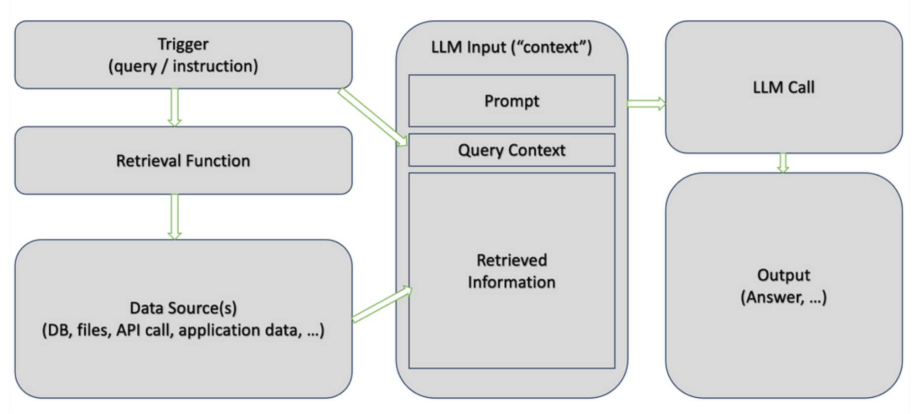
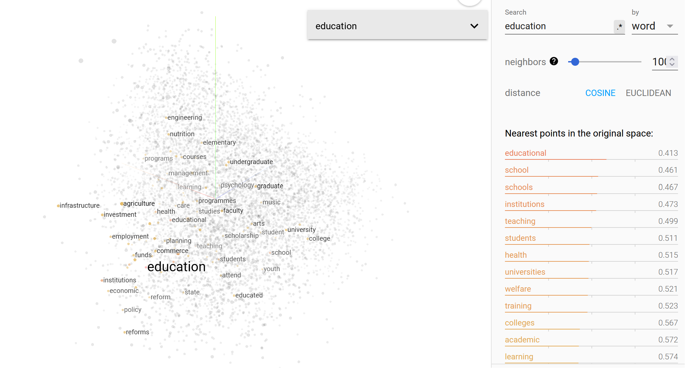

# 204: Implementar los casos de uso del RAG

En este laboratorio, revisará y ejecutará ejemplos de aplicaciones LLM que implementan el patrón de *Generación Aumentada de Recuperación (RAG)* para trabajar con LLM. Ampliaremos los conceptos aprendidos en los laboratorios anteriores.

<QuizAlert text="¡Aviso! ¡El material del cuestionario se marcará así!" />

## Software, acceso y archivos necesarios

*   Para completar este laboratorio necesitarás acceso a **watsonx.ai**
*   Algunos conocimientos de Python

## Visión general de RAG

_RAG (Generación Aumentada de Recuperación)_ es uno de los casos de uso más comunes en la IA generativa porque nos permite trabajar con datos "externos al modelo", por ejemplo, datos que no se utilizaron para el entrenamiento del modelo. Muchos casos de uso requieren trabajar con datos propios de la empresa, y es una de las razones por las que la RAG se utiliza con frecuencia en aplicaciones de IA generativa. RAG también nos permite añadir algunos guardarraíles a la salida generada y reducir la alucinación.

RAG puede aplicarse a varios casos de uso de la IA, entre ellos:

*   Preguntas y respuestas
*   Resumen
*   Generación de contenidos

> Una analogía de "interacción humana" de la GAR es proporcionar un documento a una persona y pedirle que responda a una pregunta basándose en la información que contiene.

RAG es "un patrón de aplicación" que puede aplicarse con múltiples tecnologías. Sin embargo, hay dos pasos clave:

*   Durante el paso de **recuperación**, buscamos en una base de conocimientos (documentos, sitios web, bases de datos, etc.) para encontrar información relevante para las instrucciones enviadas al modelo. La recuperación puede basarse en la búsqueda por palabras clave o en algoritmos más avanzados, como la similitud semántica.
*   El paso de **generación** es similar al de la generación en casos de uso no RAG. La principal diferencia es que la información recuperada en el primer paso se proporciona como "contexto" (incluido en la solicitud). Indicar al modelo que se base únicamente en el "contexto recuperado", en contraste con el conocimiento general que se utilizó para entrenar al LLM, es el paso clave para evitar alucinaciones.



### Bases de datos vectoriales

La "base de conocimientos" para la etapa de recuperación suele implementarse como una **base de datos** vectorial. Las bases de datos vectoriales no son nuevas, se utilizan desde hace varios años para la búsqueda semántica.

La búsqueda semántica es una técnica de búsqueda cuyo objetivo es comprender la intención y el contexto de la consulta de un usuario. Es más avanzada que la búsqueda tradicional basada en palabras clave, que se basa en la coincidencia de palabras clave específicas.

Algunas bases de datos vectoriales populares son:

*   Chroma (código abierto)
*   Milvus
*   Elasticsearch
*   Una sola tienda
*   Piña
*   Redis
*   Postgres

Algunas bases de datos vectoriales, como \_Chroma, son bases de datos en memoria, lo que las convierte en una buena opción para experimentar y crear prototipos de casos de uso de RAG. Las bases de datos en memoria no necesitan ser instaladas ni configuradas. Esto se debe a que todos sus datos se almacenan en memoria volátil durante el tiempo de ejecución del programa. Sin embargo, el inconveniente de esto es que tendremos que cargar los datos cada vez que ejecutemos la aplicación.

Las bases de datos vectoriales almacenan datos no estructurados en formato numérico. Para los casos de uso de IA, utilizamos un término específico para describir los datos no estructurados convertidos: ***incrustaciones***. Las incrustaciones se crean utilizando un modelo de incrustación, por ejemplo, un popular modelo de código abierto *word2vec\_*.

Una de las principales características de las incrustaciones es la capacidad de preservar las relaciones. Con las incrustaciones, las palabras pueden "sumarse y restarse" como los vectores en matemáticas. Uno de los ejemplos más famosos que lo demuestran es el siguiente:

```txt
king - man + woman = queen
```

En otras palabras, la suma de los vectores asociados a las palabras *rey* y *mujer* y la resta de *hombre* es igual al vector asociado a la palabra *reina*. Este ejemplo describe una relación de género.

Otro ejemplo podría ser:

```txt
Paris - France + Poland = Warsaw
```

La diferencia vectorial entre *París* y *Francia* recoge aquí el concepto de capital.

He aquí un ejemplo de búsqueda semántica de la palabra "educación". Fíjese en las palabras "punto más cercano" de la tabla. La medida está en números porque la búsqueda se realizó utilizando datos vectoriales (numéricos).

[Aquí](https://projector.tensorflow.org/) puede seguir experimentando.



Basándonos en lo que hemos debatido hasta ahora, podemos sacar las siguientes conclusiones:

*   Disponemos de varias *bases de datos vectoriales* para la aplicación de los casos de uso de la GAR
*   Podemos elegir entre varios *modelos de incrustación* para convertir datos no estructurados en vectores
*   La recuperación de información relevante es el primer paso en el patrón GAR, y la calidad puede verse afectada por la elección de una base de datos vectorial y un modelo de incrustación.

<QuizAlert />

Además de los factores mencionados, la carga de datos en la base de datos vectorial requiere ***"chunking"***, que es el proceso de dividir el texto en secciones que se cargan en la base de datos. No existe una pauta única para definir los trozos porque el tamaño óptimo depende del contenido con el que trabajemos.

Para los casos de uso de IA generativa, normalmente empezamos con trozos de tamaño fijo, que deben ser "semánticamente significativos". Por ejemplo, si en su documento cada párrafo tiene aproximadamente 200 palabras, convierta el número de palabras en varios tokens (puede variar según el LLM) y utilice este número como tamaño inicial del chunk. Además del tamaño del chunk, también tenemos que especificar el solapamiento (la misma información en más de un chunk).

Los proveedores de modelos deberían publicar información sobre el tamaño de trozo y el porcentaje de solapamiento recomendados para casos de uso específicos. Sin embargo, aunque se publique esta información, los desarrolladores tendrán que experimentar para encontrar el tamaño de trozo óptimo. Si no encuentra información sobre el solapamiento recomendado, puede empezar con un 10 por ciento (especificado en el formato de "número de tokens", por ejemplo, *100* si su tamaño de chunk es *1000*).

En resumen, debemos seguir los siguientes pasos a la hora de implementar el caso de uso RAG:

1.  Seleccione una base de datos vectorial. Al trabajar con watsonx.ai, debemos confirmar que la base de datos vectorial seleccionada es compatible. [Consulte la documentación de IBM para conocer las últimas actualizaciones](https://dataplatform.cloud.ibm.com/docs/content/wsj/analyze-data/fm-rag.html?context=wx\&audience=wdp).
2.  Seleccione el modelo de incrustación. Confirma que el modelo de incrustación funciona con la base de datos vectorial seleccionada.
3.  Experimente con el tamaño de los trozos.

Como hemos comentado anteriormente, la segunda parte del caso de uso RAG, el envío de instrucciones a LLM, es similar a los patrones no RAG. Los desarrolladores deben prestar especial atención a los límites de tokens porque el contenido recuperado se añadirá a la instrucción. Si se supera el límite de tokens en la entrada, el modelo no podrá generar la salida. Esta comprobación deberá implementarse como "código personalizado" en sus aplicaciones LLM.

La API WML devuelve errores si se supera el tamaño del token.


## RAG en documentos con LangChain y ChromaDB

Para ejecutar el laboratorio de esta sección comenzaremos por iniciar sesión en la plataforma watsonx; después de navegar a la página de inicio de watsonx [aquí](https://dataplatform.cloud.ibm.com/wx/home), querremos abrir el editor de Notebook que podemos utilizar para ejecutar el notebook asociado a este laboratorio.

> Si no sabes cómo acceder a watsonx.ai o no estás seguro de cómo abrir el editor de cuadernos, sigue [este enlace de referencia](/watsonx/watsonxai/100#how-do-i-import-a-jupyter-notebook-in-watsonxai) que te guiará a través del proceso para acceder a watsonx.ai y abrir el editor de cuadernos Jupyter.

Utilice los siguientes valores para este laboratorio:

*   **Nombre:** `{uniqueid}-rag-chromadb`
*   **URL del cuaderno:** `https://raw.githubusercontent.com/ibm-build-lab/VAD-VAR-Workshop/main/content/Watsonx/WatsonxAI/files/204/use_case_rag.ipynb`

Después de iniciar y crear tu cuaderno, puedes seguir y ejecutar cada celda del cuaderno para completar el laboratorio. El cuaderno contiene comentarios que explican lo que hace el código en cada celda, así como cualquier entrada necesaria que puedas necesitar para ejecutar con éxito una celda.

¡Buena suerte!

## RAG utilizando un sitio web (opcional)

Este cuaderno es muy similar al anterior. Sin embargo, a diferencia del anterior, en lugar de obtener el contenido de un archivo determinado, se implementará un raspador web que permita responder a una pregunta sobre una página web determinada.

Este cuaderno se puede ejecutar dentro de la plataforma watsonx; después de navegar a la página de inicio de watsonx [aquí](https://dataplatform.cloud.ibm.com/wx/home), querremos abrir el editor de cuadernos que podemos utilizar para ejecutar el cuaderno asociado a este laboratorio.

> Si no sabes cómo acceder a watsonx.ai o no estás seguro de cómo abrir el editor de cuadernos, sigue [este enlace de referencia](/watsonx/watsonxai/100#how-do-i-import-a-jupyter-notebook-in-watsonxai) que te guiará a través del proceso para acceder a watsonx.ai y abrir el editor de cuadernos Jupyter.

Utilice los siguientes valores para este laboratorio:

*   **Nombre:** `uniqueid-rag-web-chromadb`
*   **URL del cuaderno:** `https://raw.githubusercontent.com/ibm-build-lab/VAD-VAR-Workshop/main/content/Watsonx/WatsonxAI/files/204/use_case_rag_web.ipynb`

Después de iniciar y crear tu cuaderno, puedes seguir y ejecutar cada celda del cuaderno para completar el laboratorio. El cuaderno contiene comentarios que explican lo que hace el código en cada celda, así como cualquier entrada necesaria que puedas necesitar para ejecutar con éxito una celda.
