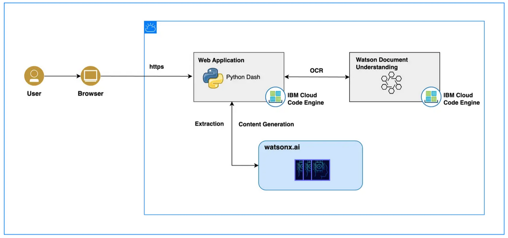

# Smart contract processing

## Step 1. Review the use case summary

A property management contract between the owner and a firm contains various clauses. The PDF of the legal contract document is converted to text. The PII in the text is masked. The masked document is processed for detecting important missing information, essential to the format, e.g. property address, and mandatory legal clauses, e.g. renewal terms, for completeness of the document.

## Step 2. Try the interactive demo application

- User uploads existing sample contracts in PDF format. The document is available to view from the links in the app. One of them is missing critical clauses required for approval. The goal is to check if these can be detected using a prompt engineered LLM.

- Watson Document Understanding (internal release) is used to extract HTML text from the document and displayed in the left pane.

- The HTML text is then processed through a watsonx.ai LLM to detect PII, e.g. date, name, amount, address.
- The PII entities are replaced with generic information and the generic document is then processed through a watsonx.ai LLM to detect missing critical information and legal clauses.
- A recommendation is generated for approval or addition of key missing clauses.
- The actual API call and models used can be seen in 'Settings ⭢ View payload'.



## Step 3. Get an application code sample

It is assumed that Python3+ is installed or download from <https://www.python.org/downloads/>.

1. Go to the root directory and prepare your python environment.

   ```sh
   python3 -m venv client-env
   ```

2. Activate the virtual environment:

   - MacOS, Linux, and WSL using bash/zsh

   ```sh
   source client-env/bin/activate
   ```

   - Windows with CMD shell

   ```cmd
   C:> client-env\Scripts\activate.bat
   ```

   - Windows with git bash

   ```sh
   source client-env/Scripts/activate
   ```

   - Windows with PowerShell

   ```cmd
   PS C:> client-env\Scripts\Activate.ps1
   ```

   > if there is an execution policy error, this can be changed with the following command

   ```cmd
   PS C:> Set-ExecutionPolicy -ExecutionPolicy RemoteSigned -Scope CurrentUser
   ```

3. Install the required libraries.

   ```sh
   pip3 install -r requirements.txt
   ```

4. [Get a watsonx trial account](https://dataplatform.cloud.ibm.com/registration/stepone?context=wx).

5. Add `.env` file to your application folder and add env variable

   ##### Steps to create IBM Cloud API key

   - 5.1.1 In the [IBM Cloud console](https://cloud.ibm.com/), go to **Manage > Access (IAM) > API keys**
   - 5.1.2 Click **Create an IBM Cloud API key**
   - 5.1.3 Enter a name and description for your API key
   - 5.1.4 Click **Create**
   - 5.1.5 Then, click **Show** to display the API key. Or, click **Copy** to copy and save it for later, or click **Download**

   ##### Steps to create project_id (skip 5.2.1 to 5.2.3 for watsonx trial account)

   - 5.2.1 In IBM Cloud, [Set up IBM Cloud Object Storage for use with IBM watsonx](https://dataplatform.cloud.ibm.com/docs/content/wsj/console/wdp_admin_cos.html?context=wx&audience=wdp)
   - 5.2.2 [Set up the Watson Studio and Watson Machine Learning services](https://dataplatform.cloud.ibm.com/docs/content/wsj/getting-started/set-up-ws.html?context=wx&audience=wdp)
   - 5.2.3 Create a Project from IBM watsonx console - https://dataplatform.cloud.ibm.com/projects/?context=wx
   - 5.2.4 (Optional step: add more collaborators) Open the Project > Click on **Manage** tab > Click on **Access Control** from the **Manage** tab > Click [Add collaborators](https://dataplatform.cloud.ibm.com/docs/content/wsj/getting-started/collaborate.html?context=wx&audience=wdp#add-collaborators) > **Add Users** > Choose **role** as **Admin** > Click **Add**
   - 5.2.5 Click on **Manage** tab > Copy the **Project ID** from **General**

   ```sh
   SERVER_URL = https://us-south.ml.cloud.ibm.com/ml/v1/text/generation?version=2023-05-29
   WATSONX_API_KEY=<your IBM Cloud API key>
   WATSONX_PROJECT_ID=<your watsonx.ai project_id>
   ```

6. Run the application.

   ```sh
   python3 template.py
   ```

You can now access the application from your browser at the following URL.

```url
http://localhost:8050
```
