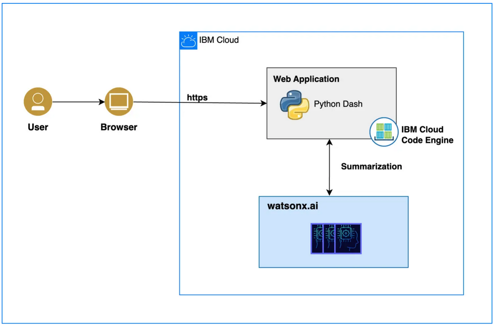

# Multilingual conversation summaries

## Step 1. Review the use case summary

Multilingual conversation summaries offer language flexibility, allowing users to toggle between English, French, German and Japanese for conversation input. It swiftly summarizes customer service interactions, aiding efficient decision-making for businesses.

## Step 2. Try the interactive demo application

- Begin by choosing the language of the transcript you wish to analyze. Whether it's English, French, German or Japanese, click on the language dropdown menu to make your selection.
- Click on the "Get Summaries" button to initiate the summarization process. The example and pre-configured instruction to an LLM is used to make an API call to watsonx.ai.
- The watsonx.ai API call payload details can be viewed by clicking on Settings icon ⭢ View Payload from the top right corner. The payload contains information about the model used, configurations, instruction and training examples.
- The model invocation is multi tenant because each API call carries the user data in terms of training examples. IBM does not use any of this data for model training or tuning.



## Step 3. Get an application code sample

It is assumed that Python3+ is installed or download from <https://www.python.org/downloads/>.

1. Go to the root directory and prepare your python environment.

   ```sh
   python3 -m venv client-env
   ```

2. Activate the virtual environment:

   - MacOS, Linux, and WSL using bash/zsh

   ```sh
   source client-env/bin/activate
   ```

   - Windows with CMD shell

   ```cmd
   C:> client-env\Scripts\activate.bat
   ```

   - Windows with git bash

   ```sh
   source client-env/Scripts/activate
   ```

   - Windows with PowerShell

   ```cmd
   PS C:> client-env\Scripts\Activate.ps1
   ```

   > if there is an execution policy error, this can be changed with the following command

   ```cmd
   PS C:> Set-ExecutionPolicy -ExecutionPolicy RemoteSigned -Scope CurrentUser
   ```

3. Install the required libraries.

   ```sh
   pip3 install -r requirements.txt
   ```

4. [Get a watsonx trial account](https://dataplatform.cloud.ibm.com/registration/stepone?context=wx).

5. Add `.env` file to your application folder and add env variable

   ##### Steps to create IBM Cloud API key

   - 5.1.1 In the [IBM Cloud console](https://cloud.ibm.com/), go to **Manage > Access (IAM) > API keys**
   - 5.1.2 Click **Create an IBM Cloud API key**
   - 5.1.3 Enter a name and description for your API key
   - 5.1.4 Click **Create**
   - 5.1.5 Then, click **Show** to display the API key. Or, click **Copy** to copy and save it for later, or click **Download**

   ##### Steps to create project_id (skip 5.2.1 to 5.2.3 for watsonx trial account)

   - 5.2.1 In IBM Cloud, [Set up IBM Cloud Object Storage for use with IBM watsonx](https://dataplatform.cloud.ibm.com/docs/content/wsj/console/wdp_admin_cos.html?context=wx&audience=wdp)
   - 5.2.2 [Set up the Watson Studio and Watson Machine Learning services](https://dataplatform.cloud.ibm.com/docs/content/wsj/getting-started/set-up-ws.html?context=wx&audience=wdp)
   - 5.2.3 Create a Project from IBM watsonx console - https://dataplatform.cloud.ibm.com/projects/?context=wx
   - 5.2.4 (Optional step: add more collaborators) Open the Project > Click on **Manage** tab > Click on **Access Control** from the **Manage** tab > Click [Add collaborators](https://dataplatform.cloud.ibm.com/docs/content/wsj/getting-started/collaborate.html?context=wx&audience=wdp#add-collaborators) > **Add Users** > Choose **role** as **Admin** > Click **Add**
   - 5.2.5 Click on **Manage** tab > Copy the **Project ID** from **General**

   ```sh
   SERVER_URL = https://us-south.ml.cloud.ibm.com/ml/v1/text/generation?version=2023-05-29
   WATSONX_API_KEY=<your IBM Cloud API key>
   WATSONX_PROJECT_ID=<your watsonx.ai project_id>
   ```

6. Run the application.

   ```sh
   python3 template.py
   ```

You can now access the application from your browser at the following URL.

```url
http://localhost:8050
```
