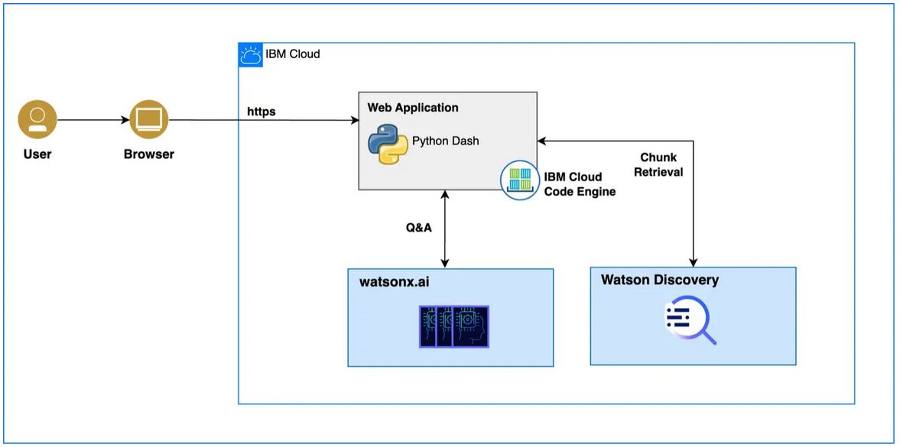

# Self-service customer assistant

## Step 1. Review the use case summary

This use case enables a question-answering application that provides instant responses to users and supports customer service in contact centers. It can be easily integrated with watsonx Assistant or other search portals for agent or user assistance. It promotes user satisfaction, streamlines customer service processes, and optimizes operational efficiency.

## Step 2. Try the interactive demo application

- A user is exploring health insurance policies at a company portal. The insurance company has a search interface for users to ask questions and get answers from existing documents without involving a live agent.
- The user can pick from an existing set of commonly asked questions appearing in the menu or ask any other questions.
- The user question is sent to an API backend.
- The API backend forwards the question to a document repository, such as Watson Discovery or any other searchable indexed database, to retrieve matching document chunks.
- The set of ranked chunks are then matched with the question to find the most appropriate chunk(s) that contains the answer. This uses a similarity matching function using embeddings of the question and the document chunks, using a vector DB.
- The document chunk(s) containing the possible answer is sent to a LLM hosted on watsonx.ai through an API call to 'generate' the answer text, which can be presented back to the user as a final response from the API backend.
- This is called the RAG (Retrieval Augmented Generation) pattern which combines Information Retrieval with Generative AI capability to provide answers instead of document matches. It can be combined with a Conversational AI front-end to provide a more engaging experience to the user.



[Let's try this interactive live demo](https://aedcbf8495.dsceapp.buildlab.cloud/)

## Step 3. Get an application code sample

It is assumed that Python3+ is installed or download from <https://www.python.org/downloads/>.

1. Go to the root directory and prepare your python environment.

   ```sh
   python3 -m venv client-env
   ```

2. Activate the virtual environment:

   - MacOS, Linux, and WSL using bash/zsh

   ```sh
   source client-env/bin/activate
   ```

   - Windows with CMD shell

   ```cmd
   C:> client-env\Scripts\activate.bat
   ```

   - Windows with git bash

   ```sh
   source client-env/Scripts/activate
   ```

   - Windows with PowerShell

   ```cmd
   PS C:> client-env\Scripts\Activate.ps1
   ```

   > if there is an execution policy error, this can be changed with the following command

   ```cmd
   PS C:> Set-ExecutionPolicy -ExecutionPolicy RemoteSigned -Scope CurrentUser
   ```

3. Install the required libraries.

   ```sh
   pip3 install -r requirements.txt
   ```

4. [Get a watsonx trial account](https://dataplatform.cloud.ibm.com/registration/stepone?context=wx).

5. Add `.env` file to your application folder and add env variable

   ##### Steps to create IBM Cloud API key

   - 5.1.1 In the [IBM Cloud console](https://cloud.ibm.com/), go to **Manage > Access (IAM) > API keys**
   - 5.1.2 Click **Create an IBM Cloud API key**
   - 5.1.3 Enter a name and description for your API key
   - 5.1.4 Click **Create**
   - 5.1.5 Then, click **Show** to display the API key. Or, click **Copy** to copy and save it for later, or click **Download**

   ##### Steps to create project_id (skip 5.2.1 to 5.2.3 for watsonx trial account)

   - 5.2.1 In IBM Cloud, [Set up IBM Cloud Object Storage for use with IBM watsonx](https://dataplatform.cloud.ibm.com/docs/content/wsj/console/wdp_admin_cos.html?context=wx&audience=wdp)
   - 5.2.2 [Set up the Watson Studio and Watson Machine Learning services](https://dataplatform.cloud.ibm.com/docs/content/wsj/getting-started/set-up-ws.html?context=wx&audience=wdp)
   - 5.2.3 Create a Project from IBM watsonx console - https://dataplatform.cloud.ibm.com/projects/?context=wx
   - 5.2.4 (Optional step: add more collaborators) Open the Project > Click on **Manage** tab > Click on **Access Control** from the **Manage** tab > Click [Add collaborators](https://dataplatform.cloud.ibm.com/docs/content/wsj/getting-started/collaborate.html?context=wx&audience=wdp#add-collaborators) > **Add Users** > Choose **role** as **Admin** > Click **Add**
   - 5.2.5 Click on **Manage** tab > Copy the **Project ID** from **General**

   ```sh
   WATSONX_API_KEY=<your IBM Cloud API key>
   SERVER_URL = https://us-south.ml.cloud.ibm.com/ml/v1/text/generation?version=2023-05-29
   WATSONX_PROJECT_ID=<your watsonx.ai project_id>
   ```

6. Run the application.

   ```sh
   python3 template.py
   ```

You can now access the application from your browser at the following URL.

```url
http://localhost:8050
```
