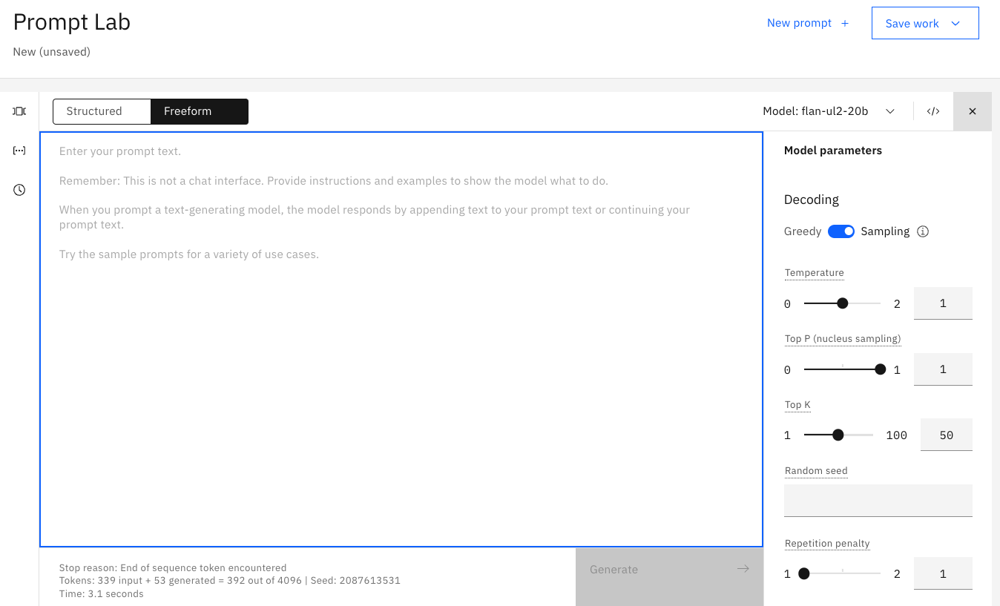
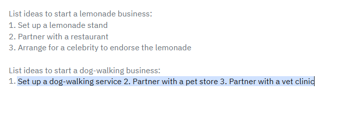
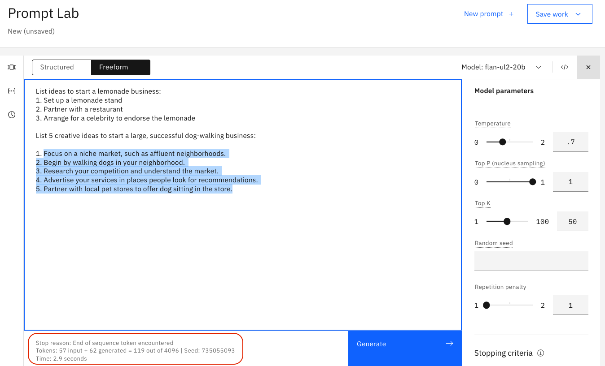
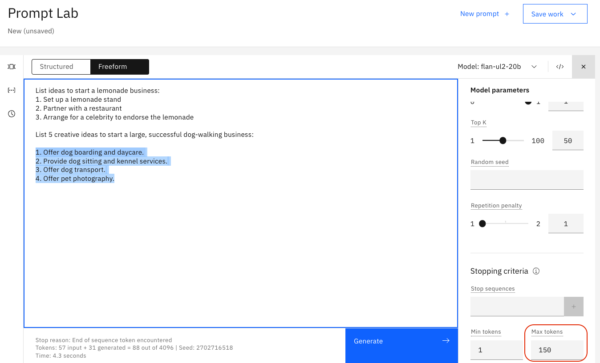
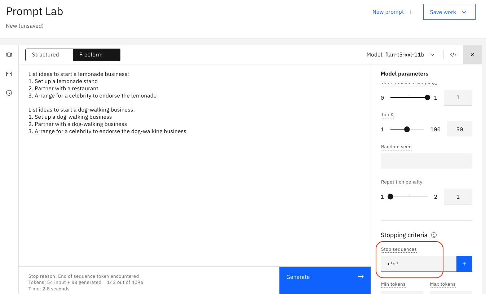
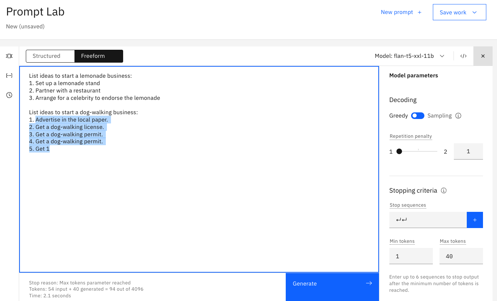
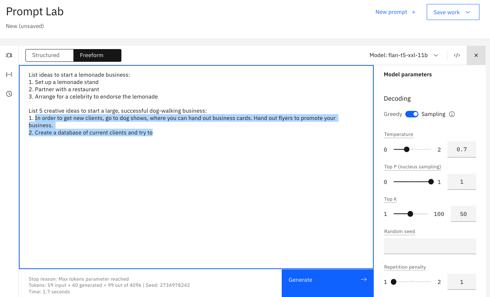
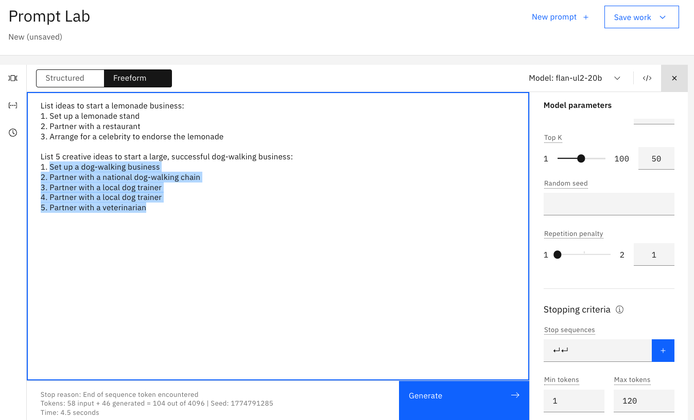
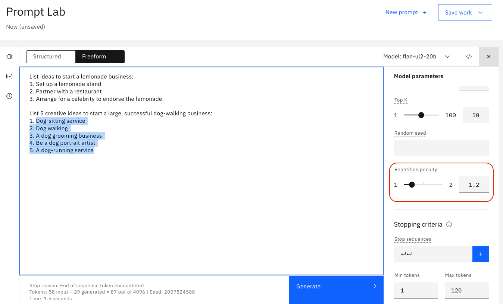
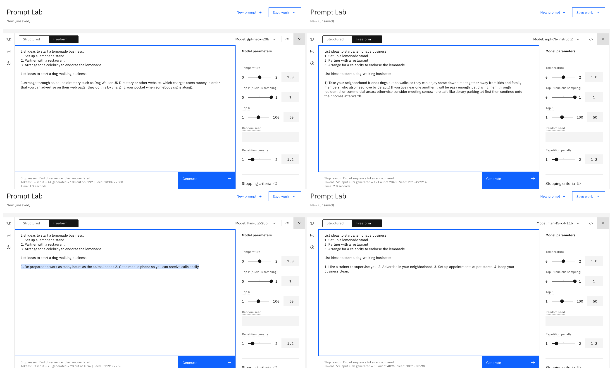

# Referencia: Sugerencias de ingeniería de solicitud

**Nota: **Las siguientes imágenes muestran resultados reales de watsonx.ai. El ligero texto gris es lo que hemos proporcionado al modelo. El texto azul resaltado es cómo respondió el modelo.

### LLM Foundations

Antes de saltar a la exploración de las capacidades de watsonx.ai, primero tenemos que establecer una base para el funcionamiento de los modelos de lenguaje grande (LLMs), y cómo podemos ajustar el modelo y los parámetros para cambiar su salida. Ganar este entendimiento nos hará más eficaces ingenieros de solicitud.



Cuando se abre watsonx.ai, esta es la vista que se mostrará. El área de texto central grande se denomina Prompt Lab (modalidad Freeform) o Prompt Builder (modalidad estructurada), basándose en la selección pulsando el recuadro de selección situado en la parte superior izquierda. En el lado derecho están los parámetros de modelo que puede utilizar para seleccionar para optimizar cómo responde el modelo a su solicitud. Y en la parte inferior izquierda, es un resumen del número de fichas utilizadas por su solicitud durante la ejecución. (No verá las señales cuando abra inicialmente el laboratorio de solicitud. Las señales sólo aparecen cuando se genera una solicitud.)

### Tokens

Cada vez que especifique una solicitud, las "señales de entrada" y las "señales generadas" se actualizarán. Los tokens son un concepto importante para entender ya que limitan el rendimiento de su modelo, además de determinar el coste de utilizar los modelos. Como aprenderás a lo largo de los Labs, las fichas no son un partido 1: 1 con palabras en lenguaje natural, pero en promedio, una señal es igual a 4 caracteres. Antes de enviar la solicitud al modelo, el texto de la solicitud se Tokeniza o se divide en subconjuntos más pequeños de caracteres mejor comprendidos por un modelo.

Es importante supervisar el uso de la señal para saber cuánta información está alimentando en el modelo con cada solicitud, así como la cantidad de texto que se genera para usted. En función del modelo seleccionado en el Creador de solicitudes, verá un máximo de 2048 o 4096 señales. Tenga en cuenta que cuanto más expresivo esté con sus instrucciones de solicitud, menos espacio tiene el modelo para responder a usted.

### Todo es terminación de texto

watsonx.ai no es una interfaz de chatbot por lo que sólo especificar una instrucción o pregunta rara vez produce un buen resultado. Por ejemplo, si le pedimos a Watsonx.ai que: `List ideas to start a dog-walking business?`


### Indicación de la estructura de salida

Podemos ver en el ejemplo anterior que las solicitudes simples no funcionan con los LLMs más pequeños. Para recibir una respuesta estructurada, incluya una señal para iniciar la respuesta en la estructura deseada. Por ejemplo, sólo añadir estos dos caracteres, "1.", mejora drásticamente la respuesta.


### Proporcione un ejemplo como guía (o solicitud de un solo disparo)

Para recibir una respuesta de mayor calidad, proporcione un ejemplo del tipo de respuesta que desea. En términos técnicos, esto se llama Single Shot Prompting.



Como puede ver, proporcionar un ejemplo antes de generar con su LLM se llama Single Shot Prompting, pero añadir más ejemplos en su solicitud también es práctica común. En general, el aumento del número de ejemplos se conoce como "pocas solicitudes de disparo" y es una herramienta poderosa para asegurarse de que tiene una salida específica.

Copiar y pegar para empezar a experimentar:

```text
List ideas to start a lemonade business:

1. Setup a lemonade stand
2. Partner with a restaurant
3. Arrange for a celebrity to endorse the lemonade

List ideas to start a dog-walking business:

1.
```

### Incluir detalles descriptivos

Cuanto más orientación, mejor:

*   Contenido
*   Estilo
*   Longitud


## Parámetros del modelo

### Ajuste del comportamiento del modelo

El primer cambio que podemos hacer es qué modelo (LLM) utilizamos para evaluar nuestra solicitud. Este es uno de los mayores cambios que puede realizar, ya que ciertos modelos están mejor construidos para tareas específicas. Los ejercicios posteriores en este laboratorio le obligarán a cambiar el modelo que utiliza si desea responder a algunas de las preguntas más desafiantes.

En general, algunos modelos funcionan mejor con el resumen, las palabras clave y la semántica, mientras que otros modelos lo hacen mejor con texto estructurado como HTML, markdown o JSON. La mejor manera de averiguar qué modelos se aplican para su caso de uso es simplemente probarlos, pero es importante saber que la elección del modelo puede hacer una gran diferencia!

watsonx.ai también proporciona varios parámetros para configurar el modo en que los LLM responden a una solicitud. La selección de los parámetros correctos a menudo puede ser más arte que ciencia. Invertir tiempo en entender luego ajustar estos parámetros será recompensado por mejores respuestas.

Explore estos parámetros con el texto siguiente:

***Lista ideas para iniciar un negocio de limonada:***

1.  Configurar un soporte de limonada
2.  Socio con un restaurante
3.  Organizar una celebridad para apoyar la limonada

***Lista ideas para iniciar un negocio de perros:***

1.

### Establecer las señales mín y máx.

Si encuentra que el texto generado es demasiado corto o demasiado largo, intente ajustar los parámetros que controlan el número de señales nuevas:

*   El **Min nuevas señales **controla el número mínimo de señales (\~ palabras) en la respuesta generada
*   El **Máximo de nuevas señales **controla el número máximo de señales (\~ palabras) en la respuesta generada





### Especificar secuencias de detención

Si especifica secuencias de detención, la salida se detendrá automáticamente cuando aparezca una de las secuencias de detención en la salida generada.

**Ejemplo**

La salida en la siguiente imagen va demasiado lejos, hay dos respuestas:


En la imagen siguiente, se especifica la secuencia de detención de dos retornos de carro:


La imagen siguiente muestra el efecto de la secuencia de detención. La salida se detiene después de dos retornos de carro:



### 2.3 Ajustar los parámetros de

Si la respuesta es demasiado genérica o va en tangentes salvajes, considere ajustar los parámetros de decodificación. O por el contrario, la respuesta puede no ser lo suficientemente creativa.

**Decodificación **es el proceso de encontrar la secuencia de salida dada la secuencia de entrada:

*   **Decodificación avari **selecciona la palabra con la mayor probabilidad en cada paso del proceso de decodificación.

*   **Descodificación de **selecciona palabras de una distribución de probabilidad en cada paso:

    *   **Temperatura **se refiere a la selección de palabras de alta o baja probabilidad. Los valores de temperatura más altos conducen a una mayor variabilidad.
    *   **Top-p **(muestreo de núcleo) se refiere a la selección del conjunto más pequeño de palabras cuya probabilidad acumulada excede de p.
    *   **Top-k **se refiere a la selección de k palabras con las probabilidades más altas en cada paso. Los valores más altos conducen a una mayor variabilidad.

Una ventaja de la decodificación codiciosa es que usted verá resultados reproducibles. Esto puede ser útil para las pruebas. Ajustar la temperatura a 0 en un enfoque de decodificación de muestreo da la misma varianza que la decodificación codiciosa.





Véase:

*   [Métodos decodificador más utilizados](https://medium.com/nlplanet/two-minutes-nlp-most-used-decoding-methods-for-language-models-9d44b2375612)
*   [Utilizar diferentes métodos de decodificación](https://huggingface.co/blog/how-to-generate)

### Añadir una penalización de repetición

A veces, verás que el texto se repite una y otra vez:



Aumentar la temperatura a veces puede resolver el problema.

Sin embargo, cuando el texto sigue siendo repetitivo incluso con una temperatura más alta, se puede intentar añadir una penalidad de repetición. Cuanto mayor sea la pena, menos probable es que los resultados incluyan texto repetido.



Este ejemplo muestra el desafío: ¡los puntos de la bala son la repetición que queremos! Así que la penalización de la repetitividad podría romper sus resultados también.

### Excelente publicación de blog de terceros en parámetros de modelo

Las descripciones anteriores proporcionan una buena introducción a los parámetros de modelo. Sin embargo, debe [leer este post de terceros en parámetros de modelo ](https://txt.cohere.com/llm-parameters-best-outputs-language-ai)que proporciona excelentes ejemplos adicionales de cómo funcionan los parámetros del modelo más buenas visuales para ayudarle a comprender mejor los conceptos. Cuanto mejor entienda los parámetros del modelo, menos frustrado estará y más capacitado para ajustar los modelos a realizar según sea necesario para su caso de uso.

## Asesoramiento general

### Probar diferentes modelos

La documentación de watsonx.ai describe los modelos disponibles: [Modelos watsonx.ai](https://dataplatform.cloud.ibm.com/docs/content/wsj/analyze-data/fm-models.html?context=wx\&audience=wdp)



### Comprobar el caso de uso

Los LLM tienen un gran potencial, pero no tienen lógica, ni conocimiento, ni experiencia en el dominio. Algunos casos de uso son un mejor ajuste que otros: las LLMs se destacan en tareas que implican la generación de patrones genéricos de texto o código común y la transformación de la entrada dada.

Si su solicitud incluye todos los consejos y mejores prácticas discutidas aquí, sin embargo, no está obteniendo buenos resultados de ninguno de los modelos, considere si su caso de uso podría ser uno que LLM simplemente no puede manejar bien.

Por ejemplo, aunque podemos obtener resultados decentes para la aritmética simple, los LLM generalmente no pueden hacer bien las matemáticas: [Los investigadores encuentran que los grandes modelos de lenguaje luchan con las matemáticas](https://venturebeat.com/business/researchers-find-that-large-language-models-struggle-with-math/)

### Equilibrio de inteligencia y seguridad

Con una gran inteligencia artificial surgen riesgos de seguridad más altos. Soluciones como ChatGPT son modelos de lenguaje muy grande (VLLM) con 175 mil millones de parámetros. Afinaron el equipo de OpenAI utilizando un conjunto de datos adicionales de Chat no público más un conjunto de datos de Refuerzo de Aprendizaje Humano (RLHF). ChatGPT es un LLM habilitado para chatbot.

En watsonx.ai, estamos interactuando directamente con LLMs más pequeños (3-20.000 millones de parámetros). Esta es una elección sabia de un POV de seguridad. La inyección rápida es un riesgo importante para los usos empresariales de los LLM. En inyecciones rápidas, un hacker creará un intrincado prompt para causar que un LLM como ChatGPT ignore/ignore los protocolos de seguridad y revele información sensible de la compañía. Imagínate que eres un hacker. ¿Qué modelo elegiría para apuntar a la inyección rápida de pirateo? El ChatGPT de OpenAI con 175 mil millones de parámetros capaces de miles de tareas o un modelo de parámetros de 3 mil millones más pequeño y más enfocado muy sintonizado para unas cuantas tareas aisladas? ¿Cuál tiene una superficie de ataque más grande para la reingeniería rápida?

Los modelos más pequeños y sencillos en watsonx.ai son más desafiantes para los potenciales hackers. El uso de muchos modelos pequeños en lugar de un solo grande, como por ejemplo ChatGPT, crea una distribución más amplia de puntos de entrada sensibles. Cada modelo de lenguaje pequeño es mucho más difícil de manipular debido a su limitada funcionalidad y alto nivel de ingeniería rápida que era necesario para realizar sus tareas principales. No tienen la amplia gama de funciones como ChatGPT. Como saben los programadores, poner todos sus recursos en un solo punto de fracaso es imprudente. Es mucho mejor descomponer su solución para seguridad, escalabilidad y control.

Así es. Para la seguridad, más pequeño es mejor. Además de los beneficios de seguridad, hay mejoras computacionales con el uso de modelos de peso más pequeños y más ligeros también. Sin embargo nos estamos adelantando a nosotros mismos. Primero interactuemos más con las LLMs de watsonx.ai para entender mejor y aprender a hacer que respondan de la manera que necesitamos.
