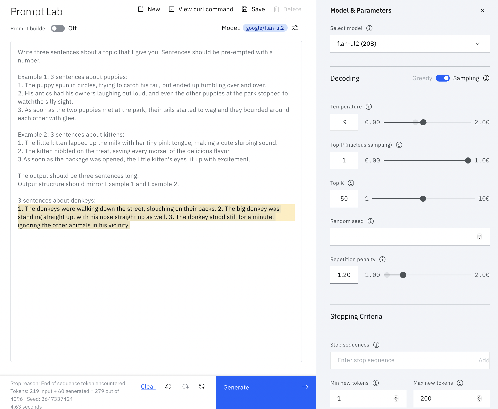
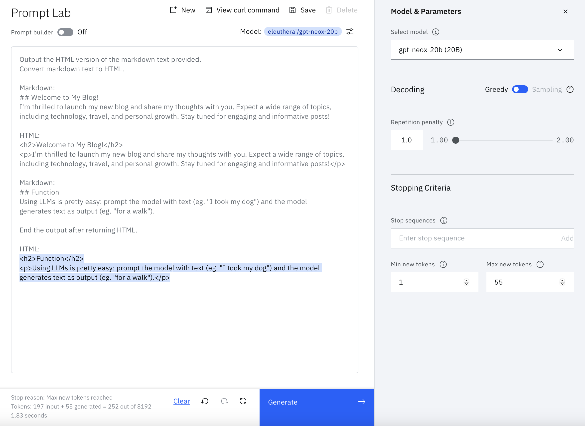
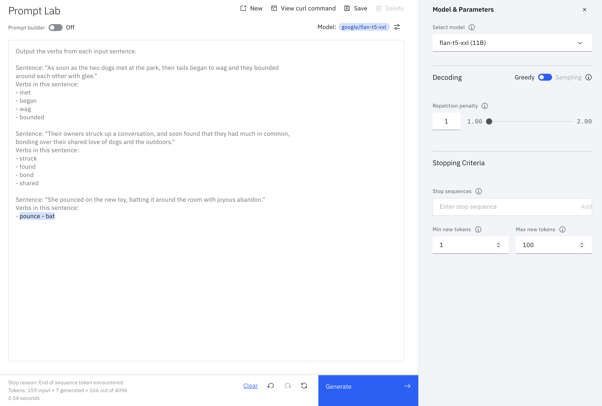

# Reference: Prompt engineering exercise and answers

## Prompt engineering exercises

Complete the following exercies using Watsonx.ai's Prompt Builder.

<p>&nbsp;</p>

### Generate

**Goal**

<table>
<tr>
<td>
Write three sentences about donkeys
</td>
</tr>
</table>
  
**Samples**
```text
3 sentences about puppies:

- The puppy spun in circles, trying to catch his tail, but ended up tumbling over and over.
- His antics had his owners laughing out loud, and even the other puppies at the park stopped to watch the silly sight.
- As soon as the two puppies met at the park, their tails began to wag and they bounded around each other with glee.

```


```text

3 sentences about kittens:

- The little kitten lapped up the milk with her tiny pink tongue, making a cute slurping sound.
- The kitten nibbled on the treat, savoring every morsel of the delicious flavor.
- As soon as the package was opened, the little kitten's eyes lit up with excitement.

```

See: [Example answer](/watsonx/watsonxai/109#1-generate)

<p>&nbsp;</p>

### 5.2 Rewrite

**Goal**

<table>
<tr>
<td>
Transform one of these Markdown passages to HTML
</td>
</tr>
</table>

**Markdown passages**

```text

## Background

The [IBM Watson Natural Language Processing library](https://dataplatform.cloud.ibm.com/docs/
content/wsj/analyze-data/watson-nlp.html) is a Python library that provides basic natural
language processing (NLP) such as syntax analysis and keyword extraction with out-of-the-box,
pre-trained models. The Watson NLP library also makes it simple to customize the language
models with dictionaries of your domain-specific terms.

```


```text

[MURAL](https://mural.co) is an online tool that is like a virtual whiteboard: you can draw
shapes, stick notes, and move things around. It’s a fabulous tool for visually organizing ideas,
designing solutions, and collaborating with teammates — in real time or asynchronously.

```


```text

## Function

Using LLMs is pretty easy: prompt the model with text (eg. "I took my dog") and the model
generates text as output (eg. "for a walk").

```


```text

## Hall of shame: when LLMs go wrong

Even the creators of LLMs cannot always fully anticipate or explain these models' output:
[ChatGPT's creators can’t figure out why it won’t talk about Trump](https://www.semafor.com/
article/02/03/2023/how-chatgpt-inadvertently-learned-to-avoid-talking-about-trump)

```

See: [Example answer](/watsonx/watsonxai/109#2-rewrite)

<p>&nbsp;</p>

### 5.3 Summarize

**Goal**

<table>
<tr>
<td>
Summarize one of these short stories
</td>
</tr>
</table>

**Short stories**

```text

A little bird chirped as she gathered twigs and bits of moss in her beak, flitting back and
forth between the trees. With each trip, her nest took shape, becoming cozier and more inviting.
And soon enough, she had created a snug home to raise her brood of chirping chicks.

```


```text

As soon as the package was opened, the little cat's eyes lit up with excitement. She pounced
on the new toy, batting it around the room with joyous abandon. With a contented purr, she
snuggled up with her toy, feeling grateful for the love and attention of her caring owner.

```


```text

The ship heaved and tossed on the angry sea as the storm raged on. Waves as tall as mountains
crashed against the hull, threatening to capsize the vessel. But the captain and crew held
steady, navigating the treacherous waters with skill and determination, until finally, the
storm subsided and the ship emerged triumphant, battered but unbroken.

```


```text

As soon as the two dogs met at the park, their tails began to wag and they bounded around
each other with glee. Their owners struck up a conversation, and soon found that they had
much in common, bonding over their shared love of dogs and the outdoors. By the end of the
day, new friendships had been formed, and both the dogs and their owners left the park with
happy hearts and wagging tails.

```

See: [Example answer](/watsonx/watsonxai/109#3-summarize)

<p>&nbsp;</p>

### 5.4 Text extraction

**Goal**

<table>
<tr>
<td>
Extract verbs from one of these sentences
</td>
</tr>
</table>

**Sentences**

```text

As soon as the two dogs met at the park, their tails began to wag and they bounded
around each other with glee.

```


```text

Their owners struck up a conversation, and soon found that they had much in common,
bonding over their shared love of dogs and the outdoors.

```


```text

As soon as the package was opened, the little cat's eyes lit up with excitement.

```


```text

She pounced on the new toy, batting it around the room with joyous abandon.

```

See: [Example answer](/watsonx/watsonxai/109#4-text-extraction)


<p>&nbsp;</p>

## 1. Generate

**Goal**

<table>
<tr>
<td>
Write three sentences about donkeys
</td>
</tr>
</table>

**One possible answer**



<p>&nbsp;</p>

## 2. Rewrite

**Goal**

<table>
<tr>
<td>
Transform one of these Markdown passages to HTML
</td>
</tr>
</table>

**One possible answer**



<p>&nbsp;</p>

## 3. Summarize

**Goal**

<table>
<tr>
<td>
Summarize one of these short stories
</td>
</tr>
</table>
  
**One possible answer**


<p>&nbsp;</p>

## 4. Text extraction

**Goal**

<table>
<tr>
<td>
Extract verbs from one of these sentences
</td>
</tr>
</table>

**One possible answer**


<p>&nbsp;</p>
