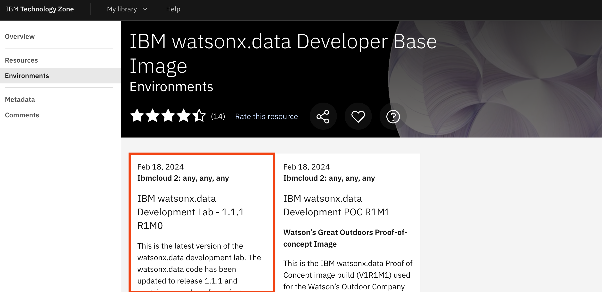
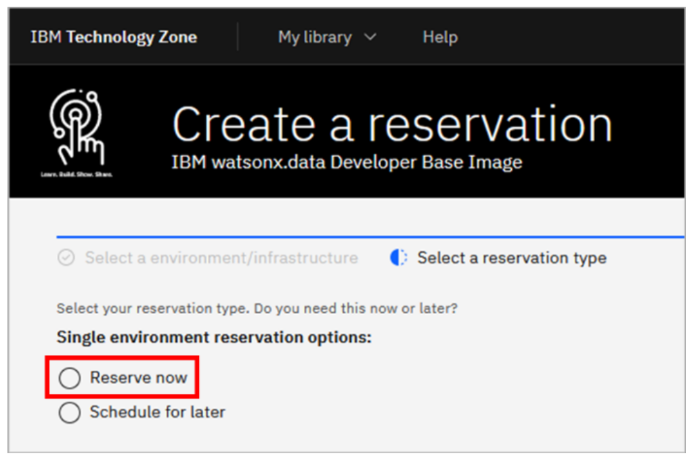
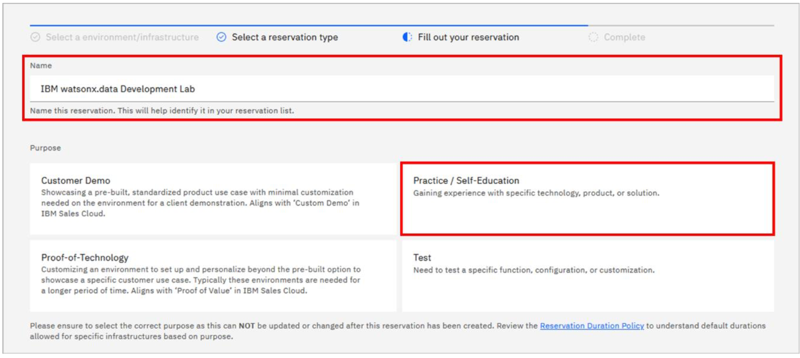
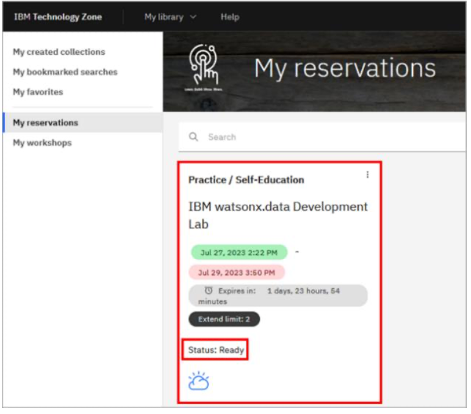

<QuizAlert text='¡Atención! ¡El material del cuestionario se marcará así!' />

## Suministro de un entorno watsonx.data desde TechZone

1.  Abra la colección IBM watsonx.data Developer Base Image en IBM Technology Zone en: [https://techzone.ibm.com/collection/ibm-watsonxdata-developer-base-image ](https://techzone.ibm.com/collection/ibm-watsonxdata-developer-base-image). Inicie sesión con su ID de IBM y acepte los términos y condiciones con los que se le presente.

2.  Seleccione la pestaña Entornos en el menú del lado izquierdo y haga clic en **IBM watsonx.data Development Lab**

    > **Nota:** Es posible que vea varias baldosas. A partir de octubre de 2023, por favor elija el marcado como Versión 1.0.1.

    

3.  Para el tipo de reserva, seleccione el botón de opción Reservar ahora.

    

4.  Acepte el valor predeterminado para el nombre de reserva o proporcione un nombre para su elección. Para el propósito de la reserva, seleccione Práctica/Autoeducación.

    

5.  Rellene el recuadro de descripción Propósito con la razón por la que realiza la reserva (por ejemplo, "Workshop lab on watson.data Technical Sales Intermediate Badge organizado por IBM Resell Lab"). A continuación, desplácese hacia abajo y seleccione su geografía preferida en función de su ubicación (por ejemplo, región de AMÉRICAS-us-este-wdc06 datacenter). Mantenga la fecha y hora de finalización de la reserva (de forma predeterminada son dos días (48 horas) a partir de ahora; no puede exceder dos días inicialmente, pero puede ampliar la reserva dos días, hasta dos veces, antes de que caduque).

    

6.  En el panel de la derecha, siga los enlaces para leer los Términos y condiciones y los documentos de End User Security Policies. A continuación, seleccione el recuadro de selección para aceptar dichos términos. Por último, pulse Enviar.

    

    Un mensaje en la esquina superior derecha aparecerá brevemente indicando que la reserva ha sido creada. Usted también puede ser presentado con la oportunidad de proporcionar retroalimentación sobre el proceso. Siéntase libre de compartir sus comentarios.

    Poco después, recibirá un correo electrónico de IBM Technology Zone reconociendo la recepción de la solicitud y recibirá otro correo electrónico cuando se complete el suministro. El suministro puede ser tan rápido como 15 minutos, o puede tardar una hora o más. Si el suministro falla, puede deberse a una falta de recursos en la geografía especificada. Vuelva a intentarlo con la misma geografía o especifique otra distinta.

    El estado de reserva está disponible en [https://techzone.ibm.com/my/reservations ](https://techzone.ibm.com/my/reservations).

    

    Ahora debe esperar hasta que se haya suministrado el entorno antes de pasar a la siguiente sección. En concreto, puede continuar en la siguiente sección una vez que haya recibido el correo electrónico Reservation Ready on IBM Technology Zone de IBM Technology Zone.

## Acceso al entorno watsonx.data

En este laboratorio interaccionará con las interfaces gráficas web (consolas) para watsonx.data, Presto y MinIO Object Store. También ejecutará mandatos desde la interfaz de línea de mandatos del servidor utilizando ssh (Secure Shell).

Los URL de la consola y el mandato ssh son específicos del entorno. Se pueden encontrar en los detalles de la reserva TechZone.

1.  Abra el correo electrónico Reservation Ready on IBM Technology Zone.

2.  Pulse el botón Ver mis reservas para ver las reservas de TechZone (es posible que tenga que volver a iniciar sesión).

    

3.  El mosaico asociado a su reserva se abre y el mosaico debe decir Estado: Listo. Haga clic en este mosaico.

    

4.  Desplácese hacia abajo hasta la sección Servicios publicados. Utilizará el mandato SSH para el ID de usuario de watsonx, la consola de Presto, la consola MinIO y la interfaz de usuario de Watsonx. Tome nota de estas cuatro piezas de información para que pueda referirse a ellas más tarde.

    

## Acceso de línea de mandatos

Debería tener ssh ya instalado en su ordenador (Windows, macOS y Linux). El usuario de Windows puede descargar PuTTY.

Para ssh en su VM watsonx.data, ejecute el comando ssh proporcionado en sus detalles de reserva (sección de servicios publicados). Será de la siguiente forma:

```bash
ssh -p <port#> watsonx@<hostname>
```

**idusuario: watsonx**

**contraseña: watsonx.data**

La primera vez que ejecute el mandato puede recibir un mensaje que indique que no se puede establecer la autenticidad del host. En este caso, responda indicando que desea continuar de todos modos.

Para cambiar al usuario root, puede utilizar el mandato siguiente:

```bash
sudo su -
```

## Componentes de infraestructura de watsonx.data

**Hay cuatro componentes de infraestructura que se pueden configurar en watsonx.data:**

• Motores: se utiliza un motor de consulta para ejecutar cargas de trabajo con datos en watsonx.data. Watsonx.data da soporte a varios motores; este laboratorio utilizará Presto como motor de consulta.

• Catálogos: Los catálogos de metadatos se utilizan para gestionar esquemas de tabla y metadatos para los datos que residen en watsonx.data.

• Cubos: Watsonx.data almacena datos en el almacenamiento de objetos. Específicamente, los datos se almacenan en cubos, que son áreas de almacenamiento identificadas dentro del almacenamiento de objetos, similares a las carpetas de archivo. Se da soporte a AWS Simple Storage Service (S3), IBM Cloud Object Storage (COS) y almacenamiento de objetos MinIO.

• Bases de datos: Las bases de datos externas se pueden registrar y utilizar en watsonx.data. Los esquemas y metadatos para objetos dentro de una base de datos se almacenan en un catálogo watsonx.data.

**Developer Edition viene preconfigurado con los siguientes componentes:**

• presto-01: Este es un motor de consulta de Presto. Se utiliza para interactuar con datos en el Lakehouse.

• iceberg\_data: Se trata de un catálogo de Iceberg, que reside en el Hive Metastore (HMS) incorporado de watsonx.data. Gestiona las tablas que se han creado con el formato de tabla abierta de Iceberg. Este catálogo está asociado con el grupo de almacenamiento de objetos de cubeta de iceberg.

• hive\_data: Este es un catálogo de Hive, que también reside dentro del HMS incorporado. Este catálogo está destinado a utilizarse con tablas que no son de Iceberg, donde los datos se almacenan en archivos (como Parquet, ORC o CSV), pero no están utilizando el formato de tabla de Iceberg. Este catálogo está asociado con el grupo de almacenamiento de objetos de cubeta de colmena.

• iceberg-bucket: es un grupo en el almacén de objetos MinIO incorporado. Los datos de tabla almacenados aquí están asociados con el catálogo de iceberg\_data.

• hive-bucket: es un grupo en el almacén de objetos MinIO incorporado. Los datos de tabla almacenados aquí están asociados con el catálogo hive\_data.

## Detener e iniciar watsonx.data

En muchos casos, es necesario detener e iniciar el entorno watsonx.data. **Esto es puramente de referencia, así que NO LO HACER AHORA.**

### Detención de watsonx.data

1.  Abra una sesión SSH y conéctese a la máquina virtual watsonx.data con el ID de usuario watsonx. Utilice el mandato SSH proporcionado en los detalles de la reserva TechZone, que se encuentra en el formato siguiente:

    ```bash
    ssh -p <port#> watsonx@<hostname>
    ```

2.  Cuando se le solicite la contraseña, especifique **contraseña **.

3.  Cambiar al usuario root

    ```bash
    sudo su -
    ```

4.  Cambiar el directorio a los binarios del producto watsonx.data

    ```bash
    cd /root/ibm-lh-dev/bin
    ```

5.  Detener watsonx.data.

    ```bash
    ./stop
    ```

Verá la salida similar al texto de abajo (este es un extracto y no la salida completa).


6.  Compruebe el estado de watsonx.data. Si se han detenido todos los componentes de watsonx.data, no verá producción a este mandato.

    ```bash
    ./status --all
    ```

### Inicio de watsonx.data

Si actualmente no tiene un terminal abierto como usuario root, siga los pasos 1-4 desde arriba para hacerlo.

1.  Inicie watsonx.data ejecutando los dos mandatos siguientes.

    ```bash
    export LH_RUN_MODE=diag
    ```

    ```bash
    ./start
    ```

Tardará unos minutos en que se inicien los distintos contenedores de componentes. La salida del comando start debe ser similar a lo que se muestra a continuación (esto es un extracto y no la salida completa):


2.  Compruebe el estado de watsonx.data:

    ```bash
    ./status --all
    ```

Si watsonx.data se ha iniciado correctamente, verá un número de contenedores en ejecución.


### Felicidades, has llegado al final del laboratorio 1.

Haga clic en [laboratorio 102 ](/watsonx/watsonxdata/102)para iniciar el siguiente laboratorio
