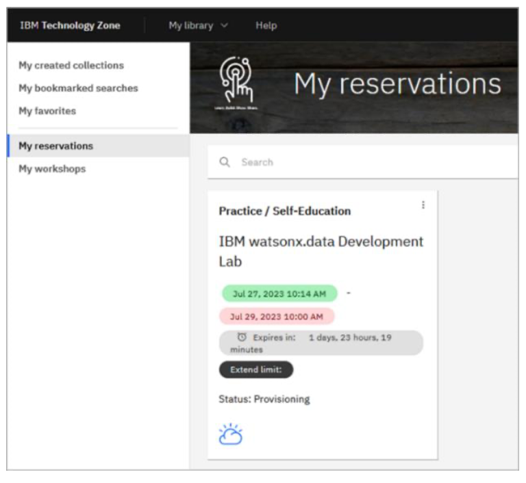
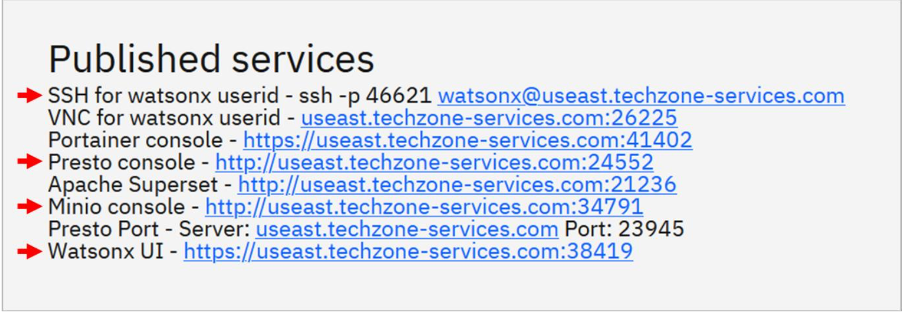

<QuizAlert text='Heads Up! Quiz material will be flagged like this!' />

## Provision a watsonx.data Environment from TechZone

1. Open the IBM watsonx.data Developer Base Image collection in IBM Technology Zone at: https://techzone.ibm.com/collection/ibm-watsonxdata-developer-base-image. Sign in with your IBMid and accept any terms and conditions you are presented with.

2. Select the Environments tab in the left-side menu and click on **IBM watsonx.data Development Lab**
    > **Note:** You may see multiple tiles. As of October 2023, please choose the one marked as Version 1.0.1.
    
    

3. For the reservation type, select the Reserve now radio button.

    

4. Accept the default for the reservation Name, or provide a name of your choosing. For the Purpose of the reservation, select Practice / Self-Education.

    

5. Fill in the Purpose description box with the reason you are making the reservation (e.g. "Workshop lab on watson.data Technical Sales Intermediate Badge organized by IBM Resell Lab"). Then, scroll further down and select your Preferred geography based on your location.(e.g. AMERICAS - us-east region - wdc06 datacenter). Keep the reservation's End date and time(by default it’s two days (48 hours) from now; it can’t exceed two days initially, but you can extend the reservation by two days, up to two times, before it expires).

    

6. On the right-side panel, follow the links to read the Terms & Conditions and the End User Security Policies documents. Then, select the checkbox to agree to those terms. Finally, click Submit.

    

    A message in the upper-right corner will briefly appear stating that the reservation has been created. You may also be presented with an opportunity to provide feedback on the process. Feel free to share your feedback.

    Shortly after, you will receive an email from IBM Technology Zone acknowledging receipt of the request and you will receive another email when the provisioning is complete. Provisioning may be as quick as 15 minutes, or it may take an hour or more. If provisioning fails, it may be due to a lack of resources in the geography specified. Try again with the same geography or specify a different one.

    Reservation status is available at https://techzone.ibm.com/my/reservations.

    

    You must now wait until the environment has been provisioned before moving on to the next section. Specifically, you can continue on to the next section once you’ve received the Reservation Ready on IBM Technology Zone email from IBM Technology Zone.


## Accessing the watsonx.data Environment

In this lab you will interact with the graphical web interfaces (consoles) for watsonx.data, Presto, and the MinIO Object Store. You will also run commands from the server’s command line interface using ssh (Secure Shell).

The console URLs and the ssh command are specific to your environment. They can be found in your TechZone reservation details.

1. Open the Reservation Ready on IBM Technology Zone email.
2. Click the View My Reservations button to view your TechZone reservations (you may have to login again).

    

3. The tile associated with your reservation opens and the tile should say Status: Ready. Click this tile.

    

4. Scroll down to the Published services section. You will be using the SSH for watsonx userid command, the Presto console, the MinIO console, and the Watsonx UI. Make note of these four pieces of information so that you can refer to them later.

    

## Command Line Access

You should have ssh already installed on your computer(Windows, macOS, and Linux). Windows user can download PuTTY. 

To ssh into your watsonx.data VM, run the ssh command provided in your reservation details(Published services section). It will be in the following form :

    ```bash
    ssh -p <port#> watsonx@<hostname>
    ```

    **userid : watsonx**

    **password : watsonx.data**

The first time that you run the command you may receive a message stating that the authenticity of the host can’t be established. In this case, respond stating that you want to proceed anyway.

To change to root user, you can use following command : 

    ```bash
    sudo su -
    ```

## watsonx.data Infrastructure Components

**There are four infrastructure components that can be configured in watsonx.data:**

    • Engines: A query engine is used to run workloads against data in watsonx.data. Watsonx.data supports multiple engines; this lab will use Presto as the query engine.

    • Catalogs: Metadata catalogs are used to manage table schemas and metadata for the data residing in watsonx.data.

    • Buckets: Watsonx.data stores data in object storage. Specifically, data is stored in buckets, which are identified storage areas within object storage, similar to file folders. AWS Simple Storage Service (S3), IBM Cloud Object Storage (COS), and MinIO object storage are supported.

    • Databases: External databases can be registered and used in watsonx.data. Schemas and metadata for objects within a database are stored in a watsonx.data catalog.


**Developer Edition comes pre-configured with the following components:**

    • presto-01: This is a Presto query engine. It is used to interact with data in the lakehouse.

    • iceberg_data: This is an Iceberg catalog, residing within watsonx.data’s embedded Hive Metastore (HMS). It manages tables that have been created with the Iceberg open table format. This catalog is associated with the iceberg-bucket object storage bucket.

    • hive_data: This is a Hive catalog, also residing within the embedded HMS. This catalog is intended for use with non-Iceberg tables, where data is stored in files (such as Parquet, ORC, or CSV), but they are not using the Iceberg table format. This catalog is associated with the hive-bucket object storage bucket.

    • iceberg-bucket: This is a bucket in the embedded MinIO object store. The table data stored here is associated with the iceberg_data catalog.

    • hive-bucket: This is a bucket in the embedded MinIO object store. The table data stored here is associated with the hive_data catalog.

## Stopping and Starting watsonx.data

In many cases, you need to stop and start watsonx.data environment. **This is purely for reference, so DO NOT DO THIS NOW.**

### Stopping watsonx.data

1. Open an SSH session and connect to the watsonx.data VM with the watsonx user ID. Use the SSH command provided in your TechZone reservation details, which is in the following form:

    ```bash
    ssh -p <port#> watsonx@<hostname>
    ```
2. When prompted for the password, enter **password**.

3. Switch to the root user

    ```bash
    sudo su -
    ```
4. Change the directory to the watsonx.data product binaries

    ```bash
    cd /root/ibm-lh-dev/bin
    ```
5. Stop watsonx.data.

    ```bash
    ./stop
    ```

You will see output similar to the text below (this is an excerpt and not the full output).

    


6. Check the status of watsonx.data. If all of the watsonx.data components have been stopped then you will see no output to this command.

    ```bash
    ./status --all
    ```

### Starting watsonx.data

If you don’t currently have a terminal open as the root user, follow Steps 1-4 from above to do so.

1. Start watsonx.data by running the following two commands.

    ```bash
    export LH_RUN_MODE=diag
    ```

    ```bash
    ./start
    ```

It will take a few minutes for the various component containers to start. Output from the start command should look similar to what’s shown below (this is an excerpt and not the full output):

    

2. Check the status of watsonx.data:

    ```bash
    ./status --all
    ```
If watsonx.data has started successfully then you will see a number of containers running.

    

### Congratulations, you've reached the end of lab 1.

To start the L3 Labs, click [lab 102](/watsonx/watsonxdata/102)

To start the L4 Labs, click [lab 202](/watsonx/watsonxdata/202)
