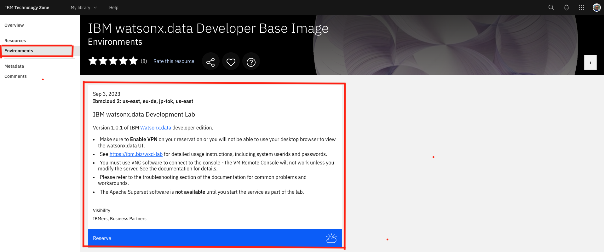
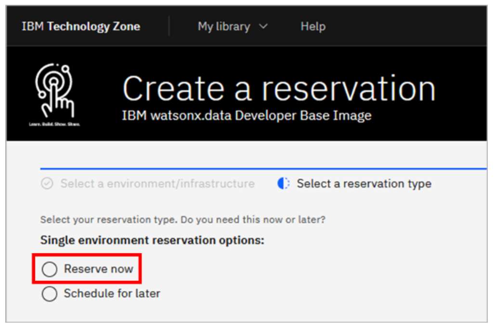
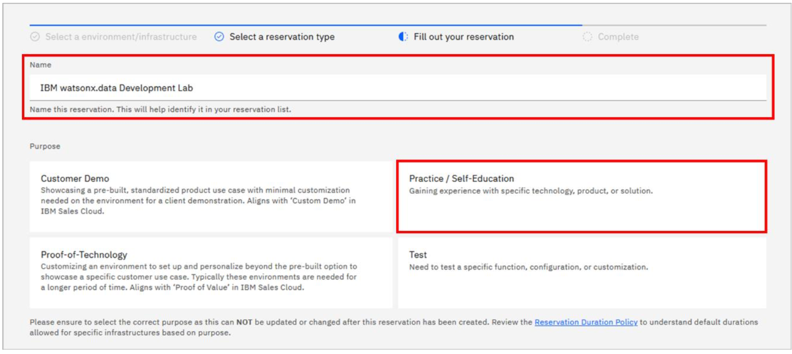

# 101: Environment Setup

<QuizAlert text='Heads Up! Quiz material will be flagged like this!' />

## Provision a watsonx.data Environment from TechZone

1. Open the IBM watsonx.data Developer Base Image collection in IBM Technology Zone at: https://techzone.ibm.com/collection/ibm-watsonxdata-developer-base-image. Sign in with your IBMid and accept any terms and conditions you are presented with.

2. Select the Environments tab in the left-side menu and click on **IBM watsonx.data Development Lab**

3. For the reservation type, select the Reserve now radio button.

4. Accept the default for the reservation Name, or provide a name of your choosing. For the Purpose of the reservation, select Practice / Self-Education.

5. Fill in the Purpose description box (you may have to scroll down to see it) with the reason you are making the reservation (e.g. "workshop lab on Watson.data Technical Saels Intermediate Badge organized by IBM Resell Lab"). Then, scroll further down and select your Preferred geography based on your location.(e.g. )

