<QuizAlert text='¡Atención! ¡El material del cuestionario se marcará así!' />

# Explorando la interfaz de usuario de watsonx.data

## Inicio de la interfaz de usuario de watsonx.data

La administración del entorno watsonx.data se realiza principalmente con la interfaz de usuario watsonx.data (también conocida como consola).

1. Desde su computadora, abra la consola watsonx.data en su navegador. La URL se puede encontrar en los detalles de su reserva de TechZone (consulte la línea de la interfaz de usuario de Watsonx en la sección Servicios publicados)

2. Es posible que reciba una advertencia sobre un posible riesgo de seguridad. Depende del navegador que utilices, puedes proceder a aceptar el riesgo.

3. En la pantalla de inicio de sesión de IBM watsonx.data, ingrese las siguientes credenciales y haga clic en el botón Iniciar sesión:

      **Nombre de usuario: ibmlhadmin**

      **Contraseña: password**
  
      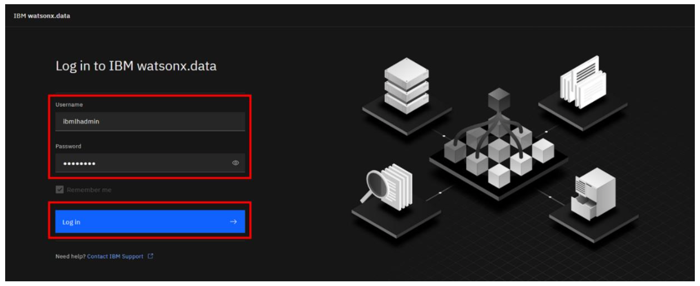

4. Inmediatamente comenzará en la pantalla de inicio de watsonx.data. Desplácese hacia abajo y explore el contenido de la página.

    

    En la página se incluyen los siguientes paneles:

      • **Bienvenido:** Información introductoria, incluido un enlace a la documentación.

      • **Componentes de infraestructura:** Un resumen de los motores, catálogos, depósitos y bases de datos registrados en watsonx.data.

      • **Tablas recientes:** Tablas que se han explorado recientemente.

      • **Trabajos de ingesta recientes:** Trabajos que han movido datos recientemente a watsonx.data

      • **Hojas de trabajo guardadas:** Ejecute con frecuencia consultas guardadas como hojas de trabajo para facilitar su reutilización.

      • **Consultas recientes:** Consultas que se han ejecutado recientemente o que están en proceso de ejecución.
  
5. Observe el menú del lado izquierdo. Pase el puntero del mouse sobre los distintos íconos para ver a qué acciones o páginas de consola se refieren.

    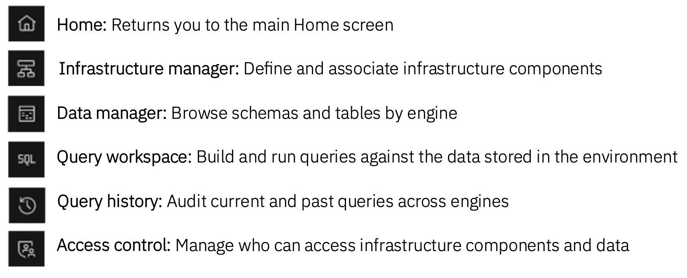

6. Alternativamente, haga clic en el ícono de hamburguesa en la esquina superior izquierda para expandir el menú del lado izquierdo de modo que pueda ver el nombre al lado de cada ícono. Para contraer el menú a la vista predeterminada, haga clic en la X en la esquina superior izquierda.

   

## Página del administrador de infraestructura

1. Seleccione **Administrador de infraestructura** en el menú del lado izquierdo.

    La página del administrador de infraestructura se abre con una vista de lienzo gráfico de los diferentes componentes de infraestructura definidos actualmente en este entorno watsonx.data: motores (capa azul), catálogos (capa violeta), depósitos (capa verde) y bases de datos (también azul, pero no). mostrado).

    > **Nota:** Watsonx.data Developer Edition viene preconfigurado con un motor de consultas Presto, dos catálogos y dos depósitos de almacenamiento de objetos.

    

    Cada depósito está asociado a un catálogo (con una asignación 1:1). Cuando se agrega un depósito a watsonx.data, se crea un catálogo para él al mismo tiempo, según la entrada del usuario. Del mismo modo, si se agrega una conexión de base de datos (para fines de federación), también se crea un catálogo para esa conexión de base de datos. Ambas actividades se mostrarán más adelante en el laboratorio.

    Luego, cada catálogo se asocia con uno o más motores. Un motor no puede acceder a los datos de un depósito o de una base de datos remota a menos que el catálogo correspondiente esté asociado al motor.

2. Observe el minimapa en la esquina inferior izquierda. Esta vista de topología es bastante simple en este punto, pero a medida que crece la cantidad de componentes de infraestructura, este widget de control le brinda una forma práctica de acercar y alejar, organizar automáticamente los componentes o ajustar el diagrama de topología a la pantalla. Pruebe cada uno de los íconos para ver cómo afectan la vista.

    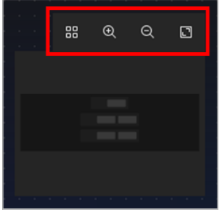

3. Además, puede arrastrar y soltar las diferentes capas de infraestructura en el lienzo. Haga clic dentro del **área de Catálogos violeta**, mantenga presionado el botón del mouse y mueva los catálogos a un lugar diferente en el lienzo.

    

4. Finalmente, puedes desplazarte por todo el lienzo. Haga clic en algún lugar del fondo negro del lienzo, mantenga presionado el botón del mouse y mueva el mouse para arrastrar el lienzo.

    

5. Además de la vista de topología gráfica, los componentes de la infraestructura se pueden enumerar en formato de tabla. Haga clic en el ícono **Vista de lista** en la esquina superior derecha para cambiar a esta vista alternativa.

    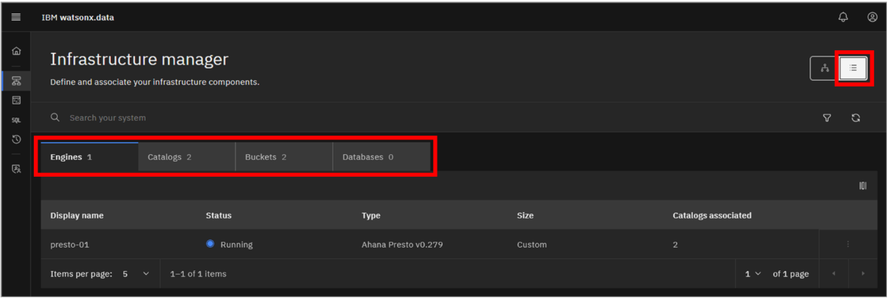

    Existen pestañas para cada uno de los motores, catálogos, depósitos y bases de datos. Explore las diferentes pestañas para ver qué información se puede encontrar allí.

6. Haga clic en el ícono **Vista de topología** (el ícono a la izquierda del ícono de vista de lista en el que acaba de hacer clic) para volver a la vista gráfica original.

    

7. Puede ver los detalles asociados con cada componente. Haga clic en el mosaico del motor **presto-01**.

    

    Se muestran detalles que incluyen la versión del software Presto, la cantidad de nodos coordinadores, la cantidad de nodos trabajadores, el tamaño y el nombre del host.

8. Haga clic en la X en la esquina superior derecha del panel para volver a la vista de topología.

9. Repita los dos pasos anteriores para cada uno de los catálogos y depósitos, para ver qué información está disponible para ellos.

10. Pase el puntero del mouse sobre el mosaico del catálogo hive_data, pero no haga clic en él.

    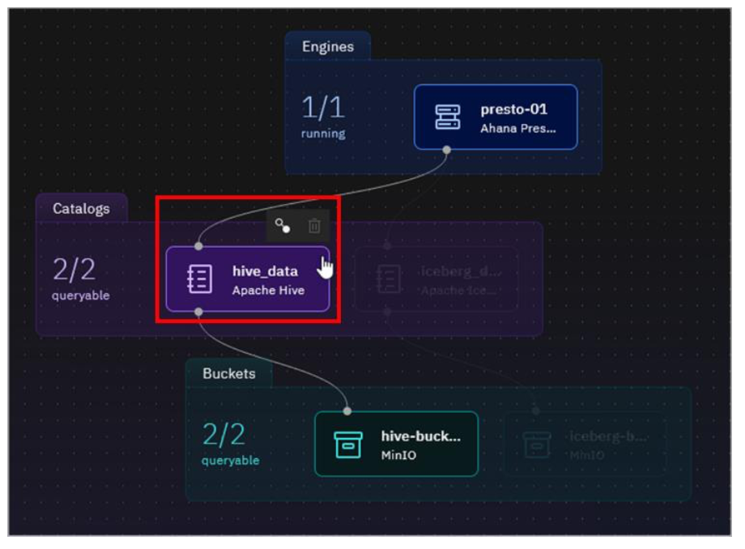

    El mosaico del catálogo se resalta y aparecen iconos encima del mosaico. En este caso hay dos iconos: **Administrar asociaciones** y **Eliminar**.

11. A medida que la topología se vuelve más compleja, puede resultar difícil encontrar los componentes de interés. La consola facilita esto al ofrecer una función de búsqueda y la capacidad de filtrar lo que se muestra (según el tipo de componente y/o el estado del componente). Haga clic en el icono **Filtro** para ver las opciones de filtro disponibles. Haga clic en el icono **Filtro** nuevamente para cerrar el menú de opciones de filtro.

    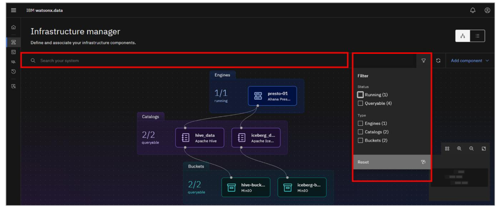


12. Haga clic en el menú desplegable Agregar componente.

    

    Como se trata de la edición para desarrolladores de watsonx.data, está limitado en cuanto a los componentes de infraestructura adicionales que se pueden modificar o agregar. No se le permite agregar motores adicionales, pero puede agregar depósitos y bases de datos. El acto de agregar un nuevo depósito o una conexión de base de datos también agrega un catálogo asociado, por lo que actualmente no existe una opción explícita para agregar un catálogo.

    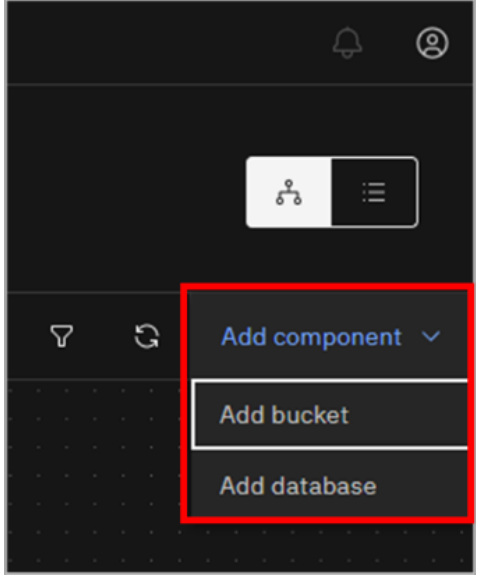

## Página del administrador de datos

La página del administrador de datos se puede utilizar para explorar y seleccionar sus datos. Incluye un panel de navegación de objetos de datos en el lado izquierdo de la página con una jerarquía navegable de motor > catálogo > esquema > tabla.

En esta sección explorará la página del Administrador de datos y creará su propio esquema y tabla.

1. Seleccione el ícono **Administrador de datos** en el menú del lado izquierdo.

    La página del Administrador de datos se abre con un panel de navegación de objetos de datos en el lado izquierdo:

    

    El punto de navegación de nivel superior es el motor de consultas. Con el motor seleccionado, ahora puede navegar a través de los catálogos asociados con el motor seleccionado (los catálogos se enumeran en la sección Catálogos asociados a la izquierda). Actualmente, esto incluye los dos catálogos predeterminados, pero aquí también verá los catálogos que asocie explícitamente con el motor.

2. Expanda cada uno de los catálogos hive_data e iceberg_data haciendo clic en ellos.

    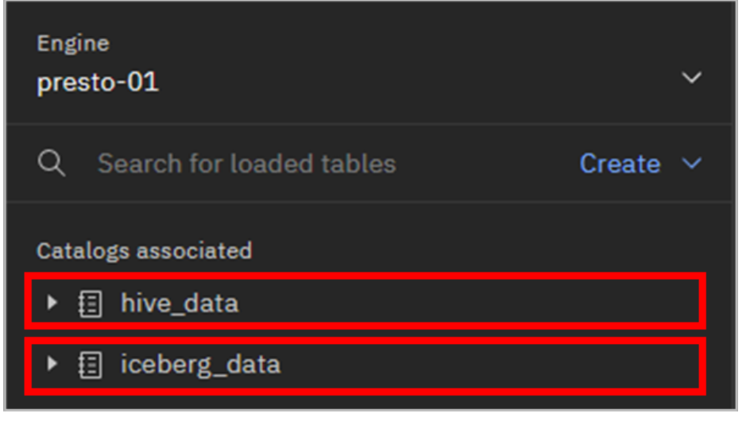

    ¿Qué ves en estos catálogos? El catálogo iceberg_data está vacío y el catálogo hive_data tiene algunos esquemas (con tablas). Estos catálogos predefinidos (y cualquier catálogo que cree) están vacíos hasta que cree esquemas y tablas dentro de ellos. Sin embargo, se han agregado algunos datos a este entorno de laboratorio para brindarle datos interesantes con los que jugar. Estos conjuntos de datos son específicos de este entorno y no se incluyen cuando instala watsonx.data usted mismo.


    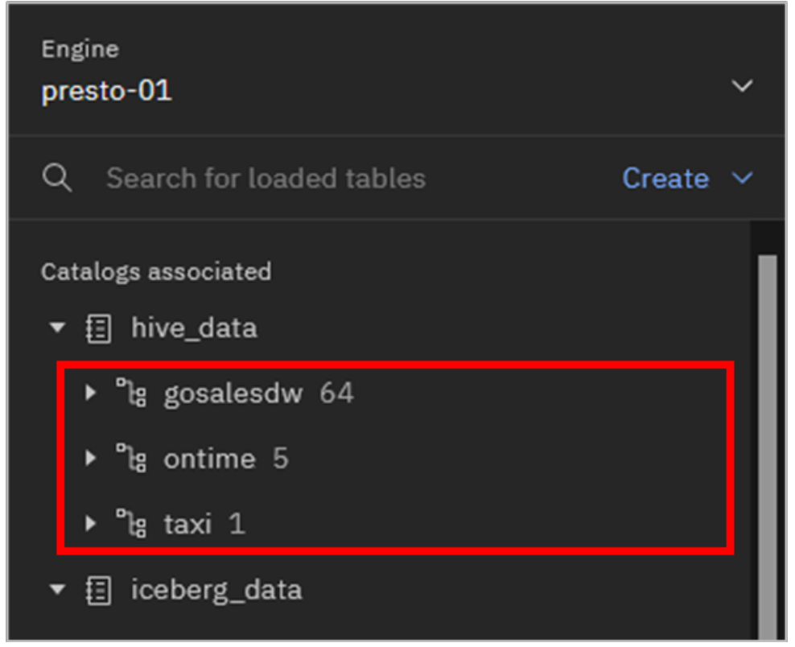

    Estos tres conjuntos de datos están actualmente incluidos:

      a. gosalesdw: datos de ventas de la ficticia Great Outdoors Company ([descripción](https://www.ibm.com/docs/en/cognos-analytics/11.0.0?topic=samples-sample-outdoors-company), [esquema ](https://www.ibm.com/docs/en/cognos-analytics/11.0.0?topic=schemas-warehouse-schema)).

      b. ontime: conjunto de datos de rendimiento de puntualidad de informes de aerolíneas ([detalles](https://dax-cdn.cdn.appdomain.cloud/dax-airline/1.0.1/data-preview/index.html)).

      C. taxi: un subconjunto de un conjunto de datos públicos de taxis de Chicago ([detalles](https://data.cityofchicago.org/Transportation/Taxi-Trips/wrvz-psew)).

    Además, el propio Presto (y por extensión watsonx.data) incluye el conjunto de datos TPC-H. TPC-H es un punto de referencia de apoyo a la toma de decisiones mantenido por el Transaction Processing Council (TPC). Su objetivo es imitar una carga de trabajo empresarial del mundo real que implica una serie de consultas ad hoc que se ejecutan mientras se realizan modificaciones simultáneas en los datos. El conjunto de datos que respalda este punto de referencia incluye información sobre clientes, proveedores, pedidos, números de pieza y más. Se pueden generar conjuntos de datos de diferente escala (tamaño) para probar cargas de trabajo a diferentes escalas.

    Los datos de muestra de TPC-H (y otros datos de muestra) se pueden encontrar en la sección Sistema y datos de evaluación comparativa, que se encuentra debajo de la sección asociada a Catálogos.

<QuizAlert text="Material del cuestionario: explora todas las opciones ampliando otros catálogos."/>

3. Expanda el conjunto de datos de tpch haciendo clic en él.

  

    Una vez expandido, el siguiente nivel es el esquema. En el caso de los datos TPC-H (tpch), cada esquema corresponde a un factor de escala diferente del conjunto de datos. Las tablas del esquema sf100000 tienen 10 veces el tamaño de las tablas del esquema sf10000, que son 10 veces el tamaño de las tablas del esquema sf1000, y así sucesivamente. El esquema pequeño es la versión más pequeña del conjunto de datos.

4. Expanda el pequeño esquema.

    

5. Tenga en cuenta las tablas dentro de este esquema. Seleccione la tabla de clientes. La información sobre esta tabla se muestra en el panel de la derecha. De forma predeterminada, se muestra la pestaña Esquema de tabla (definición de tabla).

    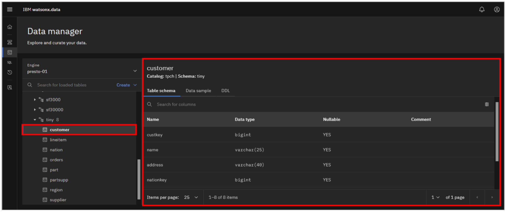

6. Seleccione la pestaña Muestra de datos para ver una muestra de los datos en la tabla de clientes.

    

    Hay diferentes formas de crear esquemas y tablas en Presto. Una forma es mediante el uso de SQL ejecutando instrucciones CREATE SCHEMA y CREATE TABLE SQL (que se pueden hacer en la interfaz de línea de comandos (CLI) de Presto o en la página del espacio de trabajo de consultas de watsonx.data). Otro enfoque es utilizar una herramienta de administración de bases de datos de terceros, como [DBeaver](https://dbeaver.io/).

    También puede utilizar la página Administrador de datos de watsonx.data, que le permite crear un esquema y cargar un archivo de datos para definirlo y completarlo.

7. Vaya a la parte superior del panel de navegación izquierdo y haga clic en el menú desplegable Crear. Seleccione Crear esquema.

    

8. En la ventana emergente Crear esquema, seleccione/ingrese la siguiente información y luego haga clic en el botón Crear.

          - Catálogo: iceberg_data
          - Nombre: my_schema

    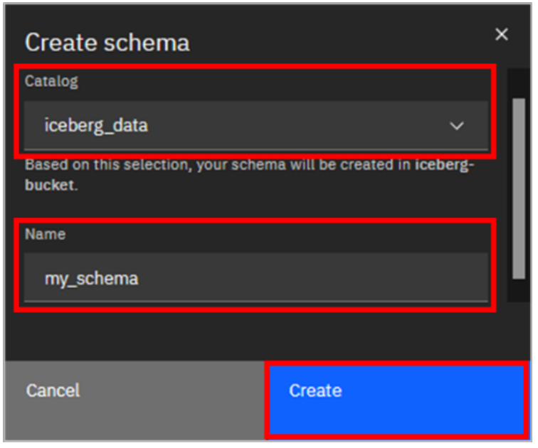

9. Expanda el catálogo iceberg_data. El nuevo esquema debería aparecer en la lista (pero no contiene tablas).

    

10. Haga clic en el menú desplegable Crear nuevamente, pero esta vez seleccione Crear tabla a partir de archivo.

    

    El flujo de trabajo Crear tabla a partir de un archivo le permite cargar un archivo pequeño (tamaño de archivo máximo de 2 MB) .csv, .parquet, .json o .txt para definir y completar una nueva tabla.

11. Descargue el archivo cars.csv de muestra en su escritorio [enlace al archivo](https://raw.githubusercontent.com/ibm-build-lab/VAD-VAR-Workshop/main/content/Watsonx/WatsonxData/files/cars.csv)

12. Para la Fuente, haga clic en Arrastrar y soltar un archivo o haga clic para cargar. Localice el archivo cars.csv que descargó en el paso anterior y selecciónelo para cargarlo (o simplemente arrastre y suelte el archivo en este panel).

    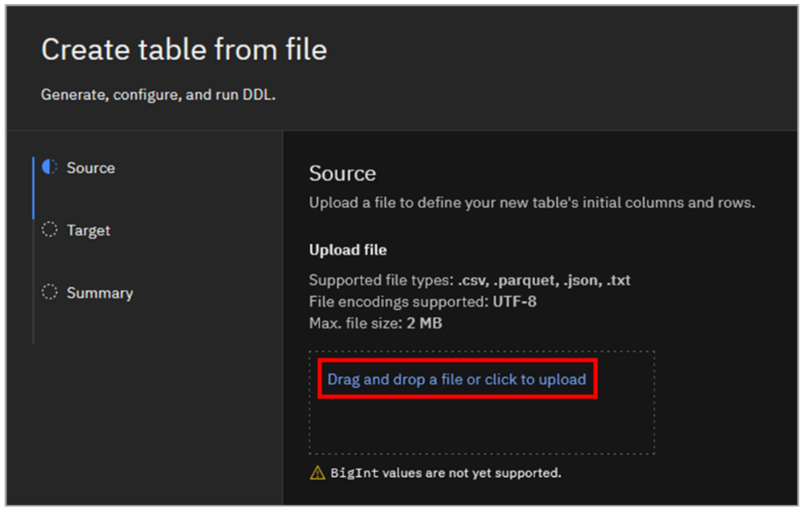

13. Desplácese hacia abajo para ver una muestra de los datos cargados. El esquema de la tabla se infiere de los datos del archivo. Haga clic en Siguiente.

    

14. Para el Objetivo, seleccione/ingrese la siguiente información (algunos campos están precompletados y no se pueden cambiar). Una vez completado, haga clic en Siguiente.


         • Engine:       presto-01

         • Catalog:      iceberg_data  

         • Schema:       my_schema

         • Table name:   cars

         • Table format: Apache Iceberg

         • Data format:  Parquet

    

15. Desplácese hacia abajo para revisar el Resumen, que incluye el lenguaje de definición de datos (DDL) que se utilizará para crear la tabla. Tiene la oportunidad de modificar la declaración DDL si lo desea, pero no cambie nada en esta práctica de laboratorio. Haga clic en Crear para crear la tabla.

    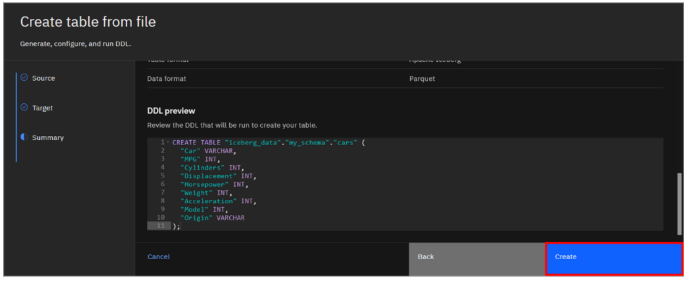

    Es posible que vea un mensaje emergente en la esquina superior derecha indicando que se está creando la tabla y otro después de que se complete.

    

16. Navegue a su nueva tabla: iceberg_data > my_schema > cars.

    

17. Explore las pestañas Esquema de tabla, Muestra de datos y DDL. Observe una nueva pestaña llamada Viaje en el tiempo que no vio anteriormente con el conjunto de datos TPC-H. Puedes ver esto ahora, pero no hagas nada allí. Este tema se tratará más adelante.

18. No es inmediatamente obvio, pero hay opciones de menú adicionales disponibles para los catálogos, esquemas y tablas en el panel de navegación. Pase el puntero del mouse en el extremo derecho de la línea de la tabla de autos. Aparece un icono de menú adicional (elipses verticales). Haga clic en el icono del menú adicional para ver la opción de soltar la tabla (no lo haga ahora). Haga clic nuevamente en el ícono del menú adicional para cerrarlo.

    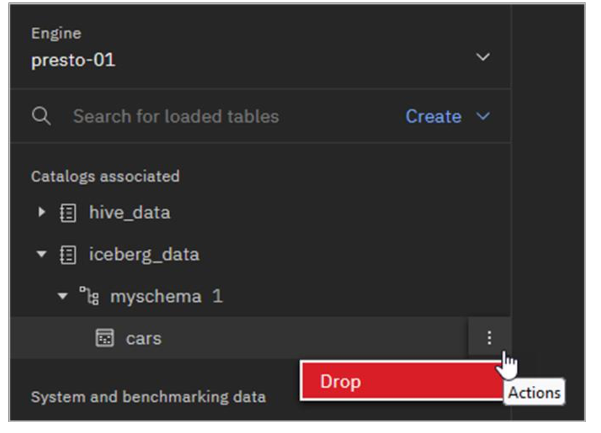


## Página del espacio de trabajo de consulta

Las bases de datos y los motores de consulta como Presto tienen múltiples formas en que los usuarios pueden interactuar con los datos, como CLI, JDBC. La interfaz de usuario watsonx.data incluye una interfaz SQL para crear y ejecutar sentencias SQL. Esto se denomina espacio de trabajo Consulta. Los usuarios pueden escribir o copiar sus propias declaraciones SQL, o pueden usar plantillas para ayudar a crear nuevas declaraciones SQL.

Además de la ejecución única de sentencias SQL, las sentencias SQL que deben ejecutarse repetidamente se pueden guardar en una hoja de trabajo y ejecutar con tanta frecuencia como sea necesario más adelante.

1. Seleccione el icono **Consultar espacio de trabajo** en el menú del lado izquierdo.

    La página del espacio de trabajo Consulta se abre con un panel de navegación de objetos de datos en el lado izquierdo y un
    Panel del editor SQL (espacio de trabajo) en el lado derecho.

    

2. Copie y pegue el siguiente texto en la hoja de trabajo SQL. Tenga en cuenta que la tabla que está a punto de consultar se identifica mediante un nombre de tres partes que incluye el catálogo, el esquema y el nombre de la tabla. Haga clic en Ejecutar en presto-01.


   ```bash
      select car, avg(mpg) as avg_mpg from iceberg_data.my_schema.cars group by car order by car;
   ```
    

    El resultado de la consulta se muestra en la parte inferior del panel.

    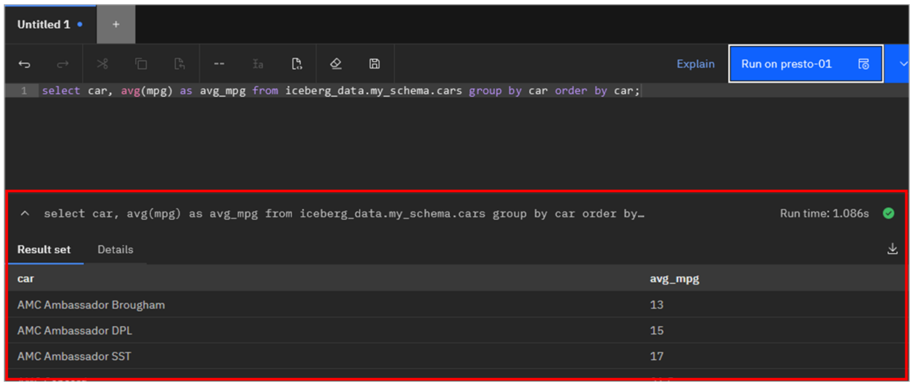
  
    Presto incluye una función de explicación que muestra cómo Presto divide y distribuye las tareas necesarias para ejecutar una consulta. Una representación gráfica del plan de ejecución de una consulta (lo que comúnmente se conoce como explicación visual) está disponible desde la página del espacio de trabajo Consulta. Watsonx.data utiliza una declaración SQL EXPLAIN en la consulta dada para crear el gráfico correspondiente, que se puede utilizar para analizar y mejorar aún más la eficiencia de la consulta.

3. Haga clic en el botón Explicar.

    

    Esto muestra una representación gráfica del plan de ejecución de la consulta. Para este ejemplo, el plan de ejecución de la consulta es relativamente simple. Siéntete libre de acercarte y explorar los diferentes elementos del mismo. Al hacer clic en una etapa en particular, es posible que se muestre información adicional en el panel de la derecha.

    

4. Haga clic en la X en la esquina superior derecha de la ventana Explicar para cerrarla.

    Supongamos que esta es una consulta que querrás ejecutar una y otra vez en el futuro. Para hacer esto, puede guardarlo como una hoja de trabajo. Si bien este ejemplo solo tiene una declaración SQL, imagine un escenario en el que tiene varias declaraciones en el editor del espacio de trabajo y en una hoja de trabajo.

5. Haga clic en el icono **Guardar** (parece un disco) en el menú del editor encima de la declaración SQL.

    

6. En la ventana emergente Guardar hoja de trabajo, ingrese Cars MPG para el Nombre y luego haga clic en Guardar.

    

    La hoja de trabajo ahora se muestra en la parte inferior del panel de navegación del lado izquierdo.

    

    Cualquier hoja de trabajo se puede eliminar en cualquier momento haciendo clic en el ícono **Eliminar** (parece un bote de basura) a la derecha del nombre de la hoja de trabajo.

7. Haga clic en el ícono **+ (Nueva hoja de trabajo)** en la parte superior de la hoja de trabajo actual para crear una hoja de trabajo nueva y vacía.

    

8. Haga clic en la X en la pestaña Car MPG para cerrar esa hoja de trabajo. Si se le solicita que confirme el cierre, haga clic en Cerrar.

    

    Además de escribir consultas desde cero o copiar y pegar consultas desde otro lugar, la interfaz del espacio de trabajo Query también puede ayudar a generar SQL para tablas que se encuentran en watsonx.data. Veamos qué opciones están disponibles aquí.

9. En el panel de navegación del lado izquierdo, coloque el puntero del mouse en el extremo derecho de la línea del catálogo iceberg_data hasta que aparezca el icono **Plantillas de consulta**. Cuando vea este icono, haga clic en él.

    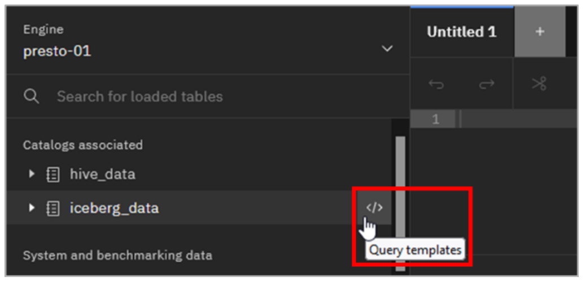

10. La única plantilla para catálogos y esquemas es Generar ruta. Haga clic en Generar ruta.

    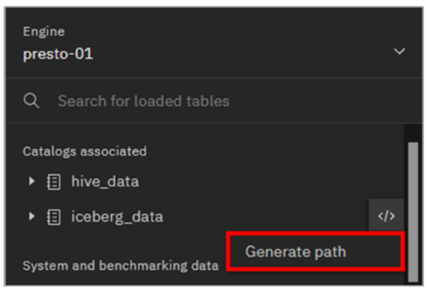

    Observe cómo se ingresó el nombre del catálogo en la hoja de trabajo. Se puede hacer lo mismo con los esquemas, y para los esquemas el texto que se ingresa en la hoja de trabajo tiene el formato de "catálogo". "esquema".

    

11. Haga clic en el icono **Borrar** (parece un borrador) en el menú encima de la declaración SQL. Esto borra el texto que se ingresó anteriormente.

    

12. Navegue a iceberg_data > my_schema > cars. Pase el puntero del mouse en el extremo derecho de la línea de la tabla de autos hasta que vea aparecer el ícono **Plantillas de consulta**. Cuando vea este icono, haga clic en él.

    

13. Como puedes ver, hay más plantillas disponibles cuando trabajas con tablas que las que viste en el catálogo:

    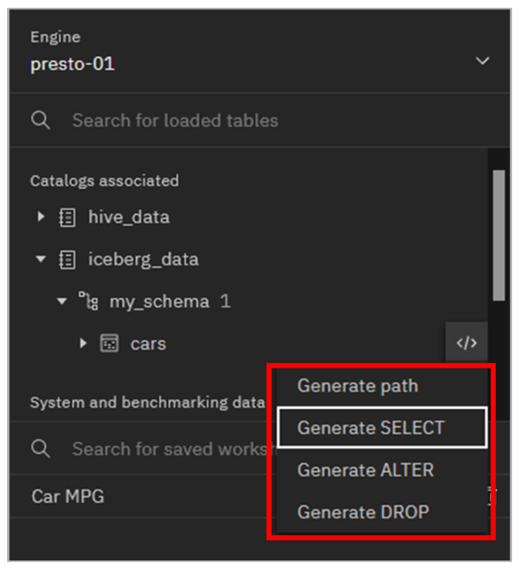

    Al seleccionar Generar ruta se genera el nombre de la tabla, como un nombre de 3 partes: “catálogo”. “esquema”. “tabla”. Las otras tres opciones se pueden utilizar para generar sentencias SELECT, ALTER y DROP SQL.

14. Haga clic en Generar SELECCIÓN.

15. Se ingresa en la hoja de trabajo una declaración SELECT básica que consulta desde la tabla de autos. Esta declaración predeterminada devuelve 10 filas de la tabla, incluidas todas las columnas. Haga clic en Ejecutar en presto-01.

    

    Como antes, el resultado de la consulta se muestra en la parte inferior de la pantalla.

    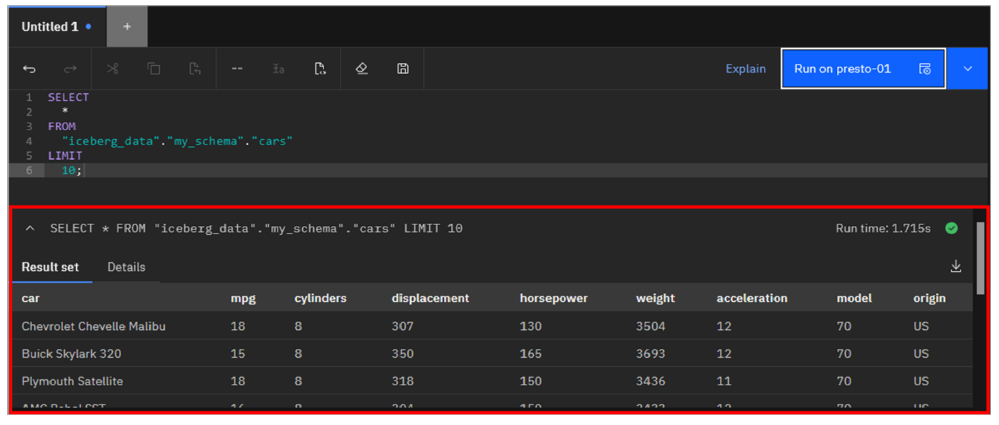

## Página del historial de consultas

  La página Historial de consultas le permite auditar las consultas que se están ejecutando actualmente y las consultas que se ejecutaron en el pasado, en todos los motores definidos en el entorno. Esto incluye consultas que los usuarios han ejecutado explícitamente, así como consultas utilizadas en la gestión interna y el funcionamiento del entorno.

1. Seleccione el ícono **Historial de consultas** en el menú del lado izquierdo.

    > **Nota:** Lo que ves en tu lista de consultas no coincidirá con las capturas de pantalla que se muestran aquí.

    La página Historial de consultas se abre con una lista de consultas actualmente en ejecución y que se ejecutaron en el pasado. Si la lista parece corta o no está actualizada, haga clic en el icono **Actualizar** en la esquina superior derecha.

    

    Se incluye (en la parte superior) una barra de búsqueda para encontrar consultas específicas de interés. La lista también se puede filtrar por el estado de la consulta (por ejemplo, FALLADO, FINALIZADO y EN EJECUCIÓN), el motor que ejecutó la consulta y el usuario que envió la consulta. Se muestra información que incluye el texto de la consulta, el estado y cuándo se ejecutó la consulta, pero puede personalizar las columnas para mostrar más o menos información.

2. Haga clic en el ícono **Filtro** a la derecha (parece un embudo). Tenga en cuenta los filtros disponibles. Haga clic en el ícono **Filtro** nuevamente para cerrarlo.

    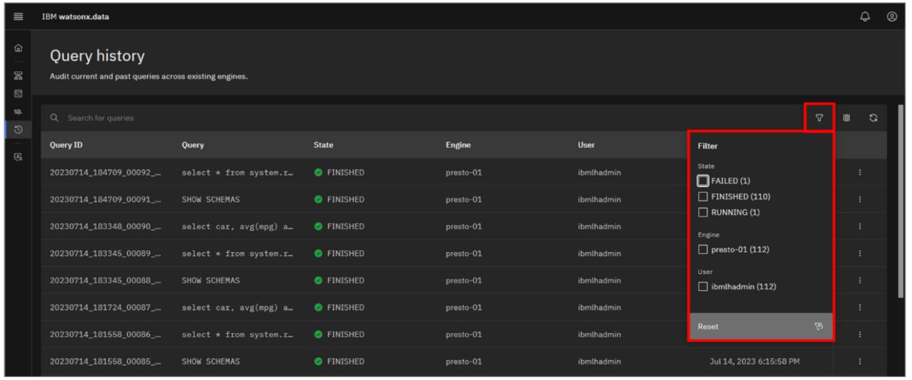

3. Haga clic en el icono **Personalizar columnas** (parece una serie de líneas verticales; está a la derecha del icono **Filtro**). Tenga en cuenta las columnas disponibles para mostrar. Haga clic en el ícono **Personalizar columnas** nuevamente para cerrarlo.

    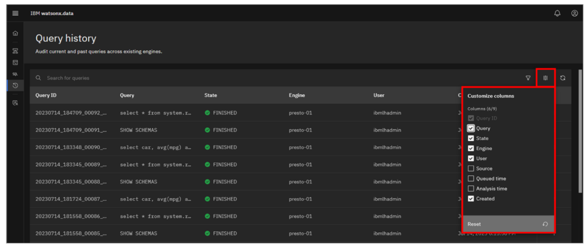

4. Haga clic en el ícono **menú adicional** (elipses verticales) al final de la fila para cualquier consulta enumerada. Tenga en cuenta las opciones disponibles. Puede ver el plan de explicación de la consulta y abrir la consulta en el espacio de trabajo Consulta. Haga clic en el ícono **menú adicional** nuevamente para cerrar la lista.

    

## Página de control de acceso

  La página de control de acceso se utiliza para gestionar el acceso a la infraestructura y las políticas de acceso a los datos.

  La seguridad y el control de acceso dentro de watsonx.data se basan en roles. Un rol es un conjunto de privilegios que controlan las acciones que los usuarios pueden realizar. La autorización se otorga asignando un rol específico a un usuario o agregando el usuario a un grupo al que se le han asignado uno o más roles.

  El acceso a los propios datos se gestiona mediante políticas de control de datos. Se pueden crear políticas para permitir o denegar el acceso a esquemas, tablas y columnas.

  En esta sección agregará un nuevo usuario y le proporcionará privilegios sobre la infraestructura y los datos. Tenga en cuenta que la intención de las instrucciones de esta práctica de laboratorio no es mostrar los resultados de estos privilegios (no iniciará sesión con otros usuarios), la intención es resaltar el proceso de cómo asignaría estos privilegios en primer lugar.

1. Abra una ventana de comando de terminal para el servidor watsonx.data como usuario root (recuerde usar el comando sudo para convertirse en usuario root, o recibirá un error de permiso denegado cuando ejecute el comando en el siguiente paso).


2. Ejecute el siguiente comando para crear un usuario que no sea administrador (tipo de usuario) con el nombre de usuario **user1** y la contraseña **password1**.


   ```bash
      /root/ibm-lh-dev/bin/user-mgmt add-user user1 User password1
   ```

3. En la interfaz de usuario de watsonx.data que se ejecuta en su navegador, haga clic en el ícono **Control de acceso** en el menú del lado izquierdo.

    La página de control de acceso se abre en la pestaña Infraestructura, con los motores (1), catálogos (2) y depósitos (2) actualmente definidos enumerados (cuando agregue bases de datos, también aparecerán aquí).

4. Haga clic en **presto-01** (se convertirá en un hipervínculo cuando pase el cursor sobre él).

    

5. Seleccione la pestaña **Control de acceso**.

    

6. Haga clic en el botón azul **Agregar usuarios** a la derecha.

    

7. Se muestra la ventana emergente **Agregar usuarios**. Para **Nombre de usuario**, seleccione **user1**. Para Función, seleccione **Usuario**. Haga clic en **Agregar**.

    > **Nota:** Si el user1 no aparece en la lista, cancele la operación, actualice la pestaña de su navegador y repita los pasos.

    

8. Observe cómo se ha agregado el rol del usuario. Haga clic en la X en la esquina superior derecha para cerrar los controles de acceso al motor Presto.

    

    Además, se debe crear una política que permita al usuario acceder a la tabla en cuestión.

9. Seleccione la pestaña **Políticas**.

    

10. Haga clic en **Agregar política** a la derecha.

    

11. Ingrese **selectcars** en el campo Escribir nombre de póliza, seleccione **Activo** para Estado de la póliza después de la creación y luego haga clic en **Siguiente**.

    

12. Haga clic en el menú desplegable Elija un catálogo para comenzar y seleccione **iceberg_data**. Luego se muestra una lista de esquemas.

      a. Seleccione la casilla de verificación para el esquema **myschema**.

      b. Luego se muestra una lista de las tablas del esquema; seleccione la casilla de verificación de la tabla **cars**.
         
      c. Luego se muestra una lista de las columnas de la tabla; seleccione la casilla de verificación para todas las columnas, que selecciona **todas** las columnas.
         
      d. Haga clic en **Siguiente**.

    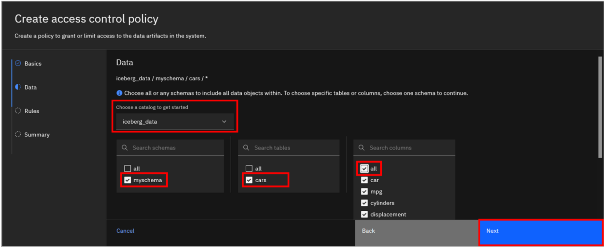

13. Ahora se pueden agregar una o más reglas a la política. Haga clic en **Agregar regla** a la derecha.

    

14. Realice las siguientes selecciones y luego haga clic en el botón **Agregar**:

      a. Para el tipo de regla, seleccione **Permitir**.
         
      b. Para **Acciones**, seleccione la casilla de verificación **seleccionar**.

      c. Para **Usuarios/grupo**, seleccione **Usuarios**.

      d. En el menú desplegable Seleccionar usuario, seleccione **user1**.

    

15. Con la regla agregada a la política, haga clic en **Revisar**.

    

16. Revise los detalles de la póliza que ingresó y haga clic en **Guardar**.

    

    La política ahora debería aparecer en la lista. Debido a que usted especificó que la política estuviera activa al momento de su creación, de hecho está activa (como puede ver al observar la columna Estado).

    

    Acaba de otorgarle al user1 los permisos necesarios para consultar los datos dentro de la tabla de autos.

### Felicitaciones, has llegado al final del laboratorio 102.

Haga clic en [lab 103](/watsonx/watsonxdata/103) para comenzar la siguiente práctica de laboratorio.
