<QuizAlert text='Heads Up! Quiz material will be flagged like this!' />

### Exploring the watsonx.data User Interface

## Starting the watsonx.data User Interface

Administration of the watsonx.data environment is primarily done with the watsonx.data user interface (also known as a console).

1. From your computer, open the watsonx.data console in your browser. The URL can be found in your TechZone reservation details (see the Watsonx UI line in the Published services section)

2. You might receive a warning about a potential security risk. Depends on browser you use, you can proceed to accept the risk. 

3. In the IBM watsonx.data login screen, enter the following credentials and click on Log in button: 

**Username: ibmlhadmin**
**Password: password**

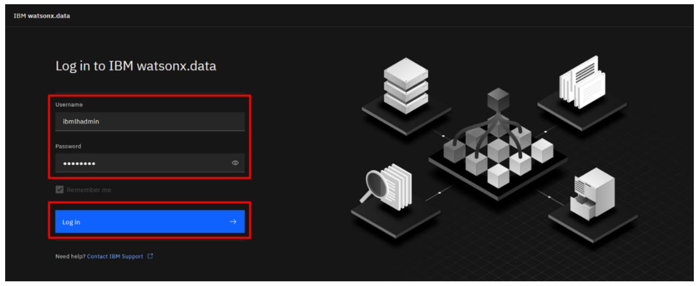

4. You will immediately start in the Home screen for watsonx.data. Scroll down and explore the contents of the page.

  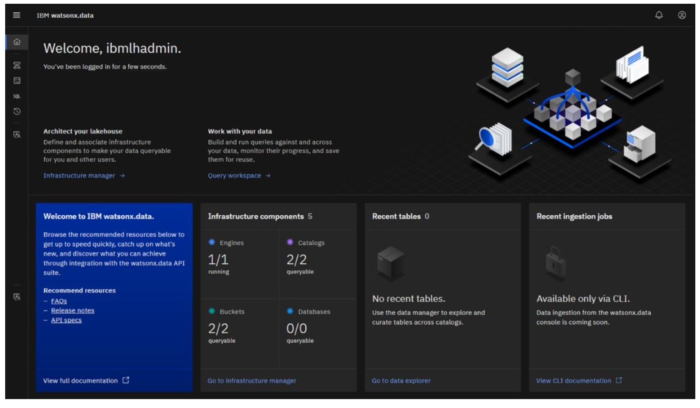

  Included on the page are the following panels:

  • **Welcome:** Introductory information, including a link to documentation

  • **Infrastructure components:** A summary of the engines, catalogs, buckets, and databases that are registered with watsonx.data

  • **Recent tables:** Tables that have recently been explored

  • **Recent ingestion jobs:** Jobs that have recently moved data into watsonx.data

  • **Saved worksheets:** Frequently run queries saved as worksheets, for easier reuse

  • **Recent queries:** Queries that have recently been run or are in the process of being run
  
5. Note the left-side menu. Hover your mouse pointer over the various icons to see what actions or console pages they refer to.

  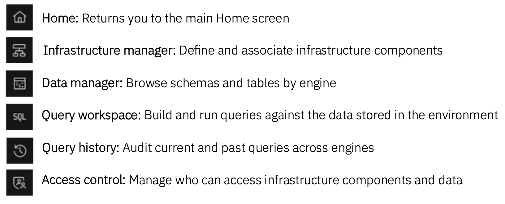

6. Alternatively, click on the hamburger icon in the upper left to expand the left-side menu such that you can see the name beside each icon. To collapse the menu back to the default view, click the X in the upper left.

  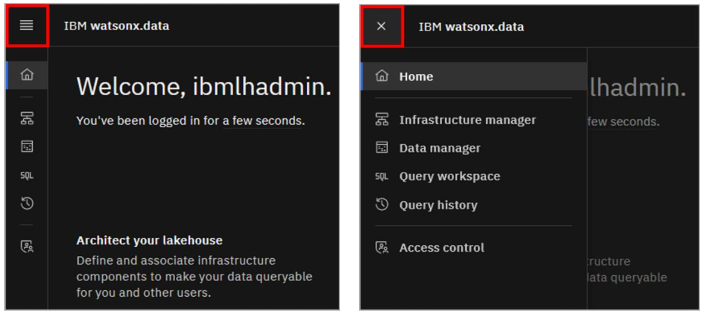

## Infrastructure Manager Page

1. Select the **Infrastructure manager** from the left-side menu.

  The Infrastructure manager page opens with a graphical canvas view of the different infrastructure components currently defined in this watsonx.data environment: Engines (blue layer), Catalogs (purple layer), Buckets (green layer), and Databases (also blue, but not shown).

  **Note:** Watsonx.data Developer Edition comes pre-configured with a Presto query engine, two catalogs, and two object storage buckets.

  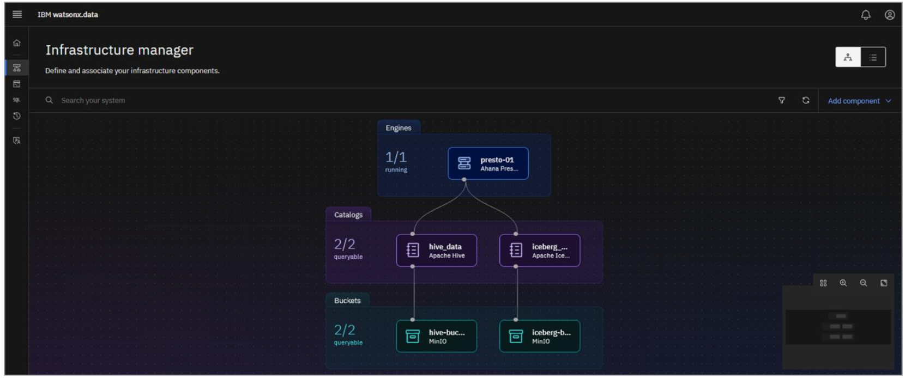

  Each bucket is associated with a catalog (with a 1:1 mapping). When a bucket is added to watsonx.data, a catalog is created for it at the same time, based on input from the user. Likewise, if a database connection is added (for federation purposes), a catalog is created for that database connection as well. Both of these activities will be shown later in the lab.

  Each catalog is then associated with one or more engines. An engine can’t access data in a bucket or a remote database unless the corresponding catalog is associated with the engine.

2. Note the mini-map in the lower left corner. This topology view is rather simple at this point, but as the number of infrastructure components grows, this control       widget gives you a handy way to zoom in and out, auto-arrange the components, or fit the topology diagram to the screen. Try each of the icons to see how they affect the view.

  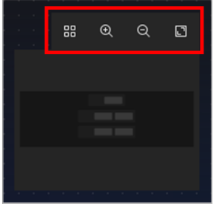

3. Additionally, you can drag and drop the different infrastructure layers across the canvas. Click within the **purple Catalogs area**, hold the mouse button down, and move  the catalogs to a different spot on the canvas.

  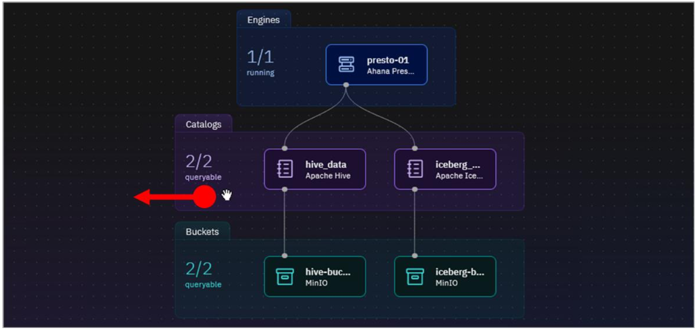

4. Finally, you can pan across the canvas as a whole. Click somewhere in the black background of the canvas, hold the mouse button down, and move your mouse to drag the canvas.

  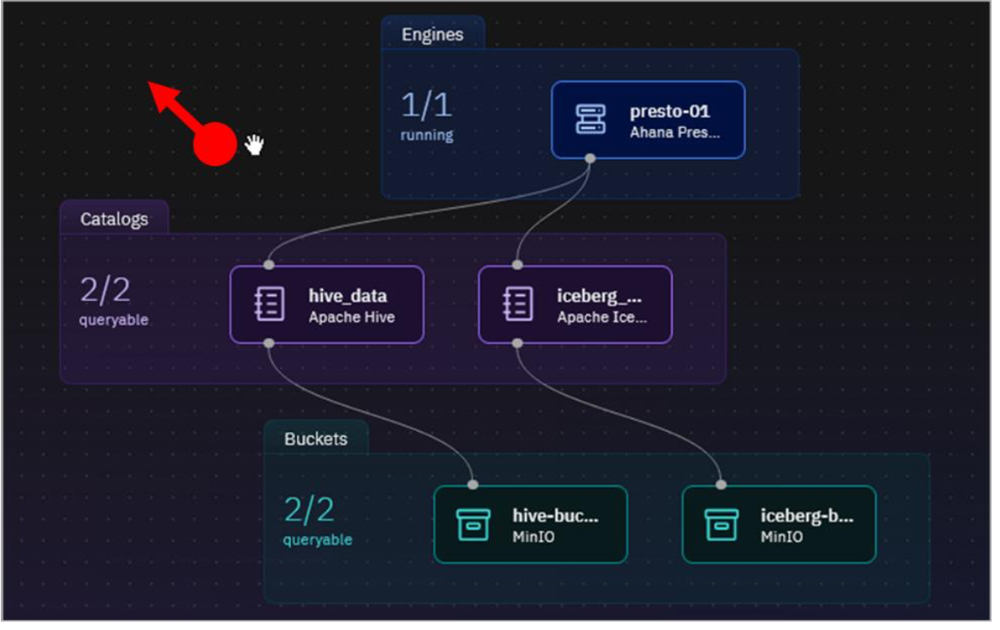

5. In addition to the graphical topology view, infrastructure components can be listed in a table format. Click the **List view** icon in the upper-right to switch to this alternate view.

  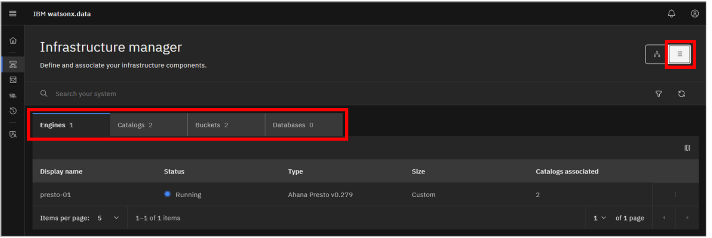

  Tabs exist for each of Engines, Catalogs, Buckets, and Databases. Explore the different tabs to see what information can be found there.  

6. Click the **Topology view** icon (the icon to the left of the List view icon you just clicked) to switch back to the original graphical view.

  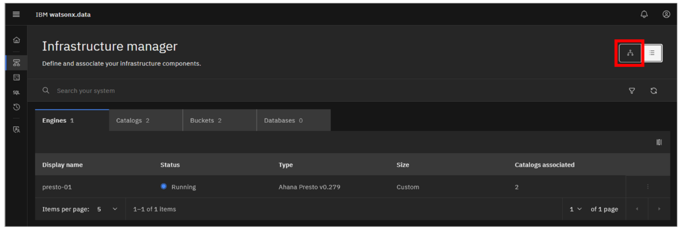

7. You can view details associated with each component. Click the **presto-01** engine tile.

  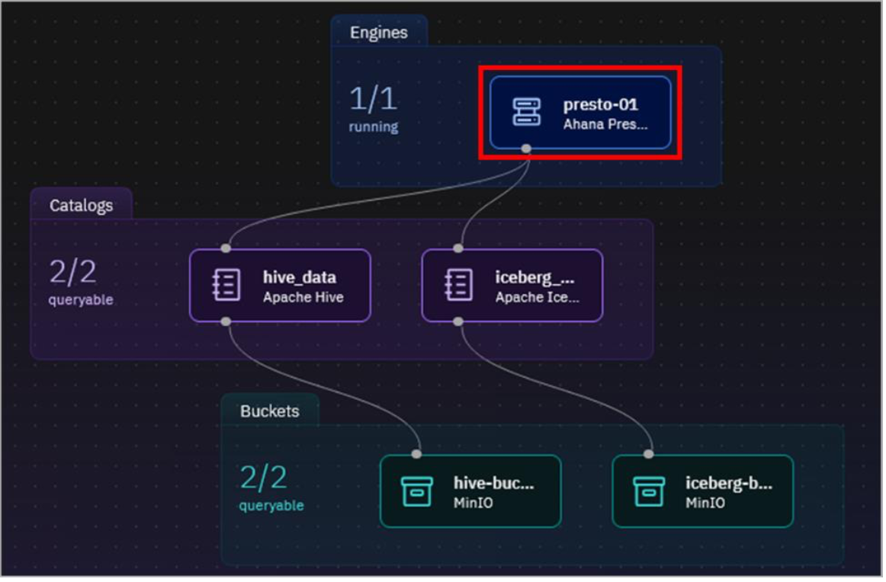

  Details including the Presto software version, the number of coordinator nodes, number of worker nodes, size, and host name are shown.

8. Click the X in the upper right corner of the pane to return to the topology view.

9. Repeat the previous two steps for each of the catalogs and buckets, to see what information is available for them.

10. Hover your mouse pointer over the hive_data catalog tile – but don’t click on it.

  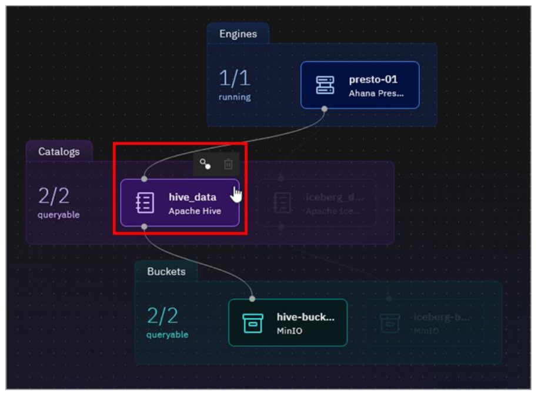

  The catalog tile is highlighted, and icons appear above the tile. In this case there are two icons: Manage associations and Delete.

11. As the topology gets more complex, it may be difficult to find the components of interest. The console makes this easy by offering a search facility and the ability to filter what is shown (based on component type and/or the state of the component). Click the Filter icon to see the filter options available. Click the Filter icon again to close the filter options menu.

  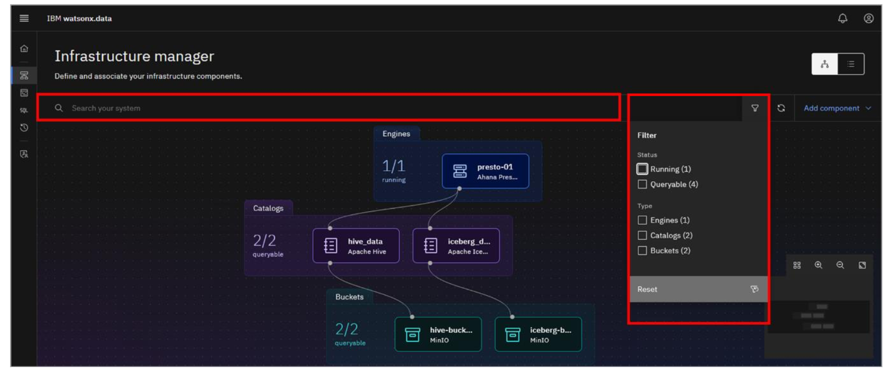

12. Click the Add component dropdown menu.

 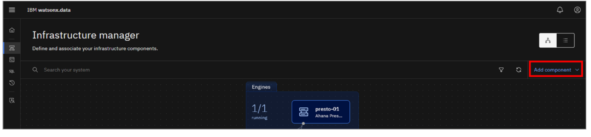

  As this is the Developer Edition of watsonx.data, you are limited in what additional infrastructure components can be modified or added. You are not permitted to add additional engines, but you can add buckets and databases. The act of adding a new bucket or a database connection also adds an associated catalog, and so there is currently no explicit option for adding a catalog.

 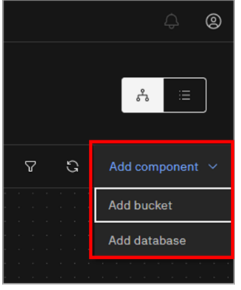

## Data Manager Page

The Data manager page can be used to explore and curate your data. It includes a data objects navigation pane on the left side of the page with a navigable hierarchy of engine > catalog > schema > table.

