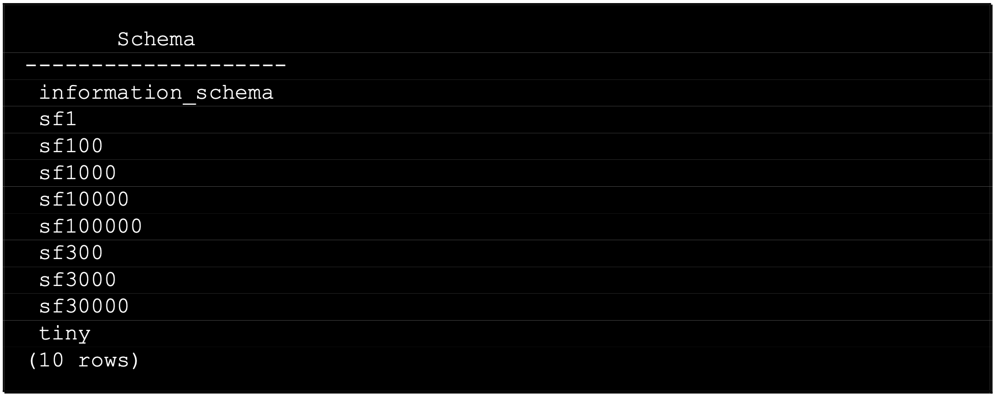
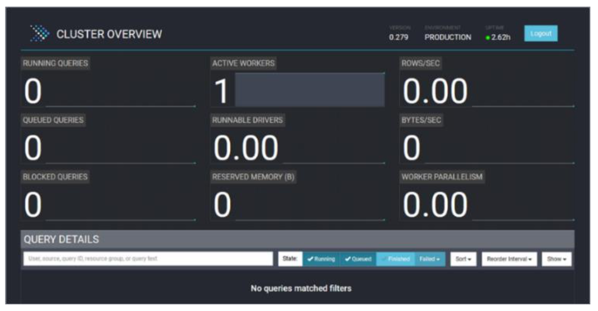
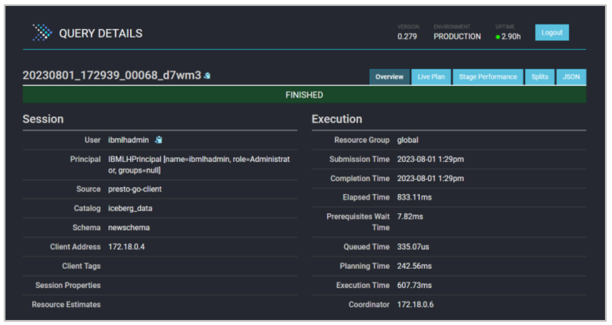

<QuizAlert text='¡Atención! ¡El material del cuestionario se marcará así!' />

# Trabajando con Presto

En [Lab 02](/watsonx/watsonxdata/102), ha visto cómo Presto se integra en watsonx.data y la interfaz de usuario de watsonx.data. Sin embargo, también puedes trabajar directamente con Presto.

Por ejemplo, Presto incluye una interfaz de línea de comandos interactiva (CLI) basada en terminal que le permite ejecutar declaraciones SQL. Presto también tiene una interfaz gráfica de usuario basada en web para obtener información sobre la actividad de consultas en el sistema.

## Interfaz de línea de comandos (CLI) de Presto

Presto CLI es un shell interactivo basado en terminal que se puede utilizar para ejecutar consultas. Puede conectarse al servidor Presto a través de Presto CLI instalado como parte del paquete ibm-lh-client o mediante Presto CLI instalado por separado.

Presto CLI está preinstalado como parte de watsonx.data Developer Edition. Se inicia utilizando el comando presto-cli (ubicado en /root/ibm-lh-dev/bin).

Presto utiliza un nombre de tres partes para identificar las tablas: catalog.schema.table. Estos identificadores se pueden incluir entre comillas dobles según sea necesario (por ejemplo, "mycatalog"."myschema"."mytable"). Tenga en cuenta que se necesitan comillas dobles si utiliza caracteres especiales en un nombre, como un guión.

1. Abra una ventana de comando de terminal para el servidor watsonx.data como usuario raíz.

2. Ejecute los dos comandos siguientes para abrir una terminal interactiva Presto CLI.

   ```bash
     cd /root/ibm-lh-dev/bin
   ```

   ```bash
     ./presto-cli
   ```

3. Ejecute el siguiente comando para enumerar los catálogos que se han registrado en Presto (Nota: Presto requiere que los comandos terminen con punto y coma).

   ```bash
     show catalogs;
   ```

   El resultado debe ser similar al texto siguiente.

   

4. Ejecute la siguiente consulta. Debería devolver un recuento de 1500 filas.

   ```bash
     select count(*) from tpch.tiny.customer;
   ```

   También puede indicarle a Presto con qué esquema desea trabajar utilizando el comando USE.

5. Primero, ejecute el siguiente comando para ver los esquemas en el catálogo de tpch.

   ```bash
     show schemas in tpch;
   ```

   El resultado debe ser similar al texto siguiente.

   

6. Ejecute el siguiente comando **USE** para configurar el esquema para la sesión actual:

   ```bash
     use tpch.tiny;
   ```

7. Ejecute la siguiente consulta. Tenga en cuenta que el catálogo y el esquema no son necesarios. Nuevamente, esto debería devolver un recuento de 1500 filas.

   ```bash
     select count(*) from customer;
   ```

   Alternativamente, puede proporcionar el catálogo de sesiones y el esquema (o solo el catálogo) cuando inicie Presto CLI. Tenga en cuenta que incluso si especifica el catálogo y el esquema al iniciar Presto CLI o ejecutando el comando USE, aún puede acceder a tablas en otros esquemas y catálogos. Solo tiene que especificar el nombre completo de 3 partes para ellos (o UTILIZAR el esquema en cuestión para cambiar el valor predeterminado de la sesión).

8. Salga de Presto CLI ejecutando el siguiente comando.

   ```bash
     quit;
   ```

9. Inicie Presto CLI nuevamente, pero esta vez especifique el catálogo de sesión y el esquema como opciones de línea de comando.

   ```bash
     ./presto-cli --catalog tpch --schema tiny
   ```

10. Ejecute la siguiente consulta. Observe que esta vez no se requieren el catálogo ni el esquema. Nuevamente, esto debería devolver un recuento de 1500 filas.

    ```bash
      select count(*) from customer;
    ```

11. Salga de Presto CLI ejecutando el siguiente comando.

    ```bash
      quit;
    ```

A continuación, creará un nuevo esquema y tabla. Al utilizar Presto para crear un esquema en watsonx.data, debe especificar el depósito de almacenamiento de objetos asociado con el catálogo.

12. Inicie Presto CLI y especifique que desea utilizar el catálogo iceberg_data.

    ```bash
      ./presto-cli --catalog iceberg_data
    ```

13. Ejecute la siguiente instrucción SQL para crear un nuevo esquema en el catálogo.

    ```bash
      create schema if not exists newschema with (location='s3a://iceberg-bucket/newschema');
    ```

14. Ejecute el siguiente comando para ver una lista de los esquemas en el catálogo que se están utilizando.

    ```bash
      show schemas;
    ```

    El newesquema debe aparecer en la lista.

    <QuizAlert text="Material del cuestionario: presta atención al script"/>

15. Ejecute las siguientes instrucciones SQL para crear una nueva tabla en este esquema, complete la tabla con algunos datos y luego consulte la tabla.

    ```bash
    create table newschema.users (id int, name varchar, age int);
    ```

    ```bash
      insert into newschema.users values (1, 'Robert', 54);
    ```

    ```bash
      insert into newschema.users values (2, 'Susan', 37);
    ```

    ```bash
      select * from newschema.users;
    ```

    El resultado de la declaración SELECT final debería ser similar a lo que se muestra a continuación.

    

16. Ejecute los dos comandos siguientes para mostrar la tabla en el nuevo esquema.

    ```bash
      use newschema;
    ```

    ```bash
      show tables;
    ```

    El resultado de la declaración SHOW TABLES debería ser similar al que se muestra a continuación.

    

17. Salga de Presto CLI ejecutando el siguiente comando.

    ```bash
      quit;
    ```

18. Abra la interfaz de usuario de watsonx.data en una ventana del navegador (si aún no tiene una abierta).

19. Seleccione el ícono **Administrador de datos** en el menú del lado izquierdo.

20. Expanda el catálogo **iceberg_data** para ver el nuevo esquema que creó (newschema).


> **Nota:** Si no ve el esquema en la lista, coloque el puntero del mouse sobre el extremo derecho de la línea del catálogo iceberg_data hasta que vea aparecer el ícono Actualizar. Haga clic en el icono Actualizar. Ahora debería ver el esquema enumerado como en la imagen de arriba.

21. Expanda el esquema **newschema** para ver la nueva tabla que creó (usuarios).


La tabla que creó a través de Presto CLI es visible a través de la interfaz de usuario watsonx.data. Este es uno de los beneficios de tener un metastore compartido. En el futuro, cualquier motor de consulta que se asocie con el catálogo iceberg_data también podrá trabajar con esta tabla.

## Interfaz web presto

Presto incluye su propia interfaz web (consola) para monitorear y administrar consultas de Presto. Es un excelente lugar para obtener información sobre consultas en ejecución y consultas completadas. Esto incluye el texto de la consulta, el estado de la consulta, el nombre del usuario que ejecutó la consulta y el porcentaje completado si aún se está ejecutando.

A cada consulta se le asigna un ID de consulta único y al hacer clic en el ID aparece una página de Detalles de la consulta con información adicional sobre la consulta.

1. Desde su computadora, abra la consola Presto en su navegador. La URL se puede encontrar en los **detalles de reserva de TechZone** (consulte la línea de la consola Presto en la sección Servicios publicados)

   

   Inmediatamente comienza en la página **Descripción general del clúster**. La parte superior de la página incluye varias métricas relacionadas con el medio ambiente.

   La sección Detalles de la consulta en la parte inferior de la página enumera las consultas que coinciden con el filtro de estado que se aplica. De forma predeterminada, solo se muestran las consultas que se ejecutan activamente, por lo que probablemente no vea ninguna consulta enumerada aquí.
   <QuizAlert text="Material del cuestionario: preste atención a todas las opciones en la página Detalles de la consulta"/>

2. Seleccione el botón **Finalizado** para incluir las consultas que terminaron de ejecutarse.

   

   Ahora debería ver las consultas en la lista. Es posible que reconozca algunas como consultas que ejecutó y otras pueden haber sido ejecutadas internamente por el sistema.

   

3. Haga clic en el enlace **ID de consulta** para ver una consulta que le parezca interesante.

   

4. Esto abre una nueva ventana del navegador con la página Detalles de la consulta para esa consulta específica. Hay varias pestañas y, de forma predeterminada, comienza en la pestaña **Descripción general**.

   

5. Desplácese hacia abajo en la página para familiarizarse con la información disponible.

6. Seleccione la pestaña **Plan en vivo** en la parte superior de la página.

   

   Aquí puede ver el plan de ejecución de la consulta y los diversos pasos involucrados en la ejecución de la consulta (su plan de ejecución se verá diferente ya que depende de la consulta que elija). Este resultado es similar al que se ve en el resultado de explicación visual de watsonx.data.

7. Haga clic en el **logotipo de Presto** en la parte superior izquierda para regresar a la página **Descripción general del clúster**.

   

8. Cuando haya terminado de explorar la consola Presto, cierre la ventana del navegador (y cualquier otra ventana de la consola Presto que aún esté abierta).

### Felicitaciones, has llegado al final del laboratorio 103.

Haga clic en [lab 104](/watsonx/watsonxdata/104) para comenzar la siguiente práctica de laboratorio.
