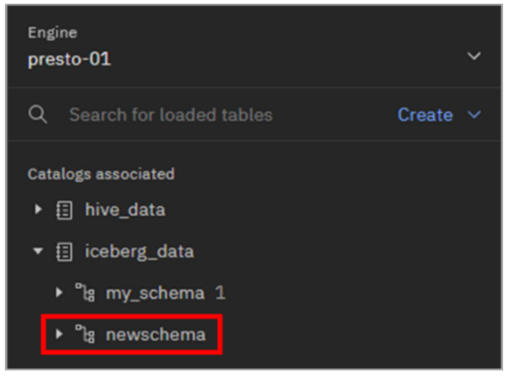
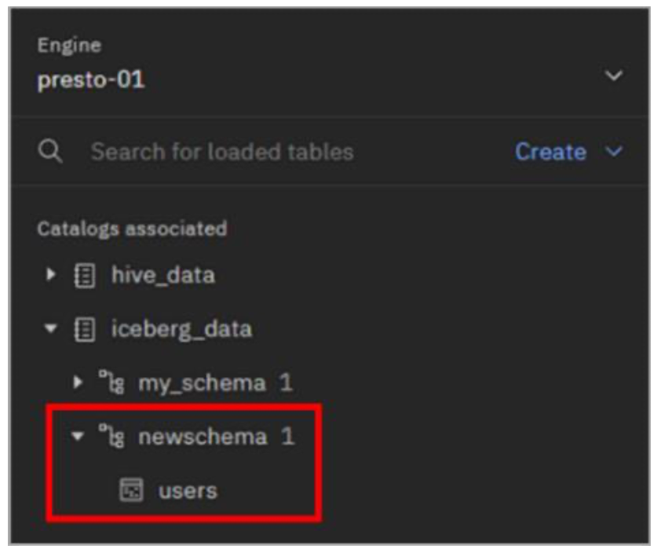
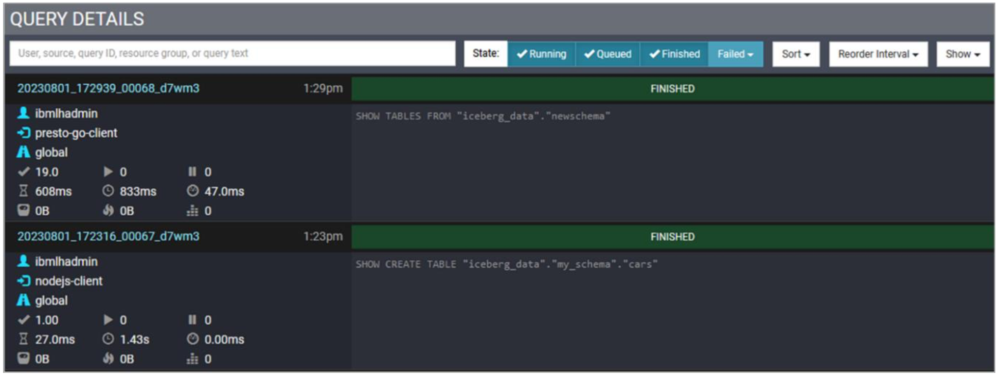

<QuizAlert text='Heads Up! Quiz material will be flagged like this!' />

# Working with Presto

In [Lab 02](/watsonx/watsonxdata/102), you have seen how Presto is integrated into watsonx.data and the watsonx.data user interface. However, you can also work directly with Presto.

For example, Presto includes a terminal-based interactive command line interface (CLI) that allows you to run SQL statements. Presto also has a web-based graphical user interface for getting information on query activity in the system.

## Presto Command Line Interface (CLI)

Presto CLI is a terminal-based interactive shell that can be used to run queries. You can connect to the Presto server either through Presto CLI installed as part of the ibm-lh-client package or through Presto CLI installed separately.

Presto CLI is pre-installed as part of watsonx.data Developer Edition. It is started by using the presto-cli command (located in /root/ibm-lh-dev/bin).

Presto uses a 3-part name to identify tables: catalog.schema.table. These identifiers can be enclosed in double quotes as needed (for example, "mycatalog"."myschema"."mytable"). Note that double quotes are needed if you’re using any special characters in a name, like a hyphen.


1. Open a terminal command window to the watsonx.data server as the root user.
  
  ```bash
   sudo su - 
   ```

2. Run the following two commands to open a Presto CLI interactive terminal.

  ```bash
  cd /root/ibm-lh-dev/bin
  ```

  ```bash
  ./presto-cli
  ```

3. Run the following command to list the catalogs that have been registered in Presto (Note: Presto requires that commands end with a semicolon.)

  ```bash
  show catalogs;
  ```

  The output should be similar to the text below.

  

4. Run the following query. It should return a count of 1,500 rows.

  ```bash
  select count(*) from tpch.tiny.customer;
  ```

  You can also tell Presto which schema you want to work with by using the USE command.

5. First, run the following command to see the schemas in the **tpch** catalog.

  ```bash
  show schemas in tpch;
  ```

  The output should be similar to the text below.

  

6. Run the following **USE** command to set the schema for the current session:

  ```bash
  use tpch.tiny;
  ```

7. Run the following query. Note how the catalog and schema aren’t required. Again, this should return a count of 1,500 rows.

  ```bash
  select count(*) from customer;
  ```

  Alternatively, you can provide the session catalog and schema (or just the catalog) when you start the Presto CLI. Note that even if you specify the catalog and schema when starting the Presto CLI or by running the **USE** command, you can still access tables in other schemas and catalogs. You just have to specify the full 3-part name for them (or USE the schema in question to change the default for the session).

8. Quit from the Presto CLI by running the following command.

  ```bash
  quit;
  ```

9. Start the Presto CLI again, but this time specify the session catalog and schema as command line options.

  ```bash
  ./presto-cli --catalog tpch --schema tiny
  ```

10. Run the following query. Note how this time the catalog and schema aren’t required. Again, this should return a count of 1,500 rows.

  ```bash
  select count(*) from customer;
  ```

11. Quit from the Presto CLI by running the following command.

  ```bash
  quit;
  ```

Next, you will create a new schema and table. When using Presto to create a schema in watsonx.data, you must specify the object storage bucket associated with the catalog.

12. Start the Presto CLI and specify that you intend to use the **iceberg_data** catalog.

  ```bash
  ./presto-cli --catalog iceberg_data
  ```

13. Run the following SQL statement to create a new schema in the catalog.

  ```bash
  create schema if not exists newschema with (location='s3a://iceberg-bucket/newschema');
  ```

14. Run the following command to see a list of the schemas in the catalog being used.

  ```bash
  show schemas;
  ```
  The **newschema** schema should be listed.

<QuizAlert text="Quiz material: pay attention to the script"/>

15. Run the following SQL statements to create a new table in this schema, populate the table with some data, and then query the table.

  ```bash
  create table newschema.users (id int, name varchar, age int);
  ```

  ```bash
  insert into newschema.users values (1, 'Robert', 54);
  ```

  ```bash
  insert into newschema.users values (2, 'Susan', 37);
  ```

  ```bash
  select * from newschema.users;
  ```

  The output of the final SELECT statement should look similar to what is shown below.

  

16. Run the following two commands to show the table in the new schema.

  ```bash
  use newschema;
  ```

  ```bash
  show tables;
  ```

  The output of the SHOW TABLES statement should look similar to what is shown below.

  

17. Quit from the Presto CLI by running the following command.

  ```bash
  quit;
  ```

18. Open the watsonx.data user interface in a browser window (if you don’t already have one open).

19. Select the **Data manager** icon from the left-side menu.

20. Expand the **iceberg_data** catalog to see the new schema you created (newschema).

  

  > **Note:** If you don’t see the schema listed then hover your mouse pointer over the far right of the line for the iceberg_data catalog until you see the Refresh icon appear. Click the Refresh icon. You should now see the schema listed as in the above image.

21. Expand the **newschema** schema to see the new table you created (users).

  

  The table you created through the Presto CLI is visible through the watsonx.data user interface. This is one of the benefits of having a shared metastore. In the future, any query engines that get associated with the iceberg_data catalog would also be able to work with this table.

## Presto Web Interface

Presto includes its own web interface (console) for monitoring and managing Presto queries. It’s a great place to get information about running queries and completed queries. This includes the query text, query state, the name of the user that ran the query, and the percentage complete if it’s still running.

Each query is assigned a unique Query ID and clicking on the ID brings up a Query Details page with additional information regarding the query.

1. From your computer, open the **Presto console** in your browser. The URL can be found in your **TechZone reservation details** (see the Presto console line in the Published services section)

  

You immediately start on the **Cluster Overview** page. The upper portion of the page includes various metrics regarding the environment.

The **Query Details** section at the bottom of the page lists queries matching the **State** filter being applied. By default, only actively running queries are shown and so you probably don’t see any queries listed here.
<QuizAlert text="Quiz material: pay attention to all options in the Query Details page"/>

2. Select the **Finished** button to include queries that have finished running.

  

  You should now see queries listed. You may recognize some as queries you ran, and others may have been run internally by the system.

  

3. Click the **Query ID** link for a query that looks interesting to you.

  

4. This opens a new browser window with the **Query Details** page for that specific query. There are multiple tabs, and you start in the **Overview** tab by default.

  

5. Scroll down the page to familiarize yourself with the information available.

6. Select the **Live Plan** tab at the top of the page.

  

  Here you can see the query’s execution plan and the various steps involved in running the query (your execution plan will look different as it depends on the query you chose). This output is similar to what you see in the visual explain output for watsonx.data.

7. Click the **Presto logo** in the top-left to return to the **Cluster Overview** page.  

  

8. When you’re done exploring the Presto console, close the browser window (and any other Presto console windows that are still open).

### Congratulations, you've reached the end of lab 103.

Click, [lab 104](/watsonx/watsonxdata/104) to start next lab.
