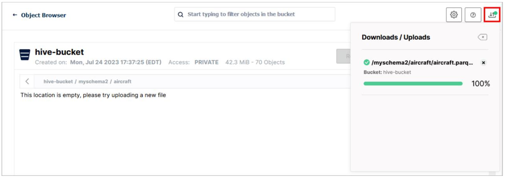

## Data Ingest

Data ingestion is the process of importing and loading data into watsonx.data. Multiple methods are available to ingest data into watsonx.data, including:

  • The Create table from file option on the **Data manager** page

  • The standalone, non-Developer Edition of watsonx.data includes an Ingestion jobs tab on the Data manager page, where data can be read from a source object storage bucket and ingested into a table. However, as this lab uses the Developer Edition, it is not available to use here.

  • Installation of the ibm-lh command line tool and using commands to create a job to ingest files from S3-compatible object storage or a local file system.

  • Loading the data file(s) for a table into an object storage bucket (if they don’t already reside in object storage), registering the bucket with watsonx.data, and creating a table on top of the file(s) using SQL.


In this section you will use the MinIO console to upload a Parquet data file into object storage and then you will create a table on it using SQL in Presto.

1. Download the **aircraft.parquet** file from [here](https://ibm.box.com/v/ontime-aircraft-id).

2. If you don’t already have the **MinIO** console open, open it in a new browser window. Use the credentials (**access key** and **secret key**) you made note of earlier.

Because you are uploading a data file that is not “wrapped” in the Iceberg table format, it needs to use a Hive catalog. You will use the existing hive_data catalog which is associated with the hive-bucket bucket.

3. Click the row for the hive-bucket bucket.

  

4. In the **hive-bucket** panel, click the **Create new path** button.

  

5. In the **Choose or create a new path** pop-up window, enter **myschema2/aircraft** for the **New Folder Path**. Then, click the **Create** button.

  

  This is going to create nested folders under the current bucket. The top-level folder (**myschema2**) should match the name of the schema you are going to create later, and the next folder down (**aircraft**) should match the name of the table you are going to create later.

6. You are instructed to upload a file. Click the **Upload** button in the upper-right and then click **Upload File**. 

  

  > **Note:** You are also given the option of uploading a folder. If you already have a set of files in folders organized by schema and table, you could upload the entire folder (in which case you wouldn’t have to create a new path for the table as you did above, as the path is already reflected in the folder being uploaded).

7. Locate, select, and upload the **aircraft.parquet** file you downloaded earlier.

8. Click the Downloads/Uploads icon to close the Downloads/Uploads panel.

  

9. If the folder appears empty, click the Refresh button in the upper-right. If the folder is still showing as empty, navigate up one level to the parent folder (**myschema2**) and then navigate back down to this folder (**aircraft**). If this still doesn’t work, refresh the browser window.

  

  The file should now be listed, as in the image below.

  

10. Close the MinIO console browser window as you no longer need to use it.

  You will now create a schema and a table to match the file that you uploaded. You will use the Presto CLI, but alternatively you could also use the Query workspace page in the watsonx.data web interface.

11. Open a terminal command window to the watsonx.data server as the **root** user.

12. Run the following command to open a Presto CLI interactive terminal.

  ```bash
    /root/ibm-lh-dev/bin/presto-cli
  ```
13. Run the following SQL statement to create the **myschema2** schema (based on the catalog/bucket being used and the schema folder name you specified when uploading the file to object storage earlier; the schema name doesn’t have to match, but it’s easier to manage this way).

  ```bash
    create schema hive_data.myschema2 with (location = 's3a://hive-bucket/myschema2');
  ```

14. Run the following SQL statement to create the **aircraft** table.

  ```bash
    create table hive_data.myschema2.aircraft (tail_number varchar, manufacturer varchar, model varchar) with (format = 'Parquet', external_location='s3a://hive-bucket/myschema2/aircraft');
  ```

15. Validate that the aircraft table has been created correctly by querying the number of rows in it.

  ```bash
    select count(*) from hive_data.myschema2.aircraft;
  ```
  
  There should be 13,101 rows returned. Your table just read the data out of the file you uploaded into object storage!

16. Quit from the Presto CLI by running the following command.

  ```bash
    quit;
  ```

17. Open the watsonx.data user interface in a browser window (if you don’t already have it open).

18. Select the **Data manager** icon from the left-side menu.

19. Expand the **hive_data catalog** to see the new schema you created (**myschema2**).

  

> **Note:** If you don’t see the schema listed then hover your mouse pointer over the far right of the line for the hive_data catalog until you see the Refresh icon appear. Click the Refresh icon. You should now see the schema listed as in the above image.

  


20. Expand the **myschema2** schema to see the new table you created (**aircraft**).

  


  The table you just created through the Presto CLI – which is based on a data file you uploaded into object storage – is visible through the watsonx.data user interface. This is one of the benefits of having a shared metastore. In the future, any query engines that get associated with the hive_data catalog would also be able to work with this table.

### Congratulations, you've reached the end of lab 105.

Click, [lab 106](/watsonx/watsonxdata/106) to start next lab.
