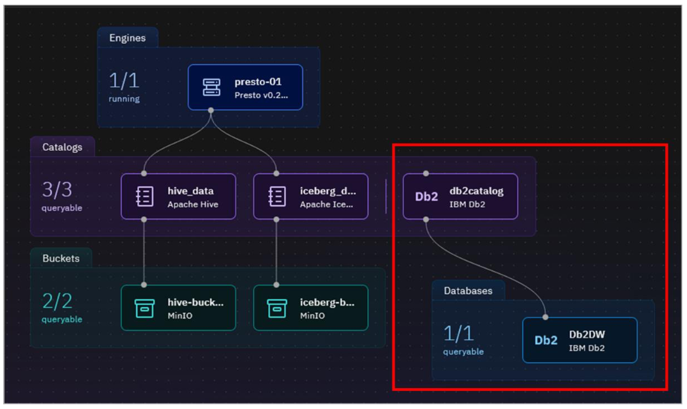
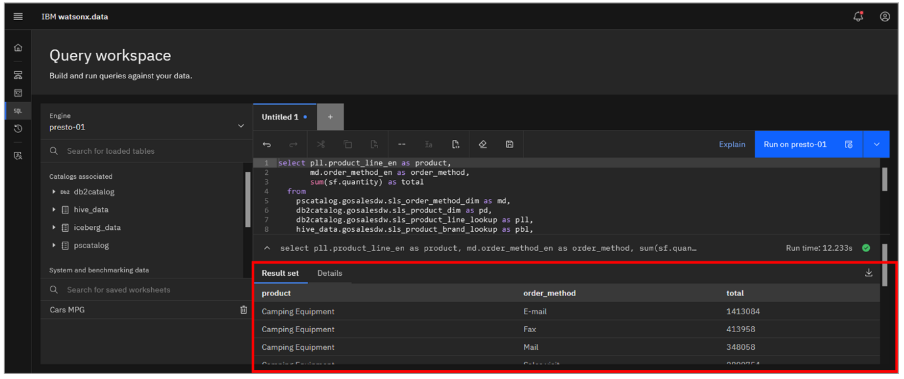
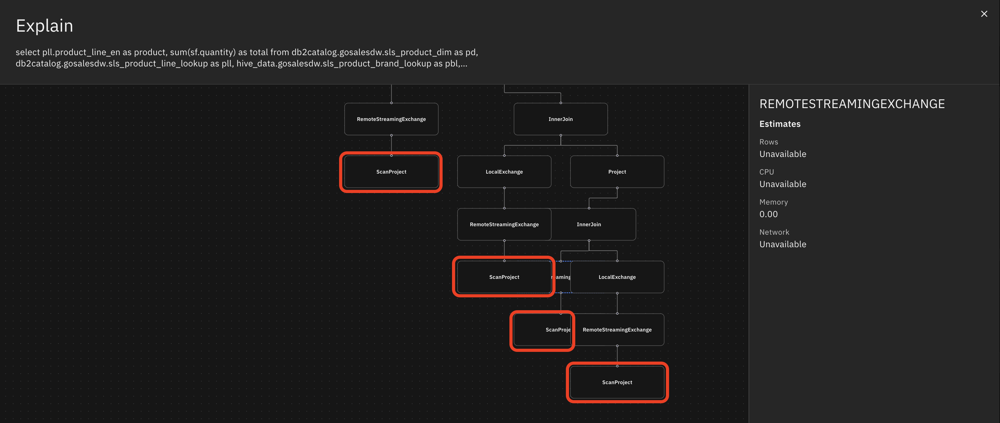

<QuizAlert text="Heads Up! Quiz material will be flagged like this!" />

## Consultas federadas

A diferencia de los sistemas de base de datos tradicionales, Presto no tiene su propio almacenamiento de base de datos nativo. En su lugar, Presto da soporte a la separación de cálculo y almacenamiento, con docenas de conectores que permiten a Presto acceder a los datos donde vive, lo que podría ser en bases de datos relacionales, bases de datos NoSQL, almacenes de datos, lagos de datos, casas de datos y más.

Aunque Presto da soporte a una amplia gama de conectores, watsonx.data oficialmente sólo da soporte a un subconjunto de ellos. Esto se debe a que IBM desea garantizar la calidad, el rendimiento y la seguridad de los conectores antes de añadir soporte (lo que puede requerir que se actualice el código fuente del conector para hacerlo). Se añadirán más conectores a lo largo del tiempo.

Se puede encontrar la lista de conectores más actual y los tipos de sentencias SQL soportadas [aquí ](https://www.ibm.com/docs/en/watsonxdata/1.0.x?topic=watsonxdata-supported-sql-statements). La lista de conectores soportados crecerá con el tiempo.

En esta sección combinará datos del almacenamiento de objetos de watsonx.data con datos en bases de datos Db2 y PostgreSQL. Para evitar que tenga que suministrar estas bases de datos usted mismo, se han instalado en la misma VM que watsonx.data y se han rellenado previamente con datos.

> **Nota: **: La contraseña del servidor de Db2 incorporado ha caducado en octubre de 2023. Antes de continuar con las instrucciones de esta sección, abra una ventana de mandatos de terminal y ejecute los mandatos siguientes para solucionar el problema de contraseña.

```bash
ssh -p <port#> watsonx@<hostname>
```

Cuando se le solicite la contraseña, especifique watsonx.data (no verá la contraseña tal como la escribe).

```bash
sudo su -
```

```bash
docker exec db2server chage -I -1 -m 0 -M 99999 -E -1 db2inst1
```

Con el problema de contraseña fijado, continúe con los pasos siguientes.

1.  Seleccione la opción **Administrador de infraestructuras **del menú del lado izquierdo.
2.  Haga clic en **Añadir componente **menú desplegable en la parte derecha de la pantalla. Seleccione **Cómo agregar una **.

<QuizAlert text="Quiz material: pay attention to the Add components menu" />


3.  En el **Adición de base **ventana emergente, seleccionar/entrar las siguientes partes de información en el **1. Definición base de datos **Sección:

*   **Base de datos **: IBM Db2
*   **Nombre de base **: GOSALES
*   **Nombre de visualización **: db2DW
*   **Nombrehost **: 192.168.252.2
*   **Puerto **: 50000
*   **Nombre **: db2inst1
*   **Contraseña **: db2inst1
*   **Conexión SSL **: ***Descontrol***


Cuando se añade un nuevo grupo o base de datos a watsonx.data, también se crea un nuevo catálogo.

4.  Desplácese hasta la sección **2. Definición de catálogo asociada **. Entrar **db2catalog **para la **Nombre del catálogo **. A continuación, pulse **Añadir **.


El **Db2DW **base de datos **db2catalog **se han añadido a watsonx.data y ahora se reflejan en la vista de topología de los componentes de infraestructura.



El **db2catalog **el catálogo se asocia automáticamente con el **Db2DW **de base de datos, pero para poder consultar datos de esta base de datos, **db2catalog **el catálogo también debe estar asociado con el **presto-01 **motor.

5.  Pase el puntero del ratón sobre el **db2catalog **teja de catálogo y la **Gestionar asociaciones **aparecerá el icono. Haga clic en **Gestionar asociaciones **icon.


6.  En el **Gestionar asociaciones **ventana emergente, seleccione el recuadro de selección para el **presto-01 **motor y luego haga clic en **Motor de salvar y reiniciar **.


Una línea ahora se conecta **presto-01 **con **db2catalog **, indicando que están asociados.


A continuación añadirá la base de datos PostgreSQL. La contraseña de la cuenta de administración de PostgreSQL es específica de su entorno y los pasos siguientes lo extraerán para usted.

7.  Abra una ventana de mandatos de terminal en el servidor watsonx.data como usuario root.
8.  El usuario administrativo de la base de datos PostgreSQL es **admin **. Ejecute el mandato siguiente para extraer y visualizar el **contraseña **. Copie el valor mostrado en una ubicación a la que puede hacer referencia más adelante.

```bash
docker exec ibm-lh-postgres printenv | grep POSTGRES_PASSWORD | sed 's/.*=//'
```

9.  Repita los pasos 2-6 desde arriba para añadir la base de datos PostgreSQL a watsonx.data. Utilice la siguiente información:

*   **Base de datos **: PostgreSQL (se puede encontrar en Otras bases de datos)
*   **Nombre de base **: gosales
*   **Nombre de visualización **: PostgreSQLLDB
*   **Nombrehost **: 192.168.252.2
*   **Puerto **: 5432
*   **Nombre **: admin
*   **Contraseña **: ***La contraseña generada en el paso anterior***
*   **Nombre del catálogo **: pgcatalog

Con las bases de datos Db2 y PostgreSQL añadidas, la topología debe tener un aspecto similar a la imagen siguiente.


10. Seleccione la opción **Gestor de datos **del menú del lado izquierdo.
11. Expanda los catálogos db2catalog y pgcatalog.


> **NOTA: **: Si obtiene un error 'db2inst1 password caducado' al intentar conmutar el 'db2catalog' y la información de esquema y tabla no aparece, los pasos siguientes le ayudarán a remediarlo:
>
> 1.  Vuelva a la página Gestor de infraestructura y desconecte el inicio de db2catalog
> 2.  Pase el ratón por encima del mosaico db2catalog y pulse el icono de trashcan para eliminarlo.
> 3.  SSH en la instancia de watsonx en la línea de mandatos y cambie al usuario root. ( `sudo su -`)
> 4.  Ejecute el siguiente mandato Docker para ampliar la caducidad de la contraseña: `docker exec db2server chage -I -1 -m 0 -M 99999 -E -1 db2inst1`
> 5.  Vuelva y siga los pasos 2-6 para volver a añadir la base de datos db2.

Se muestran información de esquema y de tabla para ambas bases de datos. Ambos incluyen un idéntico **gosalesdw **esquema con tablas que contienen datos de ventas para la empresa ficticia Great Outdoors. Recuerde que también hay una copia de estos mismos datos en el almacenamiento de objetos, gestionado por **hive\_data **catálogo.

Si no ve ninguna tabla asociada con el **gosalesdw **en cualquiera de los catálogos, puede renovar el esquema.


> **Nota: **Si por alguna razón la lista de tablas no se renueva, o si ve un mensaje aparecer en la esquina superior derecha diciendo ***"Se ha producido un error al cargar las tablas en Gosalesdw" ***, similar a la siguiente imagen, todavía puede continuar. La información de la tabla está en el catálogo y las consultas que hacen referencia a estas tablas seguirán funcionando. Por favor, continúe con el resto del laboratorio.


Ahora tiene copias de las tablas de ventas de la empresa Great Outdoors en el almacenamiento de objetos (hive\_data), Db2 (db2catalog) y PostgreSQL (pgcatalog). Esto no es algo que usted tendría en un escenario del mundo real (después de todo, el beneficio de poder federar el acceso a múltiples fuentes de datos es evitar la duplicación de datos). Sin embargo, se está haciendo aquí con el propósito de resaltar las capacidades de la federación de Presto.

Ahora verá cómo puede ejecutar una consulta federada que combine datos de las tres fuentes de datos.

12. Seleccione la opción **Espacio de trabajo **del menú del lado izquierdo.
13. Copie y pegue la consulta siguiente en el **Hoja de trabajo **Haga clic en **Ejecutar en presto-01 **.

Esta consulta de ejemplo podría ser utilizada por la empresa ficticia para determinar qué método de compra está asociado a los pedidos más grandes. La consulta accede a cinco tablas, una de las cuales está en PostgreSQL, dos en Db2 y dos en el almacenamiento de objetos de watsonx.data.

```bash
select  pll.product_line_en as product, md.order_method_en as order_method, sum(sf.quantity) as total 
  from 
    pgcatalog.gosalesdw.sls_order_method_dim as md, 
    db2catalog.gosalesdw.sls_product_dim as pd, 
    db2catalog.gosalesdw.sls_product_line_lookup as pll,
    hive_data.gosalesdw.sls_product_brand_lookup as pbl,
    hive_data.gosalesdw.sls_sales_fact as sf 
  where
    pd.product_key = sf.product_key
    and md.order_method_key = sf.order_method_key
    and pll.product_line_code = pd.product_line_code 
    and pbl.product_brand_code = pd.product_brand_code
  group by pll.product_line_en, md.order_method_en 
  order by product, order_method;
```

> **Nota: **Si la sentencia SQL se pega en la hoja de trabajo como una sola línea, puede formatearla correctamente pulsando el botón **Hoja de trabajo **icon.


El **Conjunto de resultados **para la consulta se encuentra en la parte inferior de la pantalla.



14. Haga clic en **Explicar **en la barra de menús de la hoja de trabajo.


La salida de la explicación visual para esta consulta se ve mucho más interesante que la mostrada anteriormente. Si se desplaza a través de la salida de la explicación visual, verá cinco **ScanProject **nodos hoja en el árbol. Estos corresponden a las cinco tablas que se están leyendo.



15. Haga clic en **X **en la esquina superior derecha de la **Explicar **para cerrarla.

**Paso opcional: **Aquí hay otras dos consultas que puede intentar ejecutar también, que combinan datos de los mismos tres orígenes de datos.

1.  La siguiente consulta muestra a todos los empleados canadienses y mexicanos, junto con su región y su país. Es el tipo de consulta que puede generar una herramienta de creación de informes, basada en la entrada del usuario.

```bash
select distinct branch_region_dim.region_en region, 
  branch_region_dim.country_en country,
  emp_employee_dim.employee_name employee 
from 
  hive_data.gosalesdw.go_region_dim branch_region_dim,
  pgcatalog.gosalesdw.emp_employee_dim emp_employee_dim,
  db2catalog.gosalesdw.go_branch_dim go_branch_dim
where 
  branch_region_dim.country_en in ('Canada', 'Mexico') and
  branch_region_dim.country_code = go_branch_dim.country_code and
  emp_employee_dim.branch_code = go_branch_dim.branch_code 
order by region, country, employee;
```

2.  En muchos negocios, los departamentos (u organizaciones, como se les llama en este conjunto de datos) son jerárquicos, en que un departamento cae bajo otro departamento, que a su vez cae bajo otro. Esta consulta muestra los dos departamentos padre para un conjunto determinado de departamentos. Como en la consulta anterior, es el tipo de consulta que puede generar una herramienta de creación de informes.

```bash
select gosalesdw.go_org_dim.organization_key, 
  go_org_dim_1.organization_parent as org_level1_code, 
  go_org_name_lookup_1.organization_name_en as org_level1_name, 
  gosalesdw.go_org_dim.organization_parent as org_level2_code, 
  go_org_name_lookup_2.organization_name_en as org_level2_name, 
  gosalesdw.go_org_dim.organization_code as org_code, 
  gosalesdw.go_org_name_lookup.organization_name_en as org_name
from  pgcatalog.gosalesdw.go_org_name_lookup  go_org_name_lookup_2 
        inner join
      hive_data.gosalesdw.go_org_dim 
        inner join
      pgcatalog.gosalesdw.go_org_name_lookup
        on hive_data.gosalesdw.go_org_dim.organization_code = pgcatalog.gosalesdw.go_org_name_lookup.organization_code
        on go_org_name_lookup_2.organization_code = hive_data.gosalesdw.go_org_dim.organization_parent
        inner join
      pgcatalog.gosalesdw.go_org_name_lookup go_org_name_lookup_1
        inner join 
      hive_data.gosalesdw.go_org_dim go_org_dim_1
        on go_org_name_lookup_1.organization_code = go_org_dim_1.organization_parent
        on hive_data.gosalesdw.go_org_dim.organization_parent = go_org_dim_1.organization_code
where (hive_data.gosalesdw.go_org_dim.organization_code between '1700' and '5730')
order by org_code;
```

> **Nota: **Intente ejecutar las dos consultas anteriores desde la CLI de Presto también. Debe obtener los mismos resultados en la CLI de Presto como lo hizo en el espacio de trabajo Consulta.

### Felicidades, has llegado al final del laboratorio 106.

Haga clic en [laboratorio 107 ](/watsonx/watsonxdata/107)para iniciar el siguiente laboratorio.
