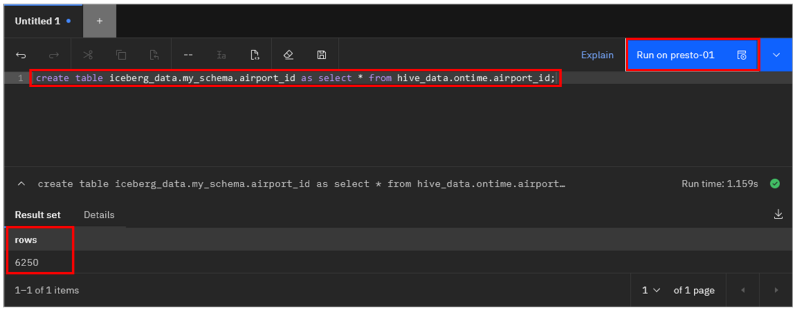
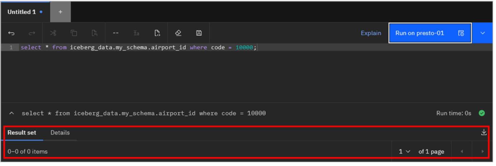

## Tiempo de viaje y retrotracción

El formato de tabla abierta de Iceberg proporciona una serie de ventajas a los usuarios, incluida la capacidad de ver una tabla tal como existía en un punto del pasado. Esta capacidad de viaje en el tiempo es útil en una serie de maneras diferentes. Por ejemplo, tener la capacidad de consultar datos históricos es útil para fines de auditoría. O si una aplicación corrompe los datos de la tabla de alguna manera, puede imaginar el valor en poder revertir rápidamente esos cambios al restablecer la tabla a un buen estado conocido.

Iceberg utiliza instantáneas para dar soporte a esta capacidad de viaje en el tiempo. Una instantánea representa el estado de una tabla en algún momento. Cuando los datos se modifican en una tabla, como la inserción, actualización o supresión de registros, se crea una nueva instantánea. Hay operaciones de mantenimiento que se pueden utilizar para limpiar las instantáneas más antiguas que ya no son necesarias.

A partir del 3Q 2023, las consultas de viajes en el tiempo aún no están soportadas en watsonx.data. Sin embargo, puede retrotraer una tabla a un punto anterior en el tiempo utilizando instantáneas. Usted pasará por ese proceso en esta sección.

1.  Seleccione la opción **Espacio de trabajo **del menú del lado izquierdo.
2.  Copie y pegue la siguiente sentencia de SQL en la **Hoja de trabajo **Haga clic en **Ejecutar en presto-01 **.

```bash
  create table iceberg_data.my_schema.airport_id as select * from hive_data.ontime.airport_id;
```



Tal como se muestra en la salida anterior después de ejecutar la consulta, hay 6.250 filas en esta tabla.

3.  Seleccione la opción **Gestor de datos **del menú del lado izquierdo.

4.  Vaya a la **Datos de icebert\_data **> **mi\_esquema **> **id\_puerto **(si no ve la tabla, renueve el esquema). A continuación, seleccione el **Viajes en tiempo **.

    

Esta pestaña lista las instantáneas asociadas con la tabla (identificada por un **ID de instantánea **). En este punto solo hay una instantánea y hay 6.250 registros totales (igualando lo que viste antes).

> **Nota: **Como referencia, también puede obtener información de instantánea a través de SQL. Por ejemplo (y no es necesario ejecutar esto ahora), esto consultará las instantáneas disponibles para la tabla airport\_id:

```bash
  select * from iceberg_data.my_schema."airport_id$snapshots" order by committed_at;
```

5.  Seleccione la opción **Espacio de trabajo **de nuevo del menú del lado izquierdo.
6.  Copie y pegue la siguiente sentencia de SQL en la **Hoja de trabajo **y pulse *Ejecutar en presto-01 *.

```bash
  insert into iceberg_data.my_schema.airport_id values (10000, 'North Pole: Reindeer Field');
```

7.  Copie y pegue (sustituyendo el SQL que ya existe) la siguiente sentencia de SQL en la **Hoja de trabajo **y pulse **Ejecutar en presto-01 **.

```bash
  select * from iceberg_data.my_schema.airport_id where code = 10000;
```

Debe ver la fila que ha insertado en el paso anterior.


8.  Copie y pegue (sustituyendo el SQL que ya existe) la siguiente sentencia de SQL en la **Hoja de trabajo **y pulse **Ejecutar en presto-01 **.

```bash
  select count(*) from iceberg_data.my_schema.airport_id;
```

Debe ver un recuento de 6.251 filas.

9.  Seleccione la opción **Gestor de datos **de nuevo del menú del lado izquierdo.

10. Como antes, vaya a la **Datos de icebert\_data **> **mi\_esquema **> **id\_puerto **. A continuación, seleccione el **Viajes en tiempo **.

    

Tenga en cuenta cómo hay ahora dos instantáneas mostradas. Si no ve una segunda instantánea, renueve el navegador y repita este paso.

La segunda instantánea muestra que hay 6.251 filas totales, con una fila que se ha añadido en esta nueva versión de la tabla.

Ahora va a retrotraer la tabla a la primera instantánea, que representa el estado inicial de la tabla. Esta versión de la tabla no tiene la fila que ha añadido.

11. Haga clic en **menú de desbordamiento **icono (elipses verticales) al final de la fila para la instantánea original (la primera instantánea mostrada, con la anterior **Confirmado a la hora **y **6250 Registros añadidos **). Pulse en **Retrotracción **.

    

12. En el **Confirmar retrotracción **ventana emergente, pulse **Retrotracción **.

    

> **Nota: **Para obtener una referencia, la siguiente sentencia SQL realizará la operación de retrotracción equivalente (NO RUN ESTE AHORA):

```bash
  call iceberg_data.system.rollback_to_snapshot ('my_schema', 'airport_id', <snapshotID>);
```

13. Seleccione la opción **Espacio de trabajo **de nuevo del menú del lado izquierdo.
14. Copie y pegue la siguiente sentencia de SQL en la **Hoja de trabajo **y pulse **Ejecutar en presto-01 **.

```bash
  select * from iceberg_data.my_schema.airport_id where code = 10000;
```

La fila que ha añadido antes se ha ido.



15. Copie y pegue (sustituyendo el SQL que ya existe) la siguiente sentencia de SQL en la **Hoja de trabajo **y pulse **Ejecutar en presto-01 **.

```bash
  select count(*) from iceberg_data.my_schema.airport_id;
```


Debe ver un recuento de 6.250 filas, que coincide con el recuento original cuando creó la tabla por primera vez. La tabla está de vuelta en el estado en el que estaba cuando se creó por primera vez!

### Felicidades, has llegado al final del laboratorio 108.

Esto concluye el laboratorio L3. Se pueden encontrar más recursos de watsonx.data, incluyendo más módulos de demostración en el ["Kit de ventas de IBM watsonx.data" Página sísmica ](https://ibm.seismic.com/Link/Content/DCbbPfP64CX3RG4CJPH7bH8XjGBP).

Usted puede ahora [completar el cuestionario ](https://learn.ibm.com/course/view.php?id=13178)para IBM watsonx.data for Technical Sales Level 3 Quiz
