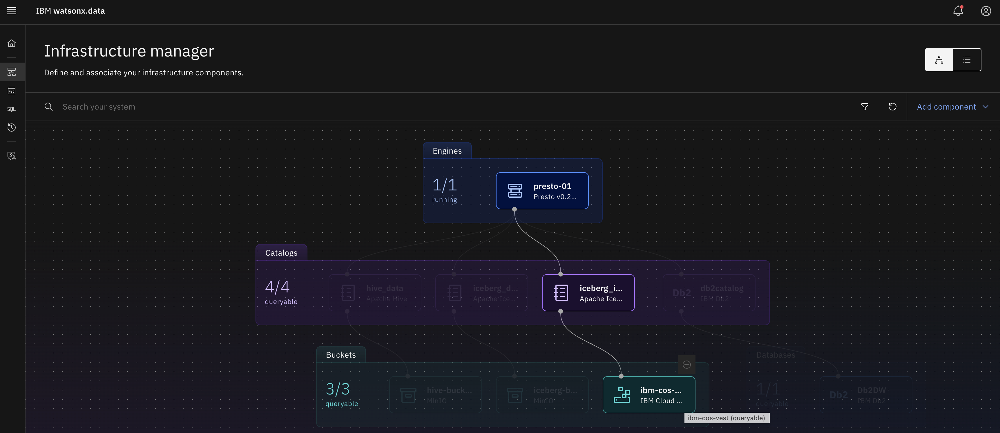

# Trabajar con IBM Cloud COS

El entorno watsonx.data de TechZone viene preconfigurado con el motor de presto, el iceberg y el catálogo de colmena asociado con el almacenamiento de objetos MinIO. En este laboratorio, va a registrar IBM Cloud Object Storage (COS) en watsonx.data.

## Registrar IBM Cloud Object Storage

1.  Seleccione la opción **Administrador de infraestructuras** del menú del lado izquierdo.
2.  Haga clic en **Añadir componente** menú desplegable en la parte derecha de la pantalla. Seleccione **Añadir cubo**.
3.  En el **Añadir cubo** ventana emergente, seleccionar/introducir las siguientes partes de la información

> **Nota:** Si tiene una cuenta de IBM Cloud, puede crear su propio grupo y utilizarlo en este laboratorio. Puede utilizar el siguiente grupo, pero asegúrese de que prefijo el esquema con sus iniciales.

Sección de definición de cubo

- **Bucket type**: IBM Cloud Object Storage
- **Bucket name**: ***from slack***
- **Display name**: ibm-cos-vest
- **Endpoint**: ***from slack***
- **Access key**: ****\*\*****
- **Secret key**: ****\*\*****
- **Activation**: **_Activar ahora_**

Definición de catálogo asociada

- **Tipo de catálogo**: Apache Iceberg

- **Nombre del catálogo**: iceberg_ibm_cos ( **_prefijo de su inicial_**)

  

  El **Ibm-cos-vest** bucket y **iceberg_ibm_cos** se han añadido a watsonx.data y ahora se reflejan en la vista de topología de los componentes de infraestructura.

4.  El **iceberg_ibm_cos** el catálogo se asocia automáticamente con el **ibm-cos-vest bucket**, pero para poder consultar datos de este grupo, el **iceberg_ibm_cos** el catálogo también debe estar asociado con el **presto-01** motor.

5.  Pase el puntero del ratón sobre el **iceberg_ibm_cos** teja de catálogo y la **Gestionar asociaciones** aparecerá el icono. Haga clic en **Gestionar asociaciones** icon.

6.  En el **Gestionar asociaciones** ventana emergente, seleccione el recuadro de selección para el **presto-01** motor y luego haga clic en **Motor de salvar y reiniciar**.

    Una línea ahora se conecta **presto-01** con **iceberg_ibm_cos**, indicando que están asociados.



## Descarga de datos de un depósito de datos a un grupo asociado

En este caso de ejemplo, usted va a "mover" el **sls_product_line_lookup** de Db2 a IBM COS de watsonx.data. Se creará como una tabla Iceberg, en un esquema nuevo que creará llamado **wxgosalesdw_ibm**, gestionado por el **iceberg_ibm_cos** catálogo.

1.  Seleccione la opción **Gestor de datos** del menú del lado izquierdo.

2.  Vaya a la parte superior del panel de navegación y pulse el botón **Crear** menú desplegable. Seleccione **Crear esquema**.

3.  En el **Crear esquema** ventana emergente, seleccionar/introduzca la siguiente información y, a continuación, haga clic en **Crear**:

    - **Catálogo**: iceberg_ibm_cos
    - **Nombre**: wxgosalesdw_ibm (**_añadir sus iniciales como prefijo_**)

4.  Expanda el archivo **iceberg_ibm_cos** catálogo. Se debe listar el nuevo esquema.

5.  Seleccione la opción **Espacio de trabajo** del menú del lado izquierdo.

6.  Copie y pegue el siguiente SQL en el **Hoja de trabajo** Haga clic en **Ejecutar en presto-01**.

Esto creará una tabla llamada **sls_product_line_lookup** En **iceberg_ibm_cos.wxgosalesdw_ibm** (_y sus iniciales como prefijo_)

```bash
create table iceberg_ibm_cos.wxgosalesdw_ibm.sls_product_line_lookup as select * from db2catalog.GOSALESDW.SLS_PRODUCT_LINE_LOOKUP;
```


7.  Como prueba, puede ejecutar una consulta federada que combine la nueva tabla en IBM COS con las tablas existentes en el catálogo MinIO y Db2.

```bash
select pll.product_line_en as product, sum(sf.quantity) as total
from
  db2catalog.GOSALESDW.SLS_PRODUCT_DIM as pd,
  iceberg_ibm_cos.wxgosalesdw_ibm.sls_product_line_lookup as pll,
  iceberg_data.wxgosalesdw.sls_sales_fact as sf
where
  pd.product_key = sf.product_key
  and pll.product_line_code = pd.product_line_code
group by pll.product_line_en
order by product;
```


8.  Inicie sesión en IBM Cloud y explore los datos almacenados en el grupo.


### Felicidades, has completado L3+ lab 109.
