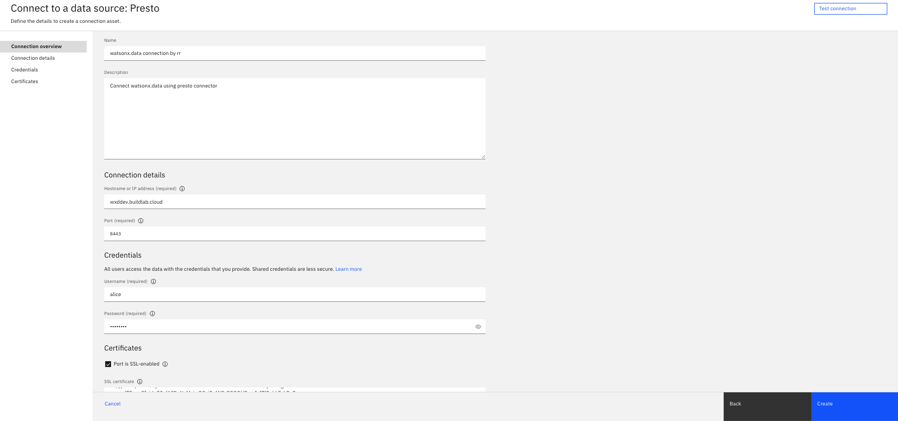
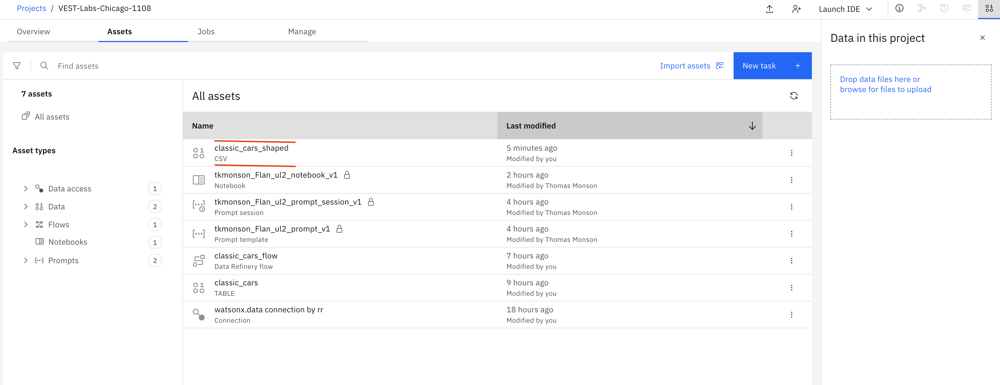

# Visualización de watsonx.data desde watsonx.ai

En este laboratorio, descargaremos algunos de los datos del almacén de datos DB2 al lago de bajo coste watsonx.data. A continuación, el equipo de ciencia de datos puede utilizar los datos en la plataforma watsonx.ai para visualizar y refinar los datos.

## Explorar las configuraciones de watsonx.data(Instructor-led)

Como has visto en la sección anterior, ya me he conectado al almacén de datos DB2 que ha sido descargado a watsonx.data lakehouse. Este almacén contiene un conjunto de datos de coches clásicos, voy a mostrar cómo un científico de datos puede llevar el conjunto de datos de coches a watsonx.ai y mirar los datos y hacer alguna visualización con ellos.

1.  He instalado y configurado un watsonx.data independiente en una instancia de servidor virtual de IBM Cloud.

2.  Inicie sesión en la instancia watsonx.data [https://wxddev.buildlab.cloud:9443/](https://wxddev.buildlab.cloud:9443/) utilizando las siguientes credenciales

    *   usuario: ibmlhadmin
    *   contraseña: *de slack*

3.  Haga clic en el icono **Administrador de infraestructuras** para ver el componente Almacén de datos DB2.

4.  Haga clic en el icono **Gestor de datos** y expanda el catálogo **db2wh** para ver todos los esquemas. Puede expandir el esquema **qnf97304** para navegar a la tabla **classic\_cars**.

5.  La tabla **classic\_cars** se ha descargado en watsonx.data. Expandir **iceberg\_data -> dsteam -> classic**\_cars

6.  En términos de control de acceso, he creado un usuario llamado **alice**, y proporcionado el rol de **usuario** al motor **presto-01**. También se ha añadido una política de acceso para proporcionar acceso a alice sólo al esquema **dsteam**.
7.  Haga clic en el icono **Control** de acceso de la barra de navegación de la izquierda, en **presto-01** y, a continuación, en la pestaña **Control de** acceso.

8.  Haga clic en la **X** para cerrar la ventana y haga clic en la pestaña **Políticas** para comprobar la política **dsteam**. Haga clic en **dsteam**.

9.  He dado acceso de rol de usuario a **alice** y restringido el uso de políticas para proporcionar acceso sólo a **dsteam** esquema en **iceberg\_data** catálogo. También he proporcionado acceso a algunos otros componentes.

## Conectar watsonx.data desde watsonx.ai

Ahora conectarás el conjunto de datos en esta instancia watsonx.data al proyecto watsonx.ai que has utilizado para completar los laboratorios watsonx.ai. Navega a tu proyecto watsonx.ai que has utilizado durante los laboratorios watsonx.ai.

> NOTA: Si está completando este laboratorio en un entorno de taller/aula de IBM, la instancia de watsonx.ai se compartirá entre todos los estudiantes. Deberá haber sido invitado a una cuenta en la nube de IBM y añadido a un proyecto watsonx.ai con el formato de nombre `VEST-Labs-{Location}-{MMDD}` donde *Location* es la ubicación y *MMDD* indica el mes y el día de su taller.

1.  Siga watsonx.ai [100: Requisitos previos y preguntas frecuentes](/watsonx/watsonxai/100) para iniciar sesión en su proyecto watsonx.ai.
2.  Haga clic en el icono de la hamburguesa en la parte superior izquierda para ampliar el menú de la izquierda y haga clic en **Ver todos los proyectos**.

3.  Seleccione el proyecto que utilizó para completar sus laboratorios watsonx.ai y haga clic en la pestaña **Activos**.

4.  Te conectarás a la instancia watsonx.data desde el proyecto watsonx.ai. Haz clic en el botón **Nueva tarea** de la parte superior derecha y selecciona **Conectar a una fuente de** datos.

5.  Con la versión actual de watsonx, utilizará el conector **Presto** para conectarse a los datos de watsonx.data. Seleccione **Presto** y, a continuación, haga clic en el botón **Seleccionar**.

6.  Rellene los datos de conexión:

> NOTA: Dado que se trata de un entorno compartido, utilice un uniqueid para la conexión, utilice su uniqueid como parte del campo de nombre

*   **Nombre:** `{uniqueid} watsonx.data connection`
*   **Descripción:** Conectar watsonx.data usando el conector presto
*   **Nombre de host o dirección IP:** wxddev.buildlab.cloud
*   **Puerto:** 8443
*   **Nombre de usuario:** alice
*   **Contraseña:** *compartido en slack*
*   **El puerto está habilitado para SSL:** Comprobado
*   **Certificado SSL:** *compartido en slack*

7.  Después de rellenar todos los datos correctamente, puede probar la conexión antes de guardarla. Haga clic en **Probar conexión**. Si ve **La prueba se ha** realizado correctamente. Haga clic en **Crear** para guardar la información de la conexión.

8.  Verá la conexión guardada con el nombre **watsonx.data connection** en la pestaña **Assets**

## Visualización de datos

Hemos establecido una conexión desde watsonx.ai sobre watsonx.data. Ahora el siguiente paso es llevar la tabla de watsonx.data a watsonx.ai.

1.  En la pestaña Activos del proyecto watsonx.ai seleccionado, haga clic en **Importar activos**. Seleccione la conexión que ha creado **watsonx**.data connection. Puede seguir la selección para seleccionar la tabla en la etapa final. **watsonx.data connection -> iceberg\_data -> dsteam -> classic\_cars**. Seleccione el botón **Importar**. Usted notará nuevo activo creado con el nombre de la tabla **classic\_cars**

2.  Observará que los catálogos **db2wh** no son visibles en la pantalla porque **alice** no ha recibido acceso al catálogo **db2wh**.
3.  Haga clic en **classic\_cars** para previsualizar los datos. Observará un valor de 0 mpg en algunas de las filas de la tabla. Mi objetivo es preparar los datos eliminando los coches con 0 mpg para que los datos refinados puedan ser compartidos con los usuarios de negocio. Vamos a la refinería de datos haciendo clic en el botón Preparar **datos** de la parte superior derecha.

4.  En la página de **refinería de datos**, haga clic en la pestaña **Perfil**. Verá las estadísticas de todas las columnas aquí, observará que el valor mínimo para la columna mpg es 0. Seleccione la columna **mpg** y añada el paso de refinado haciendo clic en **Nuevo paso** en la parte inferior izquierda.

5.  Seleccione **Filtro** en la opción **LIMPIAR** del panel lateral izquierdo. Seleccione **mpg** de la Columna, **No es igual a** del Operador y Valor **0**. Haga clic en **Aplicar**, y se dará cuenta, el valor mínimo mpg se cambia a 9.

6.  Vamos a crear un trabajo para limpiar esta columna. Seleccione **Guardar y crear un** trabajo en la parte superior izquierda.

7.  Introduzca los detalles del trabajo de la siguiente manera y haga clic en **Crear y ejecutar**

*   **Nombre:** limpiar columnas mpg con valor 0
*   **Descripción:** limpiar columnas mpg con valor 0
*   **Configurar:** *no cambiar*
*   **Horario** Off
*   **Notificar**

8.  Recibirá una notificación en la parte superior derecha cuando se haya creado correctamente una tarea. Puede hacer clic en el enlace de detalle de la notificación para ir a la página del trabajo. Una vez que el trabajo se haya completado en un par de minutos, recibirá otra notificación.

9.  Puedes navegar a tu proyecto watsonx.ai y observarás que se ha creado un nuevo asset llamado classic\_cars\_shaped si vas a la pestaña Jobs, verás el trabajo recién creado y su estado.

10. Haga clic en el activo **classic\_cars\_shaped** de la lista de activos. Observará que se eliminan todas las filas con valor mpg 0.
11. Ahora vamos a explorar los datos gráficamente. Haga clic en la pestaña **Visualización**. Selecciona las siguientes columnas para la visualización: mpg, cilindro, peso y origen. A continuación, haga clic en el botón **Visualizar datos**. 
12. Tiene la opción de visualizar los datos en diferentes gráficos que aparecen en la parte superior de la página. Puede seleccionar el **gráfico de dispersión** para este laboratorio. También puede cambiar el valor de los atributos del gráfico.

Ha aprendido a llevar datos de IBM watsonx.data a IBM watsonx.ai y a refinar y visualizar esos datos.

### Enhorabuena, has completado el laboratorio L3+ 110.

Haga clic en [watsonx](/watsonx/watsonxdata).data para ir a la página de inicio de watsonx.data.
