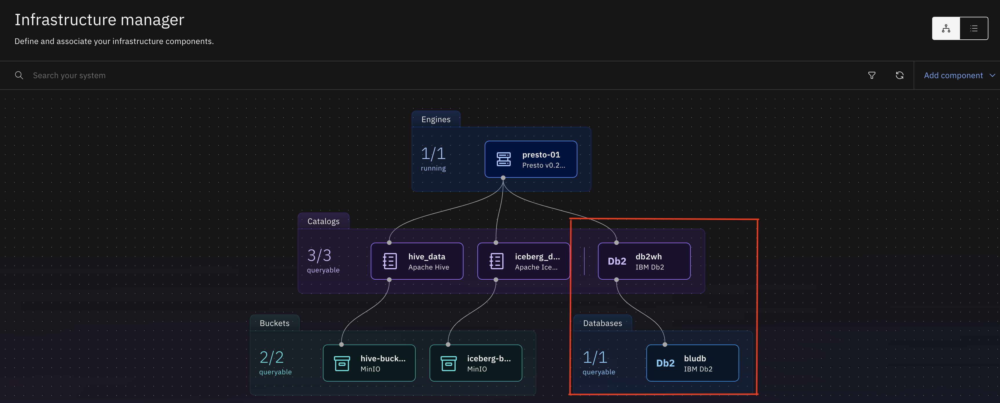
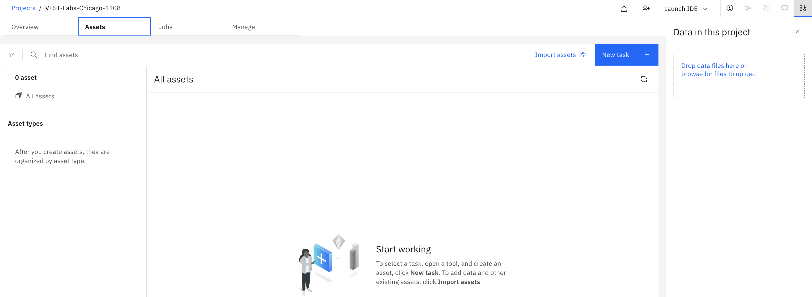
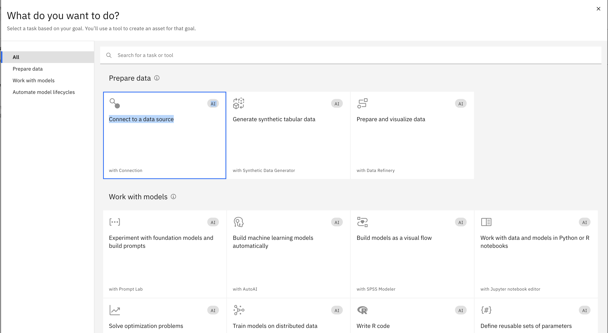
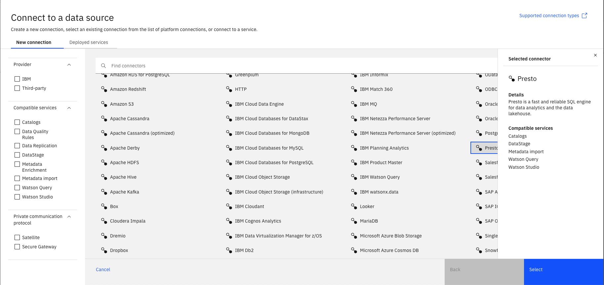

# Visualización de watsonx.data de watsonx.ai

En esta práctica de laboratorio, descargaremos algunos de los datos de DB2 Data Warehouse en el Lakehouse de datos de bajo coste. Entonces el equipo de ciencia de datos puede utilizar los datos en la plataforma watsonx.ai para visualizar y refinar los datos.

## Explorar configuraciones de watsonx.data (Instructor-led)

Como ha visto en la sección anterior, ya he conectado al depósito de datos de DB2 que se ha descargado en watsonx.data Lakehouse. Este almacén contiene un conjunto de datos de coches clásicos, voy a mostrar cómo un científico de datos puede llevar el conjunto de datos de los coches a watsonx.ai y mirar los datos y hacer alguna visualización con él.

1.  He instalado y configurado un watsonx.data autónomo en una instancia de IBM Cloud Virtual Server.

2.  Iniciar sesión en la instancia de watsonx.data [https://wxddev.buildlab.cloud:9443/ ](https://wxddev.buildlab.cloud:9443/)utilizando las siguientes credenciales

    *   idusuario: ibmlhadmin
    *   contraseña: *de holgura*

3.  Haga clic en **Administrador de infraestructuras **para ver el componente del depósito de datos de DB2.

4.  Haga clic en **Gestor de datos **y expanda el **db2wh **catálogo para ver todos los esquemas. Puede expandir el **qnf97304 **esquema para navegar a la **classic\_cars **.

5.  El **classic\_cars **se ha descargado en watsonx.data. Ampliar **iceberg\_data-> dsteam-> classic\_cars**

6.  En términos de control de acceso, he creado un usuario llamado **Hielo **, y proporcionado **usuario **rol a **presto-01 **motor. También se ha añadido una política de acceso para proporcionar acceso de alice a **dvapor **esquema.
7.  Haga clic en **Control de acceso **desde la navegación de la izquierda, y pulse en **presto-01 **y luego haga clic en **Control de acceso **.

8.  Haga clic en **X **para cerrar la ventana y hacer clic en **Políticas **para comprobar la política **dvapor **. Haga clic en **dvapor **.

9.  He dado acceso de rol de usuario a **Hielo **y restringido utilizando políticas para proporcionar acceso a sólo **dvapor **esquema en **Datos de icebert\_data **catálogo. También he proporcionado acceso a algunos otros componentes.

## Conectar watsonx.data de watsonx.ai

Ahora conectará el conjunto de datos de esta instancia de watsonx.data con el proyecto watsonx.ai que ha utilizado para completar los laboratorios watsonx.ai. Vaya a su proyecto de watsonx.ai que ha utilizado durante los laboratorios de watsonx.ai.

> NOTA: Si está completando este laboratorio en un entorno de workshop/classroom de IBM, la instancia de watsonx.ai se compartirá entre todos los estudiantes. Debe haber sido invitado a una cuenta de nube de IBM y añadido a un proyecto watsonx.ai con el formato de nombre: `VEST-Labs-{Location}-{MMDD}`donde *Ubicación *es la ubicación y *MMDD *indica el mes y el día de su taller.

1.  Seguir watsonx.ai [100: Requisitos previos y preguntas frecuentes ](/watsonx/watsonxai/100)para iniciar sesión en su proyecto watsonx.ai.
2.  Haga clic en el icono de hamburguesa en la parte superior izquierda para expandir el menú del lado izquierdo y haga clic en **Ver todos los proyectos**

3.  Seleccione el proyecto que utilizó para completar los laboratorios de watsonx.ai y haga clic en **Activos **.

4.  Se conectará a la instancia de watsonx.data del proyecto watsonx.ai. Haga clic en **Nueva tarea **de la parte superior derecha y seleccione **Conectar a un origen de datos**

5.  Con el release actual de watsonx, utilizará **Presto **conector para conectarse a datos en watsonx.data. Seleccione **Presto **y luego haga clic en **Seleccione **.

6.  Rellene los detalles de la conexión:

> NOTA: Puesto que es un entorno compartido, utilice un único para la conexión, utilice su uniqueid como parte del campo de nombre

*   **Nombre: **`{uniqueid} watsonx.data connection`
*   **Descripción: **Conectar watsonx.data utilizando el conector de presto
*   **Nombre de host o dirección IP: **wxddev.buildlab.cloud
*   **Puerto: **8443
*   **Nombre: **Hielo
*   **Contraseña: ***de holgura*
*   **El puerto está habilitado para SSL: **Marcado
*   **Certificado SSL: ***de holgura*

7.  Después de rellenar todos los detalles correctamente, puede probar la conexión antes de guardar la conexión. Haga clic en **Conexión de prueba **. Si ve **La prueba ha sido satisfactoria **Haga clic en **Crear **para guardar la información de conexión.

8.  Verá la conexión guardada con el nombre **conexión watsonx.data **En **Activos **tab

## Visualización de datos

Hemos establecido una conexión de watsonx.ai sobre watsonx.data. Ahora el siguiente paso es traer la tabla de watsonx.data a watsonx.ai.

1.  En la pestaña Activos del proyecto watsonx.ai seleccionado, pulse en **Activos de importación **. Seleccione la conexión que ha creado **conexión watsonx.data **. Puede seguir la selección para seleccionar la tabla en la etapa final. **Conexión watsonx.data-> iceberg\_data-> dsteam-> cars classics **. Seleccionar **Importación **. Se dará cuenta de nuevo activo creado con el nombre de tabla **classic\_cars**

2.  Usted se dará cuenta **db2wh **los catálogos no son visibles en la pantalla porque **Hielo **no se ha dado acceso a **db2wh **catálogo.
3.  Haga clic en **classic\_cars **para previsualizar los datos. Notará un valor de 0 mpg para algunas de las filas de la tabla. Mi objetivo es preparar los datos mediante la eliminación de coches con 0 mpg para que los datos refinados puedan ser compartidos con los usuarios de negocios. Vamos a la refinería de datos haciendo clic en el **Preparar datos **de la parte superior derecha.

4.  En **Refinería de datos **página, haga clic en **Perfil **. Verá las estadísticas de todas las columnas aquí, notará que el valor mínimo para la columna mpg es 0. Seleccione la columna **mpg **y añada el paso de refinamiento pulsando **Nuevo paso **de la izquierda inferior.

5.  Seleccione **Filtro **de **LIMPIEZA **en el panel lateral izquierdo. Seleccione **mpg **de la columna, **No es igual a **del operador y del valor **0 **Haga clic en **Aplicar **, y se dará cuenta, el valor mínimo de mpg se cambia a 9.

6.  Vamos a crear un trabajo para limpiar esta columna. Seleccione **Guardar y crear un trabajo **de la parte superior izquierda.

7.  Especifique el detalle de trabajo como se indica a continuación y pulse en **Crear y ejecutar**

*   **Nombre: **limpie las columnas mpg con el valor 0
*   **Descripción: **limpie las columnas mpg con el valor 0
*   **Configurar: ***Cambio no*
*   **Calendario **Apagado
*   **Notificación **En

8.  Recibirá una notificación en la parte superior derecha para la creación satisfactoria de un trabajo. Puede pulsar en el enlace de detalles de notificación para ir a la página de trabajo. Una vez completado el trabajo en un par de minutos, recibirá otra notificación.

9.  Puede navegar a su proyecto watsonx.ai y observará que se crea un nuevo activo denominado classic\_cars\_shaped si va a la pestaña Trabajos, verá el trabajo recién creado y su estado.

10. Haga clic en **classic\_cars\_shaped **activo de la lista de activos. Se dará cuenta de que todas las filas con el valor de mpg 0 se eliminan.
11. Ahora vamos a explorar los datos gráficamente. Haga clic en **Visualización **. Seleccione las siguientes columnas para la visualización: mpg, cilindro, peso y origen. A continuación, haga clic en **Visualizar datos **. 
12. Tiene la opción de visualizar los datos en diferentes gráficos listados en la parte superior de la página. Usted puede inclinarse **Diagrama de trazos de dispersión **para este laboratorio. También puede cambiar el valor de los atributos de gráfico.

Ha aprendido cómo traer datos de IBM watsonx.data a IBM watsonx.ai y refinar y visualizar esos datos.

### Felicidades, has completado L3 + lab 110.

Haga clic en [watsonx.data ](/watsonx/watsonxdata)para ir a la página de inicio de watsonx.data.
