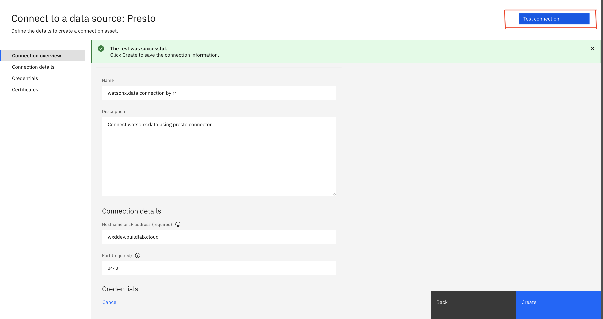
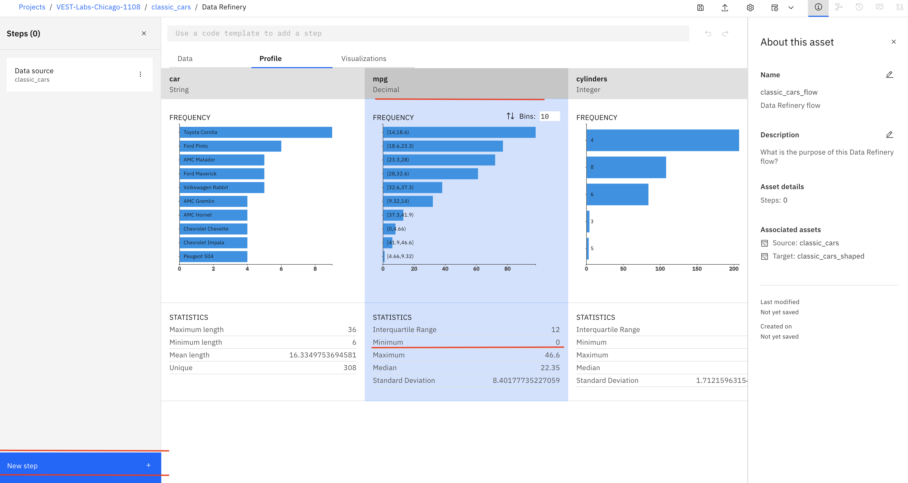
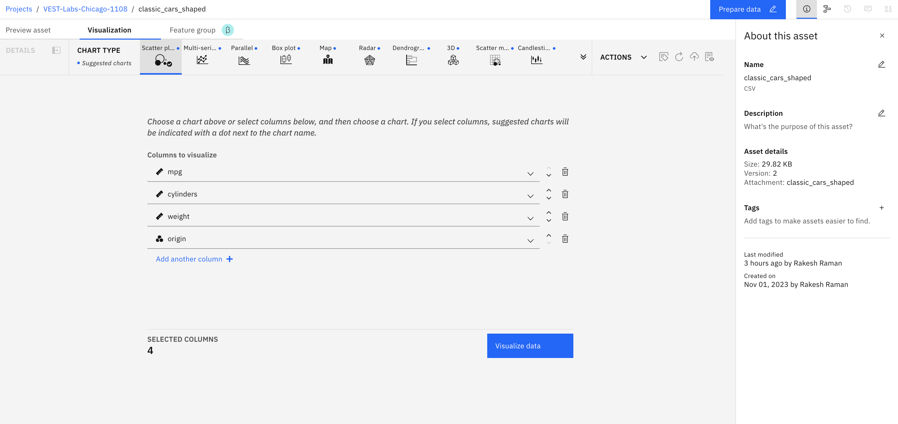

# Visualization of watsonx.data from watsonx.ai

In this lab, we will offload some of the data from the DB2 Data Warehouse to the low-cost watsonx.data lakehouse. Then the data science team can use the data in the watsonx.ai platform to visualize and refine the data.  

## Explore watsonx.data configurations(Instructor-led)

As you have seen in previous section, I have already connected to DB2 data warehouse which has been offloaded to watsonx.data lakehouse. This warehouse contains a classic cars dataset, I will show you how a data scientist can bring the cars dataset to watsonx.ai and look at the data and do some visualization with it. 

1. I have installed and configured a standalone watsonx.data on a IBM Cloud Virtual Server Instance.

2. Login to the watsonx.data instance https://wxddev.buildlab.cloud:9443/ using the following credentials

    - userid:   ibmlhadmin
    - password: *from slack*

3. Click on the **Infrastructure manager** icon to see the DB2 data warehouse component.

  

4. Click on the **Data manager** icon and expand the **db2wh** catalog to see all the schemas. You can expand the **qnf97304** schema to navigate to the **classic_cars** table.

  

5. The **classic_cars** table has been offloaded to watsonx.data. Expand **iceberg_data -> dsteam -> classic_cars**
 
  

6. In term of controlling access, I have created a user called **alice**, and provided **user** role to **presto-01** engine. An access policy has been also added to provide alice access to only **dsteam** schema. 

7. Click on **Access control** icon from left navigation, and click on **presto-01** and then click on **Access control** tab. 

  

8. Click on the **X** to close the window and click on the **Policies** tab to check the policy **dsteam**. Click on **dsteam**. 

  

9. I have given user role access to **alice** and restricted using policies to provide access to only **dsteam** schema in **iceberg_data** catalog. I have also provided access to some other components. 

## Connect watsonx.data from watsonx.ai

Now you will connect the dataset in this watsonx.data instance to the watsonx.ai project which you have used to complete the watsonx.ai labs. Navigate to your watsonx.ai project which you have used during the watsonx.ai labs. 

> NOTE: If you are completing this lab in an IBM workshop/classroom setting, the watsonx.ai instance will be shared among all students. You should have been invited to an IBM cloud account and added to a watsonx.ai project with name format: `VEST-Labs-{Location}-{MMDD}` where _Location_ is the location and _MMDD_ indicates the month and day of your workshop.

1. Follow watsonx.ai [100: Prerequisites and FAQs](/watsonx/watsonxai/100) to login to your watsonx.ai project.

2. Click on the hamburger icon in the upper left to expand the left-side menu and click **View all projects**

  

3. Select the project you used to complete your watsonx.ai labs and click on **Assets** tab.

  

4. You will connect to the watsonx.data instance from the watsonx.ai project. Click on the **New task** button from the upper right and select **Connect to a data source**

  

5. With current release of watsonx, you will use **Presto** connector to connect to data in watsonx.data. Select **Presto** and then click on **Select** button.

  

6. Fill the connection details:

> NOTE: Since it is shared environment, use unique name for conntection, you can add your name as well in the Name field. e.g. **watsonx.data connection by your First Name Last Name**

   - **Name:**                    watsonx.data connection
   - **Description:**             Connect watsonx.data using presto connector
   - **Hostname or IP address:**  wxddev.buildlab.cloud
   - **Port:**                    8443
   - **Username:**                alice
   - **Password:**                *from slack*
   - **Port is SSL-enabled:**     Checked
   - **SSL certificate:**         *from slack*

  

7. After filling all details correctly, you can test the connection before saving the connection. Click on **Test connection**. If you see **The test was successful**. Click **Create** to save the connection information.

  

8. You will see saved connection with name **watsonx.data connection** in **Assets** tab

  

## Data Visualization

We have set up a connection from watsonx.ai over watsonx.data. Now the next step is to bring the table from watsonx.data to watsonx.ai.

1. From Assets tab of selected watsonx.ai project, click on **Import assets**. Select the connection you have created **watsonx.data connection**. You can follow the selection to select table in final stage. **watsonx.data connection -> iceberg_data -> dsteam -> classic_cars**. Select **Import** button. You will notice new asset created with table name **classic_cars**

  

2. You will notice **db2wh** catalogs are not visible on the screen because **alice** has not been given access to **db2wh** catalog.

3. Click on **classic_cars** to preview the data. You will notice a 0 mpg value for some of the rows in the table. My objective is to prepare the data by removing cars with 0 mpg so that refined data can be shared with business users. Let us go to the data refinery by clicking on the **Prepare data** button from the upper right.

  

4. In **Data Refinery** page, click on **Profile** tab. You will see statistics of all the columns here, you will notice the minimum value for the mpg column is 0. Select the column **mpg** and add the refining step by clicking **New step** from the lower left.

  

5. Select **Filter** from **CLEANSE** option in the left side panel. Select **mpg** from Column, **Is not equal to** from Operator and Value **0**. Click **Apply**, and you will notice, the mpg minimum value is changed to 9.

  

6. Let us create a job to cleanse this column. Select **Save and create a job** from the upper left. 

  

7. Enter the job detail as follows and click on **Create and run**

  - **Name:**         cleanse mpg columns with value 0
  - **Description:**  cleanse mpg columns with value 0
  - **Configure:**    *dont change*
  - **Schedule**      Off
  - **Notify**        On

8. You will get a notification on the upper right for the successful creation of a job. You can click on the notification detail link to go to the job page. Once the job is completed in a couple of minutes, you will receive another notification.

  

9. You can navigate to your watsonx.ai project and you will observe new asset called classic_cars_shaped is created if you go to the Jobs tab, you will see the newly created job and its status.

   

10. Click on the **classic_cars_shaped** asset from the list of assets. You will notice all the rows with mpg value 0 are removed. 

11. Now let's explore data graphically. Click on the **Visualization** tab. Select the following columns for visualization: mpg, cylinder, weight, and origin. Then click on the **Visualize data** button.
   

12. You have option to visualize the data in different charts listed on top of the page. You can slect **Scatter plot chart** for this lab. You can also change the value of the graph attiributes. 

   

You have learned, how to bring data from IBM watsonx.data to IBM watsonx.ai and refine and visualize those data. 

### Congratulations, you've completed L3+ lab 110.
Click, [watsonx.data](/watsonx/watsonxdata) to go to watsonx.data home page.
