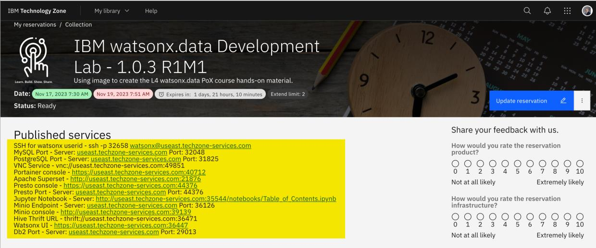
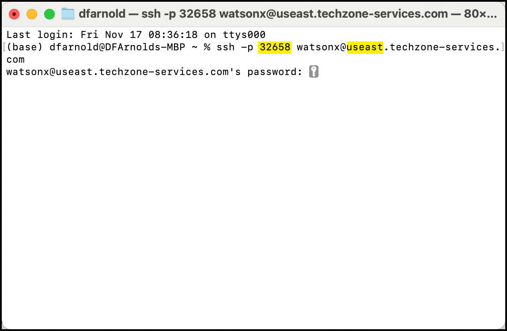
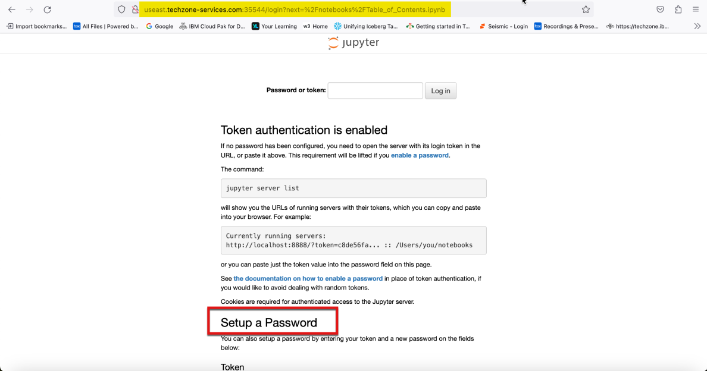
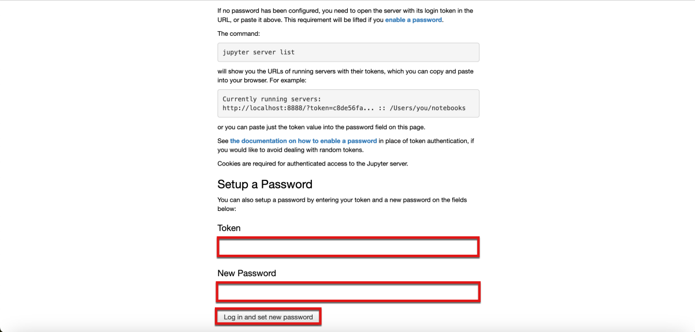
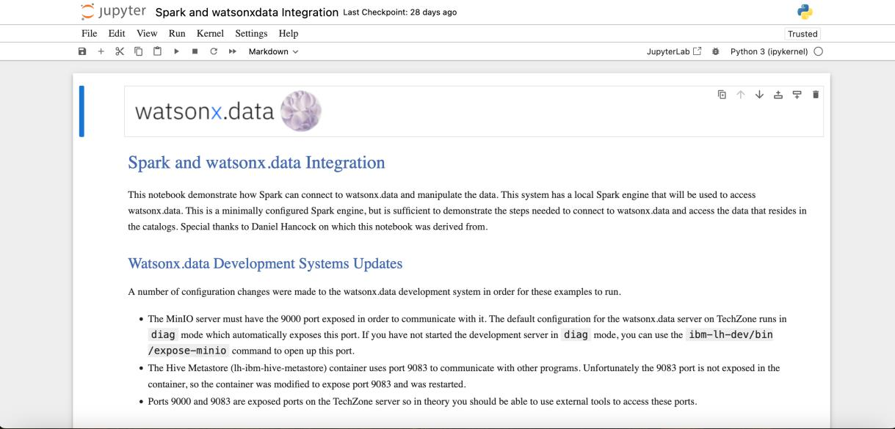
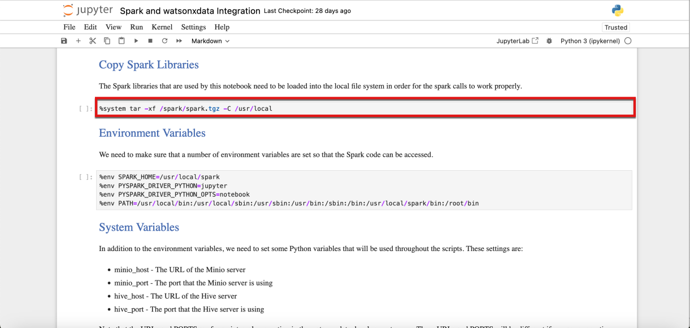
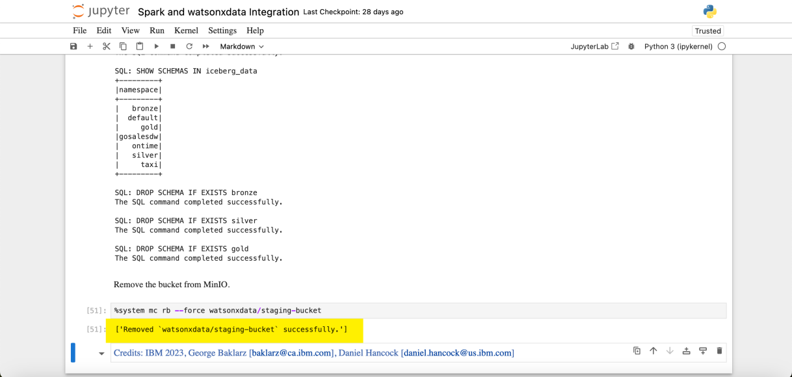

# 111: Apache Spark with watsonx.data

This lab showcases how IBM watsonx.data can integrate with Apache Spark as a query engine. 
The lab environment uses the watsonx.data Developer Edition image in an IBM TechZone 
provisioned environment. This can be found here:

https://techzone.ibm.com/collection/ibm-watsonxdata-developer-base-image/environments


For this lab’s exercises, Apache Spark is running separately within the 
image (it was not part of the product at the time this lab was written; this document will be 
updated when it is). IBM watsonx.data Software as a Service (SaaS) offerings of watsonx.data on 
IBM Cloud and Amazon Web Services (AWS), requires Apache Spark be provisioned as a 
separate service (IBM Analytics Engine is the Apache Spark Service on IBM Cloud).

This lab requires that you have a watsonx.data environment already up and running. See the 
Prerequisites & Getting Started section for details.

Watsonx.data is being developed and released in an agile manner. In addition to new 
capabilities being added, the web interface is also likely to change over time. Therefore, the 
screenshots used in this lab may not always look exactly like what you see.

## Getting Help

**Lab guide help**: If you require assistance in interpreting any of the steps in this lab, please post 
your questions to the #data-ai-demo-feedback Slack channel (IBMers only). Business Partners 
can request help at the Partner Plus Support website.

**TechZone environment**: If you encounter any issues regarding the TechZone environment being 
used in this lab, including the inability to provision an environment, please see the [TechZone
Help](https://techzone.ibm.com/help) page.

**watsonx.data**: Assistance with the watsonx.data product itself is available in the #watsonxdata-
lakehouse-discussion-open-to-all-ibmers Slack channel (IBMers only). Additionally, please refer 
to the watsonx.data documentation as needed (SaaS, software).

## Getting Started

1. Copy the required contents of the IBM TechZone environment **"Published services"** details into a text document so that the information is easily accessible during the lab exercise. The 
following information is required for this Spark lab:

- **SSH for watsonx User ID** – `ssh -p 00000 watsonx@region.techzone-services.com`
where `00000` is the port number and `region` is the region that matches the IBM 
TechZone reservation provided values.
- **Jupyter Notebook Server** - `http://region.techzone-services.com:00000/notebooks/Table_of_Contents.ipynb` where `00000` is the port 
number that matches the IBM TechZone reservation provided value.



## Start watsonx.data

1. Open a terminal window on your laptop and enter the watsonx.data SSH command provided in your TechZone reservation **"Published services"** information.

2. The SSH command is:

```bash
ssh -p watsonx@region.techzone-services.com
```

> The port number and region information must match the IBM TechZone reservation services provided to you for the SSH command to work

> If a prompt about providing a fingerprint is displayed, type **yes**. This will close the SSH connection. Enter the command again and this message will not be repeated. 

Enter **watsonx.data** as the password when prompted. This password you type will be invisible on the terminal.



3. Enter the `sudo su -` command to change your current user to root

4. As the root user, change the current directory to the path `/root/ibm-lh-dev/bin`

```bash
sudo su -
cd /root/ibm-lh-dev/bin
```

> After changing to the root user, you will see the root prefix on every commnad line and # symbol prefacing the command line. For example:


5. Check the status of watsonx.data to ensure everything has started and is running by entering the `./status.sh --all` command.

> There are two dashes ("-") in front of the "all" keyword.

```bash
./status.sh --all
```

6. The output from the command line should be comparable to the example below (widening the terminal window will make the output more readable). If all services are listed as _running_, watsonx.data has started successfully.


7. **Keep the terminal window open** and proceed to the next section of the exercise.

## Start the Jupyter Notebook Table of Contents

The IBM TechZone image contains a Jupyter Notebook table of contents that makes it easy to access the Apache Spark notebook used by this lab.

1. Open a web browser (Google Chrome and Mozilla Firefox have been tested and work with this lab) and go to the **Jupyter Notebook - Server URL** that you recorded earlier from the **Published Services** section of your TechZone reservation.



2. Scroll to the bottom of the browser window until you see the **Setup a Password** section. Your browser window should now show the **Token** and **New Passwords** fields along with a **Log in and set new password** button. Leave your browser window open and proceed to the next step.



3. Return to the terminal window that you were instructed to keep open earlier. Enter the command `jupyter server list`

```bash
jupyter server list
```

4. Copy the token value from the first item in the command output

> The token value is **watsonx.data**


5. Return to the browser window that your were instructed to keep open and path the **same** token value into both the **Token** and **New Password** fields within the browser window. Then select the **Log in and set new password** button.


6. This lab's Jupyter Table of Contents is now displayed.


7. Scroll down to the table of contents **"Accessing watsonx.data with Python, Pandas, and Apache Spark"** section. Click on the blue arrow in the lower right of the **"Accessing watsonx.data with Spark"** tile.


8. The Jupyter Notebook for this lab that has the Spark code is now displayed in the browser window. The second section, **Watsonx.data Development Systems Updates**, details all the items that were changed to allow Apache Spark to run in the watsonx.data  Development Lab image. Since this is the image that is being used for this lab exercise, these changes are already in effect, and there is nothing you need to do to run Spark in this notebook.



## Using Apache Spark within a Jupyter Notebook with watsonx.data

In this section, Apache Spark workflows and commands will be executed within a Jupyter Notebook with watsonx.data as the lakehouse.

1. Scroll down to the **Copy Spark Libraries** section. Note how executable (code) cells in Jupyter Notebooks are highlighted with a grey rectangle.



2. A Jupyter Notebook cell can be executed using two methods:

  - Executing individual cells by clicking the **Run icon** (looks like a play button) in the menu bar at the top of the notebook.
  - Executing the entire notebook by click on the **Fast Forward** icon

> As an alternative to the menu icon, a single cell can also be ran by using the **Shift + Enter** key macro while the cell is selected.


3. Select the first code cell. Notice that the current cell position is highlighted with a solid blue bar on the left of the cell.


4. Execute this first code cell 


5. After executing a code cell, you should notice two difference in the notebook code cell:

  - The **[]** to the left of the cell will change to **[*]** during its execution.
  - When execution completes, the cell changes to **[n]** where the number (n) is equivalent to the order that the cells were run 
  - Output is displayed directly underneath the code cell (if an error or warning occurs, they will be displayed underneath the cell as well).


6. Run all the remaining code cells in order within the Jupyter Notebook, waiting for each cell to complete before running the next code cell. 

> It is best practice to wait until the **[*]** for code cells being run changes to a number indicating the cell processing has completed. This is since some cells depend on the output from previous cells. For example, if a Python library is need for a function, until the library is loaded, trying to call the function will fail.

> Executing markup (text or documentation) cell within a notebook is ok, but there will be no output or run time allocated to these types of cells. 

This Jupyter Notebook created buckets, tables, loads data, and performs queries using Spark. The final product of the notebook execution cleans up the environment, all the work that has been done will be cleaned up and deletes the storage bucket.



## Summary

You have now completed the lab!

In this lab you used Apache Spark to create a storage bucket, create tables, load data, perform queries against those tables using Spark SQL. At the conclusion of the lab exercise the watsonx.data environment was cleaned up by deleting the data and removing the storage bucket.
