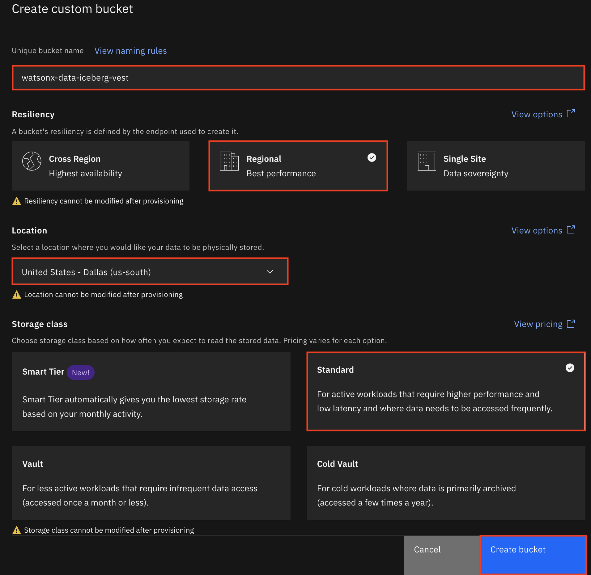
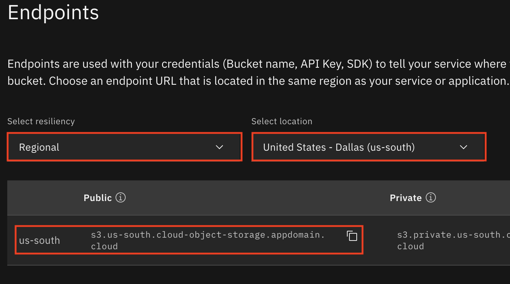
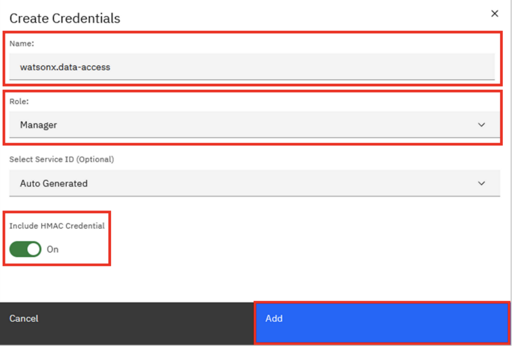
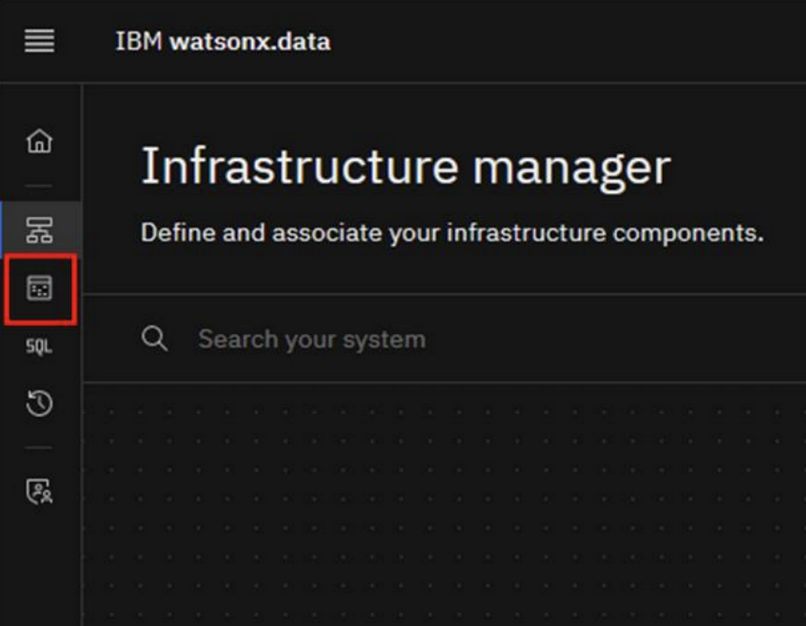
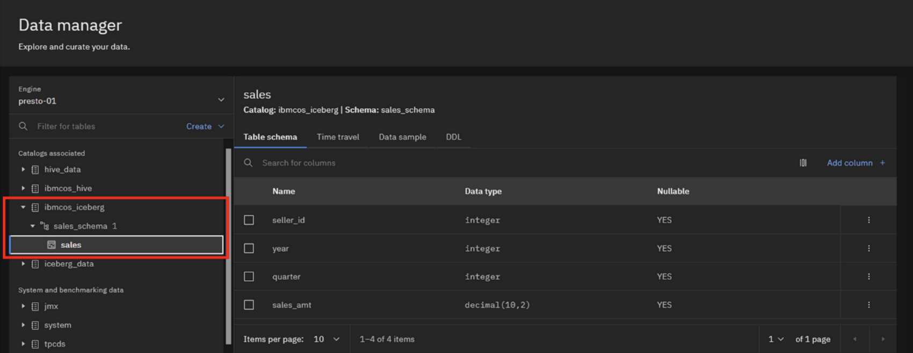
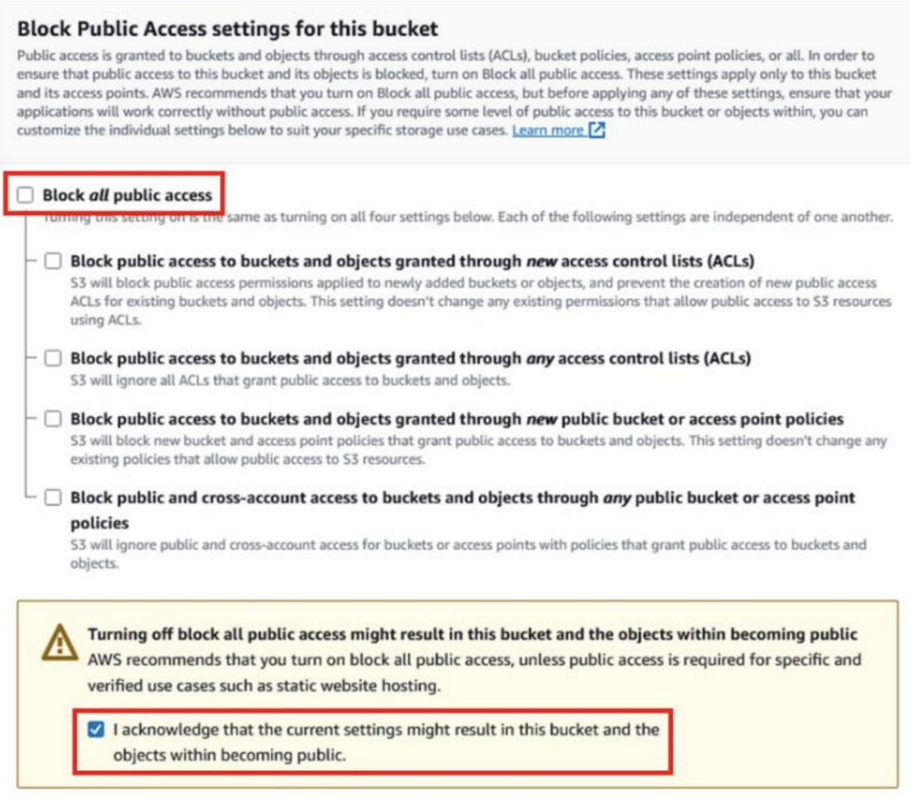
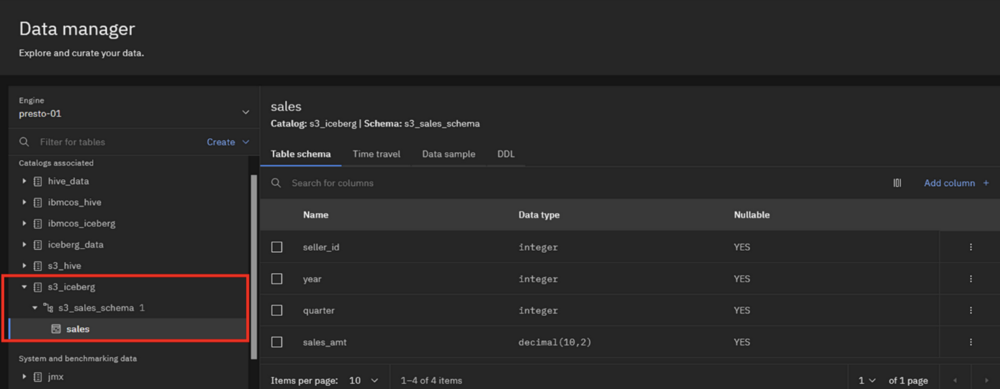

<QuizAlert text="Heads Up! Quiz material will be flagged like this!" />

# 202: Uso del almacenamiento de objetos de IBM Cloud y Amazon S3

## Objetivo

El objetivo de este laboratorio es integrar IBM watsonx.data con el almacenamiento de objetos compatible con la API Simple Storage Service (S3) alojado en IBM Cloud y Amazon Web Services (AWS).

## Almacenamiento de objetos

El almacenamiento de objetos es un tipo de arquitectura de almacenamiento en la que los datos se gestionan como objetos. Cada objeto suele incluir los propios datos, una cantidad variable de metadatos y un identificador único global. Como su nombre indica, la unidad básica del almacenamiento de objetos es un objeto, que se organiza en cubos (piense en un cubo como en un directorio o carpeta de alto nivel). Los sistemas de almacenamiento de objetos permiten retener cantidades masivas de datos estructurados, semiestructurados y no estructurados, lo que resulta muy adecuado para datos que se escriben una vez y se leen una o muchas veces. El almacenamiento de objetos es de bajo coste, con una capacidad y escalabilidad casi ilimitadas.

## Requisitos previos

### watsonx.data Medio ambiente

Este laboratorio requiere que ya disponga de un entorno IBM watsonx.data aprovisionado. Esto se hace en el **[Módulo 1: Configuración del entorno](/watsonx/watsonxdata/1)**.

### Almacenamiento de objetos de Amazon S3

Debe tener una cuenta de Amazon Web Services (AWS) para poder utilizar el almacenamiento de Amazon S3. Cree una cuenta de AWS y comience a utilizar S3 **[aquí](https://aws.amazon.com/pm/serv-s3/)**.

> **Nota:** Como parte de la **[capa gratuita de AWS](https://aws.amazon.com/free/)**, puede comenzar a utilizar Amazon S3 de forma gratuita. Al registrarse, los nuevos clientes de AWS reciben 5 GB de almacenamiento de Amazon S3 en la clase de almacenamiento S3 Standard; 20 000 solicitudes GET; 2 000 solicitudes PUT, COPY, POST o LIST; y 100 GB de transferencia de datos al mes.

### Almacenamiento de objetos en la nube (COS) de IBM

Debe disponer de una cuenta de IBM Cloud. Si aún no tiene aprovisionada una instancia de Object Storage, debe hacerlo. Existe un plan "Lite" gratuito que le permite almacenar hasta 25 GB de datos. Aprovisione una instancia de IBM Cloud Object Storage **[aquí](https://cloud.ibm.com/objectstorage)**.

> **Nota:** Los detalles de IBM COS y AWS S3 le serán proporcionados por su anfitrión de laboratorio.

## Almacenamiento de objetos en la nube (COS) de IBM

> **Nota:** IBM COS está disponible en diferentes ubicaciones de todo el mundo. Las instrucciones de esta guía de laboratorio utilizan el almacenamiento de objetos regional de EE. UU. Sur (Dallas), pero puede utilizar una región diferente que esté físicamente más cerca de usted.

### Crear cubos COS

1.  Vaya **[aquí](https://cloud.ibm.com/objectstorage)** para acceder a su(s) instancia(s) de IBM Cloud Object Storage y seleccione la instancia con la que desea trabajar. Accederá a la página de Cloud Object Storage de su instancia; de forma predeterminada, se encontrará en la pestaña Buckets.

> **Nota: Si está utilizando una instancia de COS existente que ha utilizado junto con otros servicios de IBM Cloud, verá varios buckets con nombres aparentemente aleatorios. Puede explorar estos buckets si lo desea, pero no los modifique ni los elimine de ningún modo.**

2.  Haga clic en el botón azul **Crear cubo** de la derecha.


3.  Haga clic en **Crear** en la parte inferior del mosaico **Crear un cubo personalizado**.
4.  Rellene lo siguiente para crear un cubo personalizado:

*   Introduzca un nombre de bucket único. El nombre debe ser único para todos los usuarios de IBM COS, así que utilice `watsonx-data-iceberg-<your initials or unique string>`.
*   Seleccione la ficha **Regional** para el nivel de Resistencia.
*   Haga clic en el menú desplegable **Ubicación** y seleccione la ubicación en la que desea que se almacenen los datos; en esta guía de laboratorio se utiliza **Estados Unidos - Dallas (us-south)**, pero puede elegir la ubicación que desee.

> **Nota: Recuerde la resistencia y la ubicación que eligió. Tendrá que facilitar esta información más adelante.**

*   Seleccione la ficha Estándar para la clase Almacenamiento.
*   Pulse el botón azul **Crear cubo** en la parte inferior de la página. **No cambie** nada más.



> **Nota: Si aparece la ventana emergente Habilitar control de versiones para su cubo, haga clic en Tal vez más tarde.**

Una vez creado el bucket, accederás a su página de administración en la consola.

5.  Haga clic en el **nombre de** su instancia de almacenamiento de objetos en las migas de pan de la parte superior izquierda de la pantalla. Esto le devuelve a la página principal de su instancia de almacenamiento de objetos. Por defecto, debería estar en la pestaña **Buckets**.
6.  Repita los pasos 2-4 para crear otro bucket de almacenamiento de objetos llamado `watsonx-data-hive-<your initials or unique string>` (recuerde que los nombres de bucket **deben** ser únicos entre todos los usuarios de IBM COS). Utilice la misma resistencia y ubicación que especificó para el primer bucket.
7.  Las aplicaciones se conectan a COS a través de una URL de punto final. La URL de punto final que se utiliza en una aplicación depende de la ubicación en la que se almacenan los datos. Seleccione **Puntos finales** en el menú de la izquierda.


8.  Aparecerá una lista de puntos finales para todas las regiones. Para filtrar la lista, utilice los menús desplegables **Seleccionar resistencia** y **Seleccionar ubicación**, y ajústelos a los mismos valores que utilizó anteriormente cuando creó sus dos buckets COS; por ejemplo, **Regional** y **Estados Unidos - Dallas (us-south)**. Los únicos puntos finales restantes que verá ahora son los asociados a su región y ubicación. Copie y pegue la URL en el cuadro **Público** en una ubicación que pueda consultar fácilmente más adelante. (Para facilitar esta operación, a la derecha de la URL hay un icono de **Copiar al portapapeles** ).



<QuizAlert text="There is a quiz question related to how watsonx.data connects to IBM COS" />

### Generar credenciales COS

Por motivos de seguridad, cualquier aplicación externa que acceda al almacenamiento de objetos debe proporcionar un conjunto válido de credenciales. En concreto, se debe proporcionar una clave de acceso y una clave de acceso secreta asociada a la instancia de almacenamiento de objetos.

1.  En la pantalla **Endpoints**, desplácese hasta la parte inferior de la página. En la sección **Acciones recomendadas**, haga clic en **Obtener credenciales** en el mosaico **Obtener una clave** API.


2.  Haga clic en el botón azul **Nueva credencial** de la derecha.


3.  En la ventana emergente **Crear credenciales**, introduzca la siguiente información y, a continuación, haga clic en el botón **Añadir**:

*   **Nombre:** `watsonx.data-access`
*   **Función:** Manager (esto proporciona los permisos que watsonx.data necesita)
*   **Incluir credencial HMAC:** En



4.  Busque y expanda el twisty de las nuevas credenciales que acaba de crear. Localice los campos **access\_key\_id** y **secret\_access\_key**. Copie y pegue los valores clave de estos campos (sin las comillas) en un lugar seguro. Los necesitará en la siguiente sección.


### Añadir cubos COS a watsonx.data

Una vez creados los dos buckets, ya se pueden añadir a watsonx.data.

1.  Abra la consola (interfaz de usuario) de su **entorno watsonx.data** en una nueva ventana del navegador. Mantenga la consola IBM Cloud Object Storage abierta en otra ventana.


2.  En la interfaz de usuario de watsonx.data, seleccione el icono **Administrador de infraestructuras** en el menú de la izquierda.


3.  Haga clic en el menú desplegable **Añadir componente** de la derecha y seleccione **Añadir cubo**.


4.  En la ventana emergente **Añadir cubo**, introduzca/seleccione la siguiente información para añadir el cubo **Iceberg** y, a continuación, haga clic en **Añadir y activar ahora**:

*   **Tipo de cubo:** IBM Cloud Object Storage
*   **Región:** Dallas (us-south) (o la ubicación en la que hayas creado tu cubo)
*   **Nombre del** cubo**:** `watsonx-data-iceberg-<your initials or unique string>` (debe coincidir con el nombre del cubo creado en la sección anterior)
*   **Nombre para mostrar:** `cos-iceberg-bucket`
*   **Endpoint:** `https://s3.us-south.cloud-object-storage.appdomain.cloud` (o el endpoint que copió anteriormente; asegúrese de anteponerle https\://)
*   **Clave de acceso:** **access\_key\_id** copiado de las credenciales que creó anteriormente.
*   **Clave secreta:** **clave\_de\_acceso\_secreto** copiada de las credenciales creadas anteriormente.
*   **Estado de la conexión:** Haga clic en **Probar conexión**. Si la prueba de conexión se realiza correctamente, el estado de la **conexión** mostrará **Exitoso**. **Nota:** Si la prueba no se ha realizado correctamente, recibirá un mensaje de error como el que se muestra a continuación con el motivo del fallo. Vuelva a introducir todos los campos y haga clic en **Volver a probar** para volver a probar la conexión. Las razones más comunes para un error aquí son que usted escribió mal el nombre de su cubo o pegó una o ambas claves incorrectamente.
*   **Activación:** Seleccione **Activar ahora**
*   **Tipo de catálogo:** Apache Iceberg
*   **Nombre de catálogo:** `ibmcos_iceberg`

Su cubo ha sido añadido a watsonx.data, pero necesita ser asociado con el motor de consulta Presto antes de que el cubo pueda ser accedido por él.

<QuizAlert text="There is a quiz question related to adding the connection to IBM COS" />

5.  En la sección **Catálogos**, sitúe el puntero del ratón sobre el mosaico **ibmcos\_iceberg** y aparecerá el icono **Gestionar asociaciones**. Haz clic en él.


6.  En la ventana emergente **Gestionar asociaciones**, seleccione la casilla del motor **presto-01** y, a continuación, haga clic en **Guardar y reiniciar motor**. Una línea debería conectar la ficha **presto-01** de la sección **Motores** con la ficha **ibmcos\_iceberg** de la sección **Catálogos**. Esta conexión indica que los recursos están ahora asociados.

<QuizAlert text="There is a quiz question related to your database being accessible by the Presto query engine" />

7.  Repita los pasos 3-6 para añadir el segundo bucket **Hive** a watsonx.data. Utilice la siguiente información (las diferencias entre las instrucciones anteriores son "hive" en lugar de "iceberg"):

*   **Tipo de cubo:** IBM Cloud Object Storage
*   **Región:** Dallas (us-south) (o la ubicación en la que hayas creado tu cubo)
*   **Nombre del cubo:** `watsonx-data-hive-<your initials or unique string>`.
*   **Nombre para mostrar:** `cos-hive-bucket`
*   **Endpoint:** `https://s3.us-south.cloud-object-storage.appdomain.cloud` (o el endpoint que copió anteriormente, asegúrese de anteponerle https\://)
*   **Clave de acceso:** **access\_key\_id** copiado de las credenciales que creó anteriormente.
*   **Clave secreta:** **clave\_de\_acceso\_secreto** copiada de las credenciales creadas anteriormente.
*   **Estado de la conexión:** Haga clic en **Probar conexión**. Si la prueba de conexión se realiza correctamente, el estado de la **conexión** mostrará **Exitoso**.
*   **Activación:** Seleccione **Activar ahora**
*   **Tipo de catálogo:** Apache Hive
*   **Nombre de catálogo:** `ibmcos_hive`

<QuizAlert text="There is a quiz question related to creating both Hive tables and Iceberg tables" />

### Utilizar cubos COS en watsonx.data

En esta sección creará un esquema y una tabla dentro de cada uno de los dos catálogos que acaba de añadir. Los datos asociados a cada catálogo residirán en su bucket de almacenamiento de objetos correspondiente.

#### Crear una nueva tabla Iceberg

1.  En la interfaz de usuario de watsonx.data, seleccione el icono **Gestor de datos** en el menú de la izquierda.



Debería ver los dos nuevos catálogos en la lista.


2.  Haga clic en el menú desplegable **Crear** y seleccione **Crear esquema**.


3.  En la ventana emergente **Crear esquema**, seleccione **ibmcos\_iceberg** para el **Catálogo** e introduzca `sales_schema` para el **Nombre**. El campo **Ruta** se establece automáticamente en función del nombre del esquema, pero puede modificarse si es necesario. **No** obstante, **no** lo **modifique** aquí. Ahora haga clic en el botón **Crear**.
4.  En la interfaz de usuario de watsonx.data, seleccione el icono **Espacio de trabajo de consulta** en el menú de la izquierda.


5.  Despeja el editor SQL y copia y pega en él las siguientes sentencias SQL. A continuación, haz clic en el botón **Ejecutar en presto-01** de la derecha.

```sql
CREATE TABLE "ibmcos_iceberg"."sales_schema"."sales" (seller_id INT, year INT, quarter INT, sales_amt DECIMAL (10,2));
INSERT INTO "ibmcos_iceberg"."sales_schema"."sales" VALUES (1000, 2023, 3, 11435.34);
INSERT INTO "ibmcos_iceberg"."sales_schema"."sales" VALUES (1000, 2023, 4, 16742.03);
INSERT INTO "ibmcos_iceberg"."sales_schema"."sales" VALUES (1001, 2023, 3, 8623.78);
INSERT INTO "ibmcos_iceberg"."sales_schema"."sales" VALUES (1001, 2023, 4, 19912.14);
```

6.  Una vez finalizada la ejecución de las sentencias del paso anterior, seleccione el icono **Gestor de datos** del menú de la izquierda.
7.  En el menú de navegación de la izquierda, seleccione **ibmcos\_iceberg** > **sales\_schema** > **sales**. Aparecerá la tabla que acaba de crear.



8.  Cambie a la consola **IBM Cloud Object Storage** que se ejecuta en la otra ventana del navegador que se le indicó que dejara abierta anteriormente.
9.  Haz clic en el menú desplegable **Instancias** del menú de la izquierda y selecciona tu instancia de almacenamiento de objetos en la nube. (Si tiene varias instancias, seleccione la que utilizó anteriormente en el laboratorio).


10. Busque y haga clic en el cubo `watsonx-data-iceberg-<your initials or unique string>` que creó anteriormente. (Sugerencia: es posible que desee utilizar el filtro situado encima de la lista de cubos si tiene muchos cubos de almacenamiento).
11. Observe que ahora hay una carpeta llamada **sales\_schema**. Haga clic en esa carpeta para profundizar en ella.


12. Aquí hay una carpeta llamada **ventas**. Se creó al crear la tabla en la consola watsonx.data. El nombre de la carpeta coincide con el nombre de la tabla. Haga clic en la carpeta de **ventas**.
13. Dentro de esta carpeta hay dos subcarpetas que contienen el archivo de **datos** y **metadatos** asociado a esta tabla de **ventas** Iceberg. Siéntase libre de explorar estas carpetas.

¡Enhorabuena! Acaba de experimentar cómo puede crear tablas Iceberg en IBM Cloud Object Storage.

#### Creación de una tabla Hive sobre datos existentes de Cloud Object Storage

En esta sección creará una tabla Hive basada en un archivo de datos que cargue en el bucket de almacenamiento de objetos en la nube Hive que creó anteriormente. También verás cómo puedes crear una versión Iceberg de esa tabla Hive.

1.  Localmente en tu ordenador, crea una carpeta en algún lugar llamada **airline\_schema** y dentro de ella crea una subcarpeta llamada **aircraft**.
2.  Descarga el archivo **aircraft.** parquet desde [aquí](https://raw.githubusercontent.com/ibm-build-lab/VAD-VAR-Workshop/main/content/Watsonx/WatsonxData/files/aircraft.parquet) y colócalo en la subcarpeta **aircraft** de tu ordenador. Ahora deberías tener una estructura de carpetas/archivos **airline\_schema** > **aircraft** > **aircraft**.parquet.
3.  En la consola **IBM Cloud Object Storage**, haga clic en el menú desplegable **Instancias** del menú de la izquierda y seleccione su instancia de almacenamiento de objetos en la nube. (Si tiene varias instancias, seleccione la que utilizó anteriormente en el laboratorio).


4.  Busque y seleccione el cubo `watsonx-data-hive-<your initials or unique string>`.
5.  Este cubo debe estar vacío. Haga clic en el botón azul **Subir** a la derecha.


6.  En el cuadro **Cargar** que aparece a la derecha, desplácese hasta la sección **Cargar archivos (objetos)** y haga clic en **Cargar carpetas**.


7.  Localiza la carpeta de nivel superior **airline\_schema** en tu portátil**(no** la subcarpeta aircraft ni el archivo aircraft.parquet que contiene) y selecciona esa carpeta para cargarla desde el cuadro de diálogo de tu sistema operativo.
8.  Haga clic en el botón azul **Cargar** situado en la parte inferior derecha para cargar la carpeta que acaba de seleccionar (y su contenido) en su cubo de almacenamiento de objetos. Ahora cierra cualquier mensaje emergente o notificación que indique que la carga se ha realizado correctamente.
9.  Las carpetas y archivos cargados se muestran como **airline\_schema/aircraft/aircraft.parquet**. Los caracteres **/** (barra oblicua) indican separadores de ruta. Haga clic en el icono **Actualizar**. La interfaz muestra ahora las carpetas correctas, y si navegas hacia abajo en las carpetas, encontrarás el archivo aircraft **.** parquet.


10. Vuelva a la **consola watsonx.data** y seleccione el icono **Gestor de datos** en el menú de la izquierda.
11. Haga clic en el menú desplegable **Crear** y seleccione **Crear esquema**.


12. En la ventana emergente **Crear esquema**, seleccione **ibmcos\_hive** para el **Catálogo** e introduzca `airline_schema` para el **Nombre** (coincide con el nombre de la carpeta de nivel superior que acaba de cargar). Pulse el botón **Crear**.
13. Seleccione el icono Espacio de trabajo de consulta en el menú de la izquierda.
14. Ejecute la siguiente sentencia SQL para crear la tabla de **aviones** en la parte superior de lo que se acaba de cargar. **Sustituya** el nombre del bucket por el nombre del bucket Hive que creó anteriormente. La tabla se compone de todos los archivos Parquet de la carpeta **airline\_schema/aircraft**.

```sql
create table ibmcos_hive.airline_schema.aircraft
  (tail_number varchar,
  manufacturer varchar,
  model varchar)
with (format = 'Parquet',
  external_location='s3a://watsonx-data-hive-<your initials or unique string>/airline_schema/aircraft')
```

<QuizAlert text="There is a quiz question related to the SQL query table name" />

15. Borre el editor SQL y ejecute la siguiente sentencia SQL:

```sql
select * from ibmcos_hive.airline_schema.aircraft
```

Observe los datos devueltos. Provienen directamente del archivo Parquet que cargaste en el almacenamiento de objetos. Ser capaz de acceder a archivos Hive directamente en watsonx.data es una gran manera de traer los datos existentes en el ecosistema watsonx.data lakehouse.

16. Borre el editor SQL y ejecute la siguiente sentencia SQL para crear un nuevo esquema en el catálogo Iceberg. Sustituya el nombre del bucket en la cadena de ubicación por el nombre del bucket de Iceberg que creó anteriormente.

```sql
create schema ibmcos_iceberg.airline
  with (location = 's3a://watsonx-data-iceberg-<your initials or unique string>/airline/')
```

17. Borre el editor SQL y ejecute la siguiente sentencia SQL para crear la nueva versión Iceberg de la tabla.

```sql
create table ibmcos_iceberg.airline.aircraft
  as select * from ibmcos_hive.airline_schema.aircraft;
```

El resultado de la ejecución de esta sentencia es el número de filas insertadas en la nueva tabla, que debería ser **13.101**.

> **Nota:** Si aparece un error indicando que el esquema de la aerolínea no existe, espere 10-20 segundos e inténtelo de nuevo con la sentencia CREATE TABLE.

¡Enhorabuena! Acaba de experimentar cómo puede crear tablas Hive sobre datos existentes en IBM Cloud Object Storage.

## Servicios web de Amazon S3

> **Nota:** Amazon S3 está disponible en diferentes ubicaciones en todo el mundo. En las instrucciones de este laboratorio se utiliza la ubicación **us-east-1 del este de EE. UU. (norte de Virginia** ), pero puede utilizar una región diferente que esté físicamente más cerca de usted.

### Crear buckets S3

Al igual que hizo en la sección IBM Cloud Object Storage, creará dos buckets de almacenamiento de objetos ahora en Amazon S3. El primero**(watsonx-data-aws-iceberg**) se utilizará para contener las nuevas tablas Iceberg que cree. El segundo (**watsonx-data-aws-hive**) se utilizará para una tabla Hive, basada en un archivo que subas. Se le proporcionan instrucciones para crear un bucket y estas instrucciones se pueden repetir para el segundo (pero preste atención a las sutilezas de las diferencias la segunda vez).

1.  Inicie sesión en el servicio Amazon S3 **[aquí](https://s3.console.aws.amazon.com)**
2.  Haz clic en el botón naranja **Crear cubo** de la derecha. **Nota:** Si has creado buckets en tu cuenta de S3 en el pasado, no verás la pantalla de abajo. En su lugar, se le llevará a la página que enumera sus cubos existentes. También hay un botón naranja Crear **cubo** aquí, así que haz clic en él.


3.  En la página **Crear cubo**, introduzca la siguiente información en la sección **Configuración general**:

*   **Nombre del cubo:** `watsonx-data-aws-iceberg-<your initials or unique string>`
*   **Región AWS:** **US East (N. Virgina) us-east-1** (o su ubicación preferida)

> **Nota:** Al igual que con IBM Cloud Object Storage, los nombres de bucket deben ser únicos dentro del espacio de nombres global de S3. Además, los nombres de bucket que especifique también deben ser únicos con respecto a lo que creó en IBM Cloud Storage, ya que también deben ser identificables de forma única dentro de watsonx.data.

4.  Desplácese hacia abajo hasta la sección **Bloquear** el acceso público a este cubo. Desmarque la casilla Bloquear **todo** acceso público. Una vez desmarcada, en la parte inferior de esta sección aparecerá una advertencia pidiéndole que confirme que permite el acceso público. Seleccione el mensaje **Acepto**. En la práctica, es posible que desee controlar el acceso a través de listas de control de acceso y políticas, pero por simplicidad en este laboratorio, este cubo estará abierto al público (pero aún asegurado a través de credenciales que deben ser proporcionadas por cualquier consumidor S3).



5.  Desplácese hacia abajo para ver las opciones de configuración restantes. **No cambie** nada más. Haga clic en el botón naranja **Crear cubo** en la parte inferior de esta página. Una vez creado el cubo (verás un mensaje verde de éxito), accederás a la página de **cubos** de la consola, donde podrás trabajar con tus cubos.
6.  Haz clic en el botón naranja **Crear buc** ket de la derecha. Repita los pasos 3-5 para crear otro bucket de almacenamiento de objetos llamado `watsonx-data-aws-hive-<your initials or unique string>` (recuerde que los nombres de los buckets deben ser únicos dentro del espacio de nombres global de S3). Utilice la misma ubicación que especificó para el primer bucket.


7.  Las aplicaciones se conectan a un bucket de S3 a través de una URL de punto final. Esta URL depende de la ubicación en la que se almacenan los datos. Busque **[aquí](https://docs.aws.amazon.com/general/latest/gr/s3.html)** el endpoint correspondiente a la ubicación de su bucket y cópielo en una ubicación a la que pueda hacer referencia fácilmente más adelante. Para el ejemplo de esta guía de laboratorio, la ubicación es **US East (N. Virgina) us-east-1**, que la documentación de Amazon indica que utilice la URL de punto final `s3.us-east-1.amazonaws.com`.

### Generar credenciales S3

1.  Haga clic en **su nombre** (es un menú desplegable) en la esquina superior derecha de la página y, a continuación, seleccione **Credenciales de seguridad**.


2.  Desplácese hasta la sección **Claves** de acceso. Haga clic en el botón **Crear** clave de acceso.


> **Nota:** Si la cuenta con la que está iniciando sesión se considera una cuenta de "usuario root", se le pedirá que confirme que está creando una clave de acceso de usuario root. Seleccione la casilla de verificación **Entiendo** y, a continuación, haga clic en el botón naranja **Crear** clave de acceso.

3.  Aparecerán las credenciales recién generadas, que incluyen una **Clave** de acceso y una **Clave** de acceso secreta. Copia tanto la clave de **acceso** como **la** clave de acceso secreta en algún lugar seguro para futuras referencias (las necesitarás en la siguiente sección). Es importante que se dé cuenta de que sólo puede ver la clave de acceso secreta en este momento. No podrás volver a verla más tarde, por lo que **debes** copiarla en algún lugar para guardarla (alternativamente, puedes descargar las claves como un archivo CSV). Una vez copiados los dos valores, haz clic en el botón naranja **Hecho**.

<QuizAlert text="There is a quiz question related to the AWS S3 credentials" />

### Añadir S3 Buckets a watsonx.data

1.  Abra la consola watsonx.data (interfaz de usuario) en una nueva ventana del navegador. No cierre la consola de Amazon S3; déjela abierta en otra ventana.
2.  En la interfaz de usuario de watsonx.data, seleccione el icono **Administrador de infraestructuras** en el menú de la izquierda.


3.  Haga clic en el menú desplegable **Añadir componente** de la derecha y seleccione **Añadir cubo**.


4.  En la ventana emergente **Añadir cubo**, introduzca/seleccione la siguiente información para añadir el cubo **Iceberg** y, a continuación, haga clic en **Añadir y activar ahora**::

*   **Tipo de cubo:** Amazon S3
*   **Región:** US East (N. Virginia) (o la ubicación en la que hayas creado tu cubo)
*   **Nombre del cubo:** `watsonx-data-aws-iceberg-<your initials or unique string>`
*   **Nombre para mostrar:** `s3-iceberg-bucket`
*   **Endpoint:** `https://s3.us-east-1.amazonaws.com` (o el endpoint que copió anteriormente, asegúrese de anteponerle https\://)
*   **Clave de acceso:** **access\_key\_id** copiado de las credenciales que creó anteriormente.
*   **Clave secreta:** **clave\_de\_acceso\_secreto** copiada de las credenciales creadas anteriormente.
*   **Estado de la conexión:** Haga clic en **Probar conexión**. Si la prueba de conexión se realiza correctamente, el estado de la **conexión** mostrará **Exitoso**. **Nota:** Si la prueba no se ha realizado correctamente, recibirá un mensaje de error como el que se muestra a continuación con el motivo del fallo. Vuelva a introducir todos los campos y haga clic en **Volver a probar** para probar de nuevo la conexión. Las razones más comunes para un error aquí son que usted escribió mal el nombre de su cubo o pegó una o ambas claves incorrectamente.
*   **Activación:** Seleccione **Activar ahora**
*   **Tipo de catálogo:** Apache Iceberg
*   **Nombre de catálogo:** `s3_iceberg`

5.  En la sección **Catálogos**, sitúe el puntero del ratón sobre el mosaico **s3\_iceberg** y aparecerá el icono **Gestionar asociaciones**. Haz clic en él.


6.  En la ventana emergente **Gestionar asociaciones**, seleccione la casilla del motor **presto-01** y, a continuación, haga clic en **Guardar y reiniciar motor**. Una línea debería conectar ahora la ficha **presto-01** de la sección **Motores** con la ficha **s3\_iceberg** de la sección **Catálogos**. Esta conexión indica que los recursos están ahora asociados.
7.  Repita los pasos 3-6 para añadir el segundo bucket **Hive** a watsonx.data. Utilice la siguiente información (las diferencias entre las instrucciones anteriores son "hive" en lugar de "iceberg"):

*   **Tipo de cubo:** Amazon S3
*   **Región:** US East (N. Virginia) (o la ubicación en la que hayas creado tu cubo)
*   **Nombre del cubo:** `watsonx-data-aws-hive-<your initials or unique string>`.
*   **Nombre para mostrar:** `s3-hive-bucket`
*   **Endpoint:** `https://s3.us-east-1.amazonaws.com` (o el endpoint que copió anteriormente, asegúrese de anteponerle https\://)
*   **Clave de acceso:** **access\_key\_id** copiado de las credenciales que creó anteriormente.
*   **Clave secreta:** **clave\_de\_acceso\_secreto** copiada de las credenciales creadas anteriormente.
*   **Estado de la conexión:** Haga clic en **Probar conexión**. Si la prueba de conexión se realiza correctamente, el estado de la **conexión** mostrará **Exitoso**.
*   **Activación:** Seleccione **Activar ahora**
*   **Tipo de catálogo:** Apache Hive
*   **Nombre de catálogo:** `s3_hive`

### Utilizar S3 Buckets en watsonx.data

En esta sección creará un esquema y una tabla dentro de cada uno de los dos catálogos que acaba de añadir. Los datos asociados a cada catálogo residirán en su bucket de almacenamiento de objetos correspondiente. Estos pasos son muy similares a los que siguió anteriormente en la sección IBM Cloud Object Storage (utilizando los mismos esquemas, tablas y datos). Las únicas diferencias se refieren a la consola de Amazon S3 y a la especificación de los catálogos y buckets específicos de S3.

#### Crear una nueva tabla Iceberg

1.  Seleccione el icono **Gestor de datos** en el menú de la izquierda. Debería ver los dos nuevos catálogos relacionados con S3 en la lista.


2.  Haga clic en el menú desplegable **Crear** y seleccione **Crear esquema**.


3.  En la ventana emergente **Crear esquema**, seleccione **s3\_iceberg** para el **Catálogo** e introduzca `s3_sales_schema` para el **Nombre**. El campo **Ruta** se establece automáticamente en función del nombre del esquema, pero puede modificarse si es necesario. Sin embargo, **no** lo **cambie** aquí. Ahora haga clic en el botón **Crear**.
4.  En la interfaz de usuario de watsonx.data, seleccione el icono **Espacio de trabajo de consulta** en el menú de la izquierda.


5.  Despeja el editor SQL y copia y pega en él las siguientes sentencias SQL. A continuación, haz clic en el botón **Ejecutar en presto-01** de la derecha.

```sql
CREATE TABLE "s3_iceberg"."s3_sales_schema"."sales" (seller_id INT, year INT, quarter INT, sales_amt DECIMAL (10,2));
INSERT INTO "s3_iceberg"."s3_sales_schema"."sales" VALUES (1000, 2023, 3, 11435.34);
INSERT INTO "s3_iceberg"."s3_sales_schema"."sales" VALUES (1000, 2023, 4, 16742.03);
INSERT INTO "s3_iceberg"."s3_sales_schema"."sales" VALUES (1001, 2023, 3, 8623.78);
INSERT INTO "s3_iceberg"."s3_sales_schema"."sales" VALUES (1001, 2023, 4, 19912.14);
```

6.  Una vez finalizada la ejecución de las sentencias del paso anterior, seleccione el icono **Gestor de datos** del menú de la izquierda.
7.  En el menú de navegación de la izquierda, seleccione **s3\_iceberg** > **s3\_sales\_schema** > **sales**. Esto muestra la tabla que acaba de crear.



8.  Cambie a la consola de **Amazon S3** que se ejecuta en la otra ventana del navegador que se le indicó que dejara abierta anteriormente. Para ver su lista de buckets, vaya **[aquí](https://s3.console.aws.amazon.com/s3/buckets)**
9.  Busque y haga clic en el cubo `watsonx-data-aws-iceberg-<your initials or unique string>` que creó anteriormente.
10. Observe que ahora hay una carpeta llamada **s3\_sales\_schema**. Haga clic en esa carpeta para profundizar en ella.


11. Aquí hay una carpeta llamada **ventas**. Se creó al crear la tabla en la consola watsonx.data. El nombre de la carpeta coincide con el nombre de la tabla. Haga clic en la carpeta de **ventas**.
12. Dentro de esta carpeta hay dos subcarpetas que contienen el archivo de **datos** y **metadatos** asociado a esta tabla de **ventas** Iceberg. Siéntase libre de explorar estas carpetas.

¡Enhorabuena! Acaba de experimentar cómo puede crear tablas Iceberg en el almacenamiento de objetos de Amazon S3.

#### Crear una tabla Hive en datos existentes de almacenamiento de objetos S3

En esta sección creará una tabla Colmena basada en un archivo de datos que cargará en el bucket Colmena que creó anteriormente. También verá cómo crear una versión Iceberg de la tabla Hive.

1.  En la **consola de Amazon S3** en la que estabas trabajando anteriormente con el bucket Iceberg, haz clic en **Buckets** en las migas de pan de la parte superior de la página. Volverás a la página principal de **buckets**.


2.  Busque y haga clic en el cubo `watsonx-data-aws-hive-<your initials or unique string>`.
3.  Este cubo debe estar vacío. Haga clic en el botón **Crear carpeta**.


4.  En la página **Crear carpeta**, introduce `s3_airline_schema` como **nombre de la carpeta**. A continuación, desplácese hasta la parte inferior de la página y haga clic en el botón naranja **Crear carpeta**.
5.  Haga clic en la nueva carpeta **s3\_airline\_schema** para acceder a ella y, a continuación, siga los dos pasos anteriores para crear una carpeta secundaria llamada `aircraft` dentro de la carpeta **s3\_airline\_schema** que acaba de crear.
6.  Haga clic en la carpeta de la nueva **aeronave** para acceder a ella. Ahora, haz clic en el botón **Subir** de la parte inferior (o en el botón naranja **Subir** de la derecha).


7.  En la página de **carga**, haga clic en el botón **Añadir archivos**.
8.  Localice y cargue el archivo **aircraft.parquet** que descargó anteriormente para IBM COS**(no** seleccione la carpeta de nivel superior como hizo en el caso de IBM COS, sino el propio archivo Parquet).
9.  Desplázate hasta la parte inferior de la página de **carga** y haz clic en el botón naranja **Cargar**. El archivo **aircraft.parquet** reside ahora en el almacenamiento de objetos.
10. Vuelva a la consola watsonx.data y seleccione el icono **Gestor de datos** en el menú de la izquierda.
11. Haga clic en el menú desplegable **Crear** y seleccione **Crear esquema**.
12. En la ventana emergente **Crear esquema**, seleccione **s3\_hive** para el **Catálogo** e introduzca `s3_airline_schema` para el **Nombre**. Ahora haga clic en el botón **Crear**.
13. Seleccione el icono **Espacio de trabajo de consulta** en el menú de la izquierda.
14. Ejecute la siguiente sentencia SQL para crear la tabla de **aviones** en la parte superior de lo que se acaba de cargar. **Sustituya** el nombre del bucket por el nombre del bucket Hive que creó anteriormente. La tabla se compone de todos los archivos Parquet de la carpeta **airline\_schema/aircraft**.

```sql
create table s3_hive.s3_airline_schema.aircraft
  (tail_number varchar,
  manufacturer varchar,
  model varchar)
with (format = 'Parquet',
  external_location='s3a://watsonx-data-aws-hive-ks/s3_airline_schema/aircraft')
```

15. Borre el editor SQL y ejecute la siguiente sentencia SQL:

```sql
select * from s3_hive.s3_airline_schema.aircraft
```

Observe los datos devueltos. Provienen directamente del archivo Parquet que cargaste en el almacenamiento de objetos. Ser capaz de acceder a archivos Hive directamente en watsonx.data es una gran manera de traer los datos existentes en el ecosistema watsonx.data lakehouse.

16. Borre el editor SQL y ejecute la siguiente sentencia SQL para crear un nuevo esquema en el catálogo Iceberg. Sustituya el nombre del bucket en la cadena de ubicación por el nombre del bucket de Iceberg que creó anteriormente.

```sql
create schema s3_iceberg.s3_airline
  with (location = 's3a://watsonx-data-aws-iceberg-ks/s3_airline/')
```

17. Borre el editor SQL y ejecute la siguiente sentencia SQL para crear la nueva versión Iceberg de la tabla.

```sql
create table s3_iceberg.s3_airline.aircraft
  as select * from s3_hive.s3_airline_schema.aircraft;
```

El resultado de la ejecución de esta sentencia es el número de filas insertadas en la nueva tabla, que debería ser **13.101**.

> **Nota:** Si aparece un error indicando que el esquema de la aerolínea no existe, espere 10-20 segundos e inténtelo de nuevo con la sentencia CREATE TABLE.

¡Enhorabuena! Acaba de experimentar cómo puede crear tablas Hive sobre datos existentes en el almacenamiento de objetos de Amazon S3.

## Combinarlo todo

Si ha seguido todas las instrucciones de este laboratorio, ahora dispone de tablas Hive y tablas Iceberg tanto en IBM COS como en el almacenamiento de objetos de Amazon S3.

Una ventaja de watsonx.data es que puede acceder y combinar datos de sus diferentes fuentes de datos, dejando los datos donde residen. Esto incluye el almacenamiento de objetos, pero también otras fuentes de datos y bases de datos.

Para demostrarlo, los pasos siguientes consultarán los distintos tipos de tablas en ambas plataformas de almacenamiento de objetos (IBM y Amazon).

1.  En la interfaz de usuario de watsonx.data, seleccione el icono **Espacio de trabajo de consulta** en el menú de la izquierda.
2.  Ejecute la siguiente sentencia SQL:

```sql
select * from ibmcos_hive.airline_schema.aircraft
  union all
select * from ibmcos_iceberg.airline.aircraft
  union all
select * from s3_hive.s3_airline_schema.aircraft
  union all
select * from s3_iceberg.s3_airline.aircraft
order by tail_number;
```

Los resultados devueltos por esta consulta proceden de las cuatro fuentes de datos de origen. No fue necesario mover o copiar los datos de origen en watsonx.data. Esta es una capacidad muy potente de watsonx.data.

### Enhorabuena, ha llegado al final del laboratorio 202.

Haga clic en [IBM](/watsonx/watsonxdata) watsonx.data para ir a la página de inicio de IBM watsonx.data.
