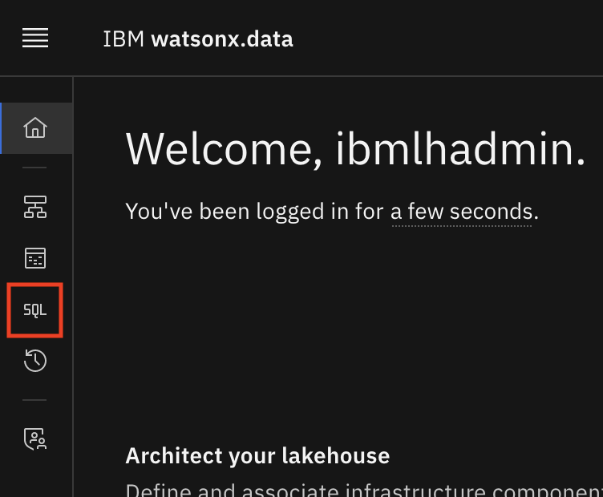
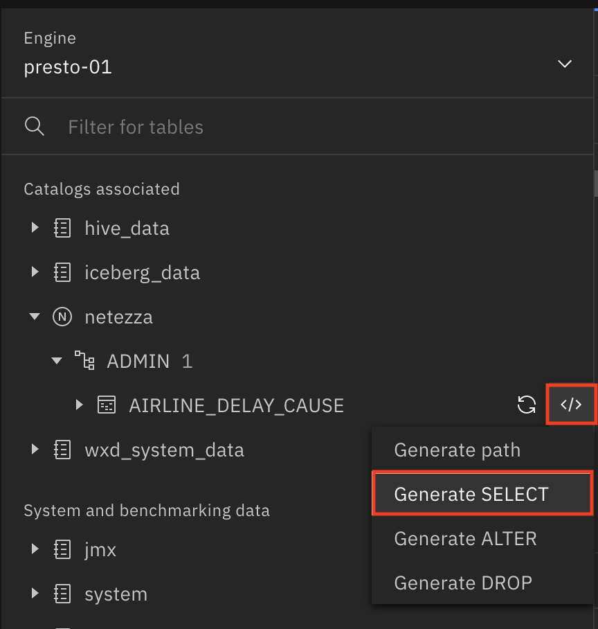
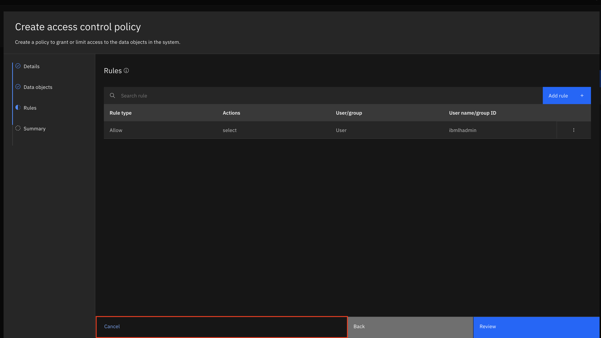

<QuizAlert text="¡Aviso! ¡El material del cuestionario se marcará así!" />

# 203: Modernización del almacén de datos Netezza

## Objetivo

El objetivo de este laboratorio es mostrar cómo se puede utilizar IBM watsonx.data para la modernización del almacén de datos para una instancia de Netezza Performance Server as a Service (NPSaaS) que se ejecuta en Microsoft Azure para mover una carga de trabajo a watsonx.data.

## Requisitos previos

### watsonx.data Medio ambiente

Este laboratorio requiere que ya disponga de un entorno IBM watsonx.data aprovisionado. Esto se hace en el **[Módulo 1: Configuración del entorno](/watsonx/watsonxdata/1)**.

## Configuración de un conector de almacén de datos para Presto

1.  Abra la consola (interfaz de usuario) de su **entorno watsonx.data** en una nueva ventana del navegador.


2.  En la interfaz de usuario de watsonx.data, seleccione el icono **Gestor de datos** en el menú de la izquierda.


3.  Haga clic en el menú desplegable **Crear** y seleccione **Crear esquema**.


4.  En la ventana emergente **Crear esquema**, seleccione **iceberg_data** para el **Catálogo** e introduzca `flight_delay` para el **Nombre**. El campo **Ruta** se establece automáticamente basándose en el nombre del esquema, pero puede anularse si es necesario. Sin embargo, **no** lo **cambie** aquí. Ahora haga clic en el botón **Crear**. El esquema **flight_delay** está ahora creado bajo el cubo **iceberg_data**.
5.  En la interfaz de usuario de watsonx.data, seleccione el icono **Administrador de infraestructuras** en el menú de la izquierda.


6.  Haga clic en el menú desplegable **Añadir componente** de la derecha y seleccione **Añadir base de datos**.


7.  En la ventana emergente **Añadir base de datos**, introduzca/seleccione la siguiente información para añadir la **base de datos Netezza Performance Server as a Service (NPSaaS) en Microsoft Azure** y, a continuación, haga clic en **Registrar**:

> **Nota:** El anfitrión del laboratorio le proporcionará las credenciales de la base de datos Netezza Performance Server as a Service (NPSaaS) en Microsoft Azure.

- **Tipo de base de datos:** IBM Netezza
- **Nombre de la base de datos:** `NZ_FLIGHTS`
- **Nombre para mostrar:** `NZ_FLIGHTS`
- **Nombre de host:** **Obtenido del host del laboratorio**
- **Puerto:** **Obtener de host de laboratorio**
- **Nombre de usuario:** **Get from lab host**
- **Contraseña:** **Obtenida del host del laboratorio**
- **Estado de la conexión:** Haga clic en **Probar conexión**. Si la prueba de conexión se realiza correctamente, el estado de la **conexión** mostrará **Exitoso**. **Nota:** Si la prueba no se ha realizado correctamente, recibirá un mensaje de error como el que se muestra a continuación con el motivo del fallo. Vuelva a introducir todos los campos y haga clic en **Volver a probar** para probar de nuevo la conexión. Las razones más comunes para que se produzca un error aquí son que ha escrito algo incorrectamente.
- **Conexión SSL:** Activa el interruptor de conexión **SSL**
- **Nombre de catálogo:** `netezza`

La base de datos Netezza se ha añadido a watsonx.data, pero no hay conexión entre el catálogo Netezza y el motor Presto (presto-01). Será necesario vincular ambos para utilizar el motor Presto para consultar la base de datos Netezza.

<QuizAlert text="Hay una pregunta de prueba relacionada con la adición de la conexión a Netezza." />

8.  En la sección **Catálogos**, pase el puntero del ratón sobre el mosaico **netezza** y aparecerá el icono **Gestionar asociaciones**. Haga clic en él.


9.  En la ventana emergente **Gestionar asociaciones**, seleccione la casilla de verificación del motor **presto-01** y, a continuación, haga clic en **Guardar y reiniciar motor**. Una línea debería conectar ahora el mosaico **presto-01** de la sección **Motores** con el mosaico **netezza** de la sección **Catálogos**. Esta conexión indica que los recursos están ahora asociados.

<QuizAlert text="Hay una pregunta de prueba relacionada con el acceso a su base de datos mediante el motor de consultas de Presto." />

10. En la interfaz de usuario de watsonx.data, seleccione el icono **Gestor de datos** en el menú de la izquierda.
11. Seleccione el catálogo **netezza** y expándalo. La tabla **AIRLINE_DELAY_CAUSE** debería aparecer en el esquema **ADMIN**, lo que indica que la conexión a la base de datos está operativa y funciona correctamente.


Aunque en esta sección se ha utilizado un conector de base de datos IBM Netezza, el proceso es idéntico para configurar el conector Presto para cualquier almacén de datos compatible. Se requerirá información comparable para cualquier almacén de datos que se añada (nombre de host de la base de datos, nombre de la base de datos, nombre de usuario y contraseña que tiene privilegios en la base de datos, el número de puerto de la base de datos, y si la conexión es Secure Sockets Layer (SSL) o no).

## Creación de tablas y carga de datos en watsonx.data

1.  En la ventana **Gestor de datos**, seleccione la tabla **AIRLINE_DELAY_CAUSE** en el esquema **ADMIN** y consulte la pestaña **Esquema de tabla** para ver la estructura de la tabla (nombres de columna, tipos de datos y si la columna es anulable).
2.  Desplácese a la pestaña **Muestra de datos** y examine el contenido de la tabla.


3.  Para hacerse una idea del volumen de datos de la tabla **AIRLINE_DELAY_CAUSE**, en la interfaz de usuario watsonx.data, seleccione el icono del **área de trabajo de consulta** en el menú de la izquierda.



4.  Despeje el editor SQL y pase el ratón por encima del símbolo **\</>** situado a la derecha del nombre de la tabla **AIRLINE_DELAY_CAUSE** y elija la opción **Generar SELECT**.



<QuizAlert text="Hay una pregunta de prueba relacionada con la generación de plantillas de consulta en el espacio de trabajo de consultas." />

5.  Edite la sentencia SQL generada para que se parezca a la sentencia SQL de abajo. A continuación, haga clic en el botón **Ejecutar en presto-01** de la derecha.

```sql
SELECT
  COUNT(*)
FROM
  "netezza"."ADMIN"."AIRLINE_DELAY_CAUSE";
```

El conjunto de resultados de la parte inferior de la ventana **Espacio de trabajo de consulta** indica que la tabla **AIRLINE_DELAY_CAUSE** de Netezza contiene **336.028** filas.

6.  Construir la sentencia CREATE TABLE AS SELECT (CTAS) es un proceso de dos pasos. Despeje el editor SQL y pase el cursor sobre el símbolo **\</>** a la derecha del esquema **flight_delay** bajo la entrada **iceberg_data** y elija la opción **Generar ruta**. En la subventana SQL, añada `CREATE TABLE` antes de la cadena de ruta y añada `."flight_delay_cause" AS` a la derecha de la información de la ruta. Asegúrese de que el cursor está al final de la sentencia al concluir el proceso de edición (después del AS). Su sentencia SQL debe parecerse a la siguiente sentencia SQL.

```sql
CREATE TABLE "iceberg_data"."flight_delay"."flight_delay_cause" AS
```

7.  Continuando con el segundo paso de la sentencia CTAS, pase el puntero del ratón sobre la entrada de la tabla Netezza **AIRLINE_DELAY_CAUSE** y seleccione el símbolo **\</>** situado a la derecha del nombre de la tabla y elija la opción **Generar SELECT**. La instrucción **SELECT** para la tabla Netezza **AIRLINE_DELAY_CAUSE** debe aparecer después de la parte **CREATE TABLE...AS** de la instrucción. Edite la instrucción **SELECT** generada para eliminar la parte **LIMIT 10** (no elimine el punto y coma ; delimitador). Su sentencia SQL debería parecerse a la que se muestra a continuación. A continuación, haga clic en el botón **Ejecutar en presto-01** de la derecha.

```sql
CREATE TABLE "iceberg_data"."flight_delay"."flight_delay_cause" AS SELECT
  *
FROM
  "netezza"."ADMIN"."AIRLINE_DELAY_CAUSE"
;
```

<QuizAlert text="Hay una pregunta de prueba relacionada con el conjunto de resultados de esta declaración SELECT" />

Una vez que la sentencia se haya ejecutado correctamente, debería haber una nueva tabla **flight_delay_cause** bajo el esquema **flight_delay** dentro del catálogo **iceberg_data**. La sentencia **CREATE TABLE...** tendrá una marca de verificación verde a la derecha para indicar que la ejecución se ha realizado correctamente y que las filas (recuento) de la nueva tabla son **336.028** (coincide con el recuento de filas de la tabla Netezza original).

Una vez creada una tabla y cargados los datos, es práctica común realizar una prueba rápida para asegurarse de que los datos de la tabla tienen un aspecto razonable y no hay problemas obvios con la nueva tabla. Una vez cargada la tabla **flight_delay_cause** como tabla Iceberg en el almacén de datos, el recuento de filas de la nueva tabla coincide con el recuento de filas de la tabla Netezza original. Como otra prueba, vamos a verificar que la tabla **flight_delay_cause** contiene el rango de fechas esperado (2003 a 2023) de datos. Esta prueba se llevará a cabo utilizando las partes del gestor de datos y del espacio de trabajo de consulta de la interfaz de usuario de watsonx.data.

<QuizAlert text="Hay una pregunta de prueba relacionada con la visualización de las definiciones de columnas de una tabla." />

8.  En la interfaz de usuario de watsonx.data, seleccione el icono **Gestor de datos** en el menú de la izquierda.
9.  Seleccione la tabla **flight_delay_cause** en el catálogo **iceberg_data** y observe las columnas definidas para la tabla. Como queremos verificar que se han cargado los meses y años de datos correctos, los nombres de columna necesarios son **MONTH** y **YEAR**.


10. En la interfaz de usuario de watsonx.data, seleccione el icono **Espacio de trabajo de consulta** en el menú de la izquierda.
11. Despeja el editor SQL y pasa el ratón por encima del símbolo **\</>** situado a la derecha de la tabla **flight_delay_cause** bajo la entrada **iceberg_data** y elige la opción **Generar SELECT**.
12. Edite la sentencia SQL generada para que se parezca a la sentencia SQL de abajo. A continuación, haga clic en el botón **Ejecutar en presto-01** de la derecha.

```sql
SELECT
  DISTINCT(YEAR)
FROM
  "iceberg_data"."flight_delay"."flight_delay_cause"
ORDER BY
  1;
```

<QuizAlert text="Hay una pregunta de prueba relacionada con el nombre de la tabla de consulta SQL." />

13. Al desplazarse por el conjunto de resultados en la parte inferior de la ventana (utilizando la tecla **>** en la parte inferior derecha) se verifica que la tabla contiene los datos de los años **2003** a **2023**. En combinación con la verificación anterior del recuento de filas, la tabla **flight_delay_cause** se ha trasladado correctamente a una tabla Iceberg.


## Privilegios de objeto

Una vez creadas las tablas y cargados los datos en el Data Lakehouse, el paso final es asegurarse de que las aplicaciones, individuos o grupos/roles necesarios han recibido el acceso requerido para poder utilizar los nuevos datos dentro del Data Lakehouse. Esta sección describe la concesión de privilegios a la tabla **flight_delay_cause** que se creó en la parte anterior de este laboratorio.

1.  En la interfaz de usuario de watsonx.data, seleccione el icono **Control de** acceso en el menú de la izquierda.


2.  Seleccione la fila **iceberg_data** para mostrar la ventana Control de acceso (por defecto).


3.  Por defecto, el rol **Admin** se asigna al nombre de usuario **ibmlhadmin** (el login utilizado al iniciar la UI de watsonx.data). Se pueden añadir accesos adicionales seleccionando el botón Añadir **acceso**. Al seleccionar Añadir acceso se mostrarán todos los nombres de usuario conocidos en watsonx.data lakehouse y se podrá conceder a estos nombres de usuario acceso al catálogo **iceberg_data**.
4.  Seleccione la pestaña **Objetos de datos** en la parte superior de esta ventana. Esto mostrará la tabla **flight_delay_cause** (ya que es el único objeto físico bajo **iceberg_data**). La información proporcionada en las pestañas es información que forma parte de otros menús dentro de la UI watsonx.data excepto para la pestaña **Time** Travel. **Time** Travel permite revertir una tabla a versiones anteriores de la misma para recuperarse de cambios no intencionados en la tabla. Dado que la tabla **flight_delay_cause** no tiene ninguna otra actividad excepto la carga inicial de datos, no es posible **realizar** Time Travel. Si hubiera varias entradas de **Time** Travel, la tabla podría revertirse a versiones anteriores de la tabla.


5.  Cerrar la ventana **iceberg_data** Control de acceso (por defecto).


6.  En la ventana principal de **Control de acceso**, seleccione la pestaña **Políticas** en la parte superior. No hay políticas definidas, ya que en esta ventana no se muestran entradas. Seleccione el botón **Añadir política** para entender una política de watsonx.data y lo que define una política.


7.  El primer panel solicita información básica, como el **nombre de la política** y una **descripción** (opcional). Por defecto, la política está **Inactiva** al crearse, y esta es una buena práctica a mantener (puede activar la política después de crearla y verificar que es correcta). Dé a la política el nombre `flightdelaycausepolicy` y seleccione el botón **Siguiente** para continuar.
8.  En el siguiente panel seleccione **iceberg_data** para el catálogo, **flight_delay** para el esquema, **flight_delay_cause** para la tabla, **all** para las columnas de la tabla, y seleccione el botón **Siguiente** para continuar.

<QuizAlert text="Hay una pregunta de prueba relacionada con la visualización de las definiciones de columnas de una tabla." />

9.  El siguiente panel permite definir reglas seleccionando el botón **Añadir regla**. El panel no muestra ninguna regla, ya que no hay ninguna definida por defecto. Seleccione el botón Añadir **regla**. Esto muestra otra ventana para introducir que permiten reglas de acceso específicas como acciones (crear, soltar, alterar, insertar, seleccionar y truncar) y qué grupos o usuarios incluir en la regla. Seleccione **Permitir** para el **tipo de Regla**, **seleccionar** para las **Acciones**, **Usuarios** para los **Usuarios/grupos**, **ibmlhadmin** para el **usuario Seleccionar**, y seleccione el botón **Añadir** para añadir la nueva regla.


10. Dado que esta imagen de watsonx.data Developer no tiene usuarios adicionales (sólo ibmlhadmin) ni grupos definidos, no es necesario continuar con el Control de **acceso**. Seleccione el botón **Cancelar** para salir de la ventana **Crear política de** control de acceso.



### Enhorabuena, ha llegado al final del laboratorio 203.

Haga clic en [IBM](/watsonx/watsonxdata) watsonx.data para ir a la página de inicio de IBM watsonx.data.
