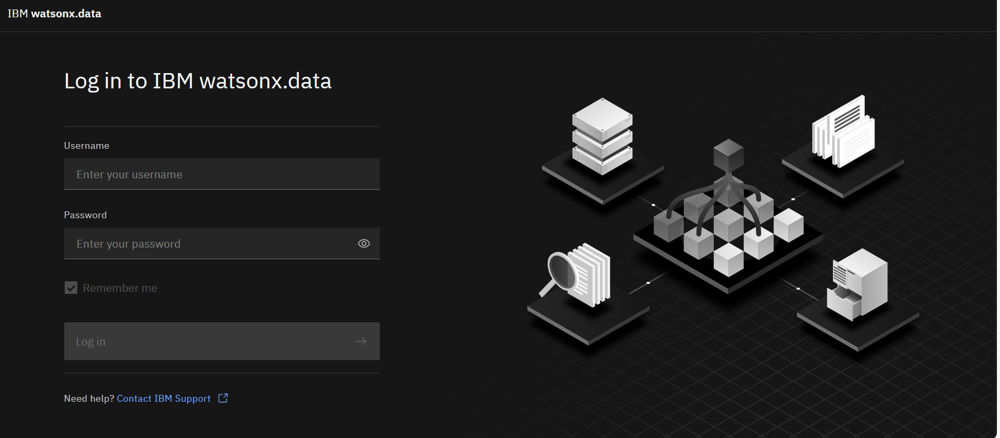
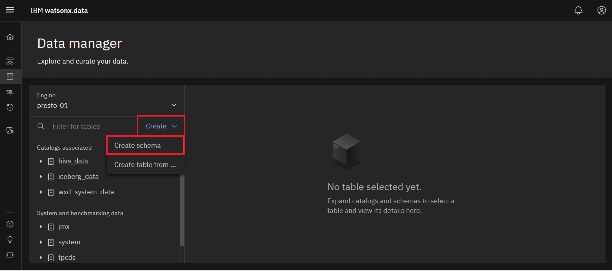
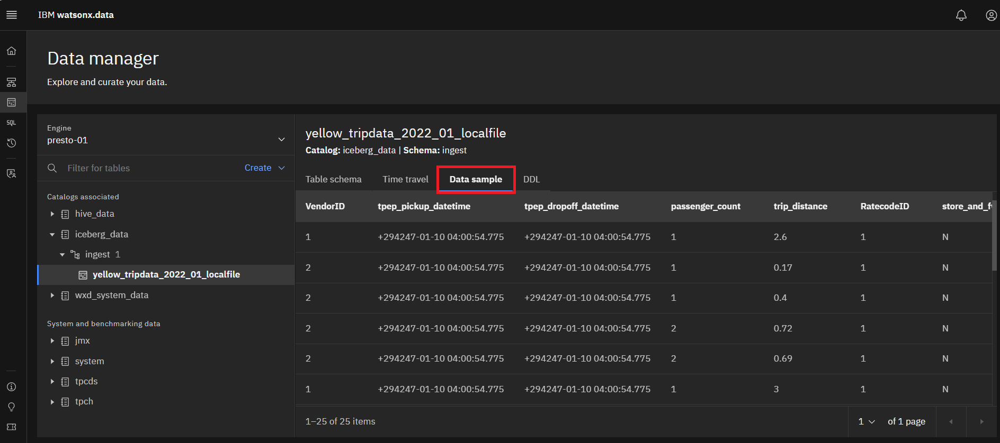
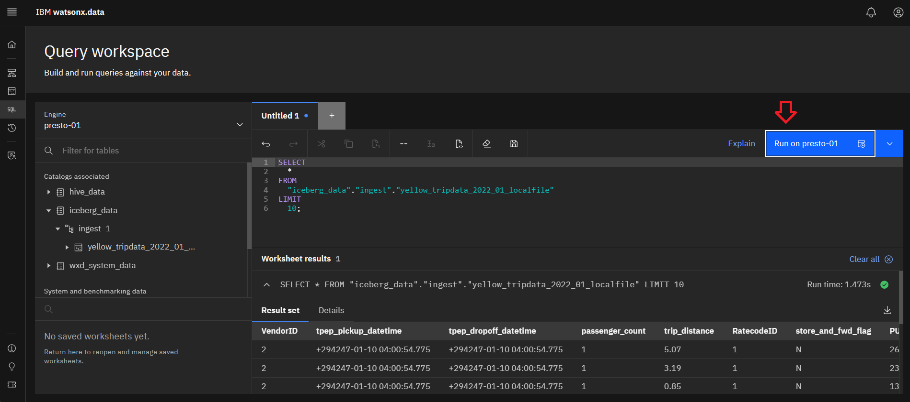

<QuizAlert text='Heads Up! Quiz material will be flagged like this!' />

# 204: Data Ingestion

Data ingestion is the process of importing and loading data into IBM® watsonx.data. One 
approach is to use the Ingestion jobs tab from the Data manager page to load data securely and 
easily into watsonx.data console (**NOTE**: This is only available in Standard Edition). Data 
ingestion in watsonx.data console or in the ibm-lh command line utility supports CSV and 
Parquet formats. The files that are ingested in a single ingestion command must be of the same 
format type and schema. watsonx.data auto discovers the schema based on the source file 
being ingested.

You can also load or ingest local data files or ingest data from external sources using the ibm-lh
tool. The ibm-lh command-line utility is a terminal-based interface that is designed to facilitate 
interaction with watsonx.data resources. 

This lab uses the ingest tool (ibm-lh) alongside the IBM watsonx.data Developer Edition that is 
running in this lab. The Ingest tool is a separate install and currently needs to be downloaded 
after IBM watsonx.data is started. The lab image (Developer Edition) contains a copy of this code 
so you will not need to download it.


In this section you will connect to your watsonx.data environment. The watsonx.data server 
automatically starts all services. To check the status of the server, run the following commands
using the instructions provided in **Command Line Access** of the [1: Environment Setup](/watsonx/watsonxdata/1#command-line-access):

1. Open a terminal window and enter the following command to connect to the watsonx.data 
server.
 
**Note:** Replace the port, region, and techzone-server in the SSH command below with the 
values provided for your environment in the TechZone reservation email.
  ```bash
ssh -p port watsonx@region.techzone-server.com
  ```

2. Enter a password of: **watsonx.data**

3. Switch to the root user by entering the following command:
 ```bash
sudo su - 
```

4. Switch to the client bin directory by entering the following command:
```bash
cd /root/ibm-lh-client/bin
```

### Ingest data into IBM watsonx.data

Before running the utility, you need to retrieve several credentials for MinIO and the keystore 
password.

1. While still in the /root/ibm-lh-dev/bin directory, enter following commands to extract the 
credentials. You need to generate three export lines and create a directory that will be used 
later in another script.
``` bash
export LH_S3_ACCESS_KEY=$(docker exec ibm-lh-presto \
printenv | grep LH_S3_ACCESS_KEY | sed 's/.*=//')
```
``` bash
export LH_S3_SECRET_KEY=$(docker exec ibm-lh-presto \
printenv | grep LH_S3_SECRET_KEY | sed 's/.*=//')
```
``` bash 
export LH_KEYSTORE_PASSWORD=$(docker exec ibm-lh-presto \
printenv | grep LH_KEYSTORE_PASSWORD | sed 's/.*=//')
```

2. Run the following commands to create the staging directory. The staging directory is used to 
move files between this system and the docker container where the **ibm-lh command-line 
utility** is running.
``` bash
export staging=/root/ibm-lh-client/localstorage/volumes/infra/staging
```
``` bash
mkdir -p ${staging}
cat <<EOF > ${staging}/keys.sh
#!/bin/bash
export access_key=$LH_S3_ACCESS_KEY
export secret_key=$LH_S3_SECRET_KEY
export keystore_password=$LH_KEYSTORE_PASSWORD
EOF
chmod +x ${staging}/keys.sh
```

3. Run the following commands to copy the MinIO SSL certificate from the docker container to 
staging directory. The MinIO SSL certificate is needed for copying operation to take place. In 
addition, the file that you want loaded into watsonx.data will be moved into the staging file 
directory.
``` bash
docker cp ibm-lh-presto:/mnt/infra/tls/lh-ssl-ts.jks \
${staging}/lh-ssl-ts.jks
cp -f /sampledata/yellow_tripdata_2022-01.parquet \
${staging}/
```
### Create a hive schema for staging the ingest file

Before ingesting the file, you need to create a new schema for the table you are creating and 
loading. You will create the schema using the watsonx.data user interface. Your TechZone 
reservation email will include the URL of your watsonx.data user interface.

1. Log in to the IBM watsonx.data console:
The URL to the watsonx.data console can be found in your TechZone reservation email 
details (see the **Watsonx UI** line in the Published services section).

   **•** Enter **ibmlhadmin** in the **Username** field.

   **•** Enter **password** in the **Password** field.
   
   **•** Click the **Log in** button.

    

2. Click the **Data manager** icon from the left-side menu.
  


3. Click the **Create** dropdown menu and select **Create schema**.
  


4. In the Create schema dialog, perform the following steps:

    **•** Click the **Catalog** dropdown menu and select **hive_data**.

    **•** Enter **staging** in the **Name** field.
  
    **•** Click the blue **Create** button.
  


  You should see the new **staging** schema under **hive_data** catalog in the **Catalogs associated** 
  section.

5. Repeat step 3 to create another schema. In the **Create schema** dialog, perform the following 
steps:

    • Click the **Catalog** dropdown menu and select **iceberg_data**.

    • Enter **ingest** in the **Name** field.

    • Click the blue **Create** button.
    


### Ingest using ibm-lh command-line utility

You will use the ibm-lh command line utility to ingest data. You will leave the watsonx.data UI 
for now to do the next steps in the command line window.

1. To access the ibm-lh command line utility, enter the following command:
``` bash
./ibm-lh data-copy
```
2. Once inside the utility, run the following command to get more details on the **data-copy** 
option.
``` bash
ibm-lh data-copy -help
```
3. Run the following command to exit the tools container.
``` bash
exit
```
4. Run the following script to ingest the taxi data (yellow_tripdata_2022_01.parquet) into the 
yellow_tripdata_2022_01_localfile table in watsonx.data.
``` bash
cat <<EOF > ${staging}/ingest-local.sh
#!/bin/bash
dir=/mnt/infra/staging
cd \${dir}
source ./keys.sh
table_name="iceberg_data.ingest.yellow_tripdata_2022_01_localfile"
file="yellow_tripdata_2022-01.parquet"
export STAGING_S3_CREDS="AWS_SECRET_ACCESS_KEY=\${secret_key}\\
,AWS_ACCESS_KEY_ID=\${access_key}\\
,AWS_REGION=us-east-1\\
,BUCKET_NAME=iceberg-bucket\\
,ENDPOINT_URL=http://ibm-lh-minio:9000"
ibm-lh data-copy \\
 --source-data-files \${dir}/\${file} \\
 --target-tables \${table_name} \\
 --ingestion-engine-endpoint "hostname=ibm-lh-presto-svc,port=8443" \\
 --staging-location s3://iceberg-bucket/ingest/ \\
 --staging-hive-catalog hive_data \\
 --staging-hive-schema staging \\
 --create-if-not-exist \\
 --trust-store-path \${dir}/lh-ssl-ts.jks \\
 --trust-store-password \${keystore_password} \\
 --dbuser ibmlhadmin \\
 --dbpassword password
EOF
```
``` bash
sed -i '/^$/d' ${staging}/ingest-local.sh
```
``` bash
chmod +x ${staging}/ingest-local.sh
```
5. Run the following command to start the ibm-lh command line utility again:
``` bash 
./ibm-lh data-copy 
```
6. Now run the ingest job inside the tool container by executing the following command:
``` bash
/mnt/infra/staging/ingest-local.sh
```
7. After ingesting the data, exit the command line utility.
``` bash
exit
```
8. Go back to the IBM watsonx.data UI. From the **Data manager** section, Expand the 
**iceberg_data** catalog in the **Catalogs associated** area and then expand the **ingest** schema.
    

9. Select the **yellow_tripdata_2021_01_localfile** table to see the table definition. Select the 
**Table schema** tab to view the table schema if not already selected.
    

10. Select the **Data sample** tab to see a sample of the data.
    

11. Now you can use the UI to run a query against this imported data. Select the 
**Query workspace (SQL)** icon from the left side menu.
    

12. On the line where the **yellow_tripdata_2022_01_localfile** table is located, click the 
**Query templates** icon at the end of the name. This will display a drop-down list. Select
**Generate SELECT**
    

This generates SQL SELECT statement in the window to the right of the table name.
    

13.In order to review the results, execute the query by clicking on the blue 
**Run on presto-01 button**.
    

### Summary
You have now completed the lab!
In this lab you ingested data by using the watsonx.data ibm-lh command-line utility and ran 
a SQL statement to query the data that was ingested.

### Congratulations, you've reached the end of lab 204.

Click, [lab 106](/watsonx/watsonxdata/106) to start next lab.
