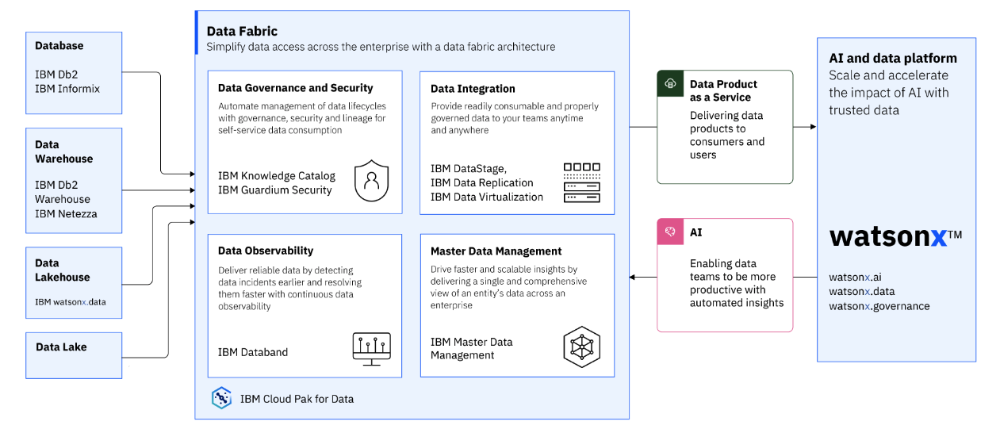

# Datos como producto: IBM watsonx.data & IBM Cloud Pak for Data

## Fabric Data Fabric con IBM

*   El tejido de datos es un enfoque arquitectónico para simplificar el acceso a los datos.

*   IBM Cloud Pak for Data está diseñado para un entramado de datos-no es necesario ningún ensamblaje.

    

## Malla de datos con IBM

*   La malla de datos es un enfoque organizativo de la gestión y distribución de datos.

*   IBM watsonx.data está diseñado como un archivo de datos, optimizado para todas las cargas de trabajo de datos e IA para habilitar la capacidad de malla de datos.

    

Los datos de IBM watsonx.se combinan fácilmente con IBM Cloud Pak for Data proporcionando un **tejido de datos **y a **malla de datos **solución para clientes.

## Datos como un producto con IBM

*   IBM Cloud Pak for Data y watsonx se combinan para proporcionar datos como una capacidad del producto.

*   IBM Cloud Pak for Data proporciona la interconexión de datos, el gobierno de datos y la integración de datos para el proceso de datos.

*   IBM Cloud Pak for Data (CP4D) proporciona la plataforma de tejido de datos que proporciona la infraestructura, servicios esenciales, gestión y herramientas de gobierno para el entorno de datos.

*   IBM watsonx.data proporciona la capacidad de malla de datos que permite la gestión independiente de cada dominio de datos y permite que esos dominios de datos abarquen varias ubicaciones, pero se vean como un único lago de datos.

*   IBM watsonx proporciona el gobierno y los controles de los modelos y componentes de IA para garantizar modelos fiables y explicables.

    

## Algunas preguntas comunes sobre IBM Cloud Pak for Data y watsonx

  
Does IBM watsonx.data will replace IBM Cloud Pak for Data (CP4D) ?

  No. IBM watsonx.data is not a replacement for IBM Cloud Pak for Data. It is another data source that can be part of a client’s data fabric architecture.

  IBM Cloud Pak for Data provides the enterprise-wide data fabric that all clients need to implement a modern data foundation for their businesses.

  Meanwhile, IBM watsonx platform has both traditional AI, Generative AI and Foundation Models as the underlying reason that the platform was created.

  
Why do we need IBM watsonx, when IBM Cloud Pak for Data (CP4D) already provides data source and data governance capabilities?

  IBM Cloud Pak for Data focuses on delivering a data fabric for organizations, while IBM Watsonx is an AI platform emphasizing foundation models and generative AI, offering trusted and explainable AI models.

  Watsonx.data serves as a cost-efficient data lakehouse, managing hybrid cloud data sources, and using open-source tech for data access. Watsonx.governance ensures model transparency. If AI isn't your goal, Watsonx.ai and governance may not be necessary.

  Watsonx complements IBM CP4D and can be used with it. Watsonx.data is also available as a cartridge to enhance CP4D’s data sources, enabling data mesh.

  
We use a CP4D system today, which has Db2 Warehouse as our data repository. What advantage would watsonx.data provide us today?

  If your data analytics currently rely solely on Db2 Warehouse, watsonx.data won't offer any immediate benefits. However, if you anticipate expanding your data sources in the future, especially with a mix of on-premises and cloud data, watsonx.data becomes valuable.

  It enables seamless integration of diverse data sources in the hybrid cloud, allowing you to add public cloud test data and optimize query costs efficiently.

  Unlike Db2 Warehouse's single query engine, watsonx.data ensures cost-effective compute resources, crucial for budget management in a cloud environment where performance needs vary.

  
How does IBM watsonx.data differ from other data sources available with IBM Cloud Pak for Data (CP4D)?

  Data sources like Db2 Warehouse and OEM databases (MongoDB, SingleStore, EDB, etc) in IBM CP4D use separate query engines with distinct SQL dialects, requiring users to learn different query syntax.

  Switching between databases is the only way to optimize compute resources, but it necessitates changing the query syntax.

  IBM watsonx.data offers a unified SQL syntax for all queries accessing Apache Iceberg tables, even if these tables are distributed across various locations in the hybrid cloud. This enables data separation for creating a data mesh architecture alongside IBM CP4D's data fabric.

