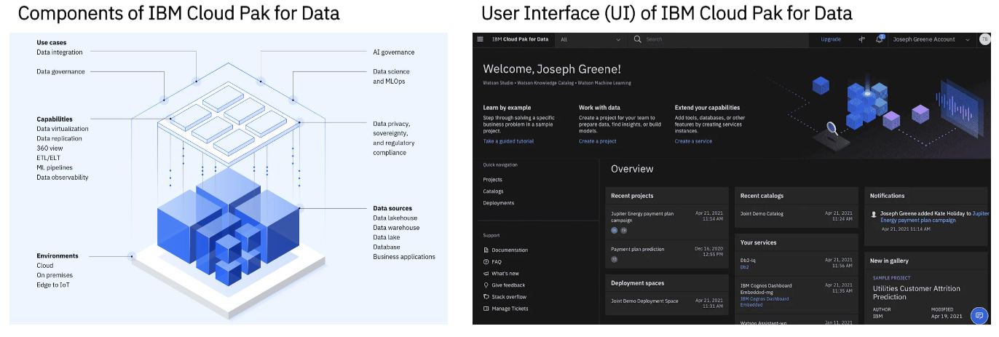

# Data as a Product: IBM watsonx.data & IBM Cloud Pak for Data

## Data Fabric with IBM

- Data fabric is an architectural approach to simplifying access to data. 
- IBM Cloud Pak for Data is designed for a data fabric– no assembly required.

  

## Data Mesh with IBM

- Data mesh is an organizational approach of managing and distributing data.
- IBM watsonx.data is designed as a data lakehouse, optimized for all data and AI workloads to enable data mesh capability.

  

IBM watsonx.data is easily combined with IBM Cloud Pak for Data providing a **data fabric** and a **data mesh** solution for clients.

  

## Data as a Product with IBM

- IBM Cloud Pak for Data and watsonx combine to provide Data as a Product capability.
- IBM Cloud Pak for Data provides the data pipeline, data governance, and data integration for data processing.
- IBM Cloud Pak for Data (CP4D) provides the data fabric platform that provides the infrastructure, essential services, management, and governance tools for your data environment.
- IBM watsonx.data provides the data mesh capability that allows separate management of each data domain and allows those data domains to span multiple locations but be viewed as a single data lakehouse.
- IBM watsonx provides the governance and controls for the AI models and components to ensure trustworthy and explainable models.

  

## Some common questions regarding IBM Cloud Pak for Data and watsonx

  
Does IBM watsonx.data will replace IBM Cloud Pak for Data (CP4D) ?

    No. IBM watsonx.data is not a replacement for IBM Cloud Pak for Data. It is another data source that can be part of a client’s data fabric architecture. 
    
    IBM Cloud Pak for Data provides the enterprise-wide data fabric that all clients need to implement a modern data foundation for their businesses.
    
    Meanwhile, IBM watsonx platform has both traditional AI, Generative AI and Foundation Models as the underlying reason that the platform was created.

  
Why do we need IBM watsonx, when IBM Cloud Pak for Data (CP4D) already provides data source and data governance capabilities?

    IBM Cloud Pak for Data focuses on delivering a data fabric for organizations, while IBM Watsonx is an AI platform emphasizing foundation models and generative AI, offering trusted and explainable AI models.
    
    Watsonx.data serves as a cost-efficient data lakehouse, managing hybrid cloud data sources, and using open-source tech for data access. Watsonx.governance ensures model transparency. If AI isn't your goal, Watsonx.ai and governance may not be necessary. 
    
    Watsonx complements IBM CP4D and can be used with it. Watsonx.data is also available as a cartridge to enhance CP4D’s data sources, enabling data mesh.

  
We use a CP4D system today, which has Db2 Warehouse as our data repository. What advantage would watsonx.data provide us today?

    If your data analytics currently rely solely on Db2 Warehouse, watsonx.data won't offer any immediate benefits. However, if you anticipate expanding your data sources in the future, especially with a mix of on-premises and cloud data, watsonx.data becomes valuable.

    It enables seamless integration of diverse data sources in the hybrid cloud, allowing you to add public cloud test data and optimize query costs efficiently. 
    
    Unlike Db2 Warehouse's single query engine, watsonx.data ensures cost-effective compute resources, crucial for budget management in a cloud environment where performance needs vary.
    

  
How does IBM watsonx.data differ from other data sources available with IBM Cloud Pak for Data (CP4D)?

    Data sources like Db2 Warehouse and OEM databases (MongoDB, SingleStore, EDB, etc) in IBM CP4D use separate query engines with distinct SQL dialects, requiring users to learn different query syntax.

    Switching between databases is the only way to optimize compute resources, but it necessitates changing the query syntax. 
    
    IBM watsonx.data offers a unified SQL syntax for all queries accessing Apache Iceberg tables, even if these tables are distributed across various locations in the hybrid cloud. This enables data separation for creating a data mesh architecture alongside IBM CP4D's data fabric.
    

