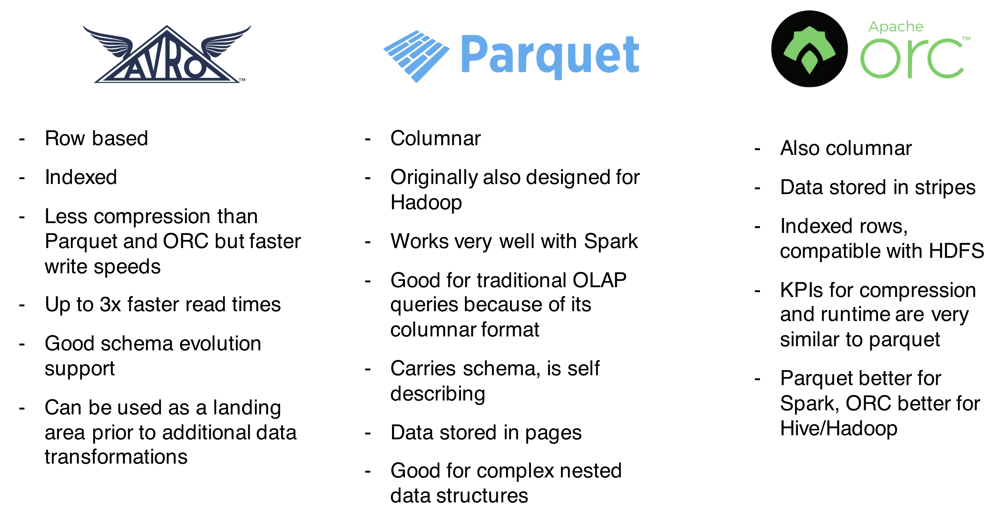

# Relevant open source technologies

**PrestoDB**

- Open Source, distributed SQL query engine, designed for fast analytics queries against data of any size
- Queries on data where it lives using ANSI SQL across federated and diverse sources
- Supports both relational and non-relational sources
- Also supports open source file types (ORC, Parquet, Avro, RCFile, SequenceFile, JSON, Text, CSV)
- Excellent for connecting business intelligence tools to various data sources

- Uses an architecture similar to classic massively parallel processing database management systems
- One coordinator node working in sync with multiple worker nodes
- Query gets submitted to the coordinator which uses presto’s custom query and execution engine to parse, plan, and schedule a distributed query plan across the worker nodes
- Designed to support standard ANSI SQL semantics, including complex queries, aggregation, joins, left/right joins, subqueries, window functions, distinct counts, and approximate percentiles

**Hive Metastore**

Central storage point for all the meta-information about your data storages

 - Central repository for lakehouse query engines
 - Stores metadata information about connected tables, views, partitions, columns, and their respective schemas
 - Stores information such as the schema of tables, their column names, types, and partitioning information

    • This information is used by the query engines to optimize query execution and improve performance

    • Tracks the location of data stored in the storage systems, making it easier for the query engine to access and process the data

    • Typically implemented as a relational database, such as MySQL, PostgreSQL, or Oracle

    • Handles concurrent access and provides high availability and fault tolerance

**File Formats**

  

**Open Source Table Formats**
 - Separation of compute, data, and storage
 - Leverage low-cost, infinitely scalable object storage
 - Standardized
  
  • open file formats (Parquet, ORC, DWRF, JSON, …)

  • table formats (Apache Iceberg, LF Delta, Apache Hudi)

 - Accessed by scalable compute engines of choice (Presto, Spark, etc.)

  

  

**ICEBERG**

Open table format for huge analytic datasets

- **Schema Evolution** supports add, drop, update, or rename, and has no side-effects
- **Hidden partitioning** prevents user mistakes that cause silently incorrect results or extremely slow queries
- **Partition layout evolution** can update the layout of a table as data volume or query patterns change
- **Time travel** enables reproducible queries that use exactly the same table snapshot, or lets users easily examine changes
- **Version rollback** allows users to quickly correct problems by resetting tables to a good state
- **Advanced filtering** data files are pruned with partition and column-level stats, using table metadata

  • Originally designed to solve correctness problems in eventually-consistent cloud object stores

- **Works with any cloud store** and reduces NN congestion when in HDFS, by avoiding listing and renames
- **Serializable isolation** table changes are atomic and readers never see partial or uncommitted changes
- **Multiple concurrent writers** use optimistic concurrency and will retry to ensure that compatible updates succeed, even when writes conflict
