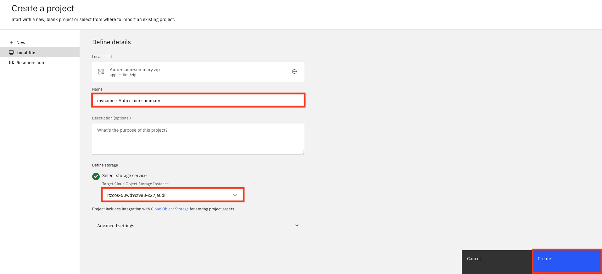
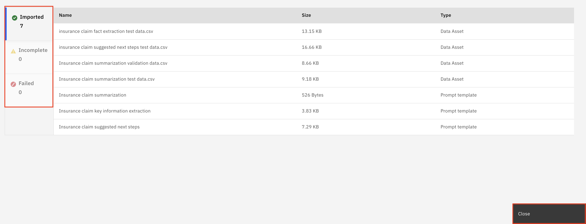
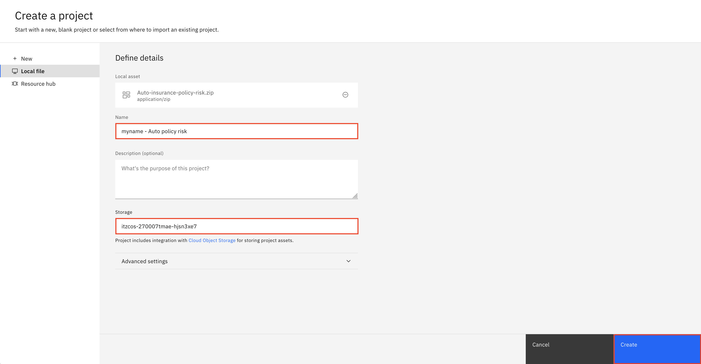

# Set up an IBM watsonx.ai project

### Set up an IBM watsonx.ai project

- To learn how to set up an IBM watsonx.ai project with a **generative** AI model, continue to [Set up an IBM watsonx.ai project with a **generative** AI model](#set-up-an-ibm-watsonxai-project-with-a-generative-ai-model)
- To learn how to set up an IBM watsonx.ai project with a **predictive** AI model, continue to [Set up an IBM watsonx.ai project with a **predictive** AI model](#set-up-an-ibm-watsonxai-project-with-a-predictive-ai-model)

## Set up an IBM watsonx.ai project with a **generative** AI model

In this lab, you will create an IBM watsonx.ai project that will contain all the assets used to deploy and work with a **generative** AI model you will be governing.

### Create the project

1. Download the [Auto-claim-summary.zip](https://raw.githubusercontent.com/ibm-build-lab/VAD-VAR-Workshop/main/content/Watsonx/WatsonxGov/files/Auto-claim-summary.zip) project file to your local machine.

2. In the IBM watsonx platform, click on the **Navigation Menu** in the upper left to expand it. Locate the **Projects** section of the menu, expanding it if necessary, and click on **View all projects**.

3. Click the blue **New project** button on the right.

4. Select the **Local file** option in the **Create a project** window and press **Browse** and locate the **Auto-claim-summary.zip** project file you downloaded in step one and upload it.

5. Once the file has been uploaded, fill out the information below and then press the **Create** button:

- **Name:** Give your project a name that includes some identifying information and the purpose it will be used for (ex. `<your initials or unique string> - Auto claim summary`).
- **Select storage service:** Select a Cloud Object Storage instance to hold your project data.

You have successfully created an IBM watsonx.ai project.

### Verify and configure the project

When importing a project from a file, it's critical to ensure that all the resources import successfully, since the project tool will report that creation was successful even if one or more resources failed to import.

1. Once the project has been successfully created, click the **View import summary** button, and ensure that nothing is listed in the **Incomplete** or **Failed** categories on the left of the screen. Once the project has successfully imported and verified, click the **Close** button to take you to your newly created project.

2. Click the **Manage** tab. On the **Manage** tab, click the **Services & integrations** item from the menu on the left and then click the blue **Associate service** button on the right. A list of services will appear in a table.

3. Locate the appropriate **machine learning service** for the account in the table. The **Type** column should say **Watson Machine Learning**. Check the box to the left of the service and then click the blue **Associate button**.

You have successfully configured the project and it is now ready to use.

### Congratulations, you've reached the end of lab 103 for setting up an IBM watsonx.ai project with a **generative** AI model.

Click, **[lab 104](/watsonx/watsonxgov/104)** to start next lab.

## Set up an IBM watsonx.ai project with a **predictive** AI model

In this lab, you will create an IBM watsonx.ai project that will contain all the assets used to deploy and work with a **predictive** AI model you will be governing.

### Create the project

1. Download the [Auto-insurance-policy-risk.zip](https://raw.githubusercontent.com/ibm-build-lab/VAD-VAR-Workshop/main/content/Watsonx/WatsonxGov/files/Auto-insurance-policy-risk.zip) project file to your local machine.

2. In the IBM watsonx platform, click on the **Navigation Menu** in the upper left to expand it. Locate the **Projects** section of the menu, expanding it if necessary, and click on **View all projects**.

3. Click the blue **New project** button on the right.

4. Select the **Local file** option in the **Create a project** window and press **Browse** and locate the **Auto-insurance-policy-risk.zip** project file you downloaded in step one and upload it.

5. Once the file has been uploaded, fill out the information below and then press the **Create** button:

- **Name:** Give your project a name that includes some identifying information and the purpose it will be used for (ex. `<your initials or unique string> - Auto policy risk`).
- **Select storage service:** Select a Cloud Object Storage instance to hold your project data.

You have successfully created an IBM watsonx.ai project.

### Verify and configure the project

When importing a project from a file, it's critical to ensure that all the resources import successfully, since the project tool will report that creation was successful even if one or more resources failed to import.

1. Once the project has been successfully created, click the **View import summary** button, and ensure that nothing is listed in the **Incomplete** or **Failed** categories on the left of the screen. Once the project has successfully imported and verified, click the **Close** button to take you to your newly created project.

2. Click the **Manage** tab. On the **Manage** tab, click the **Services & integrations** item from the menu on the left and then click the blue **Associate service** button on the right. A list of services will appear in a table.

3. Locate the appropriate **machine learning service** for the account in the table. The **Type** column should say **Watson Machine Learning**. Check the box to the left of the service and then click the blue **Associate button**.

You have successfully configured the project and it is now ready to use.

### Congratulations, you've reached the end of lab 103 for setting up an IBM watsonx.ai project with a **predictive** AI model.

Click, **[lab 104](/watsonx/watsonxgov/104)** to start next lab.
