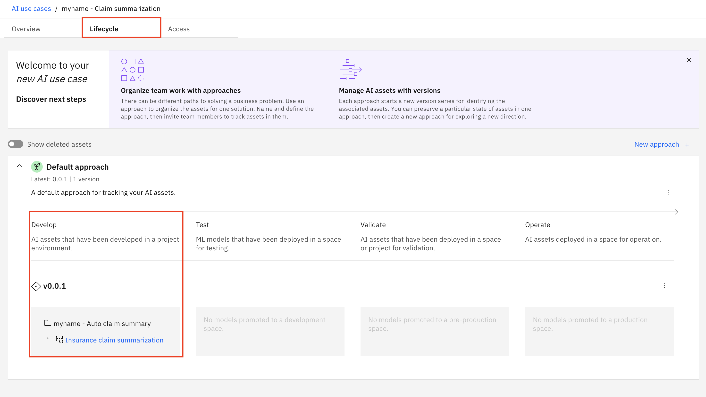
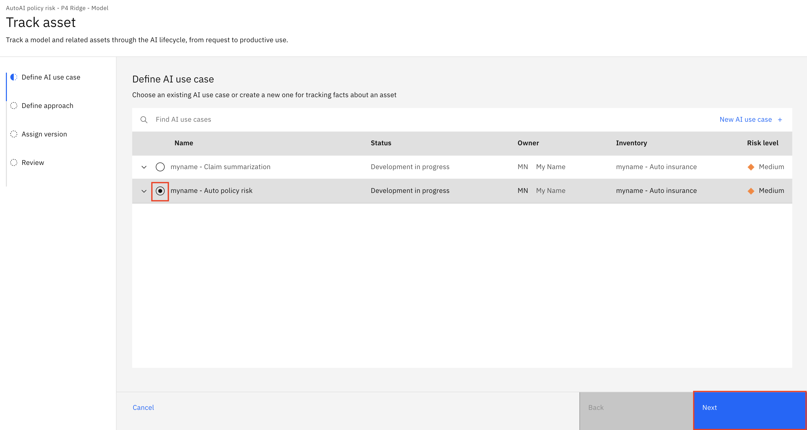

<QuizAlert text='Heads Up! Quiz material will be flagged like this!' />

# Track an AI model

### Track an AI model

- To learn how to track a **generative** AI model, continue to [Track a **generative** AI model](#track-a-generative-ai-model)
- To learn how to track a **predictive** AI model, continue to [Track a **predictive** AI model](#track-a-predictive-ai-model)

## Track a **generative** AI model

In this lab, you will configure model tracking for governing a **generative** AI model trained to summarize insurance claims.

### Configure model tracking

1. In the IBM watsonx platform, click on the **Navigation Menu** in the upper left to expand it. Locate the **Projects** section of the menu, expanding it if necessary, and click on **View all projects**.

  

2. Select your **generative** AI project that you created in **lab 103** (ex. `<your initials or unique string> - Auto claim summary`).

  

3. Click on the **Assets** tab of the project. From the list of assets, locate the **Insurance claim summarization** entry and click on the three dots to the right to expand the context menu. Click on **View AI factsheet** from the menu.

  

4. In the **Governance** section of the **AI Factsheet**, click on the **Track in AI use case** button.

  

5. Click the radio button to the left of the AI use case you created in **lab 102** (ex. `<your initials or unique string> - Claim summarization`). Click **Next**.

  

6. When asked to **Define approach**, leave **Default approach** selected and click **Next**. When asked to assign a model version, leave **Experimental** selected and click **Next**. Note that you can manually assign a version number here, or choose a more production-ready version number depending on the state of the model. Click **Track asset** to start tracking the model.

7. Note that the **Governance** section of the **AI Factsheet** now contains information on the associated AI use case, approach used, model version, and lifecycle phase (**Develop**).

You have successfully configured model tracking for a **generative** AI model.

### View the updated AI use case with the tracked model

1. In the upper right corner of the **Governance** section of the **AI Factsheet**, click the **View details** arrow to take you to your associated AI use case.

  

2. Click on the **Lifecycle** tab, then scroll down to the map of models contained in the **Default approach** section. Note that there are four lifecycle sections listed (**Develop**, **Test**, **Validate**, and **Operate**). The tracked model has not yet been promoted to a deployment space, so it is listed in the **Develop** section of the lifecycle.

  

  > **Note:** the **Lifecycle** tab of the **AI use case** is useful for stakeholders and business users to get a quick overview of all the models attempting to address a particular issue, with the ability to drill down for more information as necessary, all without needing access to the project where the developers and data engineers are working.

You have successfully enabled model tracking, and can now observe the changes as the model goes through the lifecycle.

### Congratulations, you've reached the end of lab 104 for tracking a **generative** AI model.

Click, **[lab 105](/watsonx/watsonxgov/105)** to start next lab.

## Track a **predictive** AI model

In this lab, you will configure model tracking for governing a **predictive** AI model trained to assess the risk associated with auto insurance policies.

### Configure model tracking

1. In the IBM watsonx platform, click on the **Navigation Menu** in the upper left to expand it. Locate the **Projects** section of the menu, expanding it if necessary, and click on **View all projects**.

  

2. Select your **predictive** AI project that you created in **lab 103** (ex. `<your initials or unique string> - Auto policy risk`).

  

3. Click on the **Assets** tab of the project. From the list of assets, locate and click on the **AutoAI policy risk - P4 Ridge - Model** entry to open the model information screen.

  

4. In the **Track this model** section of the model information screen, click on the **Track this model** button.

  

5. Click the radio button to the left of the AI use case you created in **lab 102** (ex. `<your initials or unique string> - Auto policy risk`). Click **Next**.

  

6. When asked to **Define approach**, leave **Default approach** selected and click **Next**. When asked to assign a model version, leave **Experimental** selected and click **Next**. Note that you can manually assign a version number here, or choose a more production-ready version number depending on the state of the model. Click **Track asset** to start tracking the model.

You have successfully configured model tracking for a **predictive** AI model.

### View the updated AI use case with the tracked model

1. In the **Track this model** section of the model information screen, click on the **Open in AI use case** button.

  

2. Click on the **Lifecycle** tab, then scroll down to the map of models contained in the **Default approach** section. Note that there are four lifecycle sections listed (**Develop**, **Test**, **Validate**, and **Operate**). The tracked model has not yet been promoted to a deployment space, so it is listed in the **Develop** section of the lifecycle.

  

  > **Note:** the **Lifecycle** tab of the **AI use case** is useful for stakeholders and business users to get a quick overview of all the models attempting to address a particular issue, with the ability to drill down for more information as necessary, all without needing access to the project where the developers and data engineers are working.

You have successfully enabled model tracking, and can now observe the changes as the model goes through the lifecycle.

### Congratulations, you've reached the end of lab 104 for tracking a **predictive** AI model.

Click, **[lab 105](/watsonx/watsonxgov/105)** to start next lab.
