<QuizAlert text="¡Aviso! ¡El material del cuestionario se marcará así!" />

# Evaluar un modelo de IA

### Evaluar un modelo de IA

*   Para saber cómo evaluar un modelo de IA **generativa**, continúe en [Evaluar un modelo de IA **generativa**](#evaluar-un-modelo-de-ia-generativa)
*   Para saber cómo evaluar un modelo de IA **predictivo**, continúe en [Evaluar un modelo **predictivo** de IA](#evaluar-un-modelo-predictivo-de-ia)

## Evaluar un modelo de IA **generativa**

En este laboratorio, evaluará un modelo de IA **generativa** utilizando la dimensión de evaluación **Calidad de IA Generativa**.

### Evaluar el modelo

1.  Descargue el archivo de datos de evaluación [claim\_summarization\_validation.csv](https://raw.githubusercontent.com/ibm-build-lab/VAD-VAR-Workshop/main/content/Watsonx/WatsonxGov/files/claim_summarization_validation.csv) a su equipo local.
2.  En la plataforma IBM watsonx, haga clic en el **menú de navegación** de la parte superior izquierda para expandirlo. Localice y haga clic en **Despliegues**.

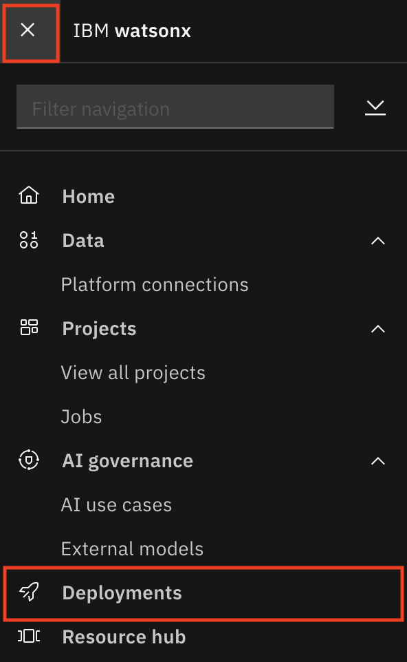

3.  Seleccione el espacio de despliegue que creó en **el laboratorio 105** (por ejemplo, `<tus iniciales o cadena única> - Claim summary testing`).
4.  Haga clic en la pestaña **Despliegues** y seleccione el despliegue que creó en **el laboratorio 105** (por ejemplo, `<tus iniciales o cadena única> - Claim summarization`).

5.  Haga clic en la pestaña **Evaluaciones** de la pantalla de información de despliegue y, a continuación, en el botón **Activar** para abrir la ventana **Plantilla de solicitud de evaluación**.

6.  La sección **Seleccionar dimensiones para evaluar** de la ventana muestra las diferentes evaluaciones disponibles. Actualmente, la **Calidad Generativa de IA** es la única disponible para esta plantilla en particular. Haga clic en el enlace **Configuración avanzada**.

Tómese un momento para desplazarse por la pantalla de configuración de **Calidad de IA Generativa** para ver las diferentes métricas que se medirán como parte de la evaluación de calidad, y los umbrales de alerta establecidos para cada una. Tenga en cuenta que estos umbrales se pueden personalizar completamente para cada modelo, lo que permite a los gestores de riesgos asegurarse de que sus modelos cumplen las normas reglamentarias. Las métricas incluyen mediciones de calidad como la precisión, la recuperación y la similitud, así como la detección de información personal identificable (PII) y de contenido odioso, agresivo y profano (HAP) tanto para la entrada como para la salida del modelo. Para más información sobre las métricas individuales, consulte la [documentación de watsonx.governance](https://dataplatform.cloud.ibm.com/docs/content/wsj/model/wos-monitor-gen-quality.html?context=cpdaas).

7.  Haga clic en **Cancelar** para volver a la ventana **Evaluar plantilla de solicitud**.
8.  Haga clic en **Siguiente** y arrastre y suelte el archivo **claim\_summarization\_validation.csv** que descargó en un paso anterior de este laboratorio en la sección de carga de la pantalla, o busque el archivo.
9.  Haga clic en el menú desplegable **Entrada** y seleccione **Reclamación\_de\_seguro** de la lista. Haga clic en el desplegable **Salida de referencia** y seleccione **Resumen** de la lista. Haz clic en **Siguiente**.

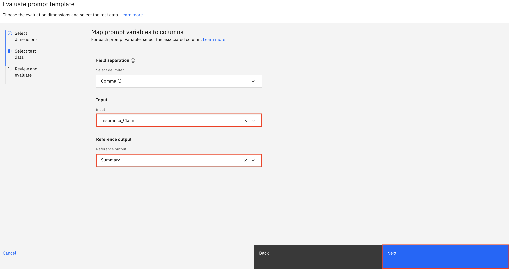

10. Haga clic en **Evaluar** para iniciar la evaluación, que puede tardar unos minutos en ejecutarse. Tenga en cuenta que si la evaluación falla, normalmente se completará con éxito si se vuelve a ejecutar.

Ha realizado con éxito una evaluación de un modelo de IA **generativa**.

### Revisar los resultados de la evaluación

1.  Una vez finalizada la evaluación, desplácese hasta la sección **Calidad de la IA Generativa - Resumen de texto**. Aquí se enumeran las diferentes métricas de calidad, con la puntuación del modelo y cualquier violación del umbral de alerta. Haga clic en el **icono de la flecha** para obtener más información sobre las métricas de calidad.

2.  La vista detallada de la calidad muestra las diferentes métricas a lo largo del tiempo; a medida que se realicen más evaluaciones, estos gráficos se actualizarán con los puntos de datos adicionales. Tenga en cuenta que al hacer clic en el enlace **Configuración de tiempo** podrá ajustar la ventana de tiempo para las evaluaciones que desee ver. Desplácese hacia abajo hasta las secciones de las diferentes métricas. Tenga en cuenta que puede hacer clic para ampliar las secciones y obtener una vista más detallada de cada métrica.

3.  Cuando haya terminado de ver las métricas de calidad, vuelva a la parte superior de la pantalla y haga clic en la pestaña Salud **del modelo**. Tómese un momento para revisar esta pestaña, que contiene datos históricos de métricas de salud como latencia, rendimiento, número de usuarios y más. Esta información puede ser vital para que los equipos de infraestructura e ingeniería de una organización se aseguren de que los modelos están respondiendo a las solicitudes de las aplicaciones y los usuarios en un tiempo razonable, y manteniendo los costes de computación en niveles aceptables. Tenga en cuenta que puede hacer clic para ampliar las secciones y obtener una vista más detallada de cada métrica.

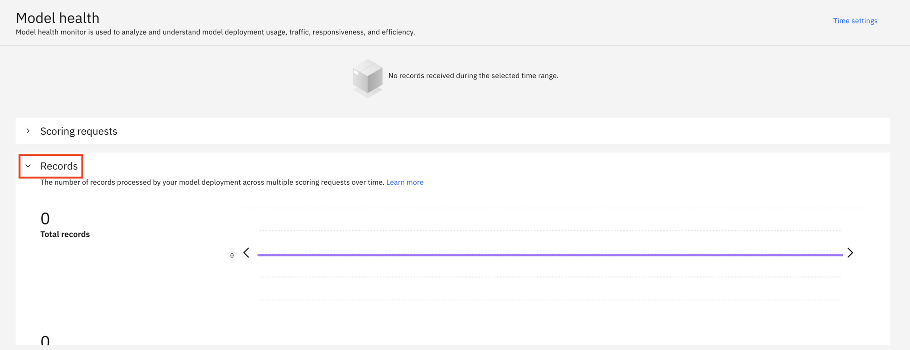

También puede navegar a la pestaña **Salud** del **modelo** pulsando la **flecha** a la derecha de **Salud del modelo** en la pestaña **Evaluaciones**.

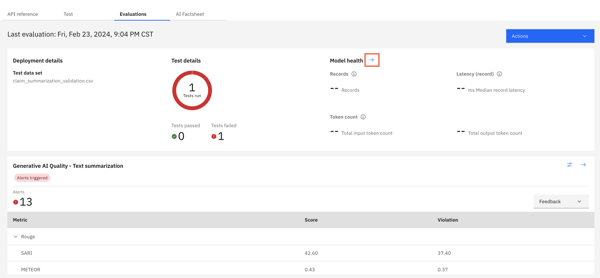

Ha revisado con éxito una evaluación sobre un modelo de IA **generativa**.

### Ver el ciclo de vida actualizado

1.  Haga clic en la pestaña **Hoja de datos de IA**, que abrirá la hoja de datos específica del despliegue del modelo. Tenga en cuenta que el modelo aún se encuentra en la fase de **validación** del ciclo de vida del modelo.

2.  Desplácese hasta la sección **Resultados de la evaluación** de la ficha. La información de la evaluación del modelo se ha almacenado automáticamente en la ficha, lo que permite a las partes interesadas, como los gestores de riesgos, los usuarios empresariales y los ingenieros de IA, acceder a la información pertinente sin necesidad de que los científicos de datos realicen ningún esfuerzo manual.

3.  Haga clic en el **menú de navegación** de la parte superior izquierda para ampliarlo. Localice la sección de **gobernanza de IA** del menú, ampliándola si es necesario, y haga clic en **Casos de uso de IA**.

4.  Seleccione el caso de uso de IA que creó en **el laboratorio 102** (por ejemplo, `<tus iniciales o cadena única> - Claim summarization`) y haga clic en la pestaña Ciclo de **vida** para ver el gráfico del ciclo de vida de este caso de uso del modelo, que reflejará el mismo progreso en la **Hoja de datos de IA**. Observe que la entrada para el modelo sigue estando en la sección **Validar** de la vista del ciclo de vida del modelo, con una insignia actualizada que muestra que se ha evaluado. Haga clic en el nombre del modelo desplegado (por ejemplo, `<tus iniciales o cadena única> - Claim summarization`) en la sección **Validar**.

Tenga en cuenta que también se puede acceder aquí a la información de la evaluación del modelo que se ha almacenado automáticamente en la **AI Factsheet**.

5.  Desplácese hasta la parte inferior de la pantalla y haga clic en el icono de flecha **Más detalles**. Se abre la ficha completa del modelo base, que contiene todos los metadatos del modelo anterior, así como las métricas de la versión desplegada.

<QuizAlert text="Hay una pregunta de prueba sobre el IA Factsheet." />

Ha visualizado correctamente el ciclo de vida actualizado de una evaluación en un modelo de IA **generativa**.

### Enhorabuena, has llegado al final del laboratorio 106 para evaluar un modelo de IA **generativa** y has completado los laboratorios L3 watsonx.governance.

Ya puede **[completar el cuestionario](https://learn.ibm.com/course/view.php?id=16170)** de IBM watsonx.governance for Technical Sales Level 3 Quiz.

Una vez completado el cuestionario, haga clic en **[IBM watsonx.governance](/watsonx/watsonxgov)** para ir a la página de inicio de IBM watsonx.governance.

## Evaluar un modelo **predictivo** de IA

En este laboratorio, evaluará un modelo **predictivo** de IA utilizando las dimensiones de evaluación **Calidad** e **Imparcialidad**.

### Configurar el espacio de despliegue para la supervisión

1.  En otra pestaña de su navegador, vaya a [https://cloud.ibm.com/resources](https://cloud.ibm.com/resources) e inicie sesión en IBM Cloud.
2.  Haga clic en **Watson OpenScale-\*\*** en la sección **AI / Machine Learning**.

3.  Haga clic en **Iniciar Watson OpenScale**.

4.  Compruebe que ha iniciado sesión en la cuenta correcta haciendo clic en el icono del avatar situado en la esquina superior derecha de la pantalla. Asegúrese de que la cuenta correcta está seleccionada en el menú desplegable **Cuenta**.

5.  Haga clic en el botón **Configurar** de la barra de menú de la izquierda.

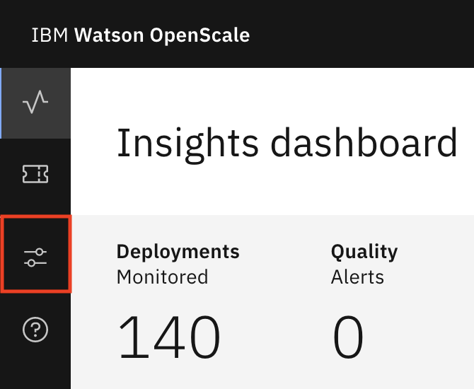

6.  En la sección **Obligatorio**, haga clic en **Proveedores** de **aprendizaje** automático y, a continuación, en el botón **Añadir proveedor de aprendizaje** automático.

7.  Haga clic en el **icono del lápiz** para editar el nombre del proveedor de aprendizaje automático. Dale a tu proveedor un nombre que incluya alguna información identificativa y el propósito para el que se utilizará (ej. `<tus iniciales o cadena única> - Auto policy risk test` automática), y haz clic en el botón azul **Aplicar**.

8.  Pulse el **icono del lápiz** en el mosaico **Conexión**. Rellene la siguiente información para la conexión y, a continuación, pulse el botón **Guardar**:

*   **Proveedor de servicios:** **Watson Machine Learning (V2)**.
*   **Espacio de despliegue:** Seleccione el espacio de despliegue que creó en **el laboratorio 105** (por ejemplo, `<tus iniciales o cadena única> - Policy risk testing`).
*   **Tipo de entorno:** **Preproducción**

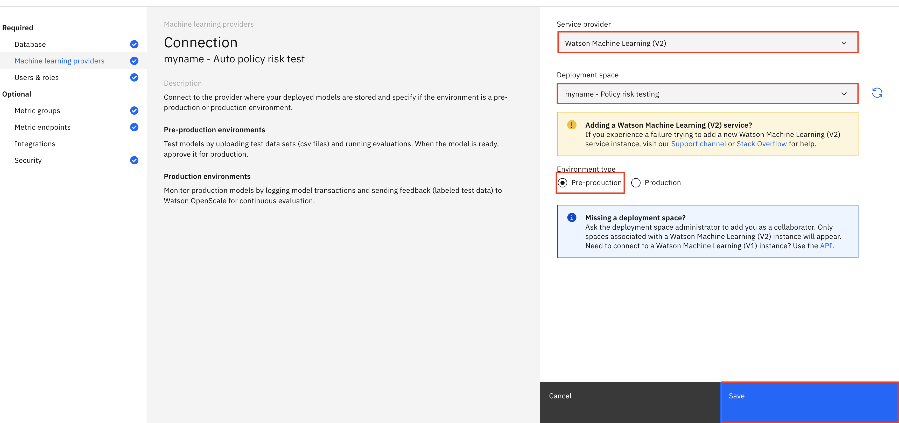

Ha identificado correctamente su espacio de despliegue como proveedor de aprendizaje automático para el servicio de monitorización. Ahora puede configurar la supervisión para el propio modelo.

### Añadir el modelo al cuadro de mandos

1.  Haga clic en el botón **Insights dashboard** de la barra de menú de la izquierda.

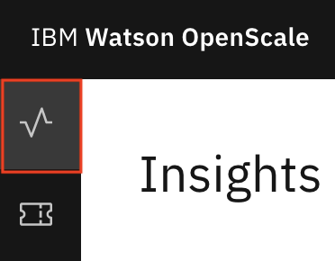

2.  Haga clic en el botón azul **Añadir al cuadro de mandos**. Se abrirá la pantalla **Seleccionar un despliegue** de modelos.

3.  Haga clic en el botón **Proveedores de aprendizaje automático**. En la lista de proveedores, seleccione el que creó anteriormente en este laboratorio (por ejemplo, `<tus iniciales o cadena única> - Auto policy risk test`) y, a continuación, haga clic en **Siguiente**.

4.  En la lista de modelos desplegados, seleccione el que creó en **el laboratorio 105** (por ejemplo, `<tus iniciales o cadena única> - Policy risk testing`) y, a continuación, haga clic en **Siguiente**.
5.  La información de la pantalla **Proporcionar información del modelo** se recuperará de los metadatos disponibles del modelo. Haga clic en el botón **Ver resumen** y, a continuación, en **Finalizar**. Tras una breve espera, se abrirá la pantalla de resumen de métricas del modelo.

Ha añadido correctamente su modelo al **panel Insights**.

### Recopilar la información necesaria

Configurar la monitorización para el modelo requerirá enviarle algunos datos, lo que a su vez requiere cierta información sobre la suscripción al modelo en el servicio de monitorización. Tenga en cuenta que este paso normalmente no sería necesario; sin embargo, va a supervisar el modelo para el sesgo indirecto, lo que requiere el envío de metadatos al modelo que no se incluye como una característica.

1.  En la pantalla de resumen de métricas del modelo, haga clic en el botón **Acciones** y seleccione **Ver información del modelo** en el menú desplegable.

2.  Copie y pegue los valores de **ID de datamart de evaluación** e **ID de suscripción** en un archivo de texto, asegurándose de anotar qué valor es cada uno. Utilizarás estos dos valores en un cuaderno Jupyter en el siguiente paso.
3.  En otra ventana del navegador, vaya a la página de **[claves de API de IBM Cloud](https://cloud.ibm.com/iam/apikeys)** correspondiente a su cuenta, iniciando sesión si es necesario.
4.  Haga clic en el botón **Crear**.
5.  Dale un nombre a tu clave API y haz clic en **Crear**. Haga clic en el icono **Copiar** situado debajo de la clave API para copiarla en el portapapeles. Péguela en un archivo de texto para utilizarla más tarde.

### Enviar datos al modelo

1.  En la ventana del navegador de su plataforma IBM watsonx, haga clic en el **Menú de navegación** de la parte superior izquierda para expandirlo. Localice la sección **Proyectos** del menú, ampliándola si es necesario, y haga clic en **Ver todos los proyectos**.

2.  Seleccione el proyecto de IA **predictiva** que creó en **el laboratorio 103** (por ejemplo, `<tus iniciales o cadena única> - Auto policy risk`).

3.  Haga clic en la pestaña **Activos** del proyecto. En la lista de activos, localice el bloc de notas **Enviar datos al modelo**. Haz clic en los tres puntos a su derecha para abrir el menú de opciones y selecciona **Editar**. Se abrirá el editor de cuadernos Jupyter de watsonx.

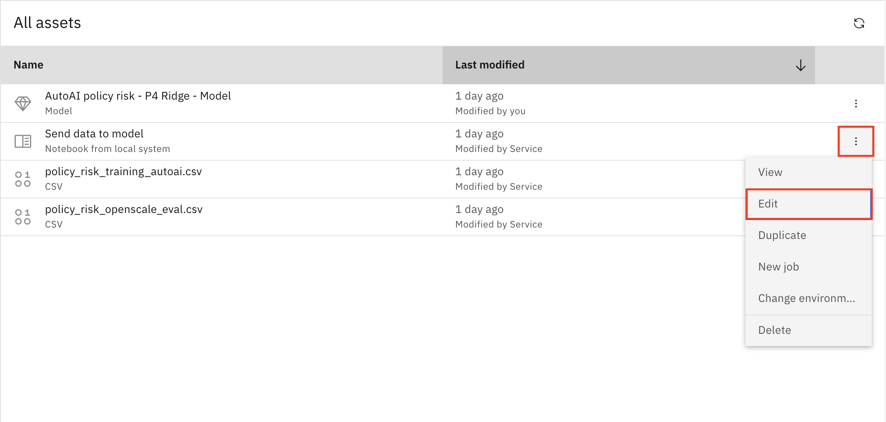

4.  Copie y pegue los valores que reunió en los pasos anteriores en la primera celda de código, asegurándose de que están contenidos entre las comillas de cada línea.
5.  Haga clic en el elemento **Celda** del menú situado encima de las celdas de código y seleccione **Ejecutar todo** para ejecutar todas las celdas de código. Deberían tardar unos 30 segundos en completarse.

Si las celdas de código se ejecutaron correctamente, debería ver un mensaje debajo de la celda de código inferior similar a este:

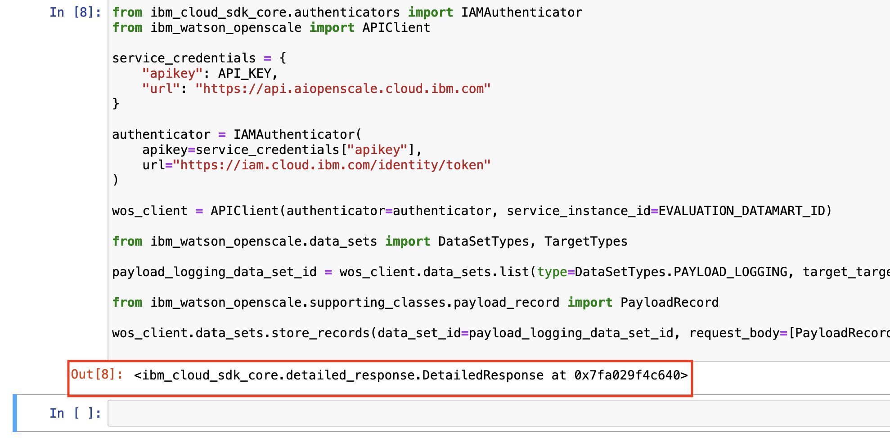

Si ha recibido un mensaje de error, es probable que se deba a que no ha utilizado los valores correctos en la primera celda de código. Compruebe que son correctos y vuelva a ejecutar todas las celdas de código. Una vez que se ejecuten correctamente, continúe con el siguiente paso.

Has enviado con éxito datos a tu modelo a través de un cuaderno Jupyter.

### Conectar con los datos de entrenamiento

A continuación, configurará los monitores individuales para el modelo. Tenga en cuenta que cada modelo desplegado puede tener sus propias métricas personalizadas y umbrales de alerta configurados, lo que permite a los administradores, responsables de cumplimiento y profesionales de gestión de riesgos garantizar que los modelos cumplen todas las normativas y requisitos internos pertinentes.

1.  En la ventana del navegador de IBM Watson OpenScale, haga clic en el botón **Acciones** y seleccione **Configurar monitores** en el menú desplegable.

2.  Haga clic en el icono **Editar** del mosaico **Datos de entrenamiento**.

3.  Deje seleccionada la opción **Utilizar configuración** manual en **Método de configuración** y haga clic en **Siguiente**.
4.  Haga clic en el menú desplegable **Opción de datos de entrenamiento** y haga clic en **Base de datos o almacenamiento en la** nube. Haga clic en el menú desplegable **Ubicación**, y haga clic en **Almacenamiento de objetos en la** nube. **Obtenga del host de laboratorio** los valores de los campos **ID de instancia de recurso** y **Clave** API y, a continuación, haga clic en **Conectar**.

5.  Haga clic en el menú desplegable **Bucket** y seleccione **faststartlab-donodelete.**.. bucket. Haga clic en el menú desplegable **Conjunto de datos** para seleccionar el **archivo policy\_risk\_openscale\_train.csv**. Haz clic en **Siguiente**.

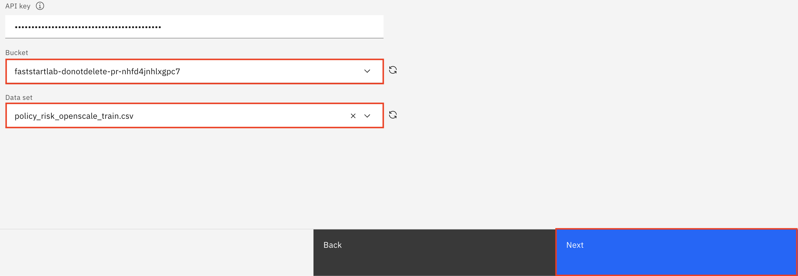

6.  La herramienta de supervisión debería identificar correctamente la característica y etiquetar las columnas, utilizando los metadatos almacenados con el modelo. Haga clic en **Siguiente**.
7.  La herramienta de supervisión también identifica correctamente el campo de predicción. Haga clic en **Ver resumen** para continuar.
8.  Haga clic en **Finalizar** para guardar la configuración de los datos de entrenamiento.

Se ha conectado correctamente a los datos de entrenamiento.

### Configurar el monitor de equidad

1.  En la lista de **Evaluaciones** de la izquierda, haga clic en **Equidad**.

2.  Observe la descripción de equidad en el centro de la pantalla, que ofrece una buena definición de lo que evalúa el monitor. Haga clic en el icono **Editar** del mosaico **Configuración**.

3.  Configurará manualmente el archivo de equidad. Deje seleccionado **Configurar** manualmente y haga clic en **Siguiente** para continuar.
4.  Para supervisar adecuadamente un modelo en busca de parcialidades injustos, debe especificar qué resultados del modelo son favorables y cuáles son desfavorables. Para los modelos de clasificación binaria, como el modelo de crédito Riesgo frente a No riesgo, o el modelo de selección de candidatos Contratar frente a No contratar, estos valores son fáciles de determinar. Sin embargo, es un poco más difícil para un modelo de regresión como el de este laboratorio. Tendrá que definir rangos de resultados que representen resultados favorables o desfavorables. Tenga en cuenta que la herramienta de monitorización ha leído los datos de entrenamiento y ha rellenado los valores mínimo y máximo de **RIESGO** en ese conjunto de datos. Para este caso de uso, identificará cualquier puntuación de 40 o superior como un resultado desfavorable. Utilice los campos de entrada numérica para introducir un valor mínimo de **0** y un valor máximo de **39** y, a continuación, haga clic en **Añadir valor**. Utilice la casilla de verificación para establecer el valor en **Favorable**.

5.  Repita el paso anterior para añadir un segundo valor, con un valor mínimo de **40** y un valor máximo de **100** (el límite superior teórico de la salida del modelo) y, a continuación, haga clic en **Añadir valor**. Utilice la casilla de verificación para establecer el valor en **Desfavorable** y, a continuación, haga clic en **Siguiente**.
6.  Establezca el **Tamaño mínimo de la muestra** en **100** y haga clic en **Siguiente**.
7.  Deje la opción **Métricas supervisadas seleccionadas** en **Impacto dispar** y haga clic en **Siguiente**.
8.  Deje los umbrales inferior y superior de **Impacto** desigual en sus valores predeterminados y haga clic en **Siguiente**.
9.  Ahora debe seleccionar los campos que desea supervisar. IBM Watson OpenScale ha analizado los datos de entrenamiento y ha sugerido que se supervisen **PRIM\_DRIVER\_AGE** y **PRIM\_DRIVER\_GENDER**, ya que, basándose en sus nombres y valores, es probable que representen campos de edad y sexo. Sin embargo, para este caso de uso, no necesitará monitorizar estos campos, ya que las compañías de seguros han demostrado a lo largo del tiempo que los conductores masculinos, así como los conductores de ciertos grupos de edad, presentan un riesgo elevado, y estos datos pueden por lo tanto utilizarse legalmente para establecer las primas de las pólizas. Utilice las casillas de verificación para anular la selección de **PRIM\_DRIVER\_AGE** y **PRIM\_DRIVER\_GENDER**. Desplácese hasta el final de la lista de características, marque la casilla junto a **MINORÍA** y haga clic en **Siguiente**.
10. Utilice las casillas de verificación para especificar **MINORÍA** como grupo **Supervisado** y **NO MINORÍA** como grupo de **Referencia**. Haga clic en **Siguiente**.

11. Utilice el umbral de alerta predeterminado (80) y haga clic en **Guardar** para terminar de configurar el monitor de imparcialidad.

Ha configurado correctamente el monitor de imparcialidad para una evaluación.

### Configurar el monitor de calidad

1.  En la lista de **evaluaciones** de la izquierda, haga clic en **Calidad**.
2.  Haga clic en el icono **Editar** del mosaico **Umbrales de calidad**.
3.  Deje los valores por defecto del umbral inferior y superior como están. Tenga en cuenta que puede hacer clic en el icono **Información** situado a la derecha de cada valor para obtener más información sobre cómo se calcula. Haga clic en **Siguiente**.
4.  Establezca el valor **Tamaño mínimo de la muestra** en **100**. Haga clic en **Guardar** para guardar la configuración de calidad.

Ha configurado correctamente el monitor de calidad para una evaluación.

### Configurar el servicio de explicabilidad

1.  En la sección **"Explainability** " de la izquierda, haga clic en " **General settings**".

2.  En el mosaico **Método de explicación**, haga clic en el icono **Editar**.
3.  Existen dos métodos diferentes para las explicaciones: **[Explicaciones aditivas de Shapley](https://shap.readthedocs.io/en/latest/)** (SHAP) o **[Explicaciones agnósticas del modelo interpretable local](https://www.openlayer.com/blog/post/understanding-lime-in-5-steps)** (LIME). Como se describe en la sugerencia que aparece al hacer clic en el cuadro **Información**, SHAP suele proporcionar explicaciones más completas, pero LIME es más rápido. Deje seleccionado el método LIME y haga clic en **Guardar**.

Ha configurado correctamente el servicio explainability.

### Ejecutar una evaluación

1.  Descargue el archivo de datos de evaluación [policy\_risk\_openscale\_eval.csv](https://raw.githubusercontent.com/ibm-build-lab/VAD-VAR-Workshop/main/content/Watsonx/WatsonxGov/files/policy_risk_openscale_eval.csv) a su equipo local.
2.  En la ventana del navegador de IBM Watson OpenScale, haga clic en **Ir al resumen del modelo** a la izquierda.

3.  Haga clic en el botón **Acciones** y seleccione **Evaluar ahora** en el menú desplegable.

4.  Haga clic en el menú desplegable **Importar** y elija desde **archivo CSV** de la lista de opciones. Arrastre y suelte el archivo CSV de evaluación descargado en el área designada en su pantalla, o búsquelo en su máquina utilizando el enlace, luego haga clic en **Cargar y evaluar**. Cuando el monitor se complete y se muestren las métricas, continúe con el siguiente paso.

> **Nota:** la evaluación puede tardar varios minutos. Si falla por cualquier motivo, siga los mismos pasos y vuelva a ejecutar la evaluación para solucionar el problema.

Ha realizado con éxito la evaluación de un modelo de IA predictiva.

### Ver los resultados de la evaluación

1.  Tómese un momento para revisar los resultados de la evaluación. Tenga en cuenta que, en función del contenido de la muestra aleatoria de los datos de la evaluación, sus resultados variarán cada vez que realice la evaluación.
2.  Revise las diferentes métricas en el mosaico **Calidad**. Observe que, si la medición cae por debajo del umbral de alerta establecido al configurar el monitor de calidad, la cantidad aparecerá en la columna **Violación** de la tabla. Para una explicación completa de las diferentes métricas utilizadas para calcular la calidad del modelo, consulte esta **[página de documentación](https://dataplatform.cloud.ibm.com/docs/content/wsj/model/wos-quality-overview.html?context=analytics)**.
3.  A continuación, observe la ficha **Equidad**. Una vez más, en función del contenido de la muestra aleatoria de los datos de evaluación, los resultados variarán cada vez que realice la evaluación. En la mayoría de los casos, el modelo se mostrará como justo, sin alertas de problemas de imparcialidad. Para obtener más información, haga clic en el **icono de la flecha de** la ficha **Equidad**.

4.  Desplácese hacia abajo hasta la parte del gráfico de la pantalla y dedique un momento a leer y comprender la sección **Cómo se determinó la puntuación del impacto dispar**, haciendo clic en el enlace **Ver cálculo** para ver el cálculo específico.

<QuizAlert text="Hay una pregunta de prueba sobre la métrica de puntuación de equidad." />

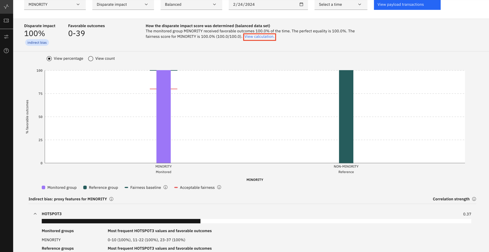

5.  Observe el gráfico. El grupo supervisado, de color púrpura en la captura de pantalla, tiene una equidad calculada por encima del umbral de alerta (80%, la línea roja en el gráfico) que configuró al configurar el monitor de equidad. Si pasa el cursor por encima de cualquiera de las barras del gráfico, también podrá ver el porcentaje exacto de resultados favorables que el grupo recibió del modelo.

6.  Desplácese hacia abajo hasta la sección **Sesgo indirecto: características proxy para MIN** ORIDAD en la parte inferior de la pantalla. En la siguiente captura de pantalla, observe que la etiqueta **MINORÍA** está bastante correlacionada (0,38) con la proximidad a **HOTSPOT3**, lo que indica que una zona concreta con frecuentes accidentes de tráfico está probablemente situada en una zona de Chicago con una elevada población minoritaria. Este tipo de correlaciones pueden provocar un sesgo injusto en los modelos de IA, haciendo que discriminen a las minorías incluso si el origen étnico no forma parte del conjunto de datos de entrenamiento. Sin embargo, si hace clic en el **icono de la flecha** situado a la izquierda de la etiqueta **HOTSPOT3**, observará que (al menos en la captura de pantalla que aparece a continuación) la proximidad a ese punto conflictivo no dio lugar a resultados significativamente más negativos, lo que significa que no es probable que sea una característica importante para determinar la decisión del modelo. Si desea obtener más información sobre las características proxy y la intensidad de la correlación, haga clic en los iconos de **información** situados a la derecha de cada encabezamiento de medición.

<QuizAlert text="Hay una pregunta de prueba sobre la parcialidad indirecta." />

7.  Cuando haya terminado de revisar los resultados, desplácese a la parte superior de la pantalla y haga clic en el botón **Ver transacciones de carga útil**.

Ha visto correctamente los resultados de la evaluación en cuanto a calidad e imparcialidad.

### Explicar una predicción

Además de cumplir las normas de calidad e imparcialidad, en muchos casos los modelos de IA deben dar explicaciones sobre las decisiones o predicciones que toman. Por ejemplo, en virtud de la Ley de Igualdad de Oportunidades de Crédito de Estados Unidos y del Reglamento General de Protección de Datos de la Unión Europea, las personas afectadas por una decisión de IA tienen derecho a conocer las razones específicas de dicha decisión. La **[página de Wikipedia Derecho a la explicación](https://en.wikipedia.org/wiki/Right_to_explanation)** ofrece varios enlaces útiles con más información.

IBM watsonx.governance ofrece la posibilidad de generar explicaciones detalladas para modelos predictivos utilizando el algoritmo que especificó previamente al configurar el servicio de explicabilidad.

1.  En la tabla de transacciones, haga clic en uno de los enlaces **Explicar predicción**. Puede obtener resultados más interesantes si encuentra una predicción cercana al umbral de desfavorable (39, tal y como se define al configurar el monitor de imparcialidad). El servicio de explicabilidad utilizará el algoritmo LIME para generar una explicación detallada, que puede tardar unos minutos en ejecutarse.

1.  Una vez generada la explicación, desplácese hacia abajo hasta el gráfico, que muestra la influencia que tuvieron las distintas características en el resultado del modelo. Las características en **azul** aumentaron la puntuación final, mientras que las de **rojo** la disminuyeron. En el caso de los modelos de clasificación, las características en **azul**  contribuyeron positivamente a la confianza del modelo en la predicción, mientras que las que aparecen en **rojo** la disminuyeron. Pase el cursor por encima de cada columna del gráfico para obtener más información.
2.  Haga clic en la pestaña **Inspeccionar**. En esta pestaña, puede modificar los valores asociados al registro y volver a enviarlo al modelo para ver cómo cambia el cálculo final del riesgo. Esto puede ser útil para comprender cómo está funcionando el modelo, o si un asegurado está buscando maneras de disminuir su evaluación de riesgo.

Ha visualizado correctamente la explicación de la predicción del modelo.

### Ver el ciclo de vida actualizado

1.  En la ventana del navegador de su plataforma IBM watsonx, haga clic en el **menú de navegación** de la parte superior izquierda para expandirlo. Localice la sección de **gobernanza de IA** del menú, ampliándola si es necesario, y haga clic en **Casos de uso de IA**.

4.  Seleccione el caso de uso de IA que creó en **el laboratorio 102** (por ejemplo, `<tus iniciales o cadena única> - Auto policy risk`) y haga clic en la pestaña **Ciclo** de vida para ver el gráfico del ciclo de vida de este caso de uso del modelo. Observe que la entrada para el modelo está ahora en la sección **Validar** de la vista del ciclo de vida del modelo, con una insignia actualizada que muestra que ha sido evaluado y una alerta roja que proporciona una señal visual de que el modelo puede tener problemas. Haga clic en el nombre del modelo desplegado (por ejemplo, `<tus iniciales o cadena única> - Policy risk testing`).

5.  Desplácese hacia abajo hasta las secciones **Calidad** y **Equidad** de la ficha del modelo. Tenga en cuenta que las métricas de evaluación generadas por la herramienta de supervisión IBM Watson OpenScale se han almacenado automáticamente en la ficha técnica del modelo, lo que permite a las partes interesadas, como gestores de riesgos y científicos de datos, acceder a la información que necesitan para evaluar el rendimiento del modelo, con un enlace opcional que abrirá la herramienta de supervisión si necesitan más información.

<QuizAlert text="Hay una pregunta de prueba sobre el IA Factsheet." />

Ha visualizado correctamente el ciclo de vida actualizado de una evaluación en un modelo de IA **predictiva**.

### Enhorabuena, has llegado al final del laboratorio 106 para evaluar un modelo **predictivo** de IA y has completado los laboratorios L3 de watsonx.governance.

Ya puede **[completar el cuestionario](https://learn.ibm.com/course/view.php?id=16170)** de IBM watsonx.governance for Technical Sales Level 3 Quiz.

Una vez completado el cuestionario, haga clic en **[IBM watsonx.governance](/watsonx/watsonxgov)** para ir a la página de inicio de IBM watsonx.governance.
