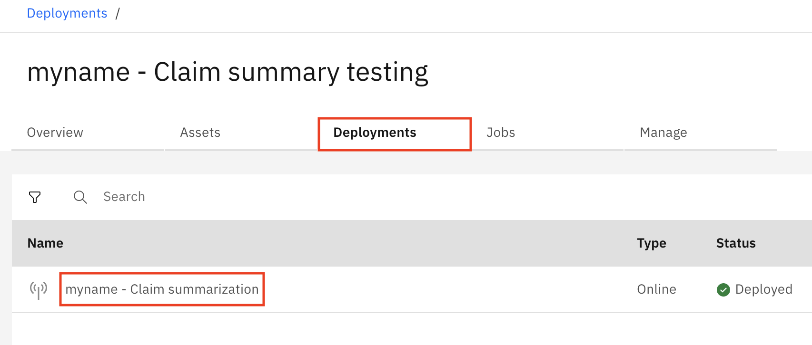
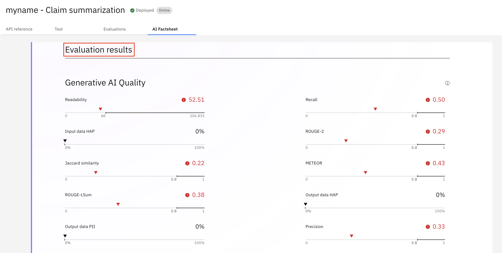
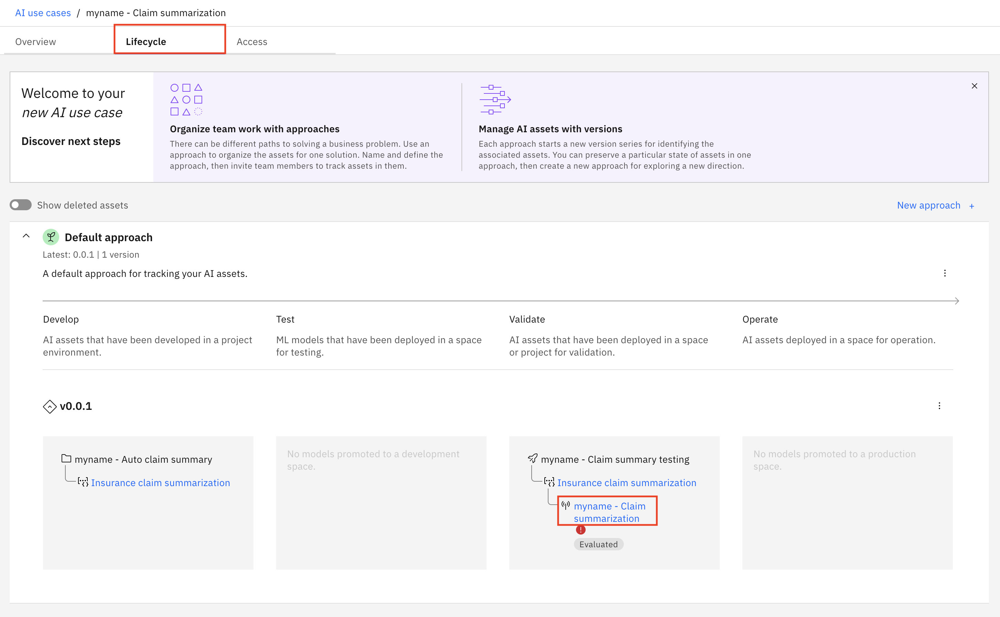

<QuizAlert text='Heads Up! Quiz material will be flagged like this!' />

# Evaluate an AI model

### Evaluate an AI model

- To learn how to evaluate a **generative** AI model, continue to [Evaluate a **generative** AI model](#evaluate-a-generative-ai-model)
- To learn how to evaluate a **predictive** AI model, continue to [Evaluate a **predictive** AI model](#evaluate-a-predictive-ai-model)

## Evaluate a **generative** AI model

In this lab, you will evaluate a **generative** AI model using the **Generative AI Quality** evaluation dimension.

### Evaluate the model

1. Download the [evaluation data file](https://raw.githubusercontent.com/ibm-build-lab/VAD-VAR-Workshop/main/content/Watsonx/WatsonxGov/files/claim_summarization_validation.csv) to your local machine.

2. In the IBM watsonx platform, click on the **Navigation Menu** in the upper left to expand it. Locate and click on **Deployments**.

  

3. Select the deployment space you created in **lab 105** (ex. `<your initials or unique string> - Claim summary testing`).

4. Click on the **Deployments** tab and select the deployment you created in **lab 105** (ex. `<your initials or unique string> - Claim summarization`).

  

5. Click on the **Evaluations** tab of the deployment information screen and then click the **Activate** button to open the **Evaluate prompt template** window.

  

6. The **Select dimensions to evaluate** section of the window shows the different evaluations available. Currently, **Generative AI Quality** is the only one available for this particular prompt template. Click on the **Advanced settings** link.

  

  Take a moment to scroll through the **Generative AI Quality** settings screen to see the different metrics that will be measured as part of the quality evaluation, and the alert thresholds set for each. Note that these thresholds can be fully-customized on a per-model basis, allowing risk managers to make sure their models comply with regulatory standards. The metrics include quality measurements such as precision, recall, and similarity, as well as personally identifiable information (PII) and hateful, aggressive, and profane (HAP) content detection for both model input and output. For more information on the individual metrics, see the [watsonx.governance documentation](https://dataplatform.cloud.ibm.com/docs/content/wsj/model/wos-monitor-gen-quality.html?context=cpdaas).

7. Click **Cancel** to return to the **Evaluate prompt template** window.

8. Click **Next** and drag and drop the **claim_summarization_validation.csv** file you downloaded in a previous step in this lab to the upload section on the screen, or browse to it.

9. Click on the **Input** dropdown, and select **Insurance_Claim** from the list. Click on the **Reference output** dropdown, and select **Summary** from the list. Click **Next**.

  

10. Click **Evaluate** to start the evaluation, which can take up to a few minutes to run. Note that if the evaluation fails, re-running it will usually complete successfully.

You have successfully ran an evaluation on a **generative** AI model.

### Review the evaluation results

1. When the evaluation is complete, scroll down to the **Generative AI Quality - Text summarization** section. The different quality metrics are listed here, with the model's score and any alert threshold violations. Click the **arrow icon** for more information on the quality metrics.

  

2. The detailed view for quality shows the different metrics over time; as more evaluations are performed, these graphs will update with the additional data points. Note that clicking on the **Time settings** link allows you to adjust the time window for the evaluations you would like to see. Scroll down to the sections for the different metrics. Note that you can click to expand the sections for a more detailed view of each metric.

3. When you are finished viewing the quality metrics, scroll back to the top of the screen and click on the **Model health** tab. Take a moment to review this tab, which contains historical data for health metrics such as latency, throughput, number of users, and more. This information can be vital for an organization's infrastructure and engineering teams ensuring that the models are responding to application and user requests in a reasonable amount of time, and keeping compute costs to acceptable levels.

  

You have successfully reviewed an evaluation on a **generative** AI model.

### View the updated lifecycle

1. Click on the **AI Factsheet** tab, which will open the factsheet specific to the model deployment. Note that the model is still in the **Validate** portion of the model lifecycle.

  

2. Scroll down to the **Evaluation results** section of the factsheet. The information from the model evaluation has been automatically stored in the factsheet, allowing stakeholders such as risk managers, business users, and AI engineers to access relevant information without requiring any manual effort from data scientists.

  

3. Click on the **Navigation Menu** in the upper left to expand it. Locate the **AI governance** section of the menu, expanding it if necessary, and click on **AI use cases**.

  

4. Select the AI use case you created in **lab 102** (ex. `<your initials or unique string> - Claim summarization`) and click on the **Lifecycle** tab to view the lifecycle graph for this model's use case, which will reflect the same progress on the **AI Factsheet**. Note that the entry for the model is still in the **Validate** section of the model lifecycle view, with an updated badge showing that it has been evaluated. Click on the name of the deployed model (ex. `<your initials or unique string> - Claim summarization`) in the **Validate** section.

  

  Note that the information from the model evaluation that has been automatically stored on the **AI Factsheet** can also be accessed here as well.

5. Scroll to the bottom of the screen and click on the **More details** arrow icon. The full factsheet for the base model opens, containing all the previous model metadata, as well as the metrics from the deployed version.

  

You have successfully viewed the updated lifecycle from an evaluation on a **generative** AI model.

### Congratulations, you've reached the end of lab 106 for evaluating a **generative** AI model and completed the L3 watsonx.governance labs.

You can now **[complete the quiz](https://learn.ibm.com/course/view.php?id=16170)** for IBM watsonx.governance for Technical Sales Level 3 Quiz.

Once the quiz is completed, click, **[IBM watsonx.governance](/watsonx/watsonxgov)** to go to the IBM watsonx.governance home page.

## Evaluate a **predictive** AI model

