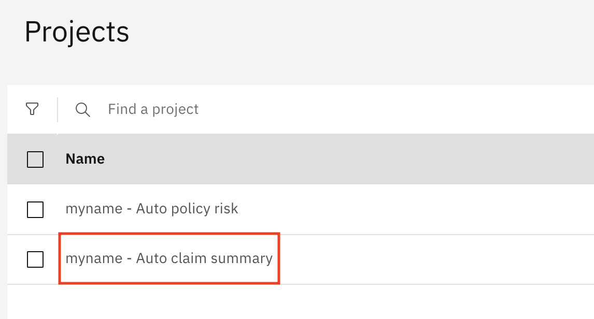
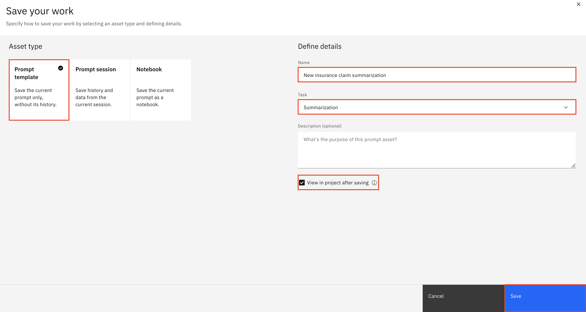
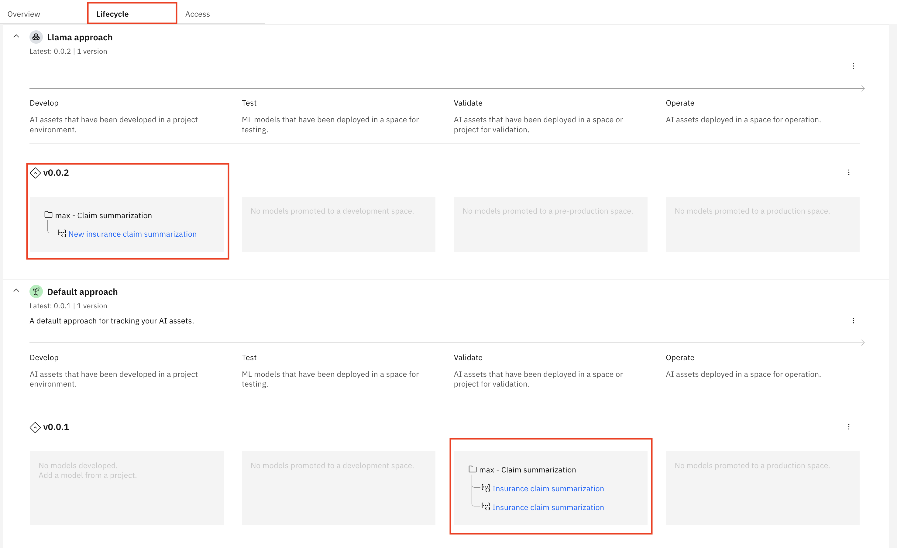

# Manage AI assets with versions

## Manage AI assets with versions for **generative** AI models

In this lab, you will configure model tracking using a new approach and version for governing and managing AI assets with **generative** AI models trained to summarize insurance claims.

### Prerequisites

Complete the following watsonx.governance L3 labs for a **generative** AI model:

- **[Module 102: Define an AI model use case](/watsonx/watsonxgov/102)**
- **[Module 103: Set up an IBM watsonx.ai project](/watsonx/watsonxgov/103)**
- **[Module 104: Track an AI model](/watsonx/watsonxgov/104)**

### Use Case

For this use case, the automotive claims department of the large insurance company wants to use a generative AI model to summarize auto insurance claims, which they believe will significantly reduce the workload for their claim review department and improve claim response time. They have been testing out using a generative AI model, but feel that this particular foundation model is not generating the necessary details in summaries and it is time to try a new approach and foundation model to address their concerns before they begin using the model in production.

### Create new prompt template

1. In the IBM watsonx platform, click on the **Navigation Menu** in the upper left to expand it. Locate the **Projects** section of the menu, expanding it if necessary, and click on **View all projects**.

2. Select your **generative** AI project that you created in **lab 103** (ex. `<your initials or unique string> - Auto claim summary`).

3. Click on the **Assets** tab of the project. From the list of assets, select the **Insurance claim summarization** entry.

4. In the top right corner, press the **TXT** button to view the full prompt text that is being used for this prompt template.

5. Press the **Generate** button to generate output from the input prompt of the full prompt text. Note the details generated for the summary in the output. This prompt template uses the **flan-ul2-20b** foundation model. You will compare this output result to the version that will be created with a different foundation model.

6. Select the **Save** floppy disk icon at the top and press **Save As**.

7. In the **Save your work** window, fill out the information below and then press the **Save** button:

- **Asset type:** Prompt template
- **Name:** `New insurance claim summarization`
- **Task:** Summarization
- **View in project after saving:** Ensure that the **View in project after saving** option is selected

8. Select the newly created **New insurance claim summarization** prompt template from the list of assets. An **Edit this prompt template** pop-up window will open. Select **Edit**.

9. In the top right corner, press the **Model: flan-ul2-20b** button and then select **View all foundation models** to change the model used for this new version.

10. From the list of foundation models, select the **llama-3-70b-instruct** model and then press the **Select model** button.

> Note: If you are using watsonx.ai on-prem you may see different models as supported by your GPUs.

11. Repeat **Steps 4 & 5** to generate output for this version using the new **llama-3-70b-instruct** model. Compare the resulting output to the output from the original version using the **flan-ul2-20b** model. Note how this new version using the **llama-3-70b-instruct** foundation model is generating a more detailed summary in the output. This is more in line for what the automotive claims department of the large insurance company was looking for with summarizing auto insurance claims.

You have successfully created a new version of a prompt template using a different foundation model.

### Configure model tracking

1. Click on the **Information** icon in the top right corner and click **View factsheet** in the **About this prompt template** section.

2. In the **Governance** section of the **AI Factsheet**, click on the **Track in AI use case** button.

3. Click the radio button to the left of the AI use case you created in **lab 102** (ex. `<your initials or unique string> - Claim summarization`). Click **Next**.

4. When asked to **Define approach**, press the **New approach** button and give the new approach the name `Llama approach`, then press **Create**. Confirm your newly created approach is selected and then click **Next**.

5. When asked to assign a model version, select **Custom** and enter `0.0.2` for the **Version number**, then click **Next**. Note that you can manually assign a version number here, or choose a more production-ready version number depending on the state of the model. Click **Track asset** to start tracking the model.

6. Note that the **Governance** section of the **AI Factsheet** now contains information on the associated AI use case, approach used, model version, and lifecycle phase (**Develop**).

You have successfully configured model tracking for a **generative** AI model using a new approach and version.

### View the updated AI use case with the tracked model

1. In the upper right corner of the **Governance** section of the **AI Factsheet**, click the **View details** arrow to take you to your associated AI use case.

2. Click on the **Lifecycle** tab, then scroll down to the map of models contained in the **Llama approach** and **Default approach** sections. Notice the new version of the model is listed in the **Llama approach** while the original model is still listed in the **Default approach**.

> **Note:** the **Lifecycle** tab of the **AI use case** is useful for stakeholders and business users to get a quick overview of all the models attempting to address a particular issue, with the ability to drill down for more information as necessary, all without needing access to the project where the developers and data engineers are working.

You have successfully enabled model tracking using a new approach and version, and can now observe the changes as the model goes through the lifecycle.

### Congratulations, you've reached the end of lab 107 for managing AI assets with versions.
