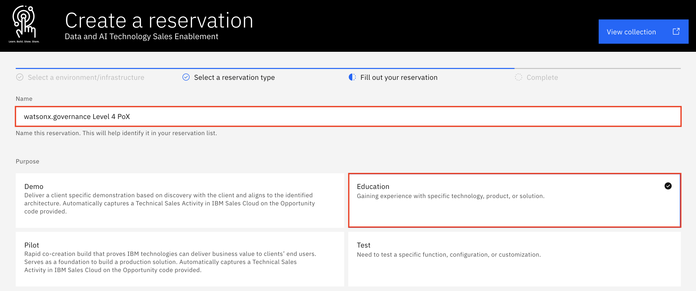
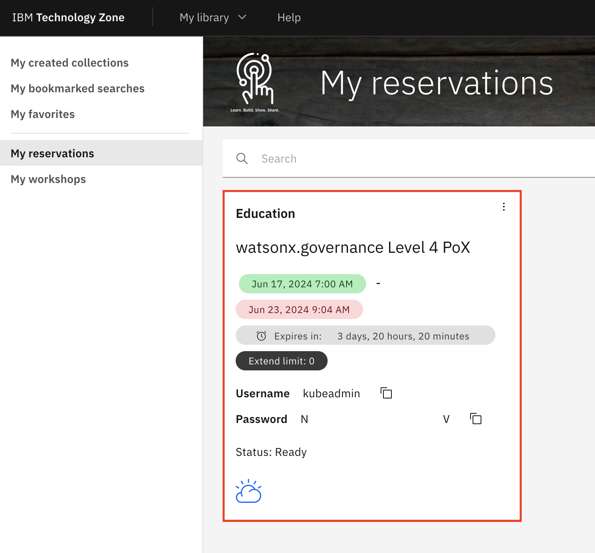
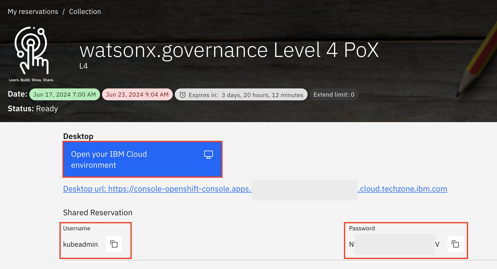
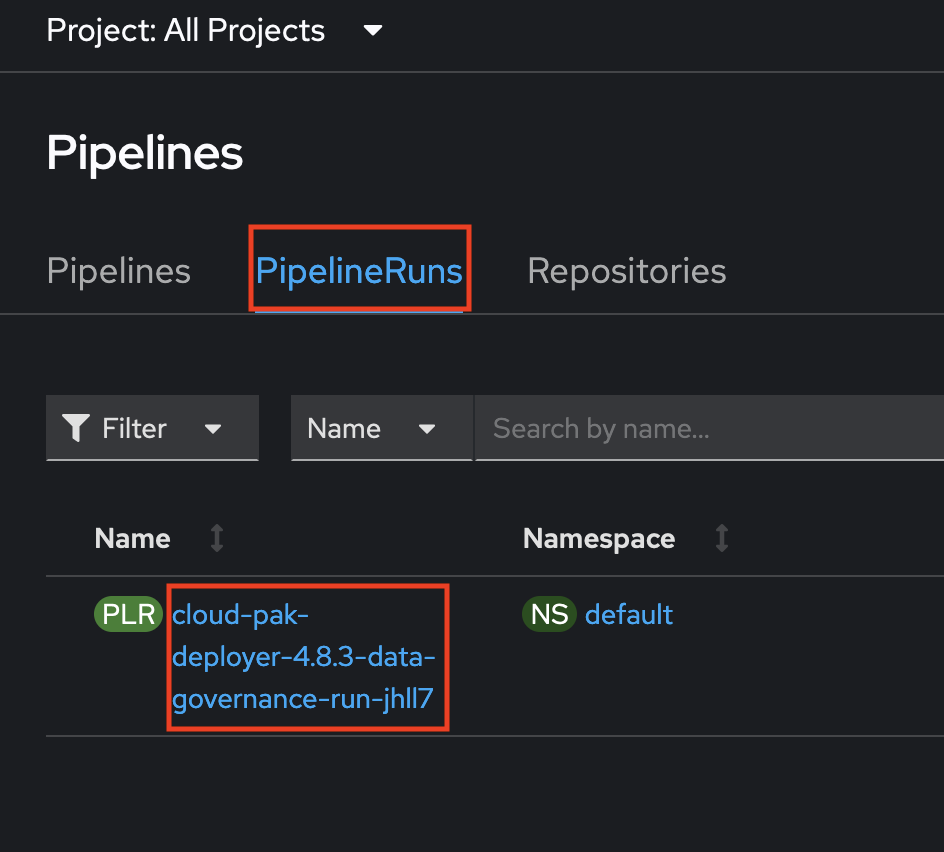
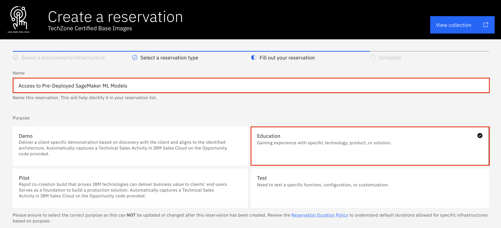
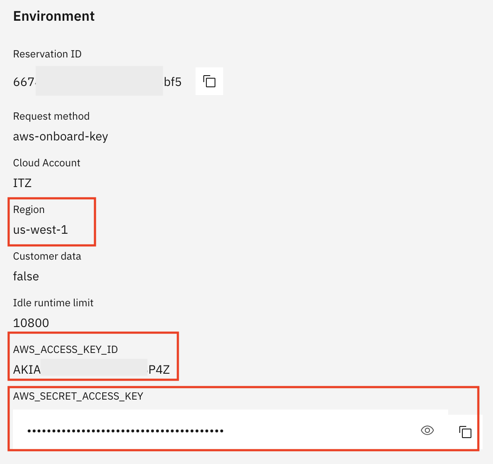
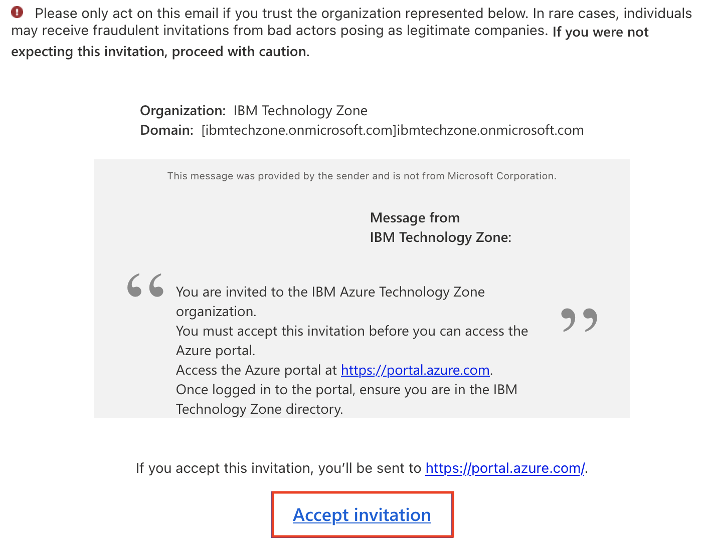
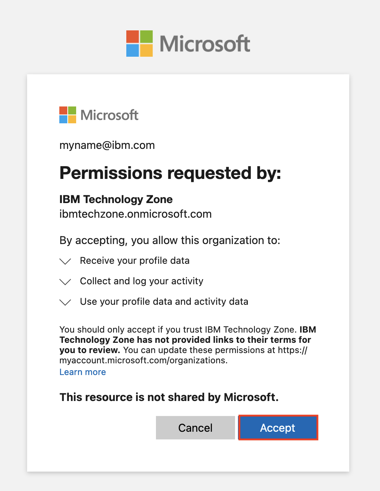
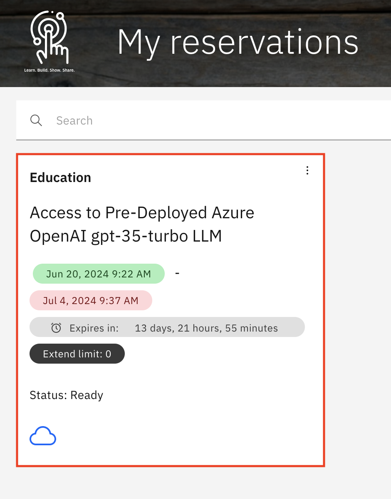
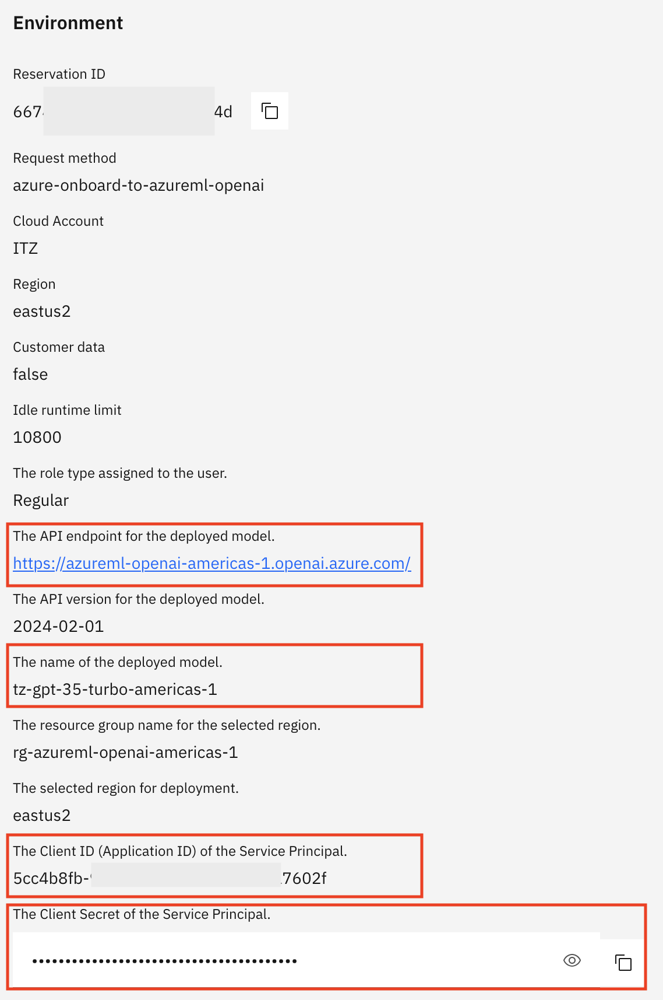

# watsonx.governance L4 Environment Setup

## Environment Setup

### Provision a watsonx.governance Environment from TechZone

1. Open the [watsonx.governance Level 4 PoX image](https://techzone.ibm.com/my/reservations/create/65bc253dfe0ac8001156d84f) in IBM Technology Zone. Sign in with your IBMid and accept any terms and conditions you are presented with.

2. For the reservation type, select the **Reserve now** radio button.

   

3. Accept the default for the reservation **Name**, or provide a name of your choosing. For the **Purpose** of the reservation, select **Education**.

   

4. Fill in the **Purpose description** box with the reason you are making the reservation (ex. `Workshop lab on watsonx.governance Technical Sales Advanced Badge organized by IBM Resell Lab`). Then, scroll further down and select your **Preferred geography** based on your location (ex. **any - AMERICAS - any region - any datacenter**). Keep the reservation's **End date and time** (by default it’s two days (48 hours) from now; it can’t exceed two days initially, but you can extend the reservation by two days, up to two times, before it expires).

   

5. On the right-side panel, follow the links to read the Terms & Conditions and the End User Security Policies documents. Then, select the checkbox to agree to those terms. Finally, click **Submit**.

   

   A message in the upper-right corner will briefly appear stating that the reservation has been created. You may also be presented with an opportunity to provide feedback on the process. Feel free to share your feedback.

   Shortly after, you will receive an email from IBM Technology Zone acknowledging receipt of the request and that the reservation has started provisioning. You will receive another email from IBM Technology Zone confirming provisioning is complete. Provisioning of the environment may take about **2 hours**; however, the environment is not ready to use yet. The Cloud Pak Deployer service still needs to run to install the required software, which typically takes an **additional 3-4 hours**. If provisioning fails, it may be due to a lack of resources in the geography specified. Try again with the same geography or specify a different one.

   Reservation status is available at https://techzone.ibm.com/my/reservations.

   You must now wait until the environment has been provisioned and the Cloud Pak Deployer service installs the required software before moving on to the next section.

### Accessing the watsonx.governance Environment

1. Navigate to your [TechZone reservations](https://techzone.ibm.com/my/reservations) page.

2. Locate and click on the tile for the environment you reserved in a previous step.

  

3. Copy and paste the reservation **Username** and **Password** values from the reservation screen into a text file for later use. Then click on the **Open your IBM Cloud environment** button. A new tab opens with the Red Hat OpenShift log in form.

  

4. If given the option to log in with **kube:admin** credentials or **IBMid** credentials, click on **kube:admin**.

5. Using the values you copied in step 3, log in to the OpenShift cluster.

  Now that you have successfully logged into your cluster, you will need the credentials to log into Cloud Pak for Data.

6. Click the **Pipelines** menu on the left side of the screen to expand it and then click the **Pipelines** item from the list.

  

7.  Click the **PipelineRuns** tab to select it. From the list of pipeline runs, click the link for **cloud-pak-deployer-xxx**. It will likely be the only item in the list. 

  > **Note:** if the run is not listed as **Completed** then you will need to wait for it to finish. This pipeline typically takes **4 hours or longer** to run and install all the required software.

  

8. Click on the **Logs** tab. Click on the last item in the list on the left, titled **update-configmap-success-iam**. **Note** that if this item does not appear in the list, then either the software installation has failed (if the pipeline run is complete) or has not fully finished. Copy and paste the **Console Route**, **Username**, and **Password** information from the log window into a text file. Throughout the remainder of these labs, you will use these credentials whenever you are instructed to log into Cloud Pak for Data or watsonx.

  

## watsonx.ai Environment Setup (optional)

If you are planning on governing and evaluating the watsonx.ai generative model as part of **[lab 207](/watsonx/watsonxgov/level-4/207)** and if your Cloud Pak for Data software environment is not equipped with GPUs and doe not have watsonx.ai installed, go through the steps in **[lab 1](/watsonx/watsonxgov/1)** to provision an **IBM watsonx.ai/watsonx.governance SaaS** environment from TechZone. Once the environment is provisioned, continue to **[lab 202: Deploy up a watsonx.ai model](/watsonx/watsonxgov/level-4/202)**

## Getting Amazon SageMaker credentials (optional)

If you are planning on governing and evaluating the Amazon SageMaker predictive model as part of **[lab 208](/watsonx/watsonxgov/level-4/208)**, go through the following steps.

TechZone now offers limited access to deployed models on Amazon SageMaker, including a hiring model used in these hands-on labs.

### Provision an Amazon SageMaker Environment from TechZone

1. Open the [Access to Pre-Deployed SageMaker ML Models](https://techzone.ibm.com/my/reservations/create/665e09dd1c9f95001e8dceb1) in IBM Technology Zone. Sign in with your IBMid and accept any terms and conditions you are presented with.

2. For the reservation type, select the **Reserve now** radio button.

   

3. Accept the default for the reservation **Name**, or provide a name of your choosing. For the **Purpose** of the reservation, select **Education**.

   

4. Fill in the **Purpose description** box with the reason you are making the reservation (ex. `Workshop lab on watsonx.governance Technical Sales Advanced Badge organized by IBM Resell Lab`). Then, scroll further down and select your **Preferred geography** based on your location (ex. **US West 1**). Keep the reservation's **End date and time** (by default it’s two weeks from now; it can’t exceed three weeks).

   

5. On the right-side panel, follow the links to read the Terms & Conditions and the End User Security Policies documents. Then, select the checkbox to agree to those terms. Finally, click **Submit**.

   

   A message in the upper-right corner will briefly appear stating that the reservation has been created. You may also be presented with an opportunity to provide feedback on the process. Feel free to share your feedback.

   Shortly after, you will receive an email from IBM Technology Zone acknowledging receipt of the request and that the reservation has started provisioning. You will receive another email from IBM Technology Zone confirming provisioning is complete. Provisioning of the environment may take about **10-15 minutes**.

   Reservation status is available at https://techzone.ibm.com/my/reservations.

### Getting Amazon SageMaker credentials

1. When you receive the email from IBM Technology Zone confirming provisioning is complete, click on the tile for the reservation from your [TechZone reservations page](https://techzone.ibm.com/my/reservations). The reservation information screen opens.

  

2. Scroll down to the **Environment** section. Copy and past the values for **Region**, **AWS_ACCESS_KEY_ID** and **AWS_SECRET_KEY_ID** into a text file for later use in the labs.

  

## Getting Microsoft Azure credentials (optional)

If you are planning on governing and evaluating the Microsoft Azure OpenAI generative model as part of **[lab 207](/watsonx/watsonxgov/level-4/207)**, go through the following steps.

TechZone now offers limited access to deployed models on Microsoft Azure.

### Provision a Microsoft Azure Environment from TechZone

1. Open the [Access to Pre-Deployed Azure OpenAI gpt-35-turbo LLM](https://techzone.ibm.com/my/reservations/create/66605ba777e8f1001e3a2cb5) in IBM Technology Zone. Sign in with your IBMid and accept any terms and conditions you are presented with.

2. For the reservation type, select the **Reserve now** radio button.

   

3. Accept the default for the reservation **Name**, or provide a name of your choosing. For the **Purpose** of the reservation, select **Education**.

   

4. Fill in the **Purpose description** box with the reason you are making the reservation (ex. `Workshop lab on watsonx.governance Technical Sales Advanced Badge organized by IBM Resell Lab`). Then, scroll further down and select your **Preferred geography** based on your location (ex. **East US 2**). Keep the reservation's **End date and time** (by default it’s two weeks from now; it can’t exceed three weeks).

   

5. On the right-side panel, follow the links to read the Terms & Conditions and the End User Security Policies documents. Then, select the checkbox to agree to those terms. Finally, click **Submit**.

   

   A message in the upper-right corner will briefly appear stating that the reservation has been created. You may also be presented with an opportunity to provide feedback on the process. Feel free to share your feedback.

   Shortly after, you will receive an email from IBM Technology Zone acknowledging receipt of the request and that the reservation has started provisioning. You will receive two more emails when the provisioning is complete: One form IBM Technology Zone confirming provisioning is complete and another from Microsoft inviting you to join the Microsoft Azure account associated with the environment. Provisioning of the environment may take about **20 minutes**.

   Reservation status is available at https://techzone.ibm.com/my/reservations.

### Getting Microsoft Azure credentials

1. When you receive the email from Microsoft inviting you to join a Microsoft Azure account, open the email and press **Accept invitation**.

  

2. A new window will open up with a permissions request, press **Accept**.

  

  You will then be brought to the Microsoft Azure portal. If a quick start guide pops up, you can press the "**X**" to close it in the top right corner. You now have acess to Microsoft Azure.

3. When you receive the email from IBM Technology Zone confirming provisioning is complete, click on the tile for the reservation from your [TechZone reservations page](https://techzone.ibm.com/my/reservations). The reservation information screen opens.

  

4. Scroll down to the **Environment** section. Copy and paste the below values to a text file for later use in a Jupyter notebook in the labs:

  - **The API endpoint for the deployed model** - It will be the **AZURE_API_ENDPOINT** value in the Jupyter notebook.
  - **The name of the deployed model** - It will be the **AZURE_DEPLOYMENT_NAME** value in the Jupyter notebook.
  - **The Client ID (Application ID) of the Service Principal** - It will be the **AZURE_CLIENT_ID** value in the Jupyter notebook.
  - **The Client Secret of the Service Principal** - It will be the **AZURE_CLIENT_SECRET** value in the Jupyter notebook.

  

### Congratulations, you've reached the end of lab 201.

If you followed the **watsonx.ai Environment Setup (optional)** steps, continue to **[lab 202](/watsonx/watsonxgov/level-4/202)**

To start the L4 Labs, continue to **[lab 203](/watsonx/watsonxgov/level-4/203)**
