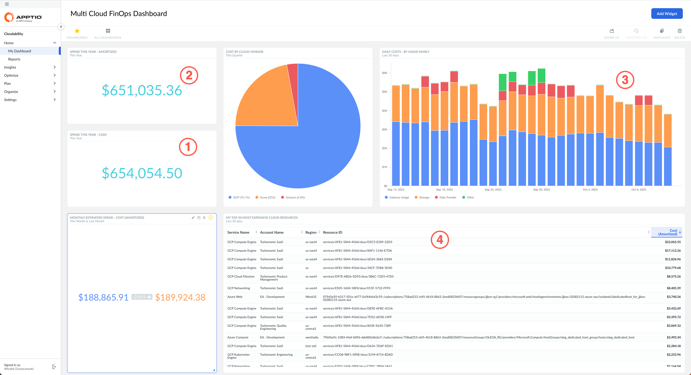
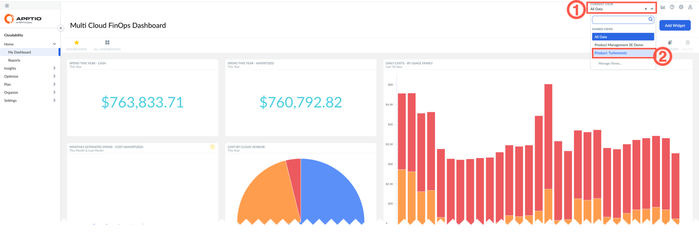
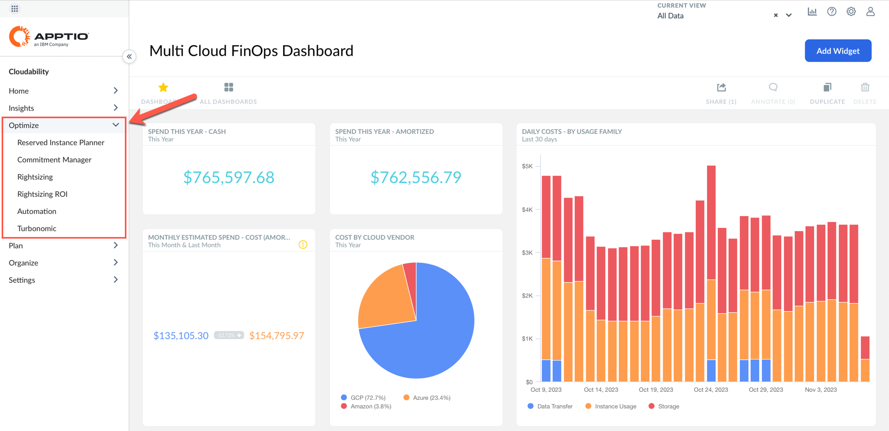
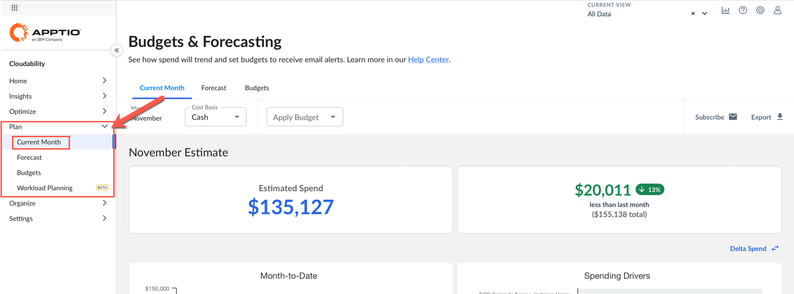
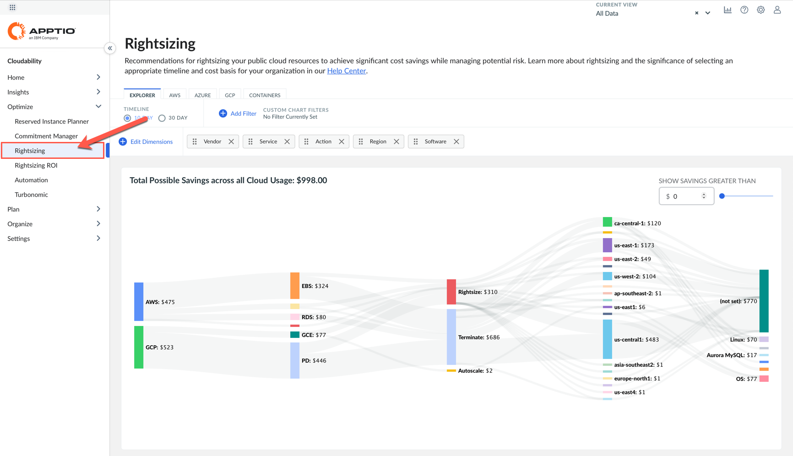

# Visión general de Cloudability

El laboratorio se centra en un **panel de FinOps**. Este cuadro de mando está diseñado para demostraciones en pantallas grandes o pequeñas, así que no dudes en utilizarlo en tu portátil (por lo que es muy adecuado para un Webex) o conectarlo a una pantalla externa. El cuadro de mandos está diseñado para su uso con o sin vistas aplicadas, pero se recomienda empezar con la vista **Todos los datos**.

El panel de control de este laboratorio está diseñado para mostrar rápidamente los conceptos clave de FinOps para una demostración introductoria. Sin embargo, está lejos de ser exhaustivo en la cobertura del conjunto de características de la solución. Te animamos a explorar más y mejorar su demostración sobre lo que se proporciona en esta guía.

1.  Abra la interfaz de usuario de Cloudability y seleccione **Multi Cloud FinOps Dashboard**.

La demostración comienza en el panel de control Multi Cloud FinOps, como se muestra más arriba. Lo primero que hay que destacar de la plataforma es que ofrece una visibilidad única de los costes en los principales proveedores de la nube: AWS, Azure y GCP.

Los clientes pueden comprender el coste de toda la huella de la nube casi en tiempo real y, lo que es más importante, medirlo de una forma que tenga sentido para la empresa.

Por ejemplo, puede hacer aflorar lo que ha pagado a los **proveedores de la nube (1)** frente a lo que se ha **consumido (2)**. La métrica del coste amortizado asignará los planes de ahorro iniciales y los pagos de instancias reservadas a dónde y cuándo se han consumido. También puede optar por aplicar reglas de fijación de precios personalizadas o eliminar descuentos con métricas como éstas, que básicamente representan el coste.

La información proporcionada por Cloudability se basa principalmente en la información de facturación detallada disponible de cada proveedor de nube, que se enriquece para ayudarle a darle sentido. Este enriquecimiento categoriza el gasto de algunas formas útiles. Una de las definiciones más interesantes disponibles por defecto es la **familia de uso (3)**.

Como puede ver aquí en este gráfico de gastos diarios, puede ver fácilmente qué costes se destinan a áreas como el almacenamiento frente a las instancias de máquinas virtuales frente a la transferencia de datos, etc.

Otras dimensiones populares de los informes permiten a los usuarios rastrear el servicio en nube consumido, identificar el tipo de partida de costes e identificar el **tipo de transacción (4)**.

2.  Seleccione **Producto:Turbonomic** en el menú desplegable **Vista actual** en la esquina superior derecha.

> Es posible que tenga que desplazarse hasta la parte superior de la ventana para ver el menú desplegable.

Lo increíblemente potente de Cloudability es que todos estos datos se estandarizan a través de su motor de visualización, tanto si desea clasificarlos por aplicación, por producto o por cualquier otra dimensión significativa para su empresa.

Las vistas pueden definirse a partir de cualquier atributo de un registro de costes, ya sea cargado directamente desde el proveedor de la nube, como etiquetas, identificadores de cuenta, etiquetas, etc., o a partir de asignaciones empresariales que correlacionan estos datos en dimensiones empresariales significativas (por ejemplo: producto, propietario, unidad de negocio, etc.).

Esto permite a los usuarios centrarse en los datos que les interesan. También proporciona control de acceso, de modo que los usuarios solo pueden ver los datos de costes que deben ver.

Si inicia sesión en el sistema como propietario de un producto o aplicación específicos (en este ejemplo, inicia sesión como propietario del producto Turbonomic), solo verá los datos de ese producto.

Este nivel de acceso a los datos se extiende a todas las características y funciones de Cloudability. Cada usuario puede acceder por sí mismo a todos los datos de su organización. Esto es así tanto si quieren profundizar en anomalías específicas que se produjeron en la plataforma en nube como si quieren examinar los contenedores que aprovecha la nube. El acceso a los datos está garantizado en todo momento mediante la asignación de derechos y funciones como la previsión.

Todo en la plataforma Cloudability está diseñado para ayudar a los usuarios a autogestionar los datos de costes y tomar la decisión correcta en la nube en tiempo real.

3.  Seleccione **Todos los datos** en el menú desplegable **Vista actual** situado en la esquina superior derecha y, a continuación, en el panel de navegación de la izquierda, despliegue la pestaña **Perspectivas**.

> El contenido de este menú depende del nivel de acceso que tenga asignado. Los elementos reales enumerados pueden diferir de las capturas de pantalla de este documento, en función de sus privilegios.

Fíjese en la parte izquierda de la barra de navegación. Cloudability, en esencia, fue diseñado como un motor de análisis de big data para la nube pública. Esto significa que va a extraer cada ID de recurso, espacio de nombres de clúster o etiqueta de todo su entorno por segundo y mantener esos datos en propina para respaldar la generación de informes anuales, mensuales y trimestrales.

Esta capacidad de generación de informes de datos es fundamental para respaldar ciertas funciones como la detección de anomalías, las capacidades de previsión y la generación de informes generales y la auditabilidad de sus datos en la nube, especialmente para las grandes organizaciones. Los clientes que intentan crear este tipo de capacidades por su cuenta se dan cuenta rápidamente de que almacenar, mantener y conservar los datos para soportar esta granularidad de informes suele ser un ejercicio increíblemente caro.

Además de la capacidad básica de elaboración de cuadros de mando e informes que acabamos de mostrar, Cloudability cuenta con un conjunto de funciones en torno a cada una de las distintas fases de FinOps.

Los Cloudability Insights están directamente relacionados con la fase Inform del ciclo FinOps:

*   **TrueCost Explorer (1)** y **Tag Explorer (2)** ayudan en la imputación de costes.
*   **La imputación de los costes de** los contenedores **(3)** también se encuentra aquí.
*   Las vistas**Plan de ahorro (4)** e **Instancia reservada (5)** permiten realizar un seguimiento de estos elementos.
*   **La detección de anomalías (6)** ayuda a detectar rápidamente los gastos inusuales
*   **Los cuadros de mando (7)** ayudan a comparar la eficiencia del uso de la nube entre equipos.

1.  En el panel de navegación izquierdo, expanda **Optimizar** twisty.

> El contenido de este menú depende del nivel de acceso que tenga asignado. Los elementos reales enumerados pueden diferir de las capturas de pantalla de este documento, en función de sus privilegios.

Una vez que sepa quién gasta qué, es probable que se pregunte: *"¿Cómo puede Cloudability ayudarnos a gastar menos?".*

Cloudability lo hace ayudando a planificar el uso de **instancias reservadas (RI)** y la gestión de compromisos en todos los proveedores de nube, así como el dimensionamiento correcto y el seguimiento automático del rendimiento de la inversión para esa optimización.

5.  Despliegue el botón **Plan** en el panel de navegación izquierdo y seleccione **Mes en curso**.

> El contenido de este menú depende del nivel de acceso que tenga asignado. Los elementos reales enumerados pueden diferir de las capturas de pantalla de este documento, en función de sus privilegios.

Una vez que sepa quién gasta qué y que está gastando la cantidad correcta, querrá saber: *"¿Cuánto vamos a pagar mañana?".*

Así que aquí está el análisis del mes actual y la previsión a más largo plazo para mostrarle lo que podría gastar a 6, 12, 24 meses vista, todo ello haciendo un seguimiento de su presupuesto y sus planes con respecto a los reales mientras se vuelven a prever esos datos a lo largo del año. De este modo, estará siempre al día de lo que se espera que gasten sus equipos.

<Danger text="The next step (6) can only be completed if you have access to the Organize tab. If you do not have access it can be skipped." />

6.  Despliegue el botón **Organizar** del menú de la izquierda.

Hablemos de la pestaña **Organizar**. Cloudability ingestará todas tus etiquetas en todos los proveedores de la nube. También puede adherirse a cualquier tipo de jerarquía de cuenta, suscripción o proyecto, cualquier cosa por el estilo. Normalmente, el 99% de los clientes de Cloudability aprovechan la función "business mappings". Esta función proporciona una estrategia de asignación basada en reglas mucho más sólida que asigna el gasto en la nube a sus prioridades empresariales reales.

7.  Despliegue el twisty **Insights** de la izquierda y seleccione la opción **Tag Explorer**.

> Recuerde que está accediendo a un entorno de demostración en vivo. El contenido real de su demo puede diferir de las capturas de pantalla de este documento.

El Explorador de etiquetas le permite ver rápidamente el estado de todas las etiquetas de su empresa. Esta vista ayuda a conseguir uno de los principios de FinOps: *"Que todo el mundo se responsabilice de su uso de la nube"*. Si observa este gráfico, podrá identificar rápidamente los gastos en la nube que no están asignados a la parte responsable. Con este informe, puede ver una cantidad muy limitada de gastos en la nube que se pueden asignar directamente al Propietario, Entorno o Aplicación pasando el cursor por encima de las barras horizontales del informe asociadas a estas dimensiones a la izquierda. Esto es muy común para la mayoría de los usuarios de Cloudability cuando empiezan.

Hay algunas cosas que no puedes etiquetar con tu proveedor de nube. Por ejemplo, hay multitenencia... En ese caso, el etiquetado no le proporciona realmente los datos que necesita para la asignación. En esta demostración, no es que el 86% de los datos no estén etiquetados por un propietario de Turbonomic, (podría haber muchas razones diferentes para ello). Algunos proveedores de nube tienen un enfoque basado en cuentas en el que los clientes no necesitan poner un valor de etiqueta en los recursos porque la cuenta, suscripción o proyecto les dice a qué aplicación o propietario pertenece la carga de trabajo. También podría haber infraestructura que está en contenedores, donde la forma en que se asignan los costes a un propietario o aplicación proviene de un espacio de nombres o una etiqueta dentro de los clústeres de Kubernetes u OpenShift.

8.  Haga clic en la barra horizontal gris asociada a la dimensión **Propietario** o **Equipo**.

 

> Observe cómo la parte inferior del informe muestra la lista de artículos de coste sin etiquetas.

Con el explorador de etiquetas de Cloudability, puede identificar rápidamente los recursos que pueden etiquetarse pero que no lo están. Cloudability le ayuda a identificar rápidamente los elementos que su equipo de operaciones debería etiquetar correctamente, de modo que los costes asociados se asignen al propietario o aplicación adecuados. Para los elementos que no se pueden etiquetar, Cloudability proporciona el flexible motor Business mappings que le permite definir condiciones lógicas utilizando cualquier atributo disponible para asignar el coste a la parte responsable.

Esto es muy importante, porque si no puede asignar los dólares de gasto en la nube con precisión y éxito a las unidades de negocio, aplicación o cualquier centro de costes, no podrá realizar la optimización, previsión o cualquiera de los otros casos de uso principales que impulsan el valor con el apoyo de FinOps.

9.  En el menú de navegación de la izquierda, expanda **Insights** y seleccione **Contenedores**.

Para entornos compartidos como clústeres gestionados de Kubernetes u OpenShift, Cloudability proporciona un mecanismo dedicado para recopilar métricas de uso, como el consumo de CPU o memoria. Estas métricas se utilizan para dividir adecuadamente los costes de funcionamiento de todo el clúster entre los propietarios o iniciadores de la carga de trabajo

10. En el menú de navegación de la izquierda, expanda **Insights** y seleccione **Reservation Portfolio**.

> En este entorno de demostración, no todos los tipos de reservas están disponibles. Elige la que muestre algunos valores (lo más probable es que sea AWS EC2).

Esta vista apoya la fase **Informar** del ciclo FinOps ayudando a los usuarios a revisar rápidamente el nivel de utilización de las medidas de ahorro de costes ya aplicadas, como **las Instancias Reservadas (IR)** o los planes de **Ahorro**. Uno de los principales principios de FinOps requiere que los ahorros de costes sean gestionados de forma centralizada por el equipo de FinOps para lograr economía de escala. Esta vista ayuda a cualquier usuario a comprender cómo están utilizando las medidas de ahorro existentes en todos los proveedores de nube y en los diferentes servicios.

11. En el menú de navegación de la izquierda, expanda **Insights** y seleccione **Detección de anomalías**; a continuación, haga clic en el botón **Detalles** de cualquiera de las líneas mostradas a la derecha.

La detección de anomalías es otra función útil que facilita la aplicación de la fase Inform de FinOps. El objetivo aquí es sencillo: detectar el gasto anómalo en la nube lo antes posible y alertar a los usuarios, para que puedan comprobarlo y reaccionar. Hay muchas situaciones en las que esto puede ahorrarle mucho dinero. Permítanme darles algunos ejemplos.

Hubo un cliente que intentó probar Amazon Macie cuando se lanzó por primera vez. Empezaron a probarlo el viernes hacia el mediodía, y salieron de la oficina al final del día sobre las 5 de la tarde. Alrededor de las 9 de la noche, habían gastado unos 240.000 dólares en Amazon Macie escaneando todas las cuentas en busca de vulnerabilidades de seguridad y cosas por el estilo. Cloudability dio la alerta al cabo de unas horas, el cliente abrió un ticket con AWS support y, como pudieron detectar esta situación en un plazo de 24 horas, consiguieron que se les devolviera el crédito por ese servicio.

Otro ejemplo está relacionado con la minería de bitcoins. Hay muchos clientes que han recibido alertas de Cloudability de que tienen cargas de trabajo extrañas y costosas desplegadas en regiones extrañas en las que normalmente no operan. Gracias a la detección de anomalías de Cloudability, pudieron detectar e identificar quién las estaba generando cuando se produjeron.

La función de detección de anomalías de Cloudability es potente y sólida porque está totalmente automatizada y se basa en el análisis de la desviación estándar de cualquier partida de gastos. Los usuarios no tienen que definir umbrales ni reglas de alerta, sino que reciben notificaciones sobre gastos anómalos en cualquier servicio de cualquier proveedor de servicios en la nube conectado.

12. Despliegue el botón **Optimizar** del menú de la izquierda y seleccione **Redimensionar**.

Mira las características de Cloudability que apoyan la fase Optimizar del ciclo FinOps. Veamos Rightsizing. Este es uno de los varios elementos disponibles para ayudarle a optimizar su gasto en la nube. Cloudability examina las métricas de utilización de diferentes servicios en la nube y hace una recomendación si Cloudability cree que hay un tipo de instancia más adecuado y de menor coste disponible. Esta función de Cloudability suele ser utilizada por clientes en el nivel bajo de madurez de FinOps (fase de rastreo) cuando aún están aprendiendo a operar en la nube y desean aplicar estas acciones manualmente. Para clientes más maduros que quieren optimizar a escala de forma automatizada, IBM tiene una solución más centrada llamada IBM Turbonomic.

13. Despliegue el botón **Plan** en el menú de la izquierda y seleccione **Previsión**.

Por último, a medida que maduren sus prácticas FinOps, normalmente querrá implantar prácticas Operate. Cloudability le ayuda proporcionando previsiones de costes basadas en los datos recopilados y la tendencia proyectada. Puede revisar estas previsiones para cualquiera de sus servicios en nube y guardar la previsión como presupuesto. Más tarde, cuando se importan nuevos datos de facturación, los costes reales se comparan automáticamente con el presupuesto y se visualizan en los informes. Esto le ayuda a gestionar su gasto en nube.

## Resumen

Recapitulemos rápidamente lo que se ha mostrado. Se le ha mostrado cómo Cloudability le ayuda a implementar prácticas de todas las fases del ciclo FinOps, empezando por la fase **Informar**, pasando por **Optimizar** y **Operar**.

También ha visto una serie de visualizaciones, cuadros de mando e informes que le ayudan a asignar los costes de la nube a propietarios, productos, unidades de negocio o los centros de costes que desee. Ha visto las recomendaciones de optimización que le ayudan a ahorrar dinero. Por último, ha visto las funciones de Cloudability que ayudan a su departamento financiero a planificar, prever y presupuestar los costes de la nube.
