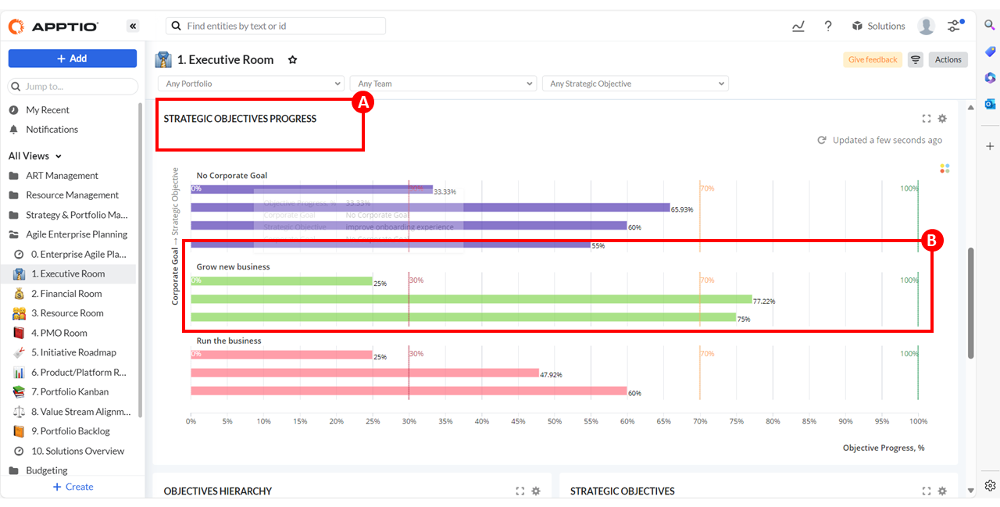
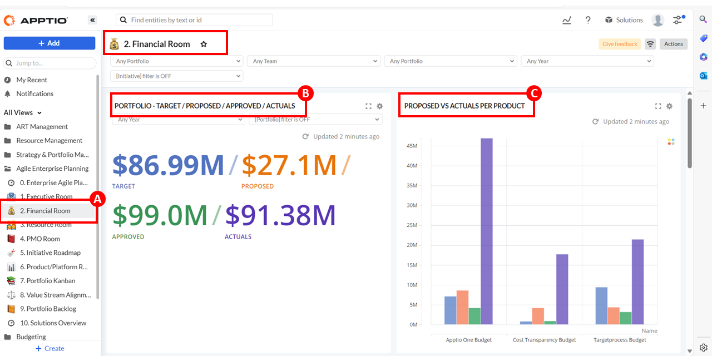
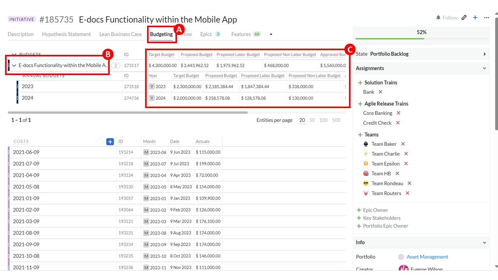
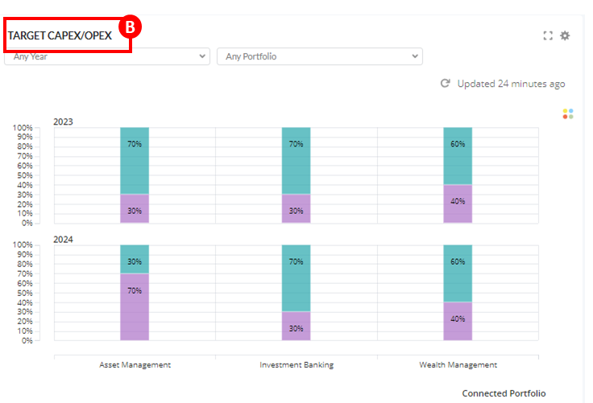
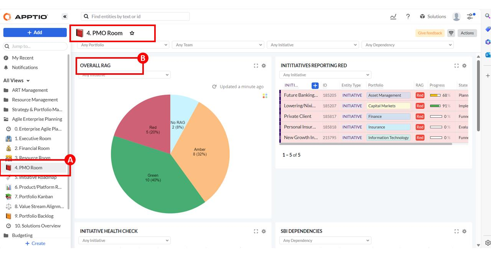
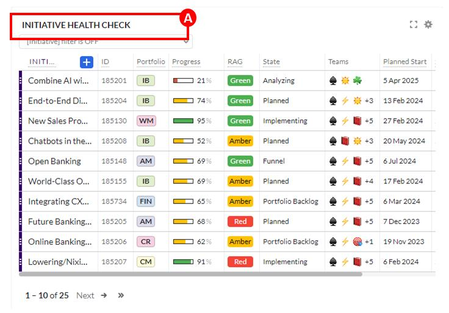

# 101: Planificación empresarial ágil

> **Descripción general**: Este escenario de demostración muestra a los clientes en diversas funciones a través de la empresa cómo Targetprocess puede ayudarles a la transición a, o continuar, el uso de lean portfolio management. El producto Targetprocess es rico en funciones, por lo que esta demostración toca brevemente la mayoría de sus capacidades: planeación estratégica, administración de programas, administración de recursos y presupuestación de portafolios.

Esta sección de la demostración se centra en las vistas de la carpeta **Agile Enterprise Planning** y es una visión general de las capacidades de Targetprocess.

La carpeta tiene muchas vistas, pero usted se concentra en cuatro vistas, específicamente (Sala Ejecutiva, Sala Financiera, Sala de Recursos y Sala PMO). Las vistas contienen muchos cuadros de mando, tablas y gráficos que están diseñados para los profesionales de Agile para mostrar las capacidades clave en Targetprocess.

> Personas utilizadas: **Líderes empresariales y tecnológicos**

## Habitación Executive

1.  Abra la carpeta **Agile Enterprise Planning** **(A)** haciendo clic sobre ella.

Al iniciar sesión en el sistema Targetprocess, verá varias carpetas. Cada carpeta está organizada en varias vistas, que lo llevan a un aspecto diferente de un proyecto ágil. Para esta sección, usted trabajará en la carpeta Agile Enterprise Planning y las vistas de la carpeta.

Lo primero que hay que destacar de la plataforma es que reúne en (una única ventana), vistas de trenes de liberación ágiles, recursos, carteras, planes estratégicos, presupuestos y proyectos. A medida que se avanza en esta sección, cada vista se expresa como una sala. Las salas son una forma de consolidar lógicamente una gran cantidad de datos en una forma consumible. Esta carpeta tiene muchas salas, pero estas cuatro salas (vistas) representan las principales capacidades de Targetprocess.

*   **Executive Room** es un lugar donde los líderes empresariales y tecnológicos pueden colaborar para alinearse en los objetivos estratégicos y las iniciativas de la empresa.
*   **Financial Room** es donde los gestores de cartera pueden alinearse con los líderes financieros a medida que el negocio pasa de la financiación anual a la financiación continua del producto.
*   La PMO y los equipos de ingeniería utilizan **Resource Room** para optimizar los recursos y mejorar la planificación de la capacidad y la demanda.
*   **PMO Room** es donde los líderes de producto pueden digitalizar y automatizar la planificación trimestral del negocio y del intervalo de planificación (PI).

2.  Haga clic en la vista de la **habitación Executive** **(A)**

Está accediendo a un entorno de demostración en vivo. Los datos que se muestran en estas capturas de pantalla pueden diferir del entorno de demostración real. Lo importante es tener en cuenta que el flujo y las capacidades son los mismos. Ajuste su narración según sea necesario.

Para cada paso, se desplaza por el panel de control (vista) de la Sala, explorando sus cuadros y gráficos.

La **Sala Ejecutiva** es el lugar donde los líderes de cartera y de producto pueden ver una visión general de las solicitudes estratégicas entrantes, los objetivos estratégicos y las iniciativas. La **Sala Ejecutiva** tiene varios usos diferentes:

*   Gestión de solicitudes estratégicas que incluyen cifras aproximadas y puntuación
*   Alinear los objetivos estratégicos con los resultados clave y el trabajo
*   Gestión de iniciativas

3.  Desplácese hacia abajo hasta que vea el gráfico: **PROGRESO DE LOS OBJETIVOS ESTRATÉGICOS (A)**.

Las peticiones estratégicas son ideas de trabajo propuestas por los líderes empresariales y tecnológicos. Los líderes empresariales revisan y priorizan las solicitudes estratégicas y, a continuación, desarrollan objetivos e iniciativas estratégicos basados en las solicitudes estratégicas que desean llevar a cabo. En este gráfico se puede ver la relación entre una meta corporativa y sus objetivos estratégicos **(B)**. Tres objetivos estratégicos están relacionados con el objetivo corporativo **"Desarrollar nuevos negocios"**.

Pase el ratón por encima del objetivo corporativo denominado **Crecimiento de nuevos negocios**. El gráfico de barras del objetivo representa tres objetivos estratégicos. Cada objetivo estratégico tiene una ventana emergente que indica su progreso. Esta vista es valiosa para que un ejecutivo pueda visualizar rápidamente los objetivos corporativos, las peticiones estratégicas y los objetivos estratégicos de la empresa.

4.  Desplácese hacia abajo hasta que vea el gráfico **del HOJA DE RUTA DE LA INICIATIVA** **(A)** y, a continuación, haga clic en el icono **Abrir vista completa** **(B)**.

5.  Haga clic en **Acciones (A)** y luego en **Mostrar** en la sección **Relaciones**. Esta acción muestra el código de colores de las relaciones entre iniciativas **(B)**.

Es posible que desee ver la información de las iniciativas de una forma más visual. Utilizando la **hoja de ruta de iniciativas**, puede ver qué iniciativas están conectadas a objetivos corporativos específicos y cuándo está prevista la entrega de la iniciativa. Las iniciativas se convierten en el centro de atención de esta demostración a medida que avanza.

## Sala Financiera

1.  Haga clic en la vista de **la Sala Financiera** **(A)**.

Como líder de un producto o cartera, usted desea ver los datos financieros de su producto o cartera. Echemos un vistazo a la Sala Financiera, que reúne diferentes métodos de financiación en un panel de control en el que puede realizar un seguimiento de los costes reales, así como de las previsiones de costes. También los divide entre CapEx/OpEx y Grow/Run.

En la Sala Financiera, Targetprocess le ofrece la posibilidad de vincular distintos métodos de financiación a un cuadro de mandos o de acumular la financiación en la misma cartera. Los distintos métodos de financiación dificultan la visualización de los datos financieros acumulados de años, trimestres y meses. Targetprocess utiliza las fechas vinculadas a las partidas para calcular los datos financieros de cada partida, independientemente de la metodología de planificación o financiación utilizada. A continuación, puede completar el seguimiento y la previsión en estos niveles de tiempo según sea necesario.

Como líder de una cartera, puede utilizar el gráfico **CARTERA - OBJETIVO/PROPUESTA/APROBADO/REALES** **(B)** para comparar los datos financieros de la cartera.

Como líder de producto, puede ver los costes propuestos frente a los reales en el gráfico **PROPUESTOS VS REALES POR PRODUCTO** **(C)**.

2.  Desplácese hacia abajo hasta que vea el cuadro **FINANZAS DE LA INICIATIVA** **(A)** y, a continuación, despliegue la **funcionalidad E-docs dentro del** twisty de **la aplicación móvil** **(B)**.

3.  Haga clic en la **Funcionalidad E-docs dentro de la** iniciativa **App Móvil** **(A)** en el **Presupuesto Anual 2023**.

4.  Seleccione la pestaña **Presupuestación** **(A)**.

Se puede hacer un seguimiento detallado de la información financiera de cada iniciativa desplegando el recuadro **(B)** situado junto a la **Funcionalidad E-docs de** la iniciativa **dentro del Presupuesto de la aplicación móvil**. En esta vista se muestran los datos financieros desglosados **(C)**, como el **presupuesto objetivo**, el **presupuesto aprobado**, **los datos reales laborales** y **los datos reales no laborales**.

5.  Cierre la ventana: **#185735 E-docs Funcionalidad dentro de la aplicación móvil**.
6.  Desplácese hasta que vea estos gráficos **FINANZAS DE PRODUCTO**, **CAPEX/OPEX OBJETIVO**, **GASTO TOTAL ANUAL** y **VARIACIÓN MENSUAL**.

Hay varios gráficos y cuadros más que le ofrecen más información financiera, ya sea relacionada con el producto o con la cartera. Como has aprendido, las iniciativas pueden verse a nivel de cartera, pero estos informes están disponibles:

*   Agregue todo hacia el nivel de producto con la tabla **FINANZAS DEL PRODUCTO** **(A)** que puede abrir directamente desde esta vista del cuadro de mando.
*   También puede visualizar el gráfico **TARGET CAPEX/OPEX** **(B)**.
*   Targetprocess también muestra un informe de tendencia mensual en el informe de **GASTO TOTAL ANUAL** **(C)**, con los datos reales/repartidos entre mano de obra/sin mano de obra reales por mes y la última tendencia. Este informe puede filtrarse por iniciativa y cartera.
*   El análisis de **la VARIABILIDAD MENSUAL** **(D)** está disponible en este cuadro de mando. Este informe también puede filtrarse por iniciativa y cartera.

La **Sala Financiera** le muestra la conexión entre el trabajo y las finanzas. Toda la información necesaria está disponible en estos cuadros de mando para gestionar directamente sus finanzas, tanto si están relacionadas con productos como con iniciativas. Veamos la Sala de Recursos.

## Sala de recursos

La **Sala de Recursos** ayuda a los responsables de productos y carteras con estos casos de uso:

*   Vincule el trabajo planificado y entregado en Jira/ADO con los intervalos de planificación (PI) y compare los recursos comprometidos con el trabajo completado.
*   Realice un seguimiento del rendimiento utilizando métricas ágiles como la velocidad, la previsibilidad y los tipos de valor.
*   Comprender las finanzas de los recursos a nivel de iniciativa y trasladarlas al nivel de ART y Stream.

1.  Haga clic en la vista **Sala de recursos** **(A)**.

Esta sala ayuda a establecer una conexión entre el trabajo planificado y el entregado a nivel de intervalo de planificación o tren de lanzamiento ágil. Esta conexión se traduce en datos financieros y capacidad disponible. Esta conexión puede ser ágil y calculada sin el uso de hojas de horas. A la gente no le gustan las hojas de asistencia. Targetprocess tiene una función de carga de equipo que admite la tasa de utilización o los grupos de recursos tradicionales.

Al pasar el puntero sobre las columnas del gráfico **ART AÑO ACTUAL PROPUESTO VERSUS REALS** **(B)**, podrá ver a nivel de tren de liberación lo que se propuso y lo que se gastó. En este caso, existe una diferencia significativa entre el coste propuesto y el coste real.

2.  Desplácese hasta que vea los gráficos **PROGRESO PI (A)** y **VELOCIDAD DE FLUJO (B)**.

En el gráfico **PI PROGRESS** **(A)**, se muestra el tren de lanzamientos ágil denominado Core Banking, con sus intervalos de planificación y su progreso. El gráfico **VELOCIDAD** DE FLUJO (B) muestra otra forma ágil de medir el rendimiento de los equipos con la evolución de la velocidad de flujo entre varios equipos o trenes de versiones.

3.  Desplácese hacia abajo hasta que vea estos gráficos: **CARACTERÍSTICAS/PI COMPLETADO VS COMPROMETIDO (A)** y **COMPROBACIÓN DE CAPACIDAD DE PI (B)**.

Recuerde que está accediendo a un entorno de demostración en vivo. Los datos que se muestran en las capturas de pantalla pueden diferir del entorno de demostración real. En el momento en que se escribió este script de demostración, el gráfico **PI CAPACITY CHECK** **(B)** estaba configurado para mostrar datos sólo para futuras versiones/PIs. Ajuste su narración.

Además de lo que se ha entregado, también se puede ver el trabajo que se ha comprometido y completado. ¿Está alineada la capacidad? ¿Sí o no? También puede ver si se ha utilizado la capacidad de todo el equipo. Por ejemplo, ¿qué pasa si falta capacidad del equipo o iteraciones necesarias para completar el trabajo? Esta vista está directamente relacionada y basada en los datos de JIRA o DevOps o cualquier otro dato de entrega del equipo. No hay necesidad de una interfaz manual ni de retrasos en los recursos.

## Sala PMO

Esta sala es el lugar en el que los equipos pueden supervisar el paso de las entregas en cascada a unas entregas y una gobernanza más ágiles. Esta sala se centra en los informes rojo, ámbar y verde (RAG) para iniciativas y objetivos tácticos. Los gráficos de esta sala muestran las iniciativas que superan el presupuesto (en rojo). Desde aquí, los equipos de ingeniería pueden identificar los principales riesgos, crear dependencias y realizar un seguimiento de los riesgos/dependencias.

1.  Haga clic en la vista **Sala PMO** **(A)**.

La **Sala PMO** es utilizada por las PMO y los equipos de ingeniería que se encuentran en la transición de un modo de trabajo tradicional en cascada a un modo de trabajo más ágil.

Aquí puede ver el estado de cualquier iniciativa en el gráfico **RAG GLOBAL** (rojo, ámbar, verde) **(B)**.

2.  Desplácese hacia abajo hasta que vea el cuadro **COMPROBACIÓN DE INICIATIVA DE SALUD** **(A)**.

Utilice el cuadro **COMPROBACIÓN DEL ESTADO DE LAS INICIATIVAS** **(A)** si desea obtener una visión general del estado de una iniciativa concreta o de todas las iniciativas.
