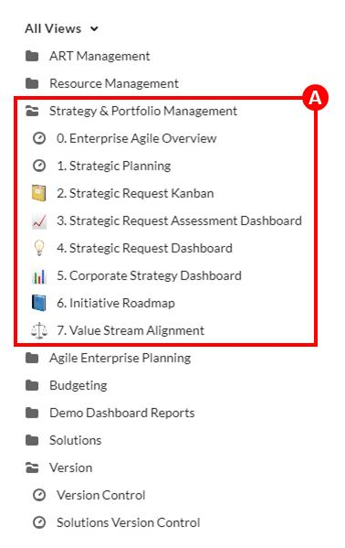
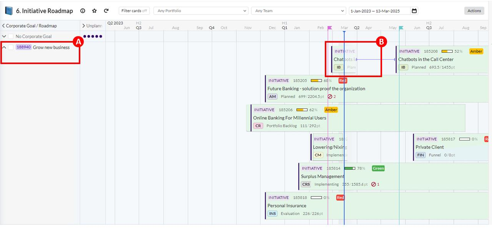
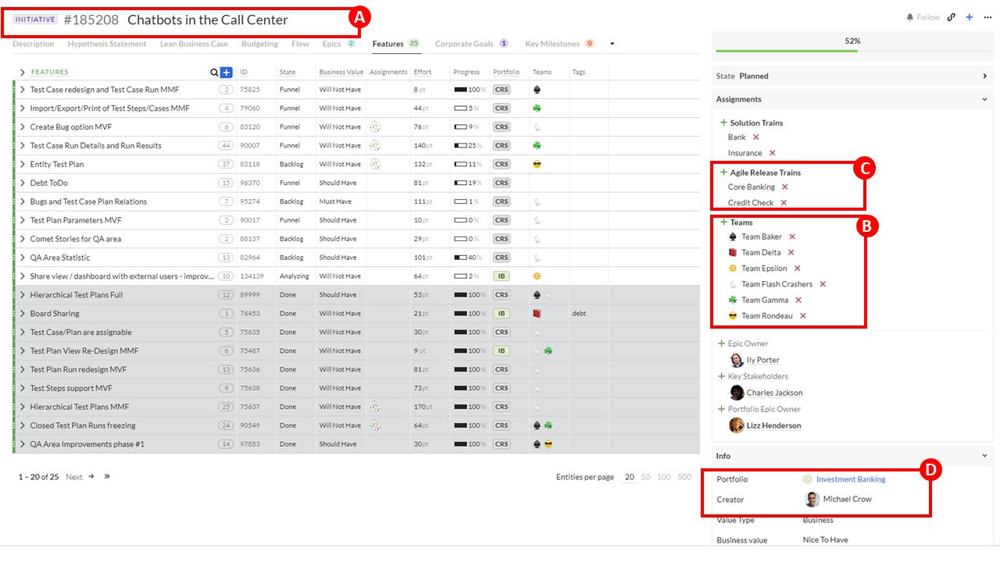
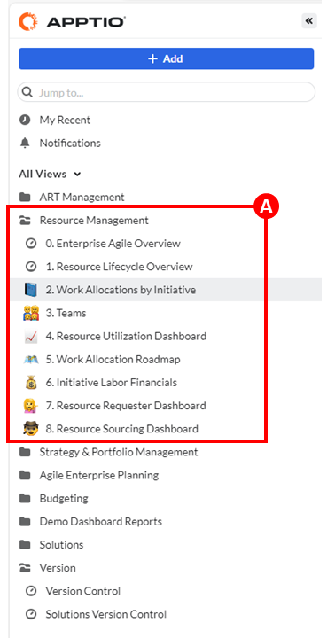
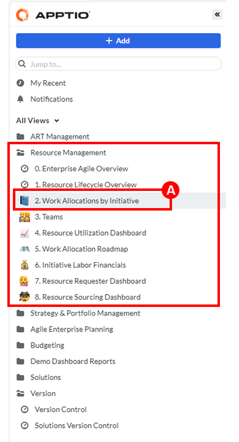
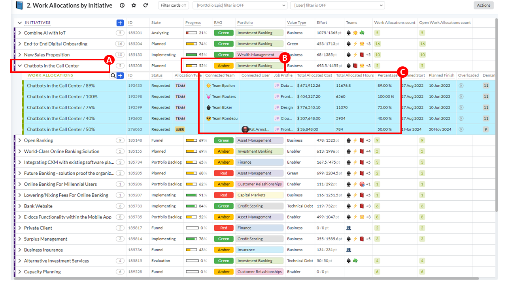
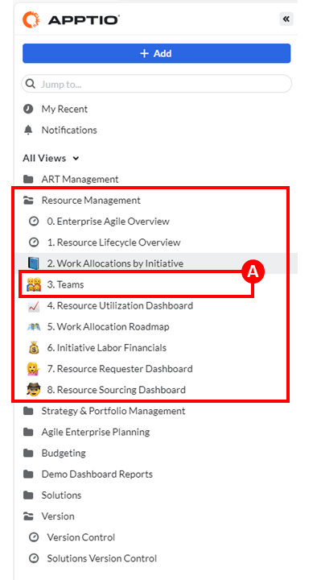
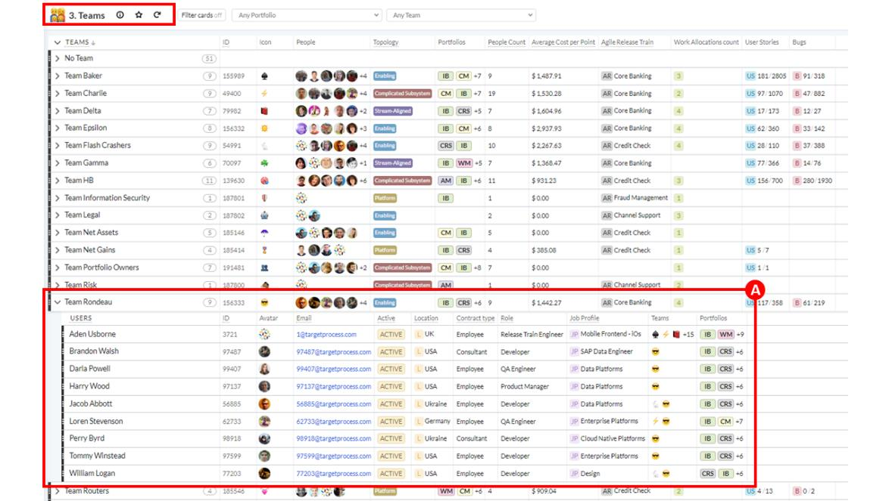
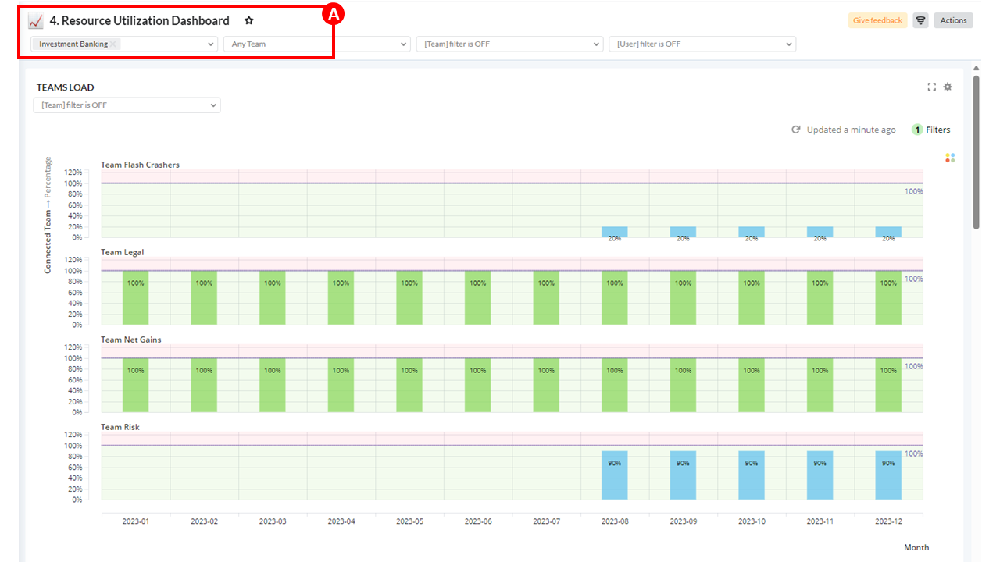
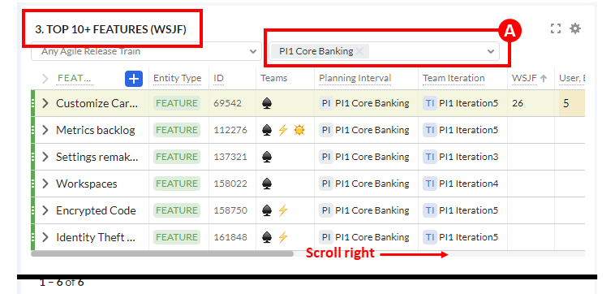

# 102: Capacidades del proceso objetivo

## Estrategia y gestión de carteras

En esta sección, se pasa de una vista a nivel ejecutivo a una vista de funciones específicas de las capacidades de Targetprocess. A medida que se avanza en esta sección y en todas las demás, se reintroducen conceptos anteriores. Esta sección se sumerge en la Planeación Estratégica, donde los líderes de negocios y tecnología pueden alinear el trabajo, la mano de obra y las inversiones con los objetivos e iniciativas estratégicas del negocio. Esta sección se centra en las iniciativas.

Se debaten dos puntos de vista:

*   Hoja de ruta de la iniciativa
*   Alineación del flujo de valor

> Personas utilizadas: **Líderes empresariales y tecnológicos**

### Hoja de ruta de la iniciativa

1.  Haga clic en la carpeta **Strategy & Portfolio Management** **(A)**.

En el laboratorio anterior, usted cubrió la transición de Solicitudes Estratégicas a Objetivos Estratégicos e Iniciativas. Ahora, quiere centrarse en las Iniciativas. Ten en cuenta que una iniciativa es una inversión o un plan empresarial de alto nivel que avanza a través del proceso ágil.

La carpeta **Strategy & Portfolio Management** **(A)** tiene muchas vistas que hablan del rico conjunto de capacidades de Targetprocess. Es posible que desee ver las iniciativas aprobadas que están programadas y cómo la financiación se alinea con los objetivos de negocio y se escala ágilmente utilizando flujos de valor.

2.  Haga clic en la vista **Hoja de ruta de la iniciativa** **(A)**.

3.  Localice el objetivo corporativo **Crecer nuevos negocios** **(A)** en el **Objetivo corporativo / Hoja de ruta**.

Targetprocess se diferencia de otras herramientas comparables por su función **de hoja de ruta de iniciativas**. La mayoría de las otras herramientas tienen alguna versión de listas y tableros. La **hoja de ruta de la iniciativa** es un gran diferenciador.

La hoja de ruta se abre con todos los **objetivos corporativos (A)** que aparecen a la izquierda. En el siguiente paso, vamos a ver el objetivo corporativo **Crecer nuevos negocios**. A la derecha, puede ver las iniciativas (B) que están asociadas a este objetivo corporativo. Veamos una de las iniciativas, **Chatbots en el Call Center**.

4.  En la **hoja de ruta de iniciativas**, haga clic en la iniciativa **Chatbots** en el **centro de llamadas** **(B)**.
5.  Una vez abierta la iniciativa Chatbots en el Call Center (A), seleccione la pestaña Características.

Puede seleccionar cualquier iniciativa, pero asegúrese de que tiene todas las características que se mencionan en la narración. En esta captura de pantalla, se observan dos iniciativas que están etiquetadas como **Chatbots en el Call Center**. Esta situación se produce porque la fecha de inicio real de la iniciativa aparece antes de la fecha de inicio prevista.

Puede ver todas las **Características** adjuntas a **los Chatbots en la** iniciativa **Call Center**. La tabla contiene varios valores de estado (Estado, Esfuerzo, Progreso, Cartera y Equipos). La tabla contiene mucha información. Explore cualquiera de los valores de las columnas.

A la derecha, puede ver los **Equipos (B)** que son responsables de esta iniciativa. También puede ver a qué **Agile Release Trains (C)** pertenece esta iniciativa. Hay mucha información reunida en esta simple vista de la iniciativa.

En la sección **Info**, tome nota de la **Cartera (D)** a la que pertenece la iniciativa. En este caso, la iniciativa está relacionada con la Banca de Inversión. En la siguiente sección, verá esta relación observando el flujo de valor.

### Alineación del flujo de valor

1.  Haga clic en la vista **Alineación del flujo de valor** **(A)**.

2.  En la sección **PORTFOLIOS**, expande el twisty **de** **Banca** **de** **Inversión** **(A)**, luego expande el twisty de **Banca** **(B)**, y finalmente el twisty **de Chatbots en el Call Center** **(C)**.

Hay un flujo de valor que está etiquetado como **Sin flujo de valor**, lo que significa que no hay ningún flujo de valor conectado.

Una característica única de Targetprocess es la capacidad de alinear las iniciativas con los flujos de valor de la empresa. Un flujo de valor comienza con el concepto inicial (iniciativa) y fluye hasta la entrega. No todas las herramientas pueden utilizar flujos de valor, por lo que esta característica es otro elemento diferenciador.

Veamos la cartera de **Banca de Inversión** **(A)**. Dentro del flujo de valor **de Banca** **(B)** hay cuatro iniciativas, una de las cuales es la iniciativa **Chatbots en el Call Center** **(C)** que hemos visto antes. Como puede ver, tiene dos Épicas (D) que están conectadas a ella. Como líder de tecnología o de negocios, usted puede mover iniciativas alrededor y entre flujos de valor. También puede crear un nuevo flujo de valor y añadirle iniciativas.

## Gestión de recursos

El mensaje general para la Gestión de Recursos es que la PMO y los equipos de ingeniería pueden optimizar los recursos, la capacidad y la demanda para reducir el riesgo y maximizar la utilización de su personal. El enfoque de esta sección es entender la iniciativa desde una perspectiva de financiación. Para continuar con la historia de la demostración, seleccione la iniciativa Chatbots en el Call Center con la que trabajó en la sección anterior.

Se debaten cuatro puntos de vista:

*   **Asignaciones de trabajo por iniciativa**
*   **Equipos**
*   **Panel de utilización de recursos**
*   **Iniciativa Laboral Finanzas**

> Personas utilizadas: **Propietario de la iniciativa**, **equipo de ingeniería** y **PMO**

### Asignaciones de trabajo por iniciativa

1.  Seleccione la carpeta Gestión de recursos (A).

En la sección de Estrategia y Gestión de Cartera, ha visto cómo se programan las iniciativas y cómo garantizar que la financiación está alineada con los objetivos empresariales y los flujos de valor. Ahora, quiere centrarse en la gestión de los recursos para trabajar en la iniciativa. Recuerde que una iniciativa es una *"idea"* que avanza a través del proceso ágil. Una parte importante del proceso ágil es asegurar los recursos, utilizarlos adecuadamente y medirlos.

La carpeta de **Administración de Recursos** tiene muchas vistas que hablan del rico conjunto de capacidades de Targetprocess. Centrémonos en la gestión de los recursos que trabajan en una iniciativa.

2.  Haga clic en la vista **Asignaciones de trabajo por iniciativa** **(A)**.

3.  Expande los **Chatbots en el Centro de Llamadas** twisty **(A)**.

Esta vista muestra todas las iniciativas de la empresa. Si lo necesita, puede filtrarlas y ordenarlas. Para la iniciativa que ha estado discutiendo, **Chatbots en el Call Center (A)**, observe los valores de **Progreso** y **RAG** **(B)**. Recuerde que esta iniciativa formaba parte de la cartera de Banca de Inversión.

Al hacer clic en cualquier iniciativa y ampliarla, se obtiene una idea de la cantidad de trabajo necesario para completarla. **El Coste Total Asignado** y las **Horas Totales Asignadas** dan una idea del alcance de la iniciativa.

En la captura de pantalla, puede ver los **equipos (C)** que están conectados a la iniciativa y determinar si están sobrecargados. Como líder de ingeniería, puede utilizar esta información para reasignar recursos de otros equipos para ayudar a cumplir el plazo de la iniciativa.

### Equipos

1.  Haga clic en la vista **Equipos** **(A)**.

2.  Amplía la curva **Team Rondeau** **(A)**.

Aquí se obtiene una instantánea de uno de los **Equipos (A)** que está asignado a la iniciativa. Un Ingeniero de Entrenamiento de Lanzamiento podría no estar familiarizado con el equipo, por lo que puede ver qué **Roles** y Perfiles de **Trabajo** componen el equipo. Pasando a la columna de **Portafolios**, se puede ver que el equipo trabaja extensamente a través de muchos Portafolios.

A veces, un miembro del equipo forma parte de varios equipos, especialmente los miembros del equipo que desempeñan la función de Ingeniero de Tren de Lanzamiento. Esta instantánea no proporciona una visión de la utilización. Veamos la utilización a continuación.

### Panel de utilización de recursos

1.  Haga clic en la vista **Panel de utilización de recursos** **(A)**.

2.  Haga clic en el menú desplegable **Cualquier cartera** y seleccione **Banca de inversión** para filtrar los resultados **(A)**.

Desde aquí, puede ver la carga de trabajo por equipo. El cuadro de mandos **CARGA DE EQUIPOS** se filtra ahora en la **Cartera (A)**. Puede hacerse una idea de la capacidad disponible, o no disponible, para cada equipo. Una columna azul indica que el equipo tiene una carga disponible. La columna verde indica que el equipo está correctamente cargado y equilibrado. El rojo indica que el equipo está sobrecargado y necesita descargar trabajo a otro equipo.

Esta vista puede utilizarse para equilibrar la capacidad y la demanda entre los equipos.

### Iniciativa Laboral Finanzas

1.  Haga clic en la vista de **Finanzas de la Iniciativa Laboral** **(A)**.

2.  Expande el twisty **2024** asociado a **Banca de Inversión (A)** y luego localiza **Chatbots en el Call Center (B)**.

El punto fuerte de Targetprocess es que puede conectar el trabajo de una iniciativa con sus finanzas. En Targetprocess, las finanzas laborales pueden calcularse automáticamente en función de las decisiones o asignaciones de asignación de trabajo.

Aquí puede ver los presupuestos anuales que están conectados por cartera. Recuerde que las iniciativas están conectadas a una cartera. Usted expandió el portafolio **de Banca de Inversión** **(A)** y va a explorar las iniciativas conectadas a continuación. Trabajando con **los Chatbots en la** iniciativa **de Call Center** **(B)**, puede ver **los Presupuestos de Mano de Obra** **Propuestos** y **Aprobados**. Puede comparar **la** **Mano** **de** **Obra** **Real** con la **Mano de Obra Restante**.

## Gestión de ART

En esta sección, el mensaje que transmite pasa al nivel de Agile Release Train (ART). Toda la planificación que se realiza en el nivel ART puede conectarse a las vistas de empresa y cartera vistas anteriormente y a herramientas de nivel de equipo como Jira o Azure DevOps. Targetprocess puede conectar áreas de la empresa que realizan la planificación con diferentes metodologías, por ejemplo, cascada tradicional y ágil escalada.

Esta sección de la demo se centra en el soporte de Targetprocess para el Evento de Planificación PI, una parte clave de SAFe. El soporte de Targetprocess para PI Planificación ayuda a habilitar la planificación remota/híbrida y simplifica el proceso de pasar de la planificación a la implementación. Este soporte es posible porque en Targetprocess, todo está conectado en un sistema, no en sistemas separados.

Se discuten tres puntos de vista que se alinean con un Evento de Planificación PI:

*   **Añadir capacidad PI de equipo** (preparación)
*   **Junta de Planificación ART** (Ejecución)
*   **Cuadro de mando de flujos** (métricas)

> Persona utilizada: **Ingeniero de Tren de Liberación**

### Añadir capacidad de PI de equipo

1.  Haga clic en la carpeta **Gestión de ART** **(A)**.

2.  Seleccione la vista **Añadir Capacidad PI de Equipo** **(A)**.

3.  Expandir **PI1** **Core Banking** twisty **(A)**, luego expandir **Team Charlie (B)**, luego expandir **PI1 Iteration5 (C)**.

La carpeta **Gestión de ART** tiene muchas vistas que hablan del rico conjunto de capacidades de Targetprocess. Vamos a centrarnos en la planificación de la capacidad para prepararse para el Intervalo de Planificación (PI) Evento de Planificación. Es importante entender que los PIs y las Iteraciones de Equipo son cajas de tiempo para capacidad y esfuerzo. **La capacidad** representa la cantidad de trabajo que un equipo puede realizar en un periodo de tiempo determinado. **El esfuerzo** es el trabajo asignado actualmente en un periodo de tiempo específico. Ambos se miden en puntos de historia.

En el nivel **INTERVALOS DE PLANIFICACIÓN** **(A)**, puede comprobar la **Capacidad** y el **Esfuerzo** para este PI. Cada Agile Release Train (ART) tiene su propia serie de PIs, permitiendo a los ARTs y equipos seguir el calendario que mejor les funcione.

En el nivel **TEAMS** **(B)**, puede ver qué equipos están asignados a este IP. El número en el campo Equipo indica cuántas iteraciones están incluidas en el IP. En este ejemplo, el Equipo Charlie está conectado a cinco iteraciones en este PI.

En el nivel **ITERACIÓN DE EQUIPOS** **(C)**, cada iteración se realiza en un sprint de dos semanas con cada equipo conectado a la iteración. Este nivel de detalle permite a los gestores que ejecutan el Evento de Planificación PI introducir y revisar la capacidad de cada equipo por iteración.

A medida que continúe expandiendo la Iteración del Equipo, podrá ver las **CARACTERÍSTICAS**, **HISTORIAS DE USUARIO**, **TAREAS (D)** conectadas a la iteración. Estos detalles se asignan a uno o más miembros del equipo y se les asigna un esfuerzo que, en última instancia, se transfiere a la columna **Esfuerzo** del Intervalo de planificación.

### Junta de Planificación ART

1.  Haga clic en la vista de la Junta de Planificación ART (A).

2.  Haga clic en el menú desplegable **Cualquier Equipo** y seleccione Equipo Panadero (A). Ahora, haga clic en **Intervalo de planificación** y seleccione **PI1 Core Banking (B)**.

Es útil tener una representación visual de la IP y sus iteraciones. Este tablero sirve para mostrar las relaciones y gestionar las dependencias.

Como puede ver, la vista está filtrada por **Equipo (A)** e **Intervalo de planificación (B)**. Cada columna representa una iteración con sus **características**, **historias de usuario** y **tareas** conectadas. Para equilibrar la capacidad de un equipo a través de sprints, un Ingeniero de Release Train puede arrastrar/soltar Características, Historias de Usuario o Tareas a otras iteraciones con más capacidad disponible. También puede equilibrar la capacidad entre equipos e iteraciones.

### Cuadro de mando de flujos

1.  Seleccione la vista **Panel de flujo** **(A)**.

2.  Haz clic en el menú desplegable **Cualquier equipo** y selecciona **Equipo Baker (A)**.

Dado que el Ingeniero de Tren de Lanzamiento realizó el trabajo para equilibrar la capacidad entre los equipos, necesitan ver métricas que les ayuden a evaluar lo bien que están alineados el plan y la implementación del trabajo. Las métricas se utilizan una vez finalizado el Evento de Planificación de la IP e iniciada la IP. Los equipos han completado el trabajo en este punto.

Esta vista contiene varios gráficos útiles para el ingeniero del tren de liberación. Veamos tres gráficos:

*   **VELOCIDAD DE FLUJO**
*   **CARACTERÍSTICAS/PI COMPLETADAS VS COMPROMETIDAS**
*   **MÁS DE 10 FUNCIONES (WSJF)**

Empiece por el gráfico **de VELOCIDAD DE FLUJO** **(B)**, que ofrece una representación gráfica del esfuerzo necesario para la iteración de cada intervalo. Al pasar por encima de cada barra del gráfico, puede ver un resumen emergente del esfuerzo de esa iteración.

3.  Navegue hasta el cuadro **CARACTERÍSTICAS/PI COMPLETADAS VS COMPROMETIDAS** **(A)**.

El gráfico **CARACTERÍSTICAS/PI COMPLETADO VS COMPROMETIDO** **(A)** es otra herramienta de la caja de herramientas del Ingeniero de Tren de Lanzamiento. Muestra gráficamente el esfuerzo completado frente al comprometido para cada PI.

4.  Haga clic en el gráfico de **las 10 funciones principales** **(** **WSJF)** **(A)**.

5.  Haga clic en el desplegable **Intervalo de planificación** y seleccione **PI1 Core Banking (A)**.

Un ingeniero puede querer ver las características principales y priorizarlas en función del valor de Weighted Shortest Job First (WSJF) o cualquier otro valor de característica.

## Resumen

Para recapitular rápidamente esta demostración, usted mostró cómo Targetprocess ayuda a los clientes en su transición a la gestión de carteras ajustada o en su uso continuado de la misma. Esta demostración se refirió brevemente a todas las capacidades de Targetprocess: planificación estratégica, gestión de programas, gestión de recursos y presupuestación de carteras.

En la carpeta Planificación ágil de la empresa, ha podido demostrar cómo puede gestionar:

*   Capacidad de planificación estratégica en la **Sala Ejecutiva**
*   Funciones de presupuestación de carteras en la **Sala Financiera**
*   Capacidades de gestión de **recursos** en la **Sala de Recursos**
*   Capacidades de gestión de programas en la **Sala PMO**

En la carpeta de **Estrategia y Gestión de Cartera**, se pasó a cómo se programan las iniciativas aprobadas y cómo se puede garantizar que la financiación esté alineada con los objetivos empresariales y la escala ágil utilizando flujos de valor.

En cuanto a las iniciativas, ha aprendido que la carpeta **Gestión de recursos** es donde se asignan los recursos a las iniciativas y se gestiona la financiación de las mismas.

La carpeta **Gestión de ART** mostró cómo se prepara, ejecuta y analiza un evento de Intervalo de Planificación (IP).
