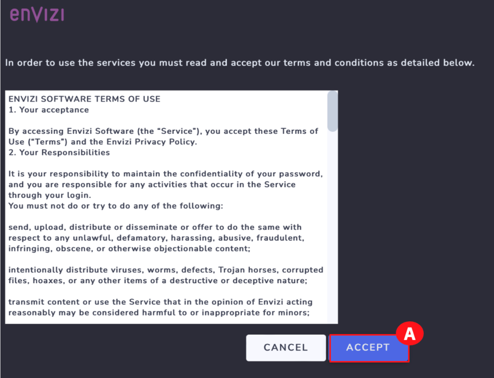
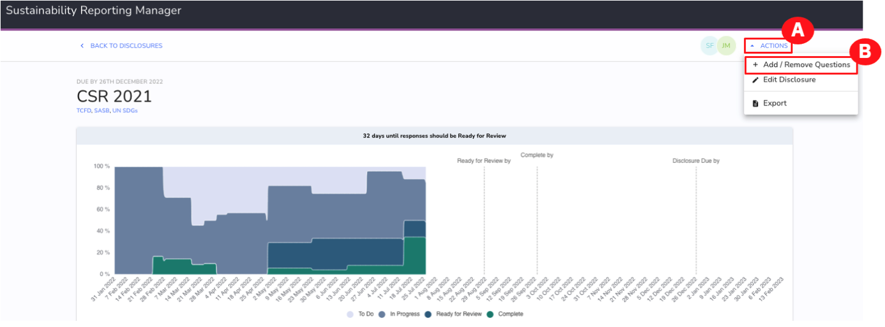
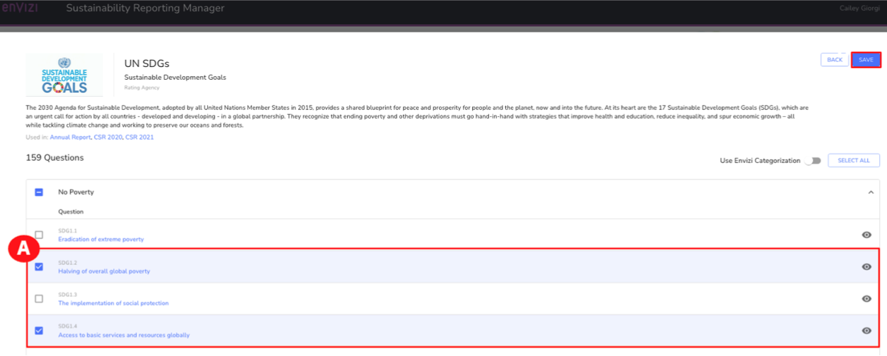
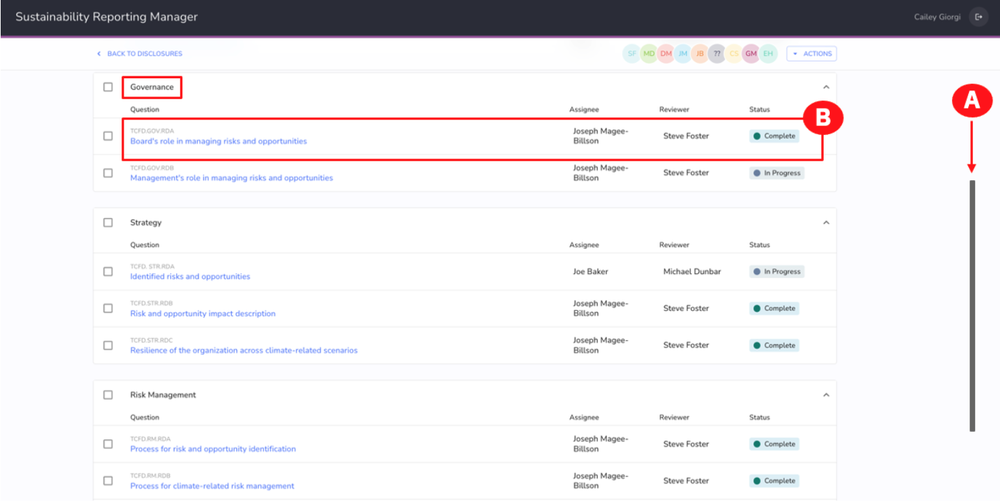
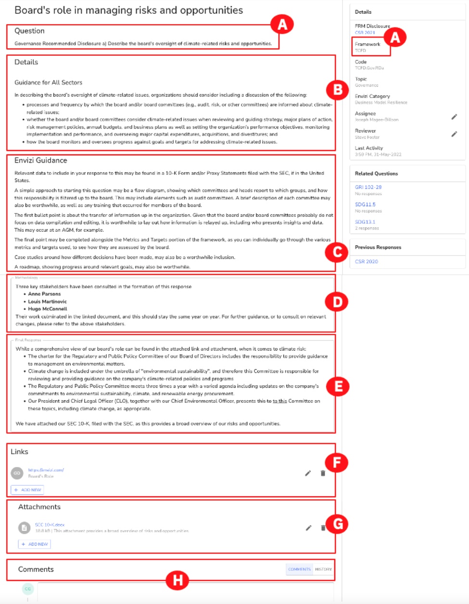

# 101: Introducción a Envizi Sustainability Performance Manager

<QuizAlert text='¡Atención! El material de la prueba será marcado así!' />

## Iniciar sesión en la plataforma Envizi

Para completar este paso, utilizará sus credenciales de acceso de la solicitud de acceso.

1. Haga clic en esta URL de la página principal de Envizi [https://uk001.envizi.com/home/default.aspx](https://uk001.envizi.com/home/default.aspx) para iniciar el entorno de demostración de Envizi.

2. Se le dirigirá a la pantalla de inicio de sesión **Bienvenido a Envizi**. Introduzca sus credenciales de inicio de sesión **(A)**.

3.  Haga clic en el botón de **inicio de sesión** **(B)**. 

4.  Se le pedirá que **revise la configuración de la** zona horaria. Haga clic en el menú desplegable y elija la zona horaria correcta **(A)**. (Para omitir este paso, haga clic en el botón **NO AHORA** ).

5.  Pulse el botón **CAMBIAR** **(B)**.

    

6.  Lea las **CONDICIONES DE USO DEL SOFTWARE ENVIZI** y haga clic en el botón **ACEPTAR (A)**.

    

## Responsable de informes de sostenibilidad

Una vez introducidas las credenciales de acceso, se abrirá la página de inicio del entorno Envizi. En esta página aparecen varias herramientas y enlaces. En esta parte de la demostración, se centrará en la herramienta Gestor de informes de sostenibilidad, que ayuda a gestionar sistemáticamente todas las preguntas, respuestas, personas, flujos de trabajo y documentos de apoyo necesarios para garantizar que los informes de sostenibilidad corporativos se ajustan a algunos de los marcos externos, como TCFD, SASB y otros.

1.  En la pantalla de inicio, en la sección Enlaces rápidos, haga clic en el widget Gestor de informes de sostenibilidad (A). Se abrirá el mosaico del Gestor de sostenibilidad en una nueva pestaña del navegador.

    

    > **NOTA:** Si el mosaico **del Gestor de Informes de Sostenibilidad** no se abre, compruebe su casilla URL, ya que es posible que tenga bloqueada la ventana emergente.

    > **NOTA:** No cierre la pestaña del navegador de **la página de inicio de Envizi**, ya que se utilizará más adelante en la demostración.

    Se abrirá la herramienta de **gestión de memorias de sostenibilidad**, donde podrá ver tanto las divulgaciones actuales como las pasadas. Cada uno de los resúmenes de esta página representa un proyecto de divulgación ESG de un año concreto. Las empresas pueden elaborar Informes de Sostenibilidad Corporativa (IRSC) anuales que se ajusten a varios marcos.

    > **NOTA:** Es posible que tenga que desplazarse hacia abajo para ver el informe CSR **2021**. Si no ve el informe etiquetado como CSR **2021**, seleccione en su lugar el **Informe anual CSR** para continuar.

    De un vistazo, hay algunas áreas en las que centrarse para gestionar sistemáticamente el progreso de la presentación del informe, así como todas las preguntas, respuestas, personas, flujo de trabajo y documentos de apoyo. Entre ellas se incluyen:

    *   Los marcos de información a los que se ajusta la memoria de sostenibilidad corporativa **(A)**.
    *   Los hitos clave del proyecto en cuanto a la preparación de los contenidos, el momento en que deben revisarse todos los contenidos y la fecha límite de presentación **(B)**.
    *   El estado de todas las respuestas a las preguntas del CSR. Muestra las preguntas que no se han iniciado**(Por hacer**), las preguntas que están **En curso**, las preguntas que están **Listas para revisión** y las preguntas que ya están **Completadas (C)**.

    

    El informe de RSE contiene información más detallada. Como responsable de sostenibilidad de su empresa, puede que le interese profundizar en los detalles de este informe.

2.  Dentro del mosaico del informe **CSR 2021**, haga clic en el botón **VER** **(A)**.

    Encuentre la sección **GRI 302: Energía 2016**

    

3.  Para obtener más información sobre cada pregunta, consulte las siguientes áreas para:

    *   Con qué marco externo está vinculada esta información (A).
    *   Quién es el encargado de responder a la respuesta para la divulgación de este año (B).
    *   Quién se encarga de revisar la pregunta antes de su publicación (C).
    *   Cuál es el estado actual de esa pregunta: "Por hacer", "En curso", "Lista para revisión" o "Completada" (D).

4.  Desplácese por esta lista de preguntas para ver más preguntas (E).

    

## Añadir y eliminar preguntas de un marco de trabajo

Después de revisar las preguntas de su informe, puede que necesite añadir una nueva pregunta. Afortunadamente, las preguntas pueden añadirse o eliminarse de este informe en cualquier momento.

1.  Para añadir (o eliminar) una pregunta, haga clic en el menú desplegable **ACCIONES** **(A)** y haga clic en **Añadir / Eliminar preguntas (B)** en el menú.

    

    Esto abrirá la biblioteca de marcos donde se enumeran los marcos externos, como TCFD, SASB y los ODS de la ONU. Cada uno de los marcos de información enumerados en esta pantalla es un marco con el que se alinea la Memoria de Sostenibilidad Corporativa (RSC) de su empresa. Supongamos que necesita añadir una pregunta del marco de los ODS de la ONU. Este marco tiene 17 Objetivos de Desarrollo Sostenible (ODS), 16 temas y 159 preguntas.

2.  Para añadir una pregunta de los ODS de la ONU desde la biblioteca marco de Envizi, haga clic en SELECCIONAR PREGUNTAS bajo el mosaico de los ODS de la ONU (A).

    

    Esto abre una página con toda la información sobre los ODS de la ONU. Las preguntas de este marco están separadas por títulos en grupos que son importantes para este marco de información, como Poner fin a la pobreza, Acción por el clima, Acción asequible y limpia, etc. Cualquier pregunta que ya exista en su informe de RSC tendrá la casilla seleccionada junto a la pregunta. Puede añadir cualquiera de las preguntas a su informe de RSE 2021.

3.  Para ello, marque la casilla situada junto a la pregunta o preguntas que desee añadir al informe de RSE **(A)**. (Por ejemplo, seleccione la casilla **Reducir a la mitad la pobreza en el mundo** y la casilla **Acceso a los servicios básicos en todo el mundo** ).

4.  Una vez seleccionadas todas las preguntas deseadas, los usuarios guardarán su selección. **NO REALICE ESTE PASO**.

    > **Nota:** Para esta demostración, usted está en el modo **Sólo Ver**, **no** haga clic en el botón **GUARDAR**.

    

    Supongamos que desea volver a una de las preguntas del informe CSR 2021 y profundizar en ella para revisar los detalles.

5.  Para volver a las preguntas, en la página del **marco de los ODS de la ONU**, haga clic en el botón **ATRÁS** **(A)**.

    

6.  Pulse de nuevo el botón **ATRÁS** **(B)** para volver a la página de resumen del **Informe Anual CSR 2021/CSR**.

    

## Director de Informes de Sostenibilidad continuación

Supongamos que desea ver los detalles que se proporcionan al profundizar en una pregunta concreta.

1.  Desplácese hasta la sección **Gobernanza** **(A** ) y haga clic en el enlace directo **Papel del Consejo en la gestión de riesgos y** oportunidades **(B)**.

    

    Cuando haga clic en una pregunta de la divulgación, aparecerán varios detalles. Como gestor de sostenibilidad, esto le facilita ver la pregunta, algunas orientaciones, quiénes son las partes interesadas y mucho más, todo en una sola vista.

2.  Para cada divulgación dentro de un marco seleccionado, puede ver:

    *   La pregunta a la que debe responder, tal y como se plantea en el marco de información externa, que en este ejemplo es TCFD **(A)**.
    *   Orientaciones del propio marco de información **(B)**.
    *   Orientación adicional de IBM Envizi, basada en su experiencia de trabajo con cientos de clientes que realizan divulgaciones ESG **(C)**.
    *   La metodología que debe seguir su equipo. Se trata, en efecto, de la memoria de la empresa; si el equipo se enfrenta a cambios durante el año siguiente, sigue habiendo una "receta" clara a seguir para responder a esta pregunta y a todas las demás de la divulgación. También hay una lista de partes interesadas a las que se puede consultar para obtener más orientación **(D)**.
    *   La respuesta final que se publicará externamente **(E)**.
    *   Enlaces a documentación externa que pueden estar disponibles en intranets corporativas o sitios web externos **(F)**. Puede hacer clic en el botón **+ADD NEW** para añadir otros enlaces.
    *   Anexos que proporcionan documentación de apoyo al proceso o respuestas finales **(G)**. Puede hacer clic en el botón **+ADJUNTAR NUEVO** para añadir documentos adicionales.
    *   Una pista de auditoría completa**(Comentarios**) sobre el diálogo entre los implicados en la respuesta y revisión de esta pregunta específica y otras actividades **(H)**.

    

    Como responsable de Sostenibilidad, usted quiere minimizar el esfuerzo que su equipo dedica a responder a las preguntas. Esto significa que necesita aprovechar el trabajo que su equipo ha realizado en años anteriores, así como encontrar sinergias entre preguntas similares en marcos diferentes. Para ayudarle en esta tarea, existen algunas herramientas de Envizi que puede aprovechar.

3.  Copie las preguntas, respuestas e información de apoyo de la declaración de un año anterior. Para ello, haga clic en **COPIAR DEL AÑO ANTERIOR (A)** en la parte superior y seleccione **VER DETALLES (B)**.

    

    Esto le permite profundizar y ver los detalles de la respuesta del año pasado. No sólo puede ver la información asociada a la respuesta del año pasado, sino que, si desea iniciar la respuesta de este año con la información del año anterior, puede hacerlo utilizando el botón **COPIAR EN RESPUESTA** situado en la parte inferior de esta pantalla.

    Su equipo puede elegir qué información copiar del último ejercicio, como la metodología, la respuesta final, los enlaces o los archivos adjuntos, simplemente seleccionando la casilla situada junto a cada epígrafe.

    > **Nota:** Para esta demostración, se encuentra en el modo **View Only**, **no** haga clic en el botón **COPY TO RESPONSE**.

4.  Pulse el botón **CANCELAR** **(A)** para volver a la pregunta.

    

    Otra posibilidad que ofrece Envizi es la de copiar información en otros marcos. En la página del **papel del Consejo en la gestión de riesgos y** oportunidades, puede copiar información y respuestas de preguntas similares de otros marcos.

5.  A la derecha, en la sección **Preguntas relacionadas**, haga clic en **ODS 13.1 (A)**.

    Esta es una revelación de otro marco que está muy cerca del marco actual en el que estás trabajando. Este podría ser un buen candidato para copiar su respuesta a la divulgación en la que estás trabajando. Si desea copiar esta respuesta, puede hacerlo haciendo clic en el botón **COPIAR A RESPUESTA**.

    > **Nota:** Para esta demostración, se encuentra en el modo View Only, no haga clic en el botón **COPY TO RESPONSE**.

6.  Haga clic en la **X** de la esquina superior izquierda para cerrar la ventana Respuesta **(B)**.

7.  Haga clic en **VOLVER A DIVULGACIÓN** en la parte superior para volver a la página de resumen del informe CSR 2021 (C).

    

    > **Nota:** El texto de los campos mostrados en las capturas de pantalla y en el vídeo de demostración puede diferir para el usuario final que complete la demostración posteriormente.

    Es importante señalar que, en el caso de algunas preguntas, las respuestas requieren cálculos numéricos complejos que agregan miles de flujos de datos. Este suele ser el caso en la parte medioambiental ("E" de ESG). Para estas preguntas, las respuestas suelen proceder de los informes Envizi. Veamos un ejemplo en torno a las emisiones de GEI de Alcance 1, Alcance 2 y Alcance 3.

    > **Nota:** El Protocolo de Gases de Efecto Invernadero (GEI) clasifica las emisiones de gases de efecto invernadero en tres "Ámbitos". El Alcance 1 cubre las emisiones directas de fuentes propias o controladas, como los vehículos y la combustión de combustible. Un ejemplo de emisiones de Alcance 1 es el combustible utilizado para la flota de vehículos de una organización. El Alcance 2 cubre las emisiones indirectas procedentes de la generación de electricidad adquirida, vapor, calefacción y refrigeración. Un ejemplo de emisiones de Alcance 2 son las emisiones procedentes de la electricidad que una organización compra para refrigerar sus centros de datos. El Alcance 3 cubre las emisiones indirectas, como la compra de bienes y servicios y los viajes de negocios. Un ejemplo de emisiones de Alcance 3 son las emisiones de FedEx, que fue contratada por el gobierno (o cualquier empresa de transporte contratada para el caso) para refrigerar y enviar vacunas de custodia de la cadena de frío durante la pandemia de COVID-19.
    >    [https://ghgprotocol.org/about-us](https://ghgprotocol.org/about-us)  [https://ghgprotocol.org/sites/default/files/Scope2\_ExecSum\_Final.pdf](https://ghgprotocol.org/sites/default/files/Scope2_ExecSum_Final.pdf)  [https://www.carbontrust.com/resources/briefing-what-are-scope-3-emissions](https://www.carbontrust.com/resources/briefing-what-are-scope-3-emissions)  [https://www.nationalgrid.com/stories/energy-explained/what-are-scope-1-2-3-carbon-emissions](https://www.nationalgrid.com/stories/energy-explained/what-are-scope-1-2-3-carbon-emissions)

8.  Desplácese hacia abajo hasta **Métricas y objetivos (A)** y haga clic en el enlace directo **Emisiones de gases de efecto invernadero de alcance 1, 2 y 3 y riesgos relacionados** **(B)**.

    

    Al igual que en la pregunta anterior, esta página contiene toda la información relacionada con esta pregunta.

9.  Para esta pregunta, hay que tener en cuenta una serie de detalles importantes:

    *   En la sección Metodología se encuentra la "receta" para responder a esta pregunta y dejar que Envizi haga todo el trabajo pesado y extraiga las cifras de un informe Envizi (A).
    *   Hacia el final de la página, observe que la Respuesta Final es numérica. Se trata de la suma de miles de flujos de datos, y puede ver que es un número resumido de emisiones por Alcance (B).
    *   En Archivos adjuntos, se adjunta el informe puntual correspondiente a un periodo determinado. Si hace clic en Sustainability (Executive Report) - ESG Year Ending Dec 31 2021.pdf, podrá ver el informe en una nueva pestaña del navegador o descargar el PDF para verlo localmente; sin embargo, esto sólo le mostrará la versión PDF del informe (C).

    Ahora supongamos que desea explorar cómo puede acceder a este informe en la plataforma Envizi.

10. Desplácese hasta la parte superior de la página **(D)** y haga clic en **VOLVER A DIVULGAR (E)**.

    > **Nota:** Las métricas y el texto de los campos que aparecen en las capturas de pantalla y en el vídeo de demostración pueden diferir para el usuario final que complete la demostración posteriormente.

### Enhorabuena, has llegado al final del laboratorio 101.

Continúe con [el laboratorio 102](/envizi/102).
