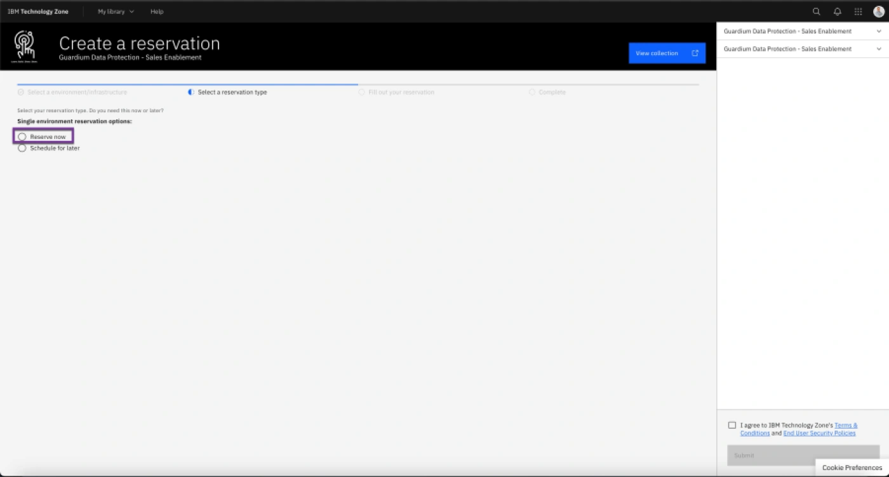
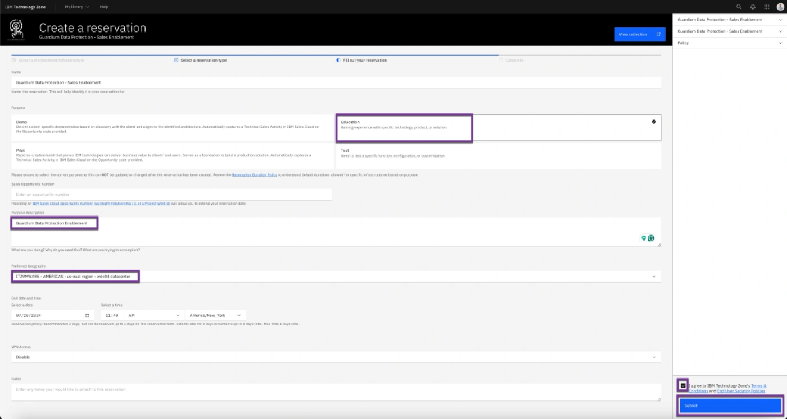
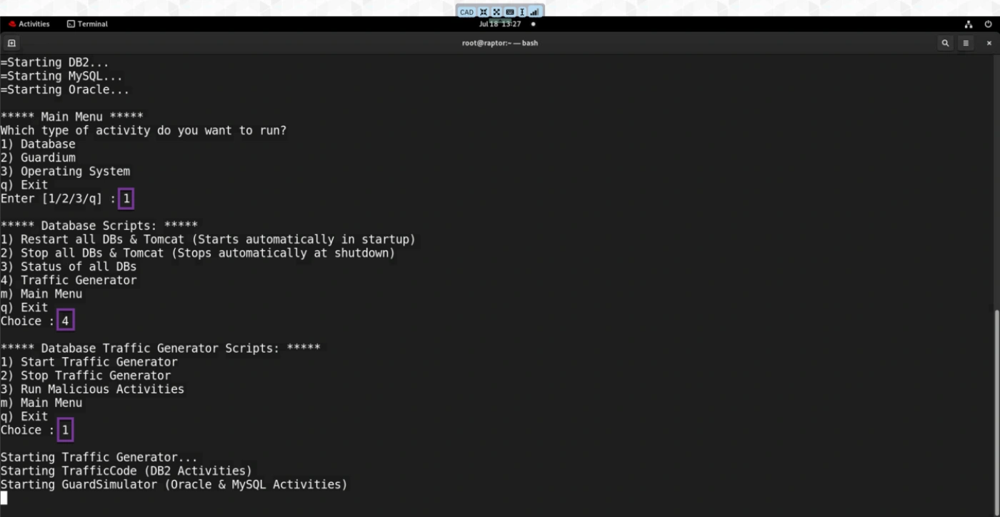
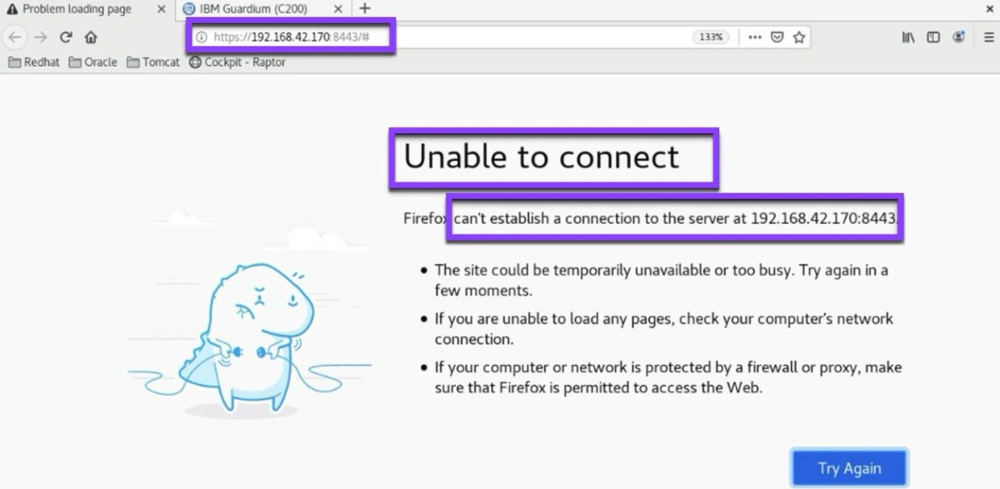

# 100: Environment Setup and Troubleshooting

## 1. Introduction

This document explains how to prepare the Guardium Data Protection
environment.


## 1.1 High level architecture

Guardium Data Protection components are grouped into the following categories:

- Appliances:
    - Collectors: Used for real-time capture and analysis of the database activity.
    - Aggregators: Offload reporting activity from collectors and consolidate reporting from
       multiple collectors.
    - Central Managers: Specialized functionality enabled on an aggregator to manage and
       control multiple Guardium appliances.
- Agents:
    - Software TAP agent (S-TAP®): Installed on the database server to monitor and relay
       observed activity to the Guardium Collector.
    - Guardium Installation Manager agent (GIM): Installed on the database server to facilitate
       S-TAP installation and the updating and configuration modification of agents.

Guardium Data Protection offers flexible and scalable solutions to support varying customer architecture
requirements.
 


The architecture above shows collectors, appliances, and S-TAP agents that are installed on monitored
database servers in each data center. S-TAP agents capture and transmit relevant database activities to
Guardium collectors for parsing, analysis, and logging. We employ agento based, proxy-based, and
agentless monitoring methods. Agentless monitoring ingests audit logs, while Universal Connector
ensures seamless monitoring. The Collectors are configured to then aggregate activities for central
reporting. In this example, there is a dedicated central management appliance for the solution that
enables federated management capabilities, such as Access Management, patching, and metadata
repository. Central management pushes policies to collectors, and central aggregation stores data in a
central audit repository.


This enablement environment features a Central Manager, a collector, and a database server named
Raptor that hosts DB2, Oracle, and MySQL databases. Additionally, it contains data within these
databases and includes a Traffic Generator script designed to automatically execute both database
activities and malicious activities.

## 1.2 Users

These are the users and passwords used in this demonstration:

- Guardium GUI: `labadmin` / `P@ssw0rd`
- Guardium GUI: `admin` / `P@ssw0rd`
- Guardium GUI: `accessmgr` / `P@sssw0rd`
- Guardium command line: `cli` / `P@ssw0rd`
- Raptor database server: `root` / `P@ssw0rd`


## 2 Getting Ready

To setup the environment, perform the following steps:

1. To schedule reservations on IBM Technology Zone, open a browser and use the following address
    to browse:

```
https://techzone.ibm.com/collection/guardium-data-protection-sales-enablement/environments
```
2. Click **Reserve** for **Guardium Data Protection **–** Sales Enablement**.
 
3. Click **Reserve Now**.

4. Enter a name in the **Name** field and choose **Education** as the purpose. Provide a description, select a **geographic location** for hosting the environment, and set the end date. Review the Terms & Conditions and policy information, then check the appropriate box. Finally, click **Submit** to proceed.

5. Verify the confirmation popup and then click on **My Reservations**.

6. When Status is ‘Ready’, click on the **Right Arrow** next to Status.

7. Verify the VMs are running. Click on VMs in VM Remote Console section.


## 3 Traffic Generator

1. Login to the Raptor server with root user.


> The Raptor Database Server, which runs on RedHat Linux, hosts DB2, MySQL, and Oracle
databases. A script is used to maintain the server and perform activities.

2. Open a Terminal and run /scripts/mainScript.sh.


3. Enter **1** for Database operations, then select **1** again to start all DB services if any database service
    is not running.

4. Enter **1** for Database operations, then **4** for Traffic Generator, and finally **1** to start the Traffic Generator scripts. 
    > Note: This Traffic Generator script runs automatically when the system boots up,
    so there is no need to run it again. Running it again may cause it to break. However, if it stops for
    any reason, you can manually run the script to restart it.


5. Enter **1** for Database operations and **4** for Traffic Generator and then **3** to run malicious activities.


You have successfully reserved the environment!


## 4 Troubleshooting

## 4.1 Keyboard Settings

If you are having difficulties to type some characters such as ‘@’ or ‘;’, perform the following steps:

1. Change your workstation’s keyboard settings to US keyboard.
2. ‘Shift+2’ will write the ‘@’.
3. You can also enable on-screen keyboard with the instructions below:


a. **__Windows 11__**: Go to **Start**, then select **Settings > Accessibility > Keyboard**, and turn on the
On-Screen Keyboard toggle. A keyboard that can be used to move around the screen and
enter text will appear on the screen. The keyboard will remain on the screen until you close it.

b. __**Windows 10**__: Go to **Start**, then select **Settings > Ease of Access > Keyboard**, and turn on
the toggle under **Use the On-Screen Keyboard**. A keyboard that can be used to move around
the screen and enter text will appear on the screen. The keyboard will remain on the screen
until you close it.

c. __**Mac**__: On your Mac, choose **Apple menu > System Preferences**, click **Accessibility**, click
**Keyboard**, click **Viewer**, then select **Enable Accessibility Keyboard**. You can also turn on
the Accessibility Keyboard by clicking the Input menu in the menu bar, then choosing **Show
Keyboard Viewer**.

## 4.2 Data Collection and Time Sync Problems

1. Log into dbserver-raptor as user **root**. Open a terminal window and run the `date` command.
2. From a terminal window, ssh to the Central Manager using the following command: `ssh cli@ma170`.
    View the time information using the command `show system clock all`.
3. Set the appropriate date, time, and time zone (EST or EDT to match raptor) using the commands:
   
    `store system clock timezone America/New_York` and 
    `store system clock datetime <YYYY-MM-DD> <hh:mm:ss>`
4. Restart the GDP console using the command **restart gui**.
5. Repeat the procedure on the Collector server.

The following graphic showcases the time adjustment procedure executed on server MA170 to agree
with the raptor server:


## 4.3 Servers Unreachable

1. If you received an error such as the following where the server is not reachable, follow the steps to
    restart the server.

2. From the server window, click the **Reboot** icon.

