# Asistente inteligente, detector de riesgos y análisis de amenazas activas

## 1 Introducción

Este laboratorio muestra lo siguiente:

*   Funciones de asistente inteligente, que ayuda a configurar rápidamente la supervisión para GDPR, PCI, SOX y otras normas y reglamentos de seguridad.
*   Detector de riesgos que utiliza un algoritmo holístico para evaluar dinámicamente los factores de riesgo e identificar posibles riesgos en todo el sistema.
*   Panel de análisis de amenazas activas que muestra posibles casos de violación de la seguridad, basados en el proceso de minería de valores atípicos y en los síntomas de ataque identificados.

## 2 Recorrido por el entorno

*   Inicie sesión en el servidor Raptor como usuario `root` contraseña `P@ssw0rd`. Asegúrese de haber completado todos los pasos de la guía de preparación del laboratorio, incluida la habilitación del tráfico malicioso.

> **Nota:** Realice los pasos de la guía de preparación antes de iniciar la demostración, preferiblemente varias horas o más, para que se genere suficiente tráfico.

*   En el servidor Raptor, abra un navegador Firefox. El navegador se abre con dos pestañas, una para el colector (C200) y otra para el Administrador Central (MA170). Haga clic en la pestaña Administrador central (MA170). Inicie sesión con la contraseña `labadmin` `P@ssw0rd`.

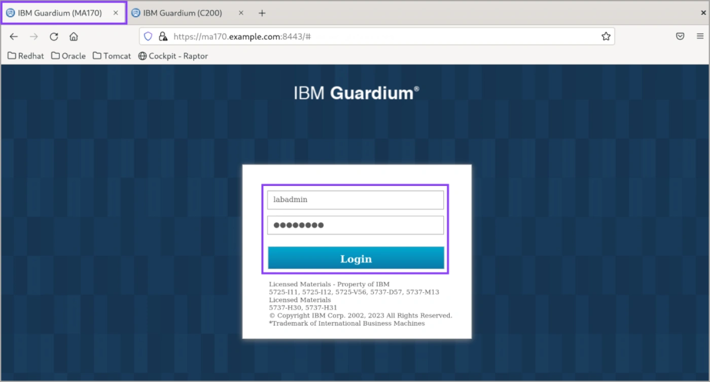

La solución IBM Security Guardium Data Protection tiene sus propias funciones de gestión de acceso. La gestión de accesos consta de cuatro tareas: administración de cuentas, mantenimiento, supervisión y revocación. La gestión de accesos es independiente de las tareas de administración del sistema. Guardium puede definir usuarios, roles, permisos y asignar un rol a un usuario para concederle privilegios de acceso específicos. Cuando se asigna un rol a una aplicación, sólo aquellos usuarios de Guardium que también tengan asignado ese rol pueden acceder a ese componente. Las definiciones de usuario pueden importarse desde LDAP. Esta demostración utiliza una cuenta administrativa para acceder a todas las funciones.

*   Revise el cuadro de diálogo de aviso y ciérrelo haciendo clic en cualquier zona de la página principal.

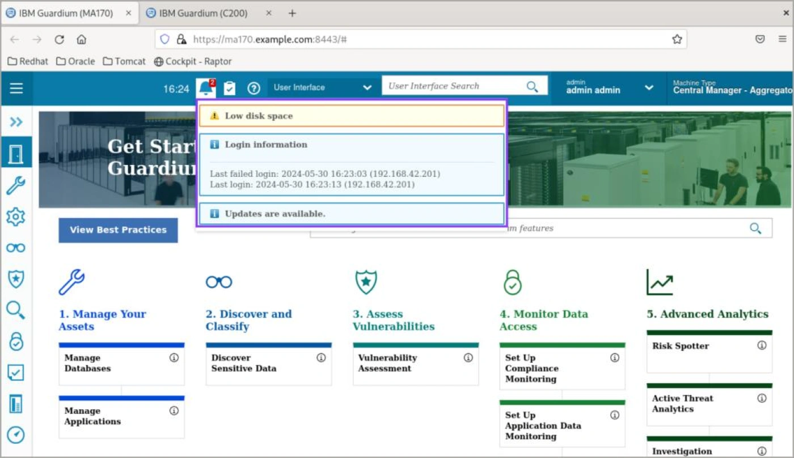

Guardium dispone de dispositivos reforzados. No sólo audita las fuentes de datos, sino que también se monitoriza a sí mismo e informa de las actividades de los usuarios de Guardium. Al iniciar sesión, se muestra la información del último inicio de sesión, los detalles del paquete de reparación si es necesario y las tareas que hay que revisar.

*   Revise el flujo en la página principal.

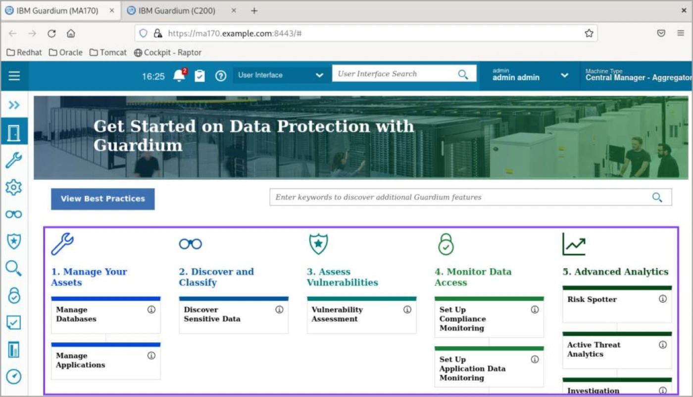

La página de bienvenida de Guardium muestra un flujo para la seguridad de los datos que se basa en la experiencia en este ámbito. Comienza con la gestión de los activos y la identificación de las fuentes de datos y los datos sensibles y continúa con las evaluaciones de vulnerabilidad para identificar las brechas en la postura de seguridad de las fuentes de datos. Una vez que se tiene más visibilidad sobre las fuentes de datos y los datos sensibles, se puede dar el siguiente paso. Con los permisos adecuados, un usuario puede supervisar y auditar actividades, informar sobre actividades, realizar acciones y ejecutar análisis avanzados. Esta capacidad proporciona una vista de pájaro de los riesgos potenciales en los sistemas y las tendencias de riesgo a lo largo del tiempo, así como herramientas para investigar los riesgos potenciales.

### Asistente inteligente

*   En el MA170 GUI, inicie sesión como `labadmin`.
*   En el menú de navegación, vaya a **Configuración > Asistente inteligente > Supervisión del cumplimiento**.

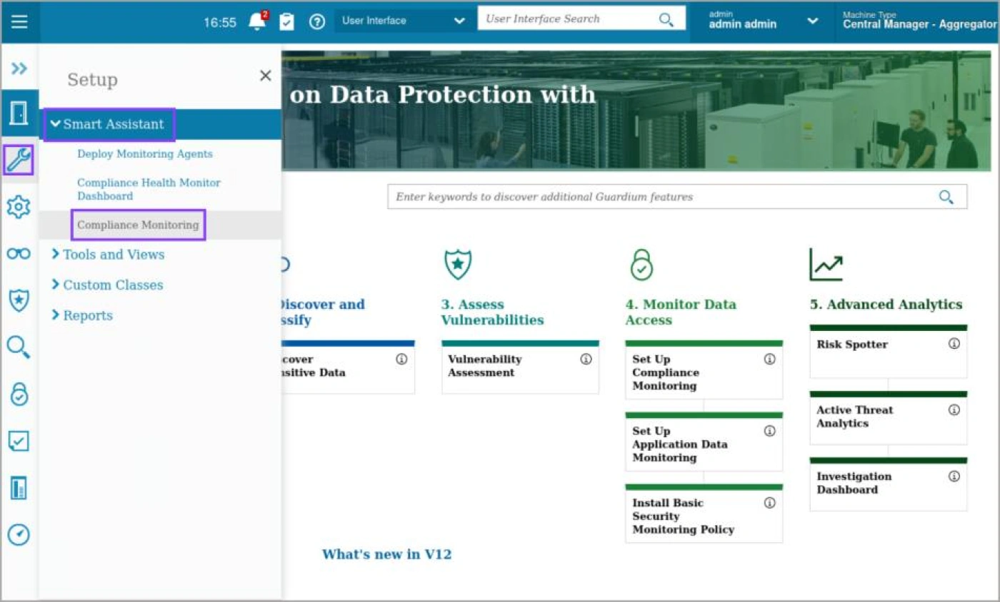

Guardium cuenta con funciones de asistente inteligente de supervisión del cumplimiento que ayudan a configurar rápidamente la supervisión para GDPR, PCI, SOX y otras normas y reglamentos de seguridad.

*   En el panel Reglamento General de Protección de Datos (RGPD), haga clic en Ver detalles.

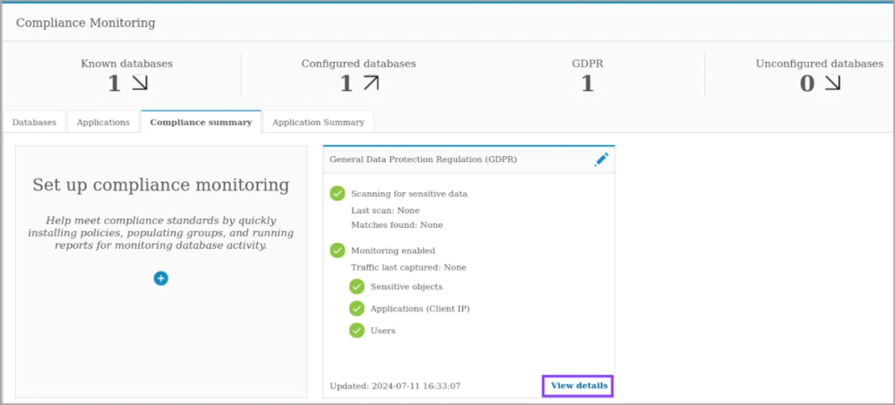

Ahora, vea los detalles de una configuración de cumplimiento de GDPR existente.

*   Ver la pestaña Resumen.

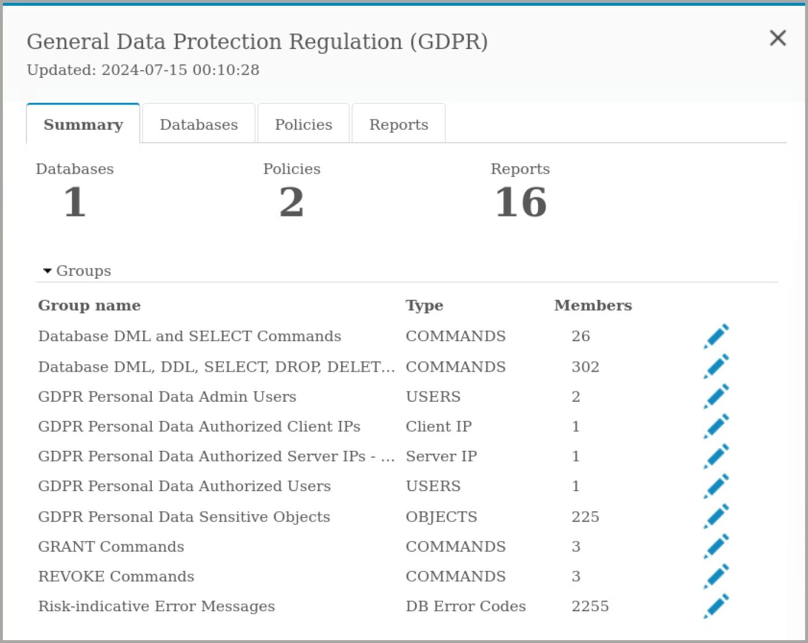

La pestaña de resumen muestra que se está supervisando una base de datos, y que hay dos políticas y dieciséis informes asociados a esta supervisión del cumplimiento.

*   Seleccione la pestaña Bases de datos. 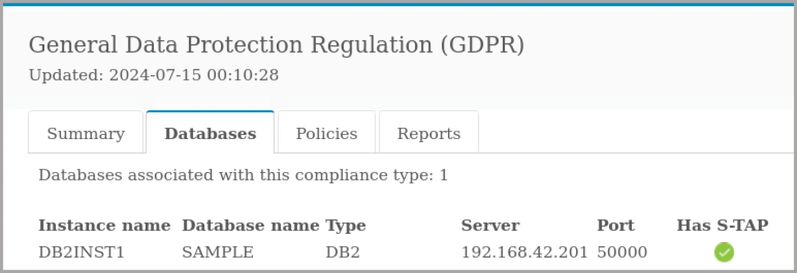

La pestaña de bases de datos muestra información más detallada sobre la base de datos que se está monitorizando. En este caso, hay una base de datos de tipo Db2 y está siendo monitorizada por un agente S-TAP.

*   Seleccione la pestaña Políticas.
*   Revise la política de seguridad y, opcionalmente, amplíe la sección del escenario de descubrimiento para mostrar qué tipos de datos busca Guardium.

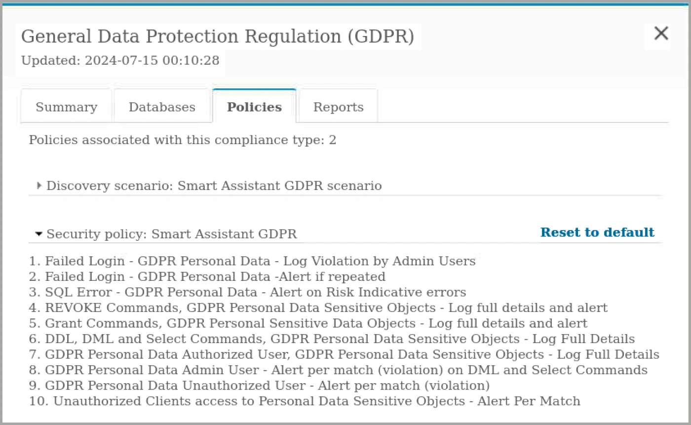

Hay dos políticas asociadas a la supervisión del cumplimiento del GDPR. La política de seguridad tiene diez reglas para evaluar el tráfico de las bases de datos. El escenario de descubrimiento describe los tipos de datos que Guardium busca en las bases de datos supervisadas, como la edad, el sexo o las condenas.

*   Seleccione la pestaña Informes y revise los informes asociados al cumplimiento del GDPR.

Guardium proporciona informes preconfigurados para los requisitos de auditoría e informes de GDPR. Estos informes pueden utilizarse tal cual o como plantillas para informes personalizados.

*   Cierre el panel de detalles.

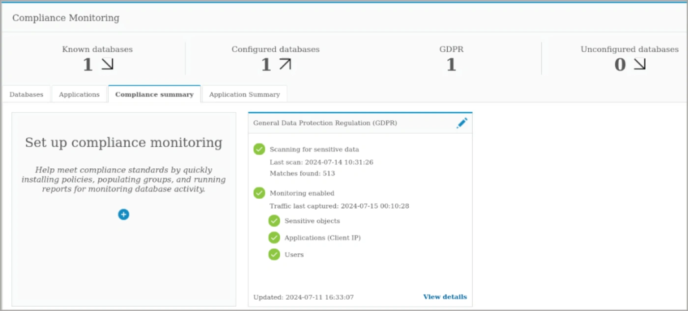

Guardium proporciona asistentes para añadir otros escenarios de monitorización de cumplimiento, como SOX, HIPAA o PCI-DSS. Guardium puede monitorizar tanto aplicaciones como bases de datos. Guardium puede monitorear múltiples bases de datos y múltiples aplicaciones para múltiples estándares y regulaciones de cumplimiento. Ahora, mire los dashboards de cumplimiento.

*   En el menú de navegación, haga clic en **Configuración > Smart Assistant > Cuadro de mandos de Compliance Health Monitor**.
*   Mostrar los informes en el cuadro de mandos.

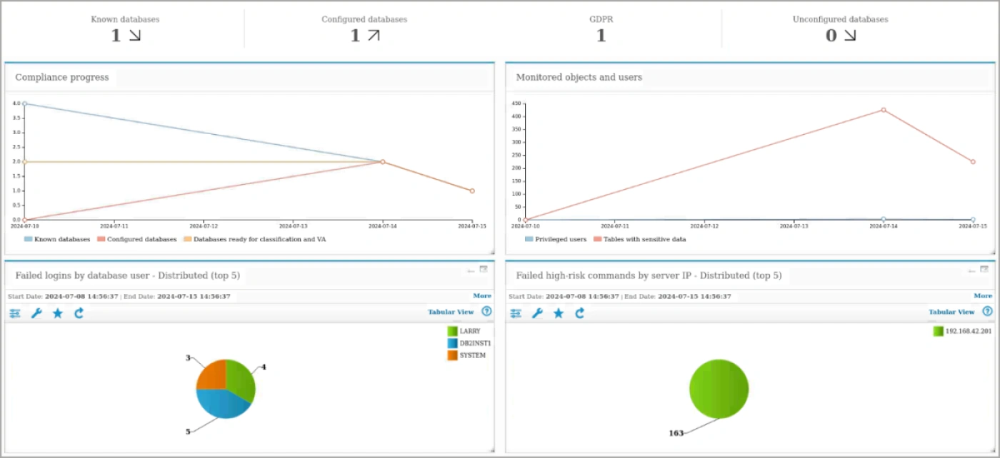

Este cuadro de mandos muestra informes que ayudan en el progreso del cumplimiento. Por ejemplo, el número de bases de datos conocidas y el número de bases de datos configuradas para el cumplimiento, los usuarios con privilegios y los objetos supervisados en las bases de datos, los inicios de sesión fallidos, los comandos y otros problemas. Seleccione la vista tabular para ver los valores o la vista gráfica para el resumen.

*   En el menú de navegación, haga clic en **Configuración > Smart Assistant > Desplegar agentes de supervisión**.
*   Revisa la página.

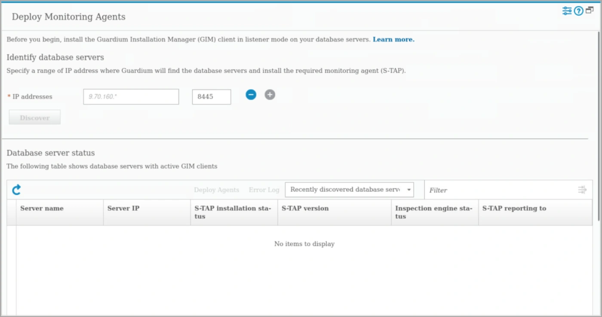

Guardium incluye la herramienta Deploy Monitoring Agents para activar automáticamente los clientes GIM, instalar S-TAPs y comenzar a monitorizar el tráfico de las bases de datos. La herramienta Deploy Monitoring Agents simplifica el proceso de establecimiento de un despliegue de Guardium. Basándose en la infraestructura existente del gestor de instalación de Guardium (GIM), la herramienta Despliegue de agentes de supervisión ayuda a encontrar rápidamente servidores de bases de datos, instalar agentes de supervisión (S-TAPs) y configurar motores de inspección para las bases de datos. Además, la herramienta proporciona una vista centralizada para el seguimiento y la revisión del estado del despliegue.

Ha revisado la herramienta Smart Assistant, el proceso para configurarla y gestionarla, y los cuadros de mando que ayudan a identificar el estado y las carencias.

### Detector de riesgos

*   En el MA170 GUI, inicie sesión como `labadmin`.
*   En el menú de navegación, vaya a **Proteger > Descubrir vectores de amenazas > Detector activo de riesgos**.

Veamos ahora otra herramienta, Active Risk Spotter.

*   Revisar la página del Detector de Riesgos.

Risk Spotter es una tecnología pionera que cambia el paradigma de la seguridad por una política de protección de datos basada en la inteligencia artificial. Utiliza un algoritmo holístico para evaluar dinámicamente los factores de riesgo, y utiliza un algoritmo inteligente para identificar los riesgos potenciales en todo el sistema.

*   Ampliar la política y los módulos relacionados.

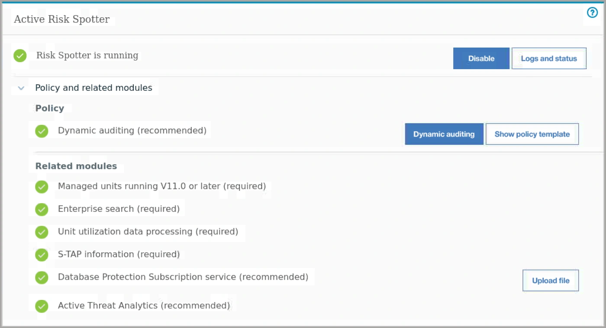

El algoritmo Risk Spotter utiliza los módulos de Guardium para analizar los indicadores de riesgo e identificar a los usuarios de riesgo. Guardium añade tres tipos de usuarios al Detector de Riesgos: el primero son los usuarios de riesgo, usuarios identificados por el algoritmo del Detector de Riesgos junto con las políticas instaladas. Otro tipo de usuarios son los usuarios de la lista de vigilancia, que son un grupo de usuarios para su posterior observación o investigación. Guardium puede añadir usuarios a la lista de vigilancia. El último tipo son los usuarios muestreados aleatoriamente. Risk Spotter escanea continuamente el sistema, más allá del radar de políticas, evaluando usuarios no auditados e identificando potenciales usuarios de riesgo. El algoritmo de Risk Spotter utiliza módulos de Guardium para analizar los indicadores de riesgo e identificar usuarios de riesgo. La puntuación global de riesgo de cada usuario se calcula diariamente, basándose en los datos auditados. Risk Spotter asigna a cada usuario una puntuación comprendida entre 0 y 10. Los datos de riesgo detallados se presentan en la tabla Usuarios de riesgo de la página de Risk Spotter. Guardium dispone de Behavioral Analytics para una base de datos o un usuario específicos. Puede ver todos los casos asociados a esta entidad, la distribución de horas de trabajo y la distribución de verbos.

Ha revisado la herramienta Risk Spotter.

### Análisis de amenazas activas

*   En el MA170 GUI, inicie sesión como `labadmin`.
*   En el menú de navegación, haga clic en **Proteger > Descubrir vectores de amenazas > Análisis de amenazas activas**.

> **Nota:** Cambie el alcance de Último 1 día para que comience el 1 de julio de 2024, para mostrar los datos.

*   Revise el informe y desplácese hacia abajo.

El cuadro de mandos de Active Threat Analytics muestra casos potenciales de violación de la seguridad, basados tanto en el proceso de minería de valores atípicos como en los síntomas de ataque identificados. En este panel, puede ver e investigar casos y actuar sobre casos individuales. Una fila de resultados tabula los casos más críticos, los casos abiertos por bases de datos, usuarios de bases de datos, usuarios de sistemas operativos, sistemas de archivos y usuarios de archivos. Los casos de cada categoría se identifican por su nivel de riesgo: alto, medio y bajo. Si una base de datos, un usuario de base de datos, un sistema de archivos o un usuario de SO está asociado a varios casos, esa base de datos o ese usuario sólo se cuentan una vez. Por ejemplo, de 40 casos críticos, 10 están asociados a la base de datos A. 10 están asociados al usuario B. Los otros 20 están asociados a varias bases de datos y usuarios. El número total de casos es 22, no 40; 1 para la base de datos A, 1 para el usuario B y 20 para otras bases de datos y usuarios. El gráfico muestra infracciones, valores atípicos, errores y actividades durante el mismo periodo. En resumen, Guardium ofrece herramientas analíticas avanzadas basadas en algoritmos de aprendizaje automático (ML), que utilizan una combinación de políticas basadas en reglas y análisis de síntomas para detectar patrones de comportamiento que se corresponden con vectores de ataque conocidos del sector. De este modo se identifican las amenazas internas y externas. Esta capacidad ayuda a actuar con mayor rapidez y eficacia.

### Enhorabuena, has llegado al final del laboratorio 101.

Revisamos la herramienta Active Threat Analytics, sus informes y su configuración.

Haga clic en, **[laboratorio 102](/guardium/102)** para iniciar el siguiente laboratorio.
