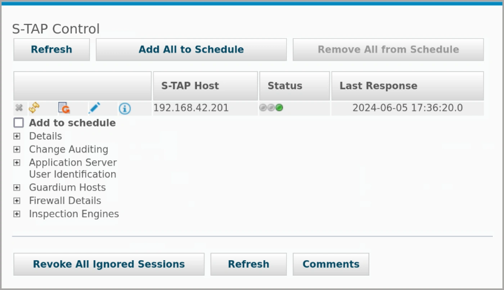
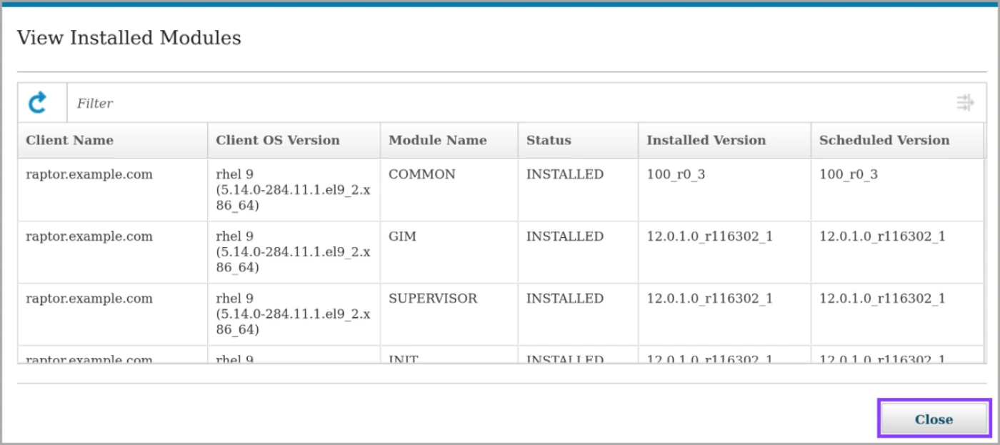
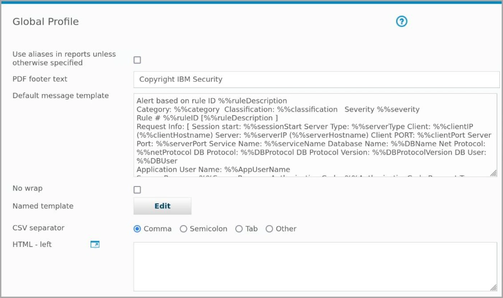
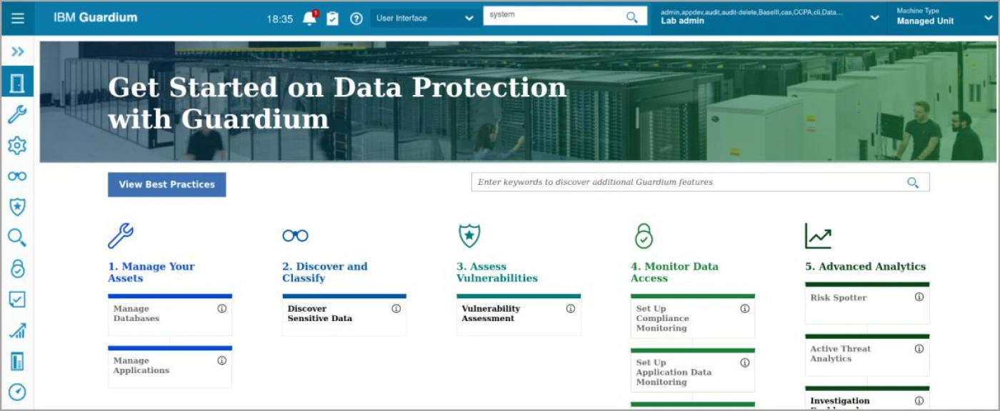

# Settings and Management

## 1 Introduction
In this lab, you will go over the Settings and Management section in Guardium.
This section provides details about agents, their management, and Health Monitoring that helps to reduce operational costs. Finally, we briefly discuss the settings and their management.
    
### Settings and Management

- Log into the MA170 user console as user `labadmin`.
- Go to **Manage > System View > System Monitor**.

Now, let’s discuss Guardium management. Guardium administrators perform various
administration and maintenance tasks. Management tasks include monitoring your
system’s health and managing artifacts such as groups, domains, and notifications. Here
are some major Guardium administration activities.

- Review the reports.

The system view is the default initial view for many users. It displays key elements of
system status.
The System Monitor window displays up-to-date details about incoming data, CPU usage,
and other information. Disk usage of Guardium systems, request rates, and logins to
Guardium systems are some of these details.

- Go to **Manage > System View > Deployment Health Topology**.

Guardium provides tools to monitor the health of the Guardium environment. The
deployment health topology shows a graphical view of the Guardium environment and the
health of nodes.

- Hover over the collector node.

Here you see that the collector is in good health except aggregation is unconfigured. You
can access reports that show details about the node or log in to the node.

- Log in to C200 as user `labadmin`. 
> **Note:** S-TAP Status Monitor is only available on the collector, C200.

- Go to **Manage > System View > S-TAP Status Monitor**.

For each S-TAP reporting to this Guardium system, this report identifies the S-TAP Host,
DB Server Type, S-TAP Version, Status, and Inspection Engine status. It also shows Last
Response Received date and time, primary hostname, and indicators for Firewall and
Encryption.
Therefore, the Guardium admin can view of the status of the S-TAP agent on the database
server, without requiring access to the monitored database server.

- Go to **Manage > Activity Monitoring > S-TAP Control**.

The S-TAP Control window shows information about S-TAP agents and provides options
to send a command to the S-TAP agent, display S-TAP event logs, and edit S-TAP
configuration.
The S-TAP control window provides a centralized point to view all S-TAPs managed by
this Guardium system, manage individual S-TAPs, and run a set of operations on all S-
TAPs.

- Expand the Inspection Engines section.

Inspection Engines are the group of parameters set for each database monitored. The S-
TAP agent periodically scans the database server for new databases and automatically
configures an inspection engine for each. However, you can also manually create a new
inspection engine or modify the parameters for existing inspection engines.

- Sign in to **C200** as `labadmin`. 
> **Note:** In this lab environment, the GIM server is on the collector, C200. The central manager, **MA170**, has no GIM clients in its Setup by Client page.

- Go to **Manage > Module Installation > Setup by Client**.

Guardium has a component that is called Guardium Installation Manager (GIM) used to
install and maintain Guardium components on managed servers.
The GIM includes a GIM server, which is installed as part of the Guardium system, and a
GIM client, which is installed on servers that host databases that you want to monitor.
The GIM client is a set of Perl scripts that run on each managed server. After installation,
the GIM client works with the GIM server to run tasks. The GIM client installs, updates,
configures, and uninstalls agents. The GIM client also monitors and controls agent
processes on the database server.
To manage large numbers of GIM installations, create groups of GIM clients. Then, use
the groups to install, update, and manage software bundles.

- Select the raptor client and click **View Installed Modules**.

- Close the installed modules dialog, expand **Choose bundle**, and select **Bundle-STAP** from the bundle menu.

In the Choose bundle section, you can see the modules that can be installed or maintained
for the server that was chosen in the previous step. After the software bundle selection,
you can see the actions that can be run, such as installation, upgrade, and update
parameters.

- Expand **Configure clients** and select **Show editable parameters**.

- Review the parameters and scroll down to show the **Install** button. Do not click.

With the update parameters option, the bundle parameters are updated on the client. You
see the parameters and their current values. You can change them according to your
needs.
You can directly install or uninstall the bundle or create an API to call the installation from
other tools or scripts. With GIM, you can immediately run or schedule the installation for
maintenance windows over night or weekends.

- Go to **Manage > Unit Utilization > Unit Utilization**.

You can also track the performance of Guardium appliances. The unit utilization report
provides an enterprise-level view of collector usage. It employs a simple Low, Medium, or
High indicator that shows which collectors are over or under-used. The analysis is mostly
based on usage monitor data, with a few parameters from the Guardium statistics,
collected internally on the collectors.

- Go to **Manage > Data Management > System Backup**.

Now, the demonstration discusses how to manage Guardium appliances. To manage the
Guardium system, there are pages and reports in the user interface that you can set and
maintain.
One of these tasks is system backup. System backups store all the necessary data and
configuration values to restore your Guardium system.
Different protocols are available for the backup, such as SCP or SFTP, and Amazon S3.
You can select to backup configuration, data, or both.

- Go to **Setup > Tools and Views > Alerter**.

- Review the parameters for the Alerter.

Another setting is about notifications. Guardium has an alerter to send email messages,
SNMP traps, and alert-related Syslog messages. Other components create and queue
messages for the Alerter. The Alerter checks for and sends messages based on the
specified polling interval.

- Go to **Setup > Tools and Views > Global Profile**.

The Global Profile page defines defaults that apply to all users.
It sets defaults for your Guardium system. You can add your own header and footer to
reports, upload your company logo, create a default message template, and much more.

- Go to **Setup > Tools and Views > System**.

Some information can be set in the system configuration page. However, most of the
information on the system configuration window is set by using the CLI.

- Go to **Setup > Tools and Views > Portal**.

From the Guardium portal page, you can reset the port for the Guardium appliance web
server, import SSL certificates, and configure authentication for your Guardium system
users. Local users, Radius, LDAP, and smart card are the options for authentication.
Multi-factor authentication (MFA) adds an extra layer of security to your Guardium user
accounts. Guardium supports the DUO authentication engine or RSA SecurID.

- Click **Welcome** on the Navigation menu.

In summary, Guardium monitors data access operations in real-time to detect unauthorized
actions based on policies. It reacts automatically to help prevent unauthorized or
suspicious activities by privileged insiders and potential hackers.
Guardium Data Protection reduces the risk of a data breach by providing real-time data
security visibility and intelligence. Guardium enables organizations to address increasingly
complex data security and privacy regulations, mitigating threats and risky users.

You talked about Guardium settings and maintenance.
