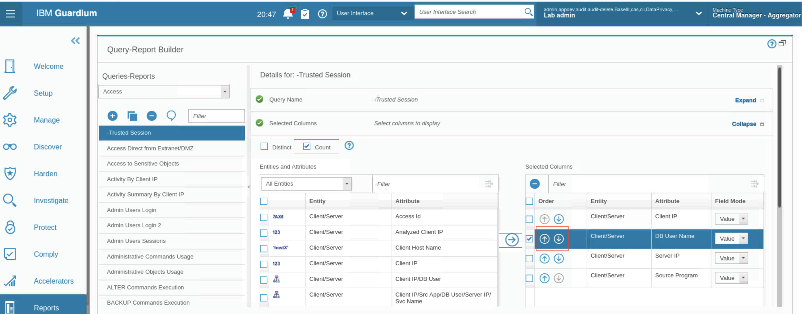
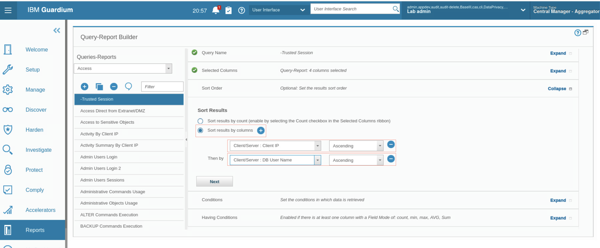
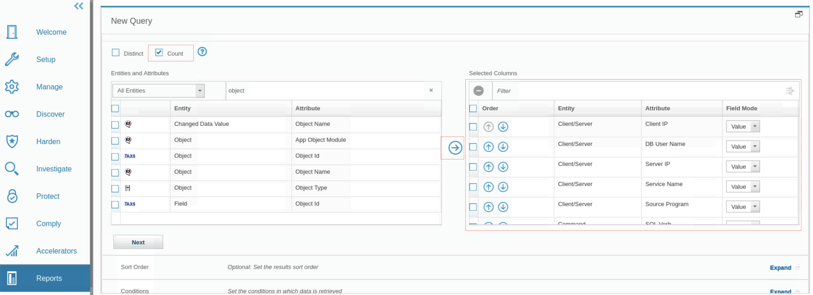
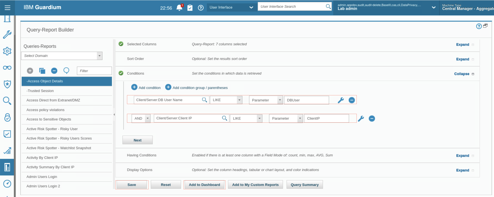

#  Creating queries and reports exercises

In these exercises, you create custom queries and reports.

## Creating a simple query and report

In this exercise, you create your own Console tab to display your report. Then, you create a simple query and a report that uses that query and places that report on your new reports page. The query that you create returns details of all trusted sessions, that is, sessions open by database users who are members of the Lab Trusted Users group. The query returns Database User Name, Client and Server IP addresses, and Source Program name.

1. On the database server, to start the **Guardium GUI**, double-click the Firefox web browser icon. 
2. Log in to the **Central Manager(MA170)** graphical console as user `labadmin` with password `P@ssw0rd`.

### Create a new dashboard for your report

In this task, you create a new dashboard to hold your report.

1. From the left navigation menu, click **My Dashboards > Create New Dashboard**. The new dashboard opens.

2. To edit the dashboard, click **Edit** 

3. Rename the dashboard to **Lab Dashboard**, and click **Save**.

    

### Create a query for the report to use 

The query specifies what information is retrieved from the Guardium database and how it is displayed.

1. From the left navigation menu, click **Reports > Report Configuration Tools > Query-Report Builder**. The Query-Report Builder pane opens. 

  

2. For **Domain**, select **Access**. An **icon to add** a new query and a list of access reports becomes available.

3. Click **New**. The New Query pane opens.

> **Note:** The New Query wizard has several sections, which can be expanded or collapsed. The wizard leads you through the process of building a query and generating a report. To return to the query-report builder pane, click **Query-Report Builder** in the lower-left corner of the wizard.

 - For the **Query name**, type **-Trusted Sessions**.
 - For **Main entity**, select **Session**. 
 - Click **Next**. 

 

The Query Builder pane displays tools to build the query.To determine how the information is displayed, choose entities from the Entities and Attributes list to add to the Selected Columns fields. You add entities to the Query Conditions, which determine what information is displayed.

4. In the **Entities and Attributes** table, select **Entity: Client/Server** with **Attribute: Client IP** and then click the **Copy** icon 

 

 The entity is added to the Selected Columns table on the right side of the window.

5. Scroll down or use the Filter field to find and add the following attributes from the Client/Server entity to the Selected Columns table

  - Server IP
  - DB User Name
  - Source Program

  When you are finished, the query builder includes four entities in the Selected Columns section.

6. You do not lose your work, scroll down and click Save, then close the confirmation.

> **Note:** When you build or modify a Guardium query, save your query early and often to avoid loss of work and frustration.

7. To ensure that subsequent reports display counts of the sessions rather than details of each individual session, select **Count**.

8. To put the fields in the correct sequence, select the **DB User Name** entity and use the **up and down blue arrows** to move it to the second position in the sequence.

  

9. To display the sort order, click **Next** 

10. To set the sort rank, select **Sort results by columns** and then click **Add sort column**. In the field that opens, you can select which columns to sort by, and in what order.

  - From the drop-down list, select **Client/Server - Client IP**.
  - To sort the data in ascending order, select **Ascending**
  - To add another sort entity, click the **Add sort column icon**. Select **Client/Server - DB User Name** and **Ascending**.
  - To move to the Conditions section, click **Next**.
    

11. Add **conditions** to the query. Conditions control the information that is displayed in the report. You are interested in only trusted users, so you check to ensure that the database users are members of a group called **Lab Privileged Users**.

  - To add a condition, click the **Add condition icon**.
  - Click the **Search icon**. The Select a condition field window opens.
  - Expand **Client/Server**, highlight **DB User Name**, and click **Select**.
  - Select the **IN GROUP** operator and the **Lab Privileged Users** runtime parameter. 
  - Click **Save**.

  

### Add the report to the dashboard

  In this task, you add the report to the dashboard.

1. Click **Add to Dashboard**. The **Add Report to Selected Dashboard** window opens.

  

2. Select **Lab Dashboard** and click **Add Report**.

3. Click **Save**.

4. From the **left navigation** menu, click **My Dashboards > My Custom Dashboards > Lab Dashboard**. Your dashboard opens on the **Add Report** tab with the new report data.

  

5.  If there is no data in your report, edit your timeframe for this report.
    - Click **Edit mode**. 
    - More icons and settings become available for customizing your report.
    - Click the **Configure runtime parameters icon** . The runtime parameter configuration dialog opens.
    - In the **Enter Period From field**, click **the date picker icon** and set the fields in the date picker to **NOW minus 3 Day** and click **OK**
    - To close the runtime parameter configuration dialog, click **OK**. You now have data in your report.

   

## Creating a query and report with drill-down capabilities

In this exercise, you create a report with runtime parameters. Reports that have this structure are available as drill-down reports from other reports where those parameters are also available.

The report returns details of all database objects that are accessed by a specified database user or client IP address combination. The database user and client IP are set up in parameter form so that you can define them at run time, either explicitly, or by using wildcards.

1. From the **left navigation** menu, click **Reports > Report Configuration Tools > Query-Report Builder**. 

2. For **Domain**, select **Access**. An icon to add a new query and a list of access reports becomes available.

3. Click **New**. **The New Query** pane opens.

 - For the **Query name**, type **-Accessed Object Details**.
 - For **Main entity**, select **Object**. 
 - Click **Next**.

 

4. To ensure that subsequent reports display counts of the sessions rather than details of each individual session, select **Count**.

5. In the **Entities and Attributes** drop-down list, select Entity: **Client/Server**. Next, select the Attribute: **Client IP** and then click **Copy**. 

The Client IP attribute is added to the Selected Columns section on the right side of the window.

6. Select the following attributes and move them to the Selected Columns section:
  - Entity: **Client/Server**, Attribute: **DB User Name**
  - Entity: **Client/Server**, Attribute: **Server IP**
  - Entity: **Client/Server**, Attribute: **Service Name**
  - Entity: **Client/Server**, Attribute: **Source Program**
  - Entity: **Command**, Attribute: **SQL Verb**
  - Entity: **Object**, Attribute: **Object Name**

  Now you have seven entity attributes in the **Selected Columns** table.

 

7. **Save** the report.

8. Add two conditions. You link these conditions with an **AND**, so both conditions must be met.
  - To configure conditions for your report, expand the **Conditions** section.
  - Add attribute **DB User Name** from the **Client/Server** folder of the entity list, with Operator set to **LIKE**, runtime parameter set to **Parameter**, and parameter value set to **DBUser**.
  - Add attribute **Client IP** from the **Client/Server** folder of the entity list, with Operator set to **LIKE**, runtime parameter set to **Parameter**, and parameter value set to **ClientIP**.

9. Save the report and add it to your dashboard.

 

10. To view your dashboard, go to **My Dashboards > My Custom Dashboards > Lab Dashboard**, or by searching for Lab Dashboard in the user interface search field.

 

11. If there is no data in the **-Accessed Database Objects** report, enable edit mode and change the start date to **NOW -3 DAY** and click **OK**.

12. On the **-Accessed Object Details** report, locate one of the entries with **DB User Name JOE** and open the **Full SQL by DB User report**
  - Click the **DB User Name column** until entries are sorted in **descending** order. Entries with **DB User Name JOE** will be at the top of the list. If not, scroll down until you find and Entry with DB User Name JOE.
  - **Right-click** any entry with **DB User Name JOE**. A pop-up window opens with a list of drill-down reports. 
  - Scroll down and select **Full SQL By DB User**.

  

13. A new window opens with the drill-down report, where the **DB User Name parameter** is **JOE**.

  

## Congratulations, you've reached the end of lab 206.

Click, **[lab 207](/guardium/dataprotection/level-4/207)** to start the next lab.

