# Descubrimiento y clasificación

## 1 Introducción

Este laboratorio cubre las funciones de Descubrimiento y Clasificación que ayudan a gestionar los activos y objetos sensibles en las fuentes de datos.

### Descubrimiento y clasificación

El descubrimiento y la clasificación se refieren a la localización e identificación de objetos en el entorno que deben ser rastreados con fines de seguridad y cumplimiento.

El descubrimiento es el proceso de encontrar objetos importantes, como usuarios con privilegios, datos confidenciales y fuentes de datos. La clasificación es el proceso de identificar lo que se descubre con fines de seguridad y cumplimiento. Estos procesos de descubrimiento y clasificación son importantes en grandes organizaciones en las que las fusiones, adquisiciones y sistemas existentes introducen nuevos objetos en el entorno de forma no estructurada o impredecible. Guardium le ayuda a incorporar estos objetos al entorno para que pueda aplicar políticas de seguridad eficaces y verificar el cumplimiento.

Un escenario común implica el descubrimiento de datos sensibles. Los datos sensibles se refieren a información regulada como números de tarjetas de crédito, datos financieros personales, números de la seguridad social y otra información que requiere un tratamiento especial. Guardium admite dos enfoques diferentes para descubrir datos confidenciales: mediante el generador de flujos de trabajo Descubrir datos confidenciales o mediante el generador de políticas con otras herramientas de Guardium. El generador de flujo de trabajo Descubrir datos confidenciales es una herramienta integral para establecer procesos de descubrimiento y clasificación de datos confidenciales. Utilícelo para especificar reglas para la detección, definir las acciones a tomar sobre los datos descubiertos, especificar qué fuentes de datos escanear, distribuir informes y ejecutar el flujo de trabajo en una programación automatizada. Para usuarios más avanzados, el Policy Builder admite reglas de descubrimiento y clasificación más granulares que pueden incorporarse fácilmente a procesos y aplicaciones Guardium existentes.

*   En la GUI del C200, inicie sesión como `labadmin`.
*   En el menú de navegación, vaya a **Descubrir > Descubrimiento de bases de datos > Configuración de descubrimiento automático**.

Las bases de datos pueden existir en la red sin ser detectadas y exponer la red a riesgos potenciales. Las bases de datos antiguas pueden ser olvidadas y no supervisadas, o puede añadirse una nueva base de datos como parte de un paquete de aplicaciones. Un DBA deshonesto también podría crear una nueva instancia de una base de datos para llevar a cabo actividades maliciosas fuera de las bases de datos supervisadas.

*   Seleccione el proceso DB Discovery y haga clic en Editar (Lápiz).

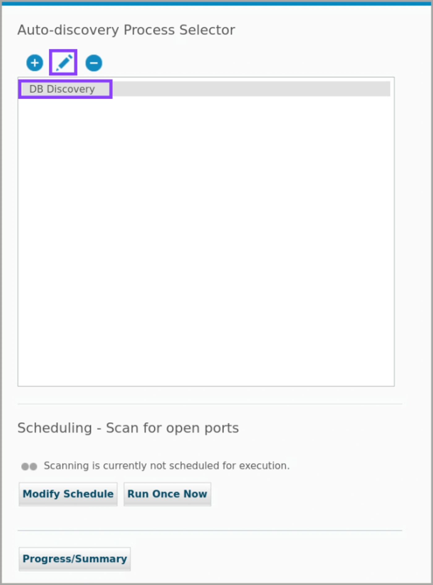

*   Revise los detalles de configuración del descubrimiento. Tenga en cuenta que es posible escanear puertos abiertos y sondear puertos encontrados abiertos por el último escaneo de servicios DB, sin embargo hará ambas cosas simultáneamente.

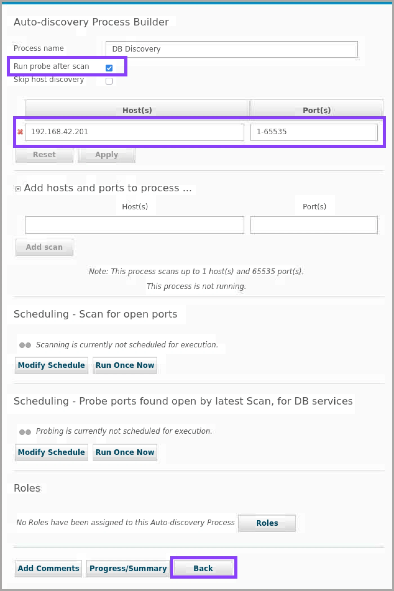

La detección automática utiliza tareas de exploración y sondeo para verificar que ninguna base de datos pase desapercibida en el entorno.

*   Un trabajo de escaneo escanea cada host especificado (o hosts en una subred especificada) y compila una lista de puertos abiertos que se especifican para ese host.
*   Una tarea de sondeo utiliza los resultados de la exploración para determinar si los servicios de base de datos se están ejecutando en los puertos abiertos.
*   Desplácese hacia abajo y haga clic en **Atrás**.

La detección sólo encuentra bases de datos en ejecución. Las bases de datos deben iniciarse si se va a utilizar la detección durante la instalación.

*   Seleccione el proceso **DB Discovery** y haga clic en **Ejecutar una vez ahora**.

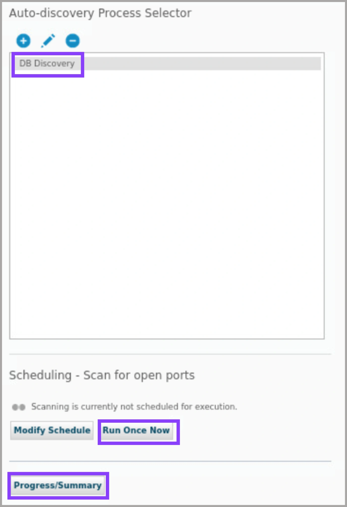

El proceso de autodescubrimiento se ejecuta bajo demanda o de forma programada.

*   Para cerrar el cuadro de diálogo, pulse **OK**.

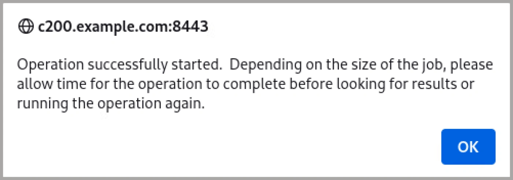

*   Haga clic en **Progreso/Resumen**.

Después de iniciar o programar un trabajo, puede hacer clic en Resumen del progreso para ver el estado de este proceso.

*   Amplíe los detalles del host, haga clic en **Actualizar** hasta que se complete el proceso y, a continuación, haga clic en **Cerrar**.

Puede encontrar más detalles para cada host en el cuadro de diálogo Progreso del proceso de detección automática. Ahora, puede comprobar los informes de las bases de datos descubiertas.

*   En el menú de navegación, vaya a **Descubrir > Informes > Bases de datos descubiertas**.
*   Revise el informe.

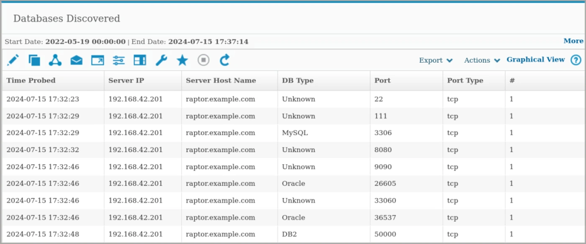

En el informe Bases de Datos Descubiertas, cada puerto individual que se descubre tiene su propia fila en el informe. Este informe tiene como columnas Hora de detección, Dirección IP del servidor, Nombre de host del servidor, Tipo de base de datos, Puerto, Tipo de puerto (normalmente TCP) y un recuento de ocurrencias. Puede crear informes personalizados con el Generador de consultas de detección automática.

*   En el menú de navegación, vaya a **Descubrir > Informes > Instancias descubiertas**.
*   Revise el informe.

> **Nota:** Si el informe no contiene datos, pruebe a cambiar la fecha de inicio al 1 de julio de 2024.

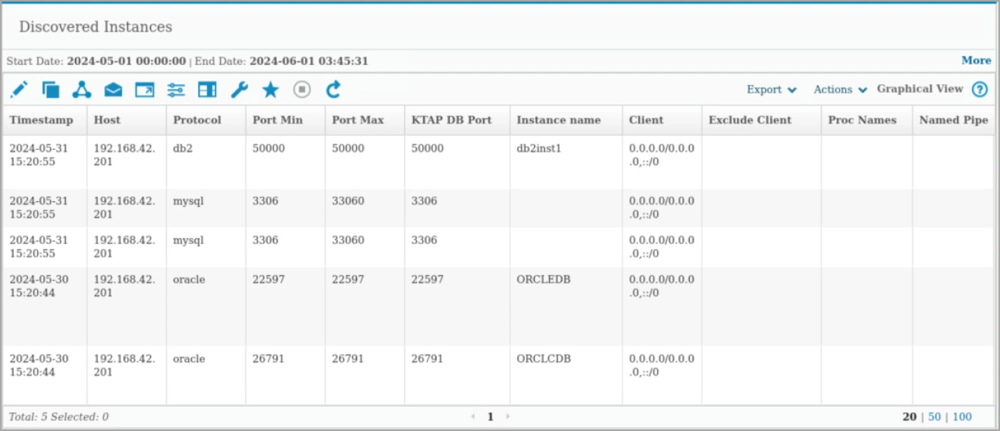

Otro informe de autodescubrimiento es el de Instancias Descubiertas. En el informe de Instancias Descubiertas, se enumeran las instancias descubiertas y cada instancia de base de datos individual que se descubre tiene su propia fila en el informe. Este informe tiene como columnas el host, el protocolo de la base de datos, los puertos, el nombre de la instancia y más detalles.

*   Vaya a **Descubrir > Clasificación > Descubrir Datos Sensibles**.

El creador de escenarios de extremo a extremo Discover Sensitive Data agiliza los procesos de descubrimiento, protección y cumplimiento integrando varias herramientas de Guardium en una única interfaz.

*   Haga clic en el icono **Más** para crear un nuevo escenario.

Guardium proporciona escenarios o plantillas de clasificación de datos sensibles predefinidos. Puede reutilizar la política de clasificación asociada al escenario.

*   Especifique un nombre, seleccione **PCI \[plantilla]** como política de clasificación y **Relacional (SQL)** como tipo de fuente de datos.

Proporcione un nombre y una descripción para el nuevo escenario de descubrimiento. También puede especificar los roles de seguridad que pueden acceder al escenario de descubrimiento. Dispone de 2 opciones para el tipo de fuente de datos: Relacional (SQL) para bases de datos relacionales como MySQL o Documento para bases de datos de tipo documento como MongoDB.

*   Para ampliar la sección de reglas, haga clic en **Siguiente**.
*   Revisa las normas.

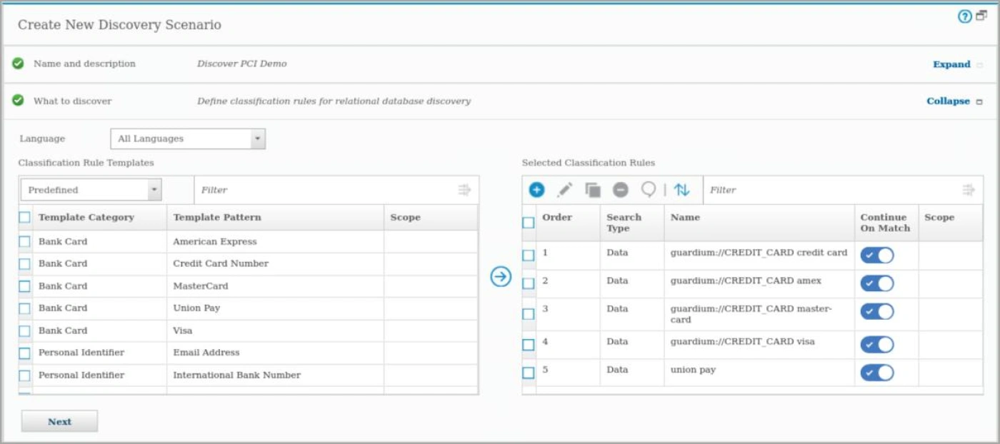

Las políticas de clasificación contienen conjuntos ordenados de reglas y acciones de reglas que identifican datos sensibles y actúan sobre ellos. Cada regla de una política define una acción condicional que se lleva a cabo cuando la regla coincide. La prueba condicional puede ser simple, por ejemplo, una cadena comodín en cualquier lugar de una tabla o colección, o una prueba compleja que considere múltiples condiciones. En los escenarios de descubrimiento de datos confidenciales, la acción desencadenada por una regla puede añadir las coincidencias a un grupo específico o desencadenar una notificación. Se pueden combinar y ordenar múltiples acciones de agrupación y alerta para crear respuestas sofisticadas a las reglas coincidentes. Este asistente le guía a través de la creación y edición de reglas de clasificación y acciones de reglas en el escenario de descubrimiento.

*   Para ampliar la sección de fuentes de datos, haga clic en **Siguiente**.

*   Seleccione la fuente de datos **Raptor\_DB2** y haga clic en **la flecha derecha** para moverla a las fuentes de datos seleccionadas.

Los orígenes de datos almacenan información sobre la base de datos o el repositorio, como el tipo de base de datos, la ubicación del repositorio o las credenciales de autenticación asociadas. Al añadir orígenes de datos a un escenario de descubrimiento, se crea un proceso de clasificación en el que se aplican políticas de clasificación a los orígenes de datos seleccionados. En esta tarea, se identifican los orígenes de datos en los que buscar datos confidenciales.

*   Desplácese hacia abajo y haga clic en **Guardar**.
*   Despliegue la sección **Ejecutar detección** y haga clic en **Ejecutar ahora**. La detección tardará varios minutos en completarse.

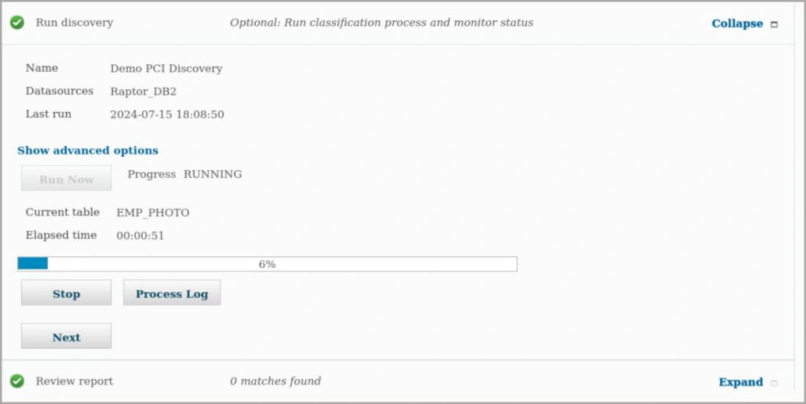

*   Amplíe la sección Informe de revisión y vea los resultados.

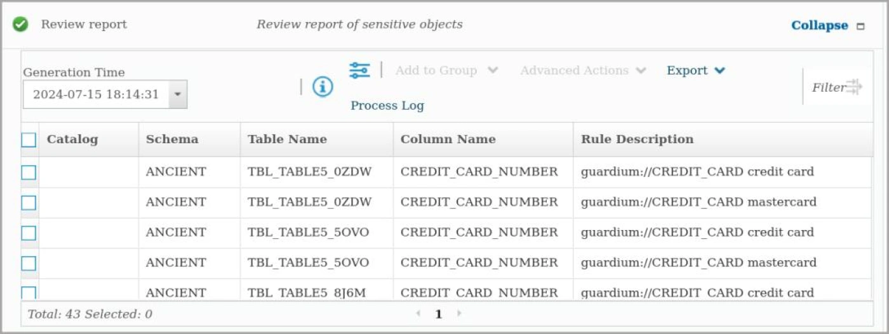

Ha definido políticas para descubrir datos confidenciales e identificar fuentes de datos en las que buscar. Ahora, puede ejecutar el proceso de clasificación y revisar los resultados. En este ejemplo, Guardium descubrió varios conjuntos de datos de tarjetas de crédito. Ejecutar el proceso y revisar los resultados permite refinar las políticas. Por ejemplo, si los resultados son demasiado amplios, especifique más criterios de búsqueda. Puede ser necesario pasar por varias iteraciones para refinar las políticas, ejecutar el proceso y evaluar los resultados para lograr los resultados deseados.

*   Expanda la sección de auditoría y haga clic en **Nuevo**.

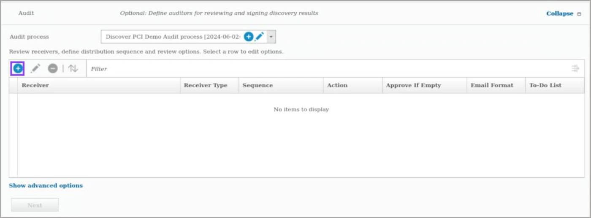

*   Seleccione auditoría como función. A continuación, haga clic en **Aceptar**.

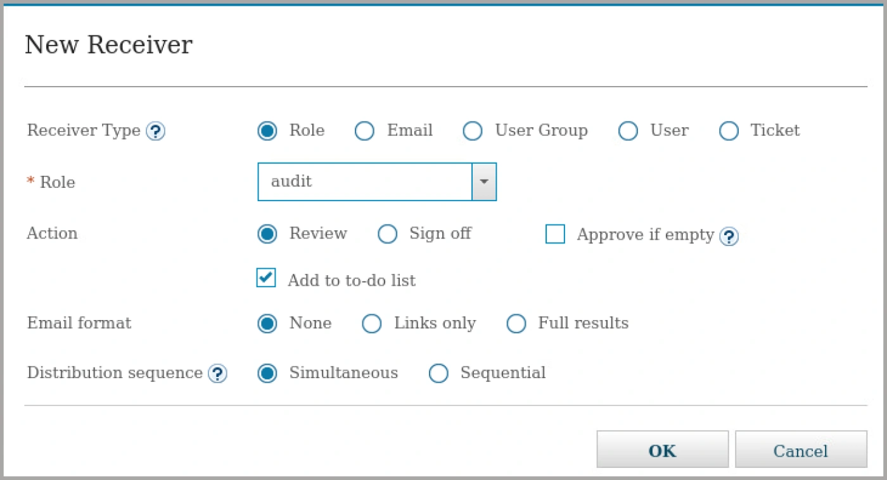

Puede definir cualquier número de receptores para los resultados de un flujo de trabajo de descubrimiento, y puede controlar el orden en que reciben los resultados. Además, puede especificar opciones de control del proceso, como si un receptor debe aprobar los resultados antes de que se envíen al siguiente receptor.

*   Revise los receptores y haga clic en **Guardar**.

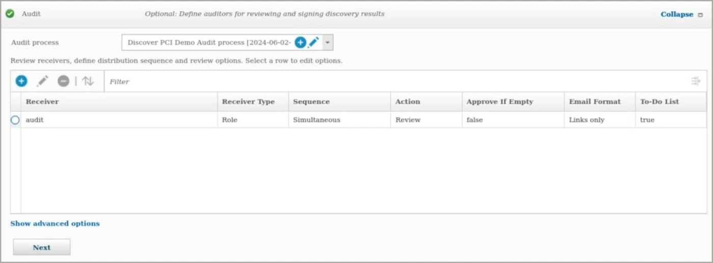

En esta demostración se habló de descubrimiento y clasificación. En resumen, el descubrimiento y la clasificación de datos ayudan a examinar el contenido y los metadatos para identificar y clasificar los datos sensibles.

### Enhorabuena, has llegado al final del laboratorio 102.

Revisamos la herramienta de Descubrimiento y Clasificación.

Haga clic en, **[laboratorio 103](/guardium/datasecurity/103)** para iniciar el siguiente laboratorio.
