# Evaluación de vulnerabilidades y gestión de políticas

## 1 Introducción

En este laboratorio, demostramos las funciones de evaluación de vulnerabilidades que ayudan a identificar y corregir vulnerabilidades de seguridad en la infraestructura de bases de datos. Repasamos los detalles sobre la gestión de políticas que ayuda a supervisar y auditar el tráfico.

### Evaluación de la vulnerabilidad

*   En la GUI del C200, inicie sesión como `labadmin`.
*   Vaya a **Harden > Vulnerability Assessment > Assessment Builder**.

Guardium Vulnerability Assessment ayuda a identificar y corregir las vulnerabilidades de seguridad en la infraestructura de la base de datos. Database Vulnerability Assessment se utiliza para escanear la infraestructura de la base de datos en busca de vulnerabilidades y proporcionar una evaluación de la salud de la seguridad de la base de datos y de los datos, con mediciones en tiempo real e históricas.

*   Asegúrese de que la Evaluación DB2 está seleccionada y haga clic en **Editar** (Lápiz).

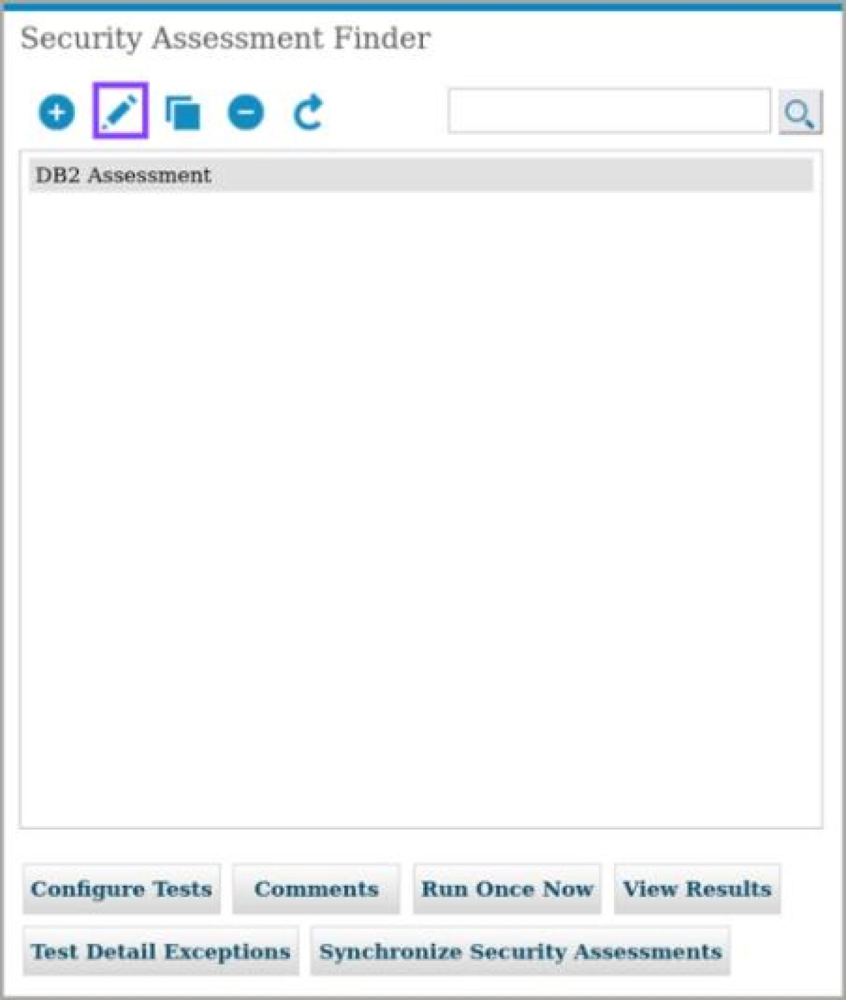

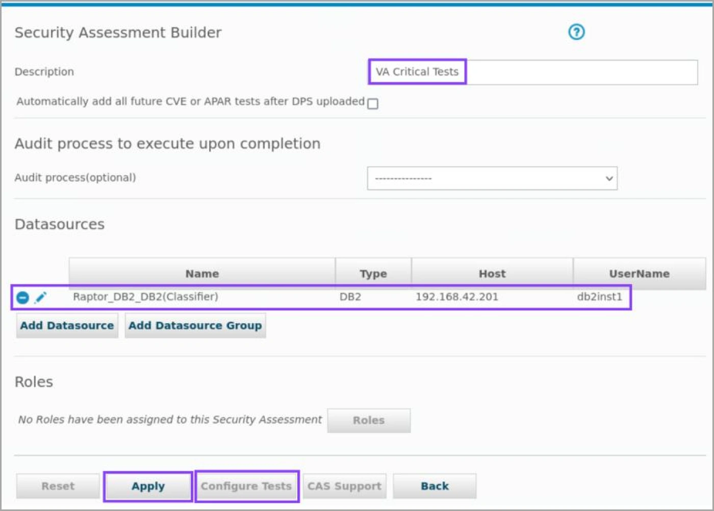

Una vulnerabilidad aplica un conjunto de pruebas a una o más fuentes de datos. Una fuente de datos contiene información de conexión para una base de datos.

*   Haga clic en **Editar** (Lápiz) junto a la fuente de datos. 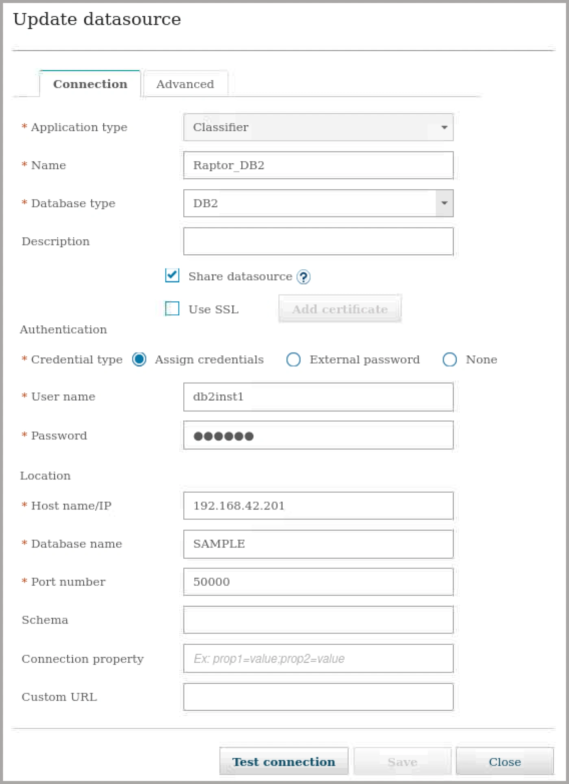

La ejecución de evaluaciones de vulnerabilidades de Guardium y el uso del clasificador de Guardium requieren acceso a la base de datos y privilegios específicos de la base de datos. Aquí puede ver que el origen de datos contiene la información que Guardium necesita para conectarse a una base de datos, incluido el host, el puerto, el tipo, las credenciales y el nombre. Los orígenes de datos se utilizan para muchas funciones en Guardium, incluyendo el descubrimiento y la evaluación.

*   Cierra la fuente de datos.
*   Haga clic en Aplicar y, a continuación, en **Configurar pruebas**. 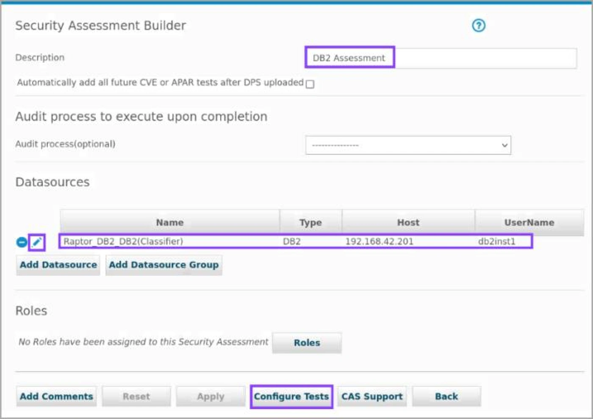

Una evaluación de vulnerabilidad contiene pruebas predefinidas o personalizadas. Las pruebas predefinidas están diseñadas para ilustrar problemas de vulnerabilidad comunes que pueden encontrarse en entornos de bases de datos. Sin embargo, debido a la naturaleza altamente variable de las aplicaciones de bases de datos, algunas de estas pruebas son adecuadas para ciertas bases de datos pero inapropiadas para otras, incluso dentro de la misma organización. Por lo tanto, Guardium permite la personalización de algunas pruebas predefinidas para satisfacer los requisitos específicos de la organización. Además, para mantener las evaluaciones al día con los estándares de la industria y proteger contra nuevas amenazas, Guardium distribuye trimestralmente nuevas pruebas de evaluación y actualizaciones. Estas actualizaciones forman parte del servicio IBM Database Protection Subscription (DPS).

*   Desplácese hacia abajo y haga clic en **Atrás** para volver al generador de evaluaciones. A continuación, vuelva a hacer clic en **Atrás** para regresar al buscador de evaluaciones.

*   Seleccione su nueva evaluación y haga clic en **Ejecutar una vez ahora**.

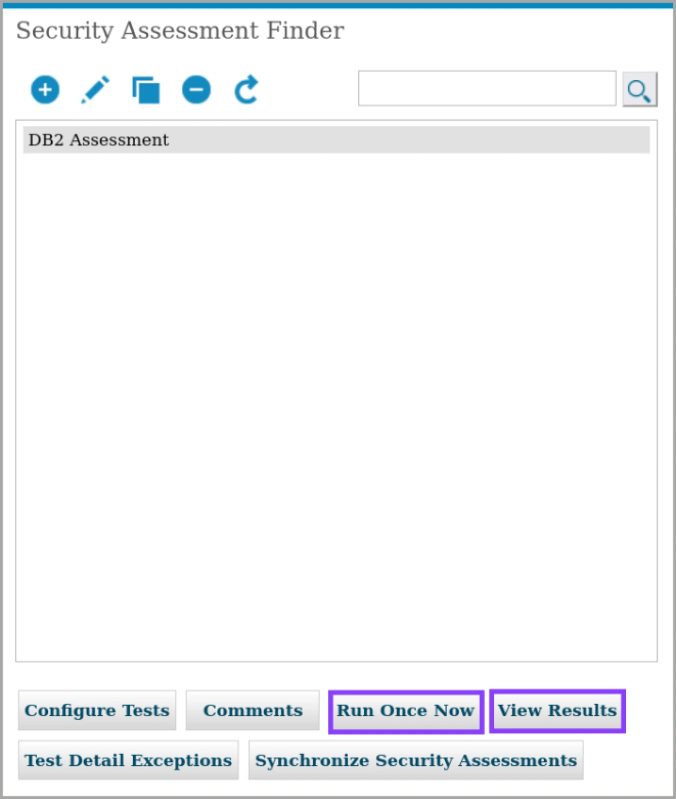

*   Cierre el diálogo y espere un momento. Opcionalmente, puede acceder a la cola de trabajos de Guardium para ver el progreso.

*   Vuelva al generador de evaluaciones. Seleccione su evaluación y haga clic en Ver resultados. Se abre una nueva ventana de informe. Ajuste el tamaño de la ventana según sea necesario.

Veamos los resultados de la evaluación.

*   Revise el informe.

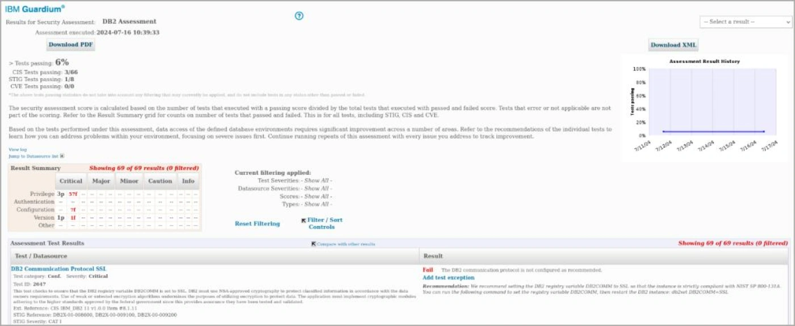

Una evaluación evalúa múltiples pruebas basadas en múltiples informes. Los resultados globales se muestran en una ventana titulada Resultados de la evaluación de seguridad. El informe tiene secciones para Identidad de evaluación, Selección de evaluación, Historial de resultados de evaluación, Resumen de resultados, Resultados de pruebas de evaluación y algunos detalles más. El Historial de resultados de evaluación muestra el porcentaje de pruebas superadas durante un periodo.

En la sección Resumen de resultados, un gráfico tabular resume todas las pruebas realizadas en esta evaluación. El eje X representa las pruebas, y en el eje Y tiene el tipo de las pruebas. La cuadrícula muestra el número de pruebas superadas, fallidas y que provocaron un error. La sección de resultados de las pruebas de evaluación describe las pruebas realizadas, la información sobre la fuente de datos de destino, el estado de superación o no superación de cada prueba, la gravedad, la referencia externa y el motivo del estado. Puede filtrar los resultados de las pruebas. Los registros CVE y la información CVSS se muestran en el visor de resultados de pruebas de evaluación. Puede generar una versión PDF del resultado de la evaluación, descargarlo como SCAP xml o descargarlo como AXIS xml.

*   En la sección Resultados de la evaluación, desplácese hacia abajo y haga clic en **Nivel de parche Db2**. Se abrirá una nueva ventana. Cambie el tamaño según sea necesario.
*   Revise los detalles de la prueba y haga clic en **Cerrar esta ventana**.

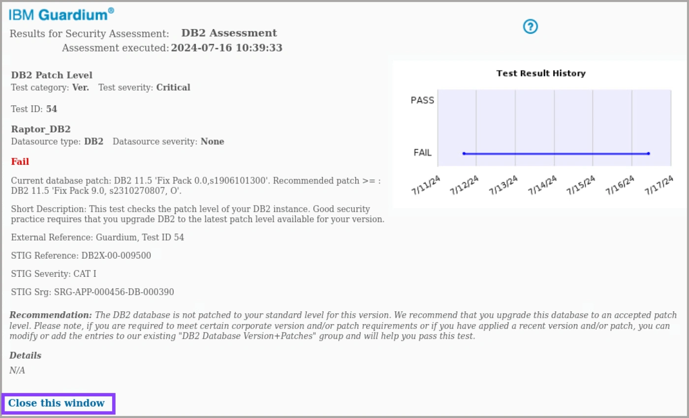

En este cuadro de diálogo de detalles de la prueba de evaluación de vulnerabilidades, se ve que el servidor Db2 on Raptor no tiene las actualizaciones necesarias. Cuando la versión de la base de datos y el nivel de actualización no cumplen los niveles definidos, la evaluación de seguridad está diseñada para fallar. Para anular este fallo, el nivel de actualización y la versión de base de datos necesarios pueden añadirse manualmente al Group Builder.

*   Haga clic en el enlace **Añadir excepción de prueba** para Db2 Patch Level.

Cuando una prueba falla, puede aplicar una excepción a la prueba.

*   Añada una justificación y haga clic en **Guardar**.

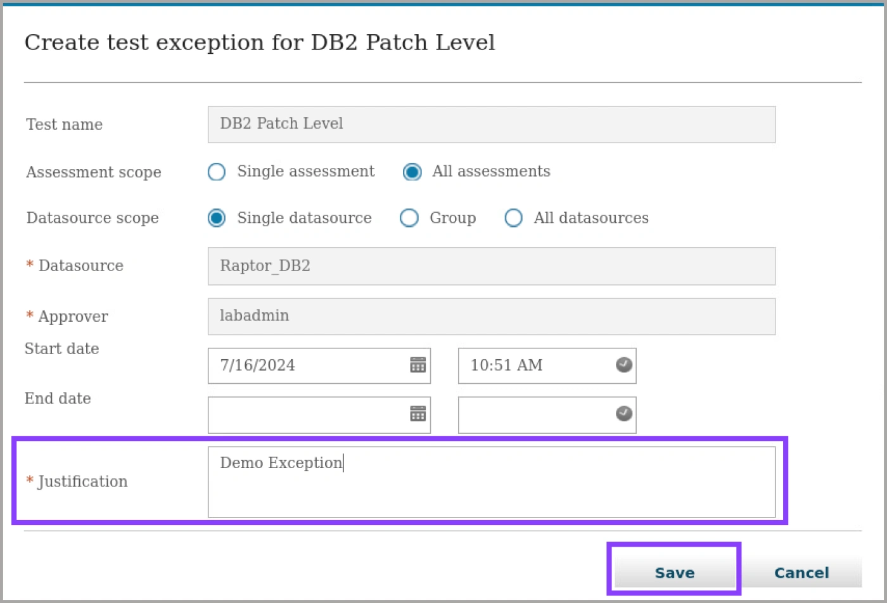

*   Haga clic en **Filtrar/Ordenar** controles.

La página de resultados de evaluación tiene capacidad de filtrado para encontrar más rápidamente la prueba requerida. Si desea cambiar el filtrado, puede eliminar el filtro mediante la opción Restablecer filtro o seleccionar Filtro / Ordenar controles para abrir las opciones de filtrado y ordenación del informe. Las opciones de este filtro de diálogo incluyen severidades, fuente de datos, clasificación de severidades, puntuaciones y tipos de pruebas.

*   Seleccione Pasar y haga clic en **Aplicar**.

*   Desplácese por la página y haga clic en **Prueba de funciones anidadas**.

Una prueba superada tiene detalles de la prueba y de la fuente de datos, pero no tiene enlaces de excepción porque ha sido superada.

*   Cierra la ventana.

En resumen, las evaluaciones de vulnerabilidades de Guardium pueden escanear proactivamente las bases de datos en busca de vulnerabilidades, configuraciones erróneas, controles de autenticación y actualizaciones omitidas antes de que puedan utilizarse. Las suscripciones trimestrales de protección de datos (DPS) y la respuesta rápida DPS le ayudan a adelantarse a las vulnerabilidades de día cero.

Ha hablado de la herramienta de evaluación de la vulnerabilidad.

### Gestión de políticas

*   Inicie sesión en C200 como `labadmin` para los ejercicios de políticas e informes. Debe hacerlo desde el recopilador.
*   Vaya a **Proteger > Políticas de seguridad > Creador de políticas para datos**.

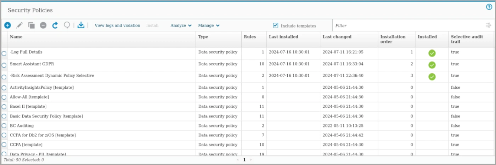

Ahora, aprenderá sobre las políticas de seguridad. Guardium es una solución de seguridad específica para datos, lo que significa que conoce SQL. Las políticas son conjuntos de reglas y acciones que se aplican en tiempo real al tráfico de base de datos observado por un sistema Guardium. Las políticas definen qué tráfico se ignora o se registra, qué actividades requieren un registro más granular y qué actividades deben activar una alerta o bloquear el acceso a la base de datos. Se pueden instalar y activar varias políticas al mismo tiempo.

*   Filtre sobre `pci`. Seleccione **PCI \[plantilla]** y haga clic en **Copiar**.

> **Nota:** No instalará esta política.

Se eligió esta política porque tiene ejemplos de reglas de acceso, excepción y extrusión.

Guardium ofrece políticas predefinidas compatibles con los estándares de seguridad de datos establecidos. Por ejemplo, la plantilla PCI se ajusta al estándar de seguridad de datos de la industria de tarjetas de pago (PCI DSS). También es posible crear o personalizar políticas. Se pueden definir múltiples políticas, y se pueden instalar múltiples políticas en un dispositivo Guardium al mismo tiempo.

*   Introduzca `Demo PCI Policy` como nombre.

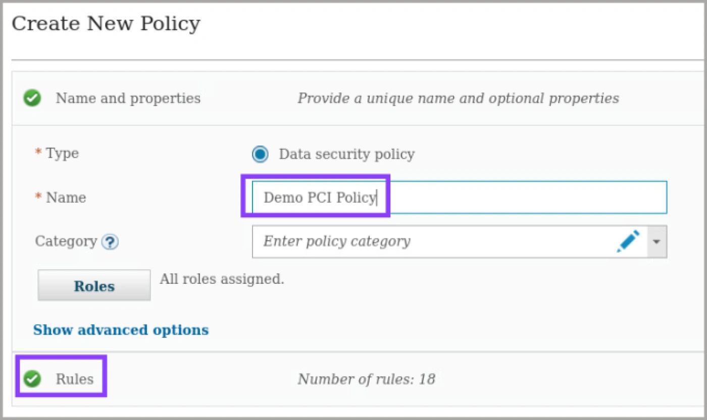

*   Amplíe la sección Normas.

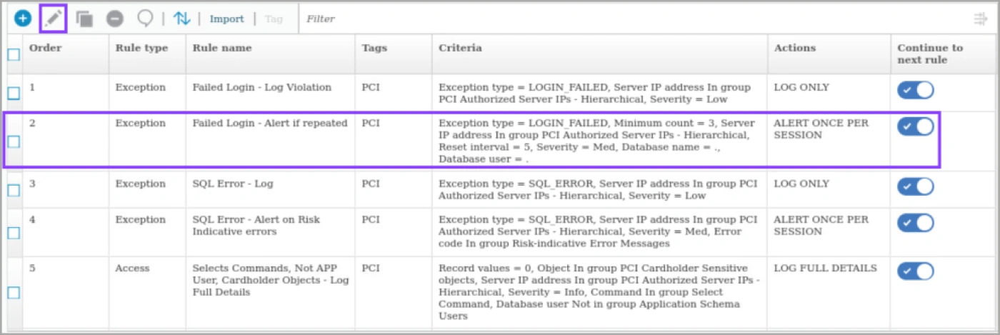

Esta política es una copia de una plantilla. Contiene todas las reglas de la plantilla. Puede editar las reglas existentes o crear nuevas reglas para personalizar la política copiada. Una política de seguridad contiene un conjunto ordenado de reglas que se aplicarán al tráfico observado entre clientes y servidores de bases de datos. Cada regla puede aplicarse a una solicitud de un cliente o a una respuesta de un servidor. Las políticas incluyen tres tipos de reglas:

*   Una regla de acceso se aplica a las peticiones de los clientes. Por ejemplo, podría comprobar los comandos UPDATE que se emiten desde un grupo específico de direcciones IP.
*   Una regla de excepción evalúa las excepciones que devuelve el servidor. Por ejemplo, una regla de excepción puede comprobar si se han producido cinco fallos de inicio de sesión en un minuto.
*   Una regla de extrusión evalúa los datos devueltos por el servidor. Por ejemplo, una regla de extrusión podría comprobar los datos devueltos en busca de patrones numéricos que podrían ser números de la seguridad social o de tarjetas de crédito. Puede utilizar categorías, clasificaciones o etiquetas para agrupar fácilmente las políticas.
*   Seleccione la segunda regla, **Inicio de sesión fallido - Alerta si se repite** y haga clic en **Editar** (Lápiz).

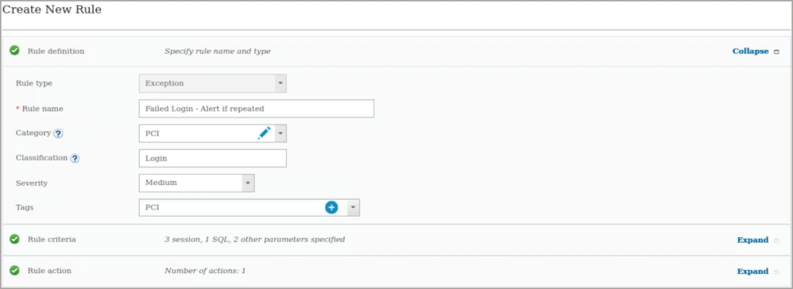

*   Revise la definición de la regla y amplíe la sección Criterios de la regla.

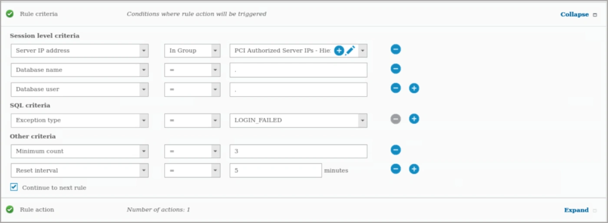

Cada regla de una política define un conjunto de condiciones. La condición que se comprueba puede ser una simple prueba. Por ejemplo, puede comprobar cualquier acceso desde una dirección IP de cliente que no pertenezca a un grupo de IPs de cliente autorizadas. O la condición puede ser compleja, considerando múltiples atributos de mensaje y sesión (usuario de base de datos, programa fuente, tipo de comando, hora del día, etc.). La prueba puede contar el número de veces que se cumple una condición en un periodo de tiempo especificado. Esta regla de política prueba 3 fallos de inicio de sesión en 5 minutos en un servidor cuya dirección IP es miembro del grupo IPs de Servidor Autorizado PCI.

*   Revise los criterios de la regla y amplíe la sección **Acción de la regla**.

*   Haga clic en **Nuevo (+)** para comprobar las opciones de acción y, a continuación, en Aceptar.

> **Nota:** No es necesario añadir otra acción, ya que esto es sólo para mostrar las opciones de acción.

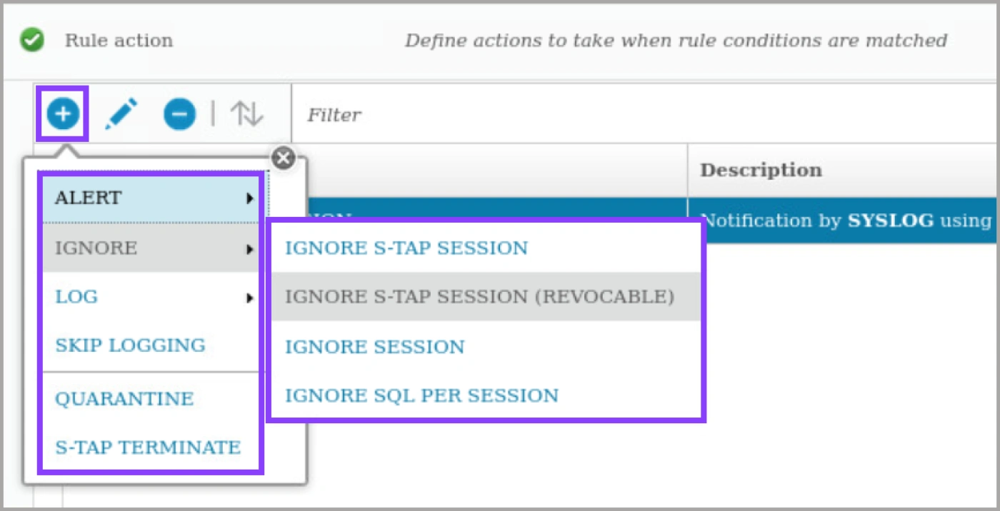

La acción desencadenada por la regla puede ser una acción de notificación como un correo electrónico, una acción de bloqueo (la sesión del cliente desconectada), o el evento puede simplemente registrarse como una violación de la política. Se pueden desarrollar acciones personalizadas para realizar tareas exclusivas de un entorno o aplicación determinados. También se puede establecer la granularidad de la acción. Por ejemplo, puede enviar una alerta por sesión, una alerta por día o una alerta por cada evento. En este caso, se envía una alerta por sesión si se cumplen los criterios.

*   Para volver a la política, desplácese hacia abajo y haga clic en **Cancelar**. Seleccione la 4ª regla, **Error SQL - Alerta sobre errores indicativos de riesgo** y haga clic en **Editar** (Lápiz).

Otro ejemplo de regla de excepción es la que se activa en caso de error SQL.

*   Revise la definición de la regla y amplíe la sección **Criterios de la regla**.

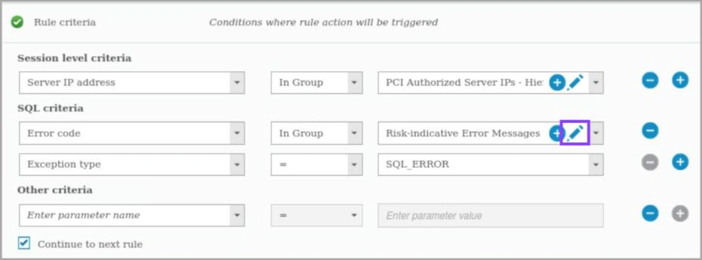

*   Haga clic en **Editar** (Lápiz) para **Mensajes de error indicativos de riesgo** en los criterios de Código de error.

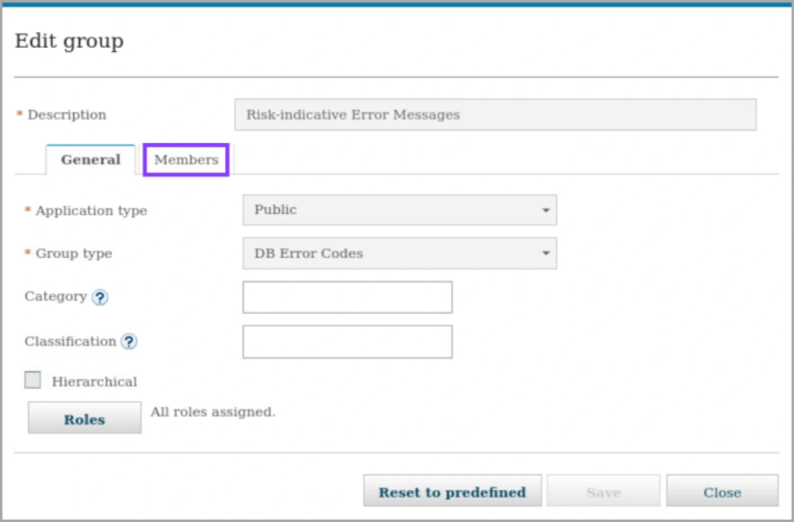

Para muchos criterios de reglas de política, puede especificar un único valor o un grupo de valores.

*   Vaya a la pestaña **Miembros** y haga clic en **Cerrar**.

Los grupos simplifican la creación y gestión de definiciones de políticas. En lugar de tener que definir repetidamente un conjunto de objetos de datos para una regla de política, puede colocar los objetos en un grupo para gestionarlos fácilmente. Guardium incluye muchos grupos predefinidos. Códigos de error SQL es uno de ellos. Como administrador de Guardium o especialista en seguridad, no necesita conocer todos los códigos de error que pueden devolver las bases de datos. Basta con utilizar el grupo.

*   Amplíe Criterios de **tipo de excepción** y revise los filtros.

Guardium puede diferenciar el tipo de error, por ejemplo, si se trata de un fallo de inicio de sesión o de un error SQL.

*   Para cerrar el cuadro de diálogo de edición de reglas y volver al cuadro de diálogo de políticas, desplácese hacia abajo y haga clic en **Cancelar**.
*   Edite la 6ª regla, Comandos DDL, Objetos de titular de tarjeta - Registrar detalles completos.

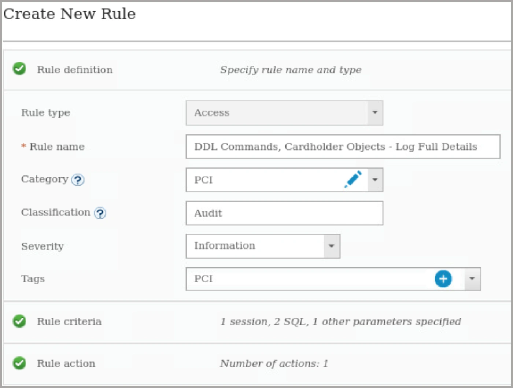

*   Revise la definición de la regla y amplíe la sección **Criterios de la regla**.

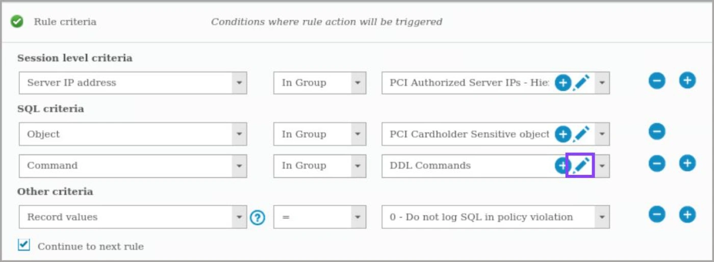

Puede tener filtros para diferentes criterios. En este caso, la regla filtra las actividades DDL que se ejecutan en objetos sensibles del titular de la tarjeta en servidores autorizados.

*   Haga clic en **Editar** (Lápiz) para **Comandos DDL** en los criterios de Comandos. Revise los miembros.

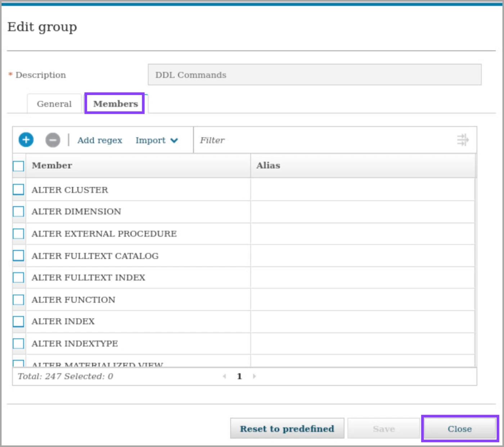

Esta regla utiliza el grupo Comandos DDL para los criterios Comandos. Como profesional de la seguridad, no necesita saber qué comandos son comandos DDL en bases de datos específicas. Guardium incluye grupos predefinidos para ayudar a los administradores de seguridad y de Guardium a crear políticas más eficaces rápidamente.

*   Cierre el grupo de comandos DDL.
*   Amplíe la sección **Acción de la regla**.

Las reglas de acceso, las reglas de excepción y las reglas de extrusión difieren en las acciones disponibles. Por ejemplo, las acciones Registrar e Ignorar están disponibles para la mayoría de las políticas, pero la acción Sólo auditoría sólo está disponible para las políticas que utilizan el ajuste Registro de auditoría selectivo.

*   Haga clic para añadir una acción y desglosar hasta **Ignorar**.

Para controlar y disminuir la carga de un sistema Guardium, se pueden utilizar acciones de ignorar. Ignorar Sesión S-TAP es una acción útil. Con esta acción, la petición actual y el resto de la sesión S-TAP son ignoradas. Esta acción se realiza con sistemas específicos, usuarios o aplicaciones que están produciendo un alto volumen de tráfico de red. Esta acción es útil en casos en los que se sabe que la respuesta de la base de datos de la sesión S-TAP no es de interés. Por ejemplo, si tiene aplicaciones con auditoría habilitada en el lado de la aplicación, puede ignorar el tráfico de estas aplicaciones. Esta acción disminuye el consumo de CPU de S-TAP porque no reenvía el tráfico al sistema Guardium. También disminuye la carga en el sistema Guardium, lo que aumenta el rendimiento del sistema. Guardium proporciona diferentes opciones para ignorar. Puede ignorar el tráfico a nivel de S-TAP. Puede ignorar sesiones específicas, o puede ignorar comandos SQL para el resto de la sesión.

*   Haga clic en **Cancelar** para cerrar la regla.
*   Haga clic en **Aceptar** para guardar la política y cerrar el cuadro de diálogo.

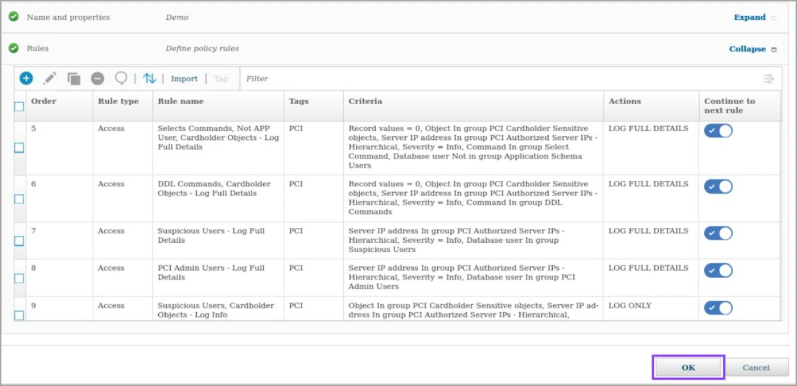

*   Vaya a **Proteger > Políticas de seguridad > Creador de grupos**.

Los grupos de Guardium ayudan a crear y gestionar definiciones de clasificadores, políticas y consultas.

*   Revise los grupos preestablecidos.

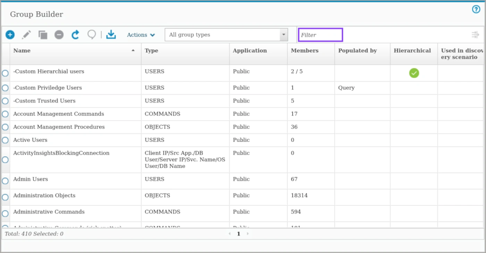

Los grupos son prácticos de utilizar. Al agrupar objetos de datos similares, puede utilizar todo el conjunto de objetos en políticas, clasificaciones, consultas e informes, en lugar de tener que seleccionar varios objetos de datos individualmente. Si necesita cambiar una consulta o política, en lugar de aplicar esos cambios a cada objeto individual, puede aplicar esos cambios al grupo. Guardium incluye muchos grupos predefinidos.

*   Para filtrar el informe, introduzca **DDL**, seleccione el grupo **Comandos DDL** y haga clic en **Editar** (Lápiz).

Puedes buscar por el nombre del grupo en el creador de grupos.

*   Vaya a la pestaña **Miembros**.

Como ya ha revisado este grupo de Comandos DDL anteriormente en la política, puede ver los miembros del grupo aquí.

*   Haga clic en **Importar** y revise los métodos.

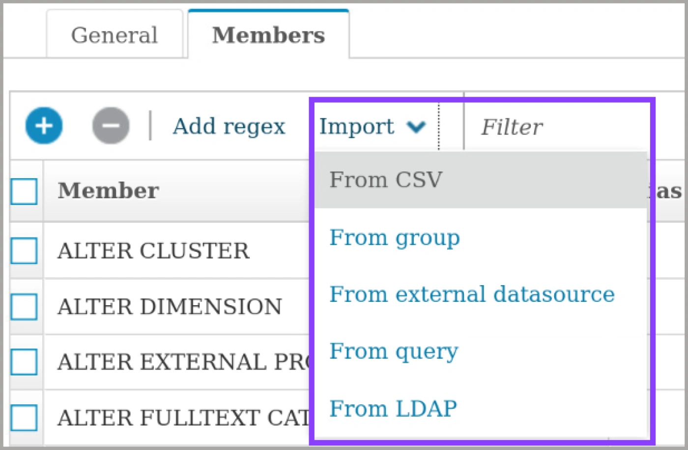

Es posible añadir miembros de un grupo de forma manual o automática. CSV, grupos, fuentes de datos externas, consultas o LDAP son los métodos para añadir miembros de grupos. Esto permite rellenar los grupos de Guardium con datos de sus propias fuentes de datos y mantener esos grupos sincronizados con sus datos.

*   Haga clic en **Cerrar**.
*   Haga clic en el filtro **Todos los tipos de grupo** y revise las opciones.

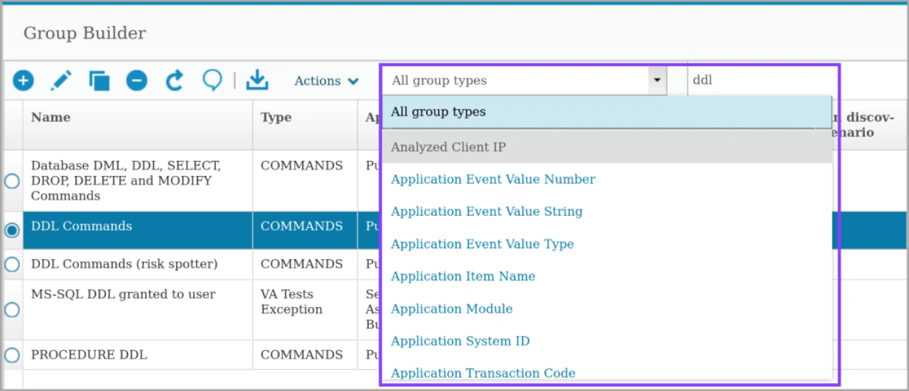

*   Vaya a **Proteger > Políticas de seguridad > Creador de periodos de tiempo**.

Las reglas de política y las condiciones de consulta pueden comprobar eventos que se producen (o no se producen) durante periodos de tiempo definidos por el usuario. Cuando se abre el Creador de periodos de tiempo, hay disponible un conjunto de periodos de tiempo predefinidos. Puede editar los periodos de tiempo disponibles para satisfacer sus necesidades, o puede definir los suyos propios. En la sección Gestión de políticas de la demostración, ha visto que Guardium incluye plantillas de políticas de seguridad y cumplimiento predefinidas que pueden personalizarse en función de los requisitos normativos y de auditoría. Las políticas pueden construirse para detectar cualquier escenario de amenaza con las construcciones de auditoría más comunes y otra información contextual. Para automatizar el seguimiento y la generación de informes de cumplimiento, las políticas y reglas pueden crearse, actualizarse y etiquetarse fácilmente para normativas y estándares específicos de seguridad y privacidad de datos, sin duplicar esfuerzos administrativos. Estas políticas instruyen la supervisión de la actividad de los datos en tiempo real y las alertas de seguridad, que informan sobre registros de auditoría detallados y perfiles de usuarios de riesgo. Guardium Data Protection notifica a los analistas de seguridad con alertas en tiempo real cuando se infringe una política de seguridad.

### Enhorabuena, has llegado al final del laboratorio 103.

Hablamos de las Políticas y otras herramientas que apoyan la gestión de las políticas.

Haga clic en, **[laboratorio 104](/guardium/datasecurity/104)** para iniciar el siguiente laboratorio.
